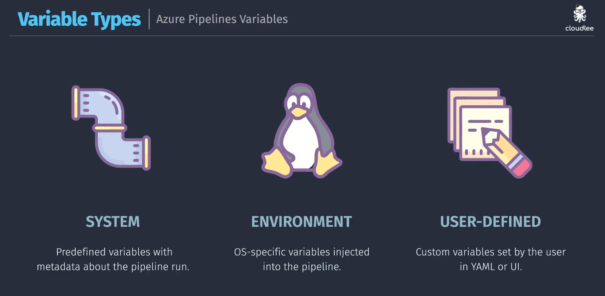
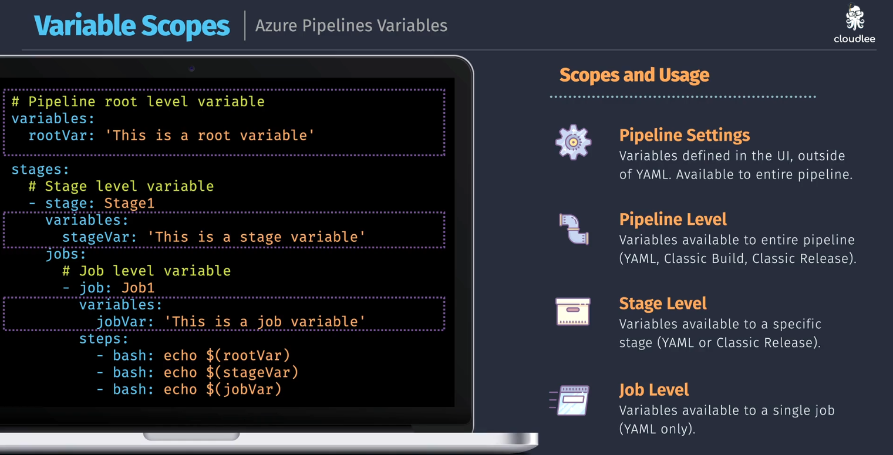
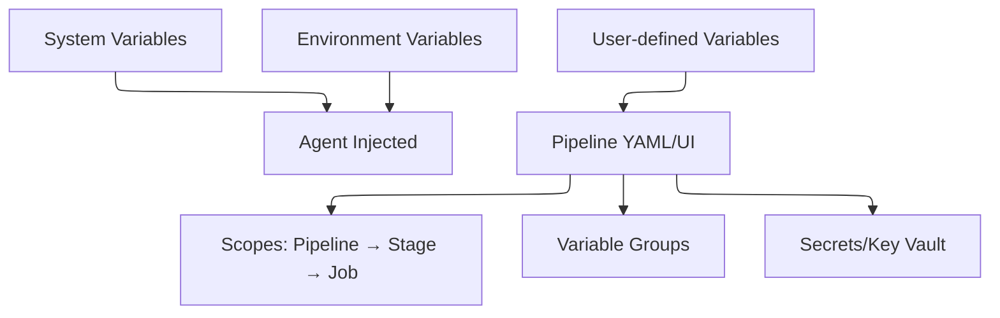

# 🔧 Azure Pipeline Variables

Azure Pipelines variables let you store, pass, and reuse values in your pipeline YAML or Classic UI. They help make pipelines **dynamic**, **secure**, and **maintainable**.

---

## 🧪 1. Variable Types

| Type             | Description                                                                |
| ---------------- | -------------------------------------------------------------------------- |
| **System**       | Predefined variables that describe metadata like `Build.SourceBranchName`. |
| **Environment**  | Variables injected from the agent's OS (e.g., `PATH`, `HOME`, `TEMP`).     |
| **User-defined** | Custom variables set by the developer in YAML or UI.                       |

---

<div align="center">
  
</div>

---

### 🔍 Example:

```yaml
variables:
  buildConfiguration: "Release"
  isProduction: true
```

---

## 🗂️ 2. Variable Scopes

Variables can be scoped to different levels: Pipeline, Stage, Job.

### 🔭 Scopes & Access:

| Scope              | Description                                                 | YAML Support |
| ------------------ | ----------------------------------------------------------- | ------------ |
| **Pipeline Level** | Available to all stages and jobs.                           | ✅ Yes       |
| **Stage Level**    | Available only within that stage.                           | ✅ Yes       |
| **Job Level**      | Available only within that job.                             | ✅ Yes       |
| **Step Level**     | Not explicitly defined, but job-scoped vars behave like it. | ✅ Implied   |
| **UI Level**       | Set from Classic UI, accessible by all pipeline components. | ✅ Yes       |

### 🔍 YAML Example:

<div align="center">
  
</div>

---

## 👥 3. Variable Groups

Variable Groups are reusable collections of variables, especially helpful across multiple pipelines.

### ✅ Used for:

- Sharing variables across pipelines (Web, Mobile, API, etc.)
- Centralized secrets (linked to Key Vault if needed)

### 🔧 How to use:

1. Define a group in Library (UI)
2. Link it in YAML:

```yaml
variables:
  - group: MyCommonSettings
```

Now you can use:

```yaml
- bash: echo "App URL is $(APP_URL)"
```

---

<div align="center">
  
</div>

---

## 🔐 4. Secrets

Secrets can be:

- **Set in UI** under Variables with "lock" icon
- **Pulled from Azure Key Vault**

### ❌ Not exposed in logs:

```yaml
variables:
  - name: myPassword
    value: $(myPassword)
    isSecret: true
```

You can use them but can't `echo $(myPassword)` in logs — they’re masked.

---

## 🧠 5. Runtime Expressions vs Macro Syntax

| Syntax   | Example                                 | When used                             |
| -------- | --------------------------------------- | ------------------------------------- |
| Macro    | `$(var)`                                | Most common (in steps, scripts, etc.) |
| Runtime  | `$(<expression>)`                       | If/else or conditionals               |
| Template | `{{ if }}` or `{{ variables.varName }}` | Templates (reusable YAML)             |

```yaml
variables:
  isProd: $[eq(variables['Build.SourceBranch'], 'refs/heads/main')]
```

---

## ⚙️ 6. Set Variables in Script or Task

You can set a variable dynamically during runtime using `echo`.

### 🛠 Example:

```yaml
steps:
- bash: |
    echo "##vso[task.setvariable variable=dynamicVar]true"
- script: echo "Value: $(dynamicVar)"
```

---

## 📦 7. Variable Precedence (Important!)

| Priority (Highest → Lowest)        |
| ---------------------------------- |
| Variable in YAML `job:` or `step:` |
| Variable in YAML `stage:`          |
| Variable in YAML root level        |
| Variable set from script (`##vso`) |
| Variable group (if added)          |
| Variable from pipeline UI          |
| System/environment variables       |

---

## ✅ 8. Use-Cases by Pipeline Type

### 🧪 Build Pipeline:

```yaml
variables:
  buildPlatform: "Any CPU"
  configuration: "Debug"

steps:
  - script: dotnet build --configuration $(configuration)
```

### 🚀 Release Pipeline:

```yaml
variables:
  environment: "Staging"
  connectionString: "$(StagingDbConnection)"

steps:
  - script: deploy.ps1 -connString $(connectionString)
```

---

## 🔄 9. Overriding Variables at Runtime

You can override variables from the **Azure DevOps UI** when running a pipeline manually:

- Click **Run Pipeline**
- Set new values for input variables

This is helpful for triggering deployments with different environments.

---

## 📋 10. Best Practices

✅ Use variable groups for shared config (e.g., API URLs, keys)

✅ Scope variables narrowly to avoid conflict (`job`, `stage`)

✅ Use secrets for anything confidential

✅ Prefer YAML over UI for reproducibility

✅ Use templates and parameterized variables for DRY pipelines

---

## 🧪 Advanced: Conditional Variable Usage

```yaml
variables:
  environment: 'dev'
  connectionString: $[
    eq(variables['environment'], 'dev')
    ? 'Server=dev.sql'
    : 'Server=prod.sql'
  ]
```

---

## 📌 Summary Diagram (Based on Your Images)


