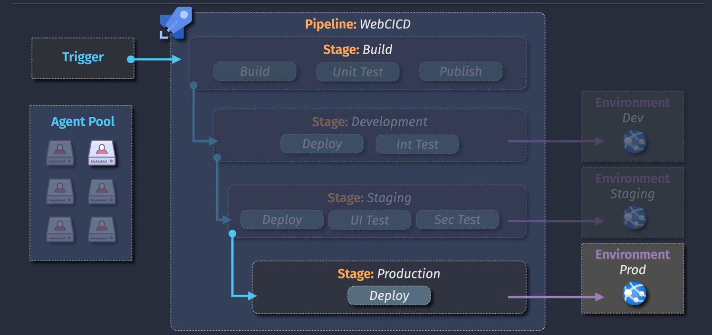
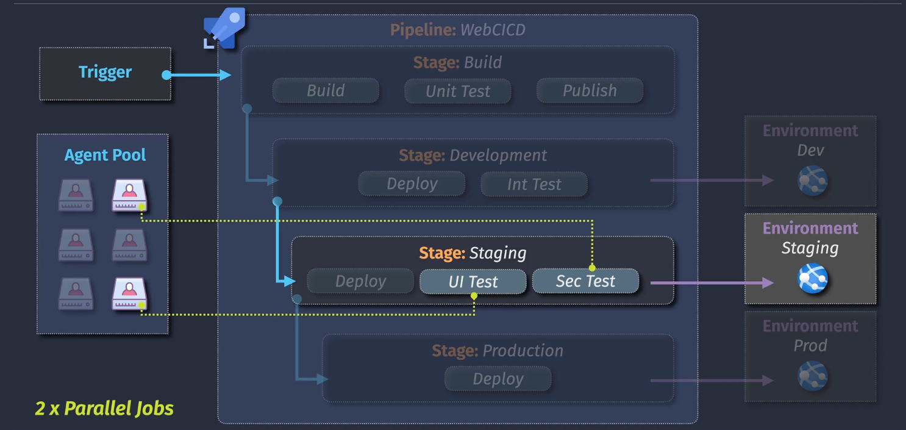
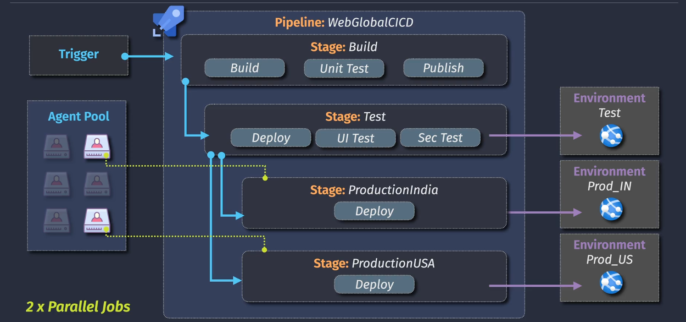

# ⚙️ Parallel Jobs in Azure Pipelines

Parallel jobs let you **run multiple jobs or stages at the same time** using multiple agents. This speeds up your pipeline and enables advanced strategies like deploying to multiple regions or environments simultaneously.

---

## 🧠 What Is a "Parallel Job"?

A **parallel job** is:

> A job that runs on its **own agent** independently of other jobs.

You get **1 free Microsoft-hosted parallel job** for public repos and limited ones for private repos. If you want more, you either:

- 🏠 Use **self-hosted agents**, or
- 💰 Purchase additional hosted parallel jobs.

---

## 📦 Levels of Parallelism

Let’s look at 3 scenarios:

### 1️⃣ **One Parallel Job**

All jobs wait their turn to run **sequentially**, even if they are defined in parallel — because only 1 agent is allowed at a time.

<div align="center">
  
</div>

---

```yaml
jobs:
  - job: BuildApp
    steps:
      - script: echo "Build"

  - job: TestApp
    steps:
      - script: echo "Test"
```

If you're using only 1 parallel job → `TestApp` waits until `BuildApp` is done, even if not dependent.

---

### 2️⃣ **Multiple Parallel Jobs (Real Parallel Execution)**

When you have **more than one parallel job**, Azure Pipelines runs jobs truly **in parallel** (if no dependency is declared).

<div align="center">
  
</div>

---

```yaml
jobs:
  - job: BuildApp
    steps:
      - script: echo "Build"

  - job: LintApp
    steps:
      - script: echo "Lint Check"

  - job: TestApp
    steps:
      - script: echo "Unit Test"
```

If you have 3 parallel job capacity, all run at once on **separate agents**.

🖼️ **Visual:**

- Agent A → BuildApp
- Agent B → LintApp
- Agent C → TestApp

---

### 3️⃣ **Parallel Stages with Dependencies**

Stages can also run in parallel if no `dependsOn` is defined:

<div align="center">
  
</div>

---

```yaml
stages:
  - stage: DeployUS
    jobs:
      - job: DeployJob
        steps:
          - script: echo "Deploy to US"

  - stage: DeployEU
    jobs:
      - job: DeployJob
        steps:
          - script: echo "Deploy to EU"
```

This allows **multi-region parallel deployment**, assuming you have the parallel capacity.

---

## ⚠️ Important Rules

| Rule                              | Explanation                                                                    |
| --------------------------------- | ------------------------------------------------------------------------------ |
| 🧠 One agent = one job            | Each parallel job consumes an **agent** (hosted or self-hosted).               |
| ⚠️ Parallel jobs ≠ parallel steps | **Steps** inside a job always run **sequentially**. No step-level parallelism. |
| 🧾 `dependsOn` blocks parallelism | If you define `dependsOn`, the next job waits. Remove it to go parallel.       |
| 🧰 Agent pools control limits     | You can assign jobs to different **agent pools** (self-hosted/hosted).         |

---

## 💡 Real Use Case: Multi-region Production Deployments

```yaml
stages:
  - stage: DeployIndia
    jobs:
      - job: Deploy
        steps:
          - script: echo "Deploy to Prod India"

  - stage: DeployUSA
    jobs:
      - job: Deploy
        steps:
          - script: echo "Deploy to Prod USA"
```

🟢 This allows two global deployments to happen **at the same time** = 💨 faster release.

---

## 💸 How to Check Parallel Job Quota?

Go to:

```ini
Azure DevOps Portal → Project Settings → Parallel Jobs
```

You'll see:

- How many parallel jobs are available
- How many are Microsoft-hosted or self-hosted
- How many are in use right now

---

## 🧪 Summary

| Concept           | Description                                         |
| ----------------- | --------------------------------------------------- |
| ✅ Parallel Job   | A job that runs on a separate agent                 |
| 🛑 Steps          | Always sequential                                   |
| 📊 You get        | 1 free parallel job (hosted) for private projects   |
| 💰 To scale       | Buy hosted parallel jobs or use your own agents     |
| 🔀 To parallelize | Remove `dependsOn` or split to multiple jobs/stages |

---

## 🖼️ Visual Recap

Here’s how multiple jobs use the pool and run in parallel:

```ini
Trigger
   ↓
+------------+      +------------+
| Job: Build | ---> | Agent A    |
+------------+      +------------+

+------------+      +------------+
| Job: Lint  | ---> | Agent B    |
+------------+      +------------+

+------------+      +------------+
| Job: Test  | ---> | Agent C    |
+------------+      +------------+
```

---

## Notes

> if you require more than the free-tier parallel jobs, you must purchase self-hosted agents or microsoft-hosted agents.

---

> the free-tier includes a different number of parallel jobs for for public vs private repos.

---

> stages and jobs can run in parallel using multiple agents (parallel jobs), but steps/tasks/scripts cannot run in parallel.
