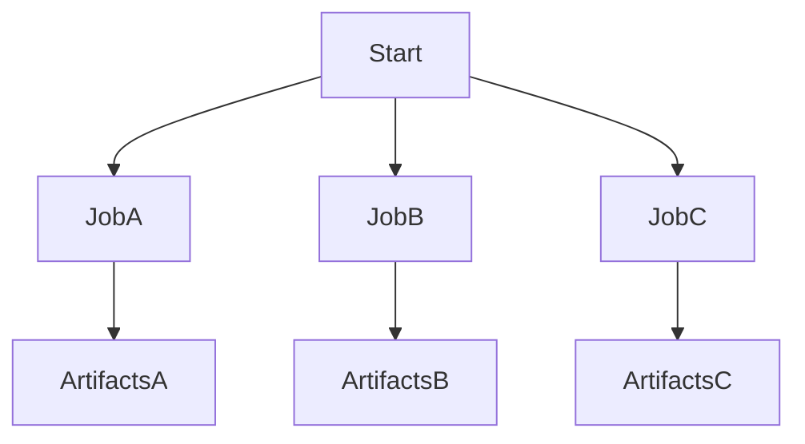

# ⚙️ What Are Parallel Jobs?

**Parallel jobs** in Azure Pipelines allow you to run **multiple jobs at the same time**, instead of waiting for one to finish before the next begins.

- 🔧 Each job runs on a **separate agent** (VM or container)
- 💨 They **run concurrently**, drastically reducing total pipeline time
- 📦 Used for: building multiple services, testing across configs, running matrix jobs, etc.

---

## 🧠 Key Concepts

| Term             | Meaning                                             |
| ---------------- | --------------------------------------------------- |
| **Job**          | A unit of work in your pipeline (e.g., Build, Test) |
| **Agent**        | A machine that runs your job                        |
| **Parallel Job** | A job that runs at the same time as another job     |
| **Concurrency**  | The number of jobs Azure DevOps can run at once     |
| **Pipeline**     | A definition of stages, jobs, and steps             |
| **Strategy**     | A way to define matrix or rolling job runs          |

---

## 🔧 How Azure Pipeline Executes Parallel Jobs

- You define **multiple jobs** under a stage or directly in the pipeline
- Azure assigns a **separate agent** to each job
- All jobs begin **at the same time**, if enough agents are available

> 📦 These agents can be **Microsoft-hosted** or **self-hosted**  
> 🧾 The number of **parallel jobs you’re allowed** depends on your Azure DevOps **license** (see licensing below)

---

## ✍🏻 Basic YAML Example – Parallel Jobs

```yaml
trigger:
  - main

jobs:
  - job: JobA
    pool:
      vmImage: ubuntu-latest
    steps:
      - script: echo "This is Job A"

  - job: JobB
    pool:
      vmImage: ubuntu-latest
    steps:
      - script: echo "This is Job B"

  - job: JobC
    pool:
      vmImage: ubuntu-latest
    steps:
      - script: echo "This is Job C"
```

> 🎯 `JobA`, `JobB`, and `JobC` will **run in parallel**, on **separate agents**, as long as:
>
> - You have enough parallel job **license capacity**
> - No `dependsOn` relationship exists between them

---

## ⛓️ Controlling Dependencies (Optional)

If you want to **make some jobs wait** for others to finish, use `dependsOn`:

```yaml
jobs:
  - job: Build
    steps:
      - script: echo "Build"

  - job: Test
    dependsOn: Build
    steps:
      - script: echo "Run Tests"

  - job: Deploy
    dependsOn: Test
    steps:
      - script: echo "Deploy"
```

> 📌 These run **sequentially** because each job depends on the one before.

---

## 🔬 Using Strategy: Matrix for Auto Parallelism

If you want to run the **same job in parallel with different variables** (like OS, versions), use a `matrix` strategy:

```yaml
jobs:
  - job: TestJob
    strategy:
      matrix:
        linux:
          OS: ubuntu-latest
        windows:
          OS: windows-latest
    pool:
      vmImage: $(OS)
    steps:
      - script: echo "Running on $(OS)"
```

> 🧠 Azure will automatically create **2 parallel jobs** with the same steps, one on Linux and one on Windows.

---

## 🧾 Licensing – How Many Parallel Jobs Do I Get?

| Type                                     | Free Parallel Jobs                                      |
| ---------------------------------------- | ------------------------------------------------------- |
| **Public Project**                       | Unlimited                                               |
| **Private Project (Microsoft-hosted)**   | 1 free (more requires paid parallel jobs)               |
| **Private Project (Self-hosted agents)** | 1 free (can add unlimited self-hosted jobs with limits) |

To add more:

- Go to **Project Settings > Parallel Jobs**
- Purchase additional capacity (e.g., 5 jobs for \$40/month)

🔗 [Official Pricing Guide](https://learn.microsoft.com/en-us/azure/devops/pipelines/licensing/concurrent-jobs)

---

## 📌 Best Practices for Parallel Jobs

| Tip                                          | Why                                                              |
| -------------------------------------------- | ---------------------------------------------------------------- |
| ✅ Keep jobs isolated                        | Avoid shared folders between jobs — agents are separate machines |
| ✅ Use pipeline artifacts to share files     | Use `PublishPipelineArtifact` + `DownloadPipelineArtifact`       |
| ✅ Use matrix for config/version testing     | Great for Node, Python, OS builds                                |
| ✅ Limit dependencies                        | More `dependsOn` = less parallelism                              |
| ✅ Use `condition:` if skipping logic needed | Example: run only if another job failed                          |
| ✅ Monitor usage in “Parallel jobs” UI       | Avoid hitting concurrency limits                                 |

---

## 📊 Visual Diagram

<div align="center">



</div>

> Each job starts **in parallel**, runs independently, and produces its own results.

---

## 🚀 Advanced: Parallel Jobs + Stages

You can also run **parallel stages** — same concept, different level of control:

```yaml
stages:
  - stage: Backend
    jobs:
      - job: BuildAPI
        steps:
          - script: echo "Build API"

  - stage: Frontend
    jobs:
      - job: BuildUI
        steps:
          - script: echo "Build UI"
```

> 🧠 These two stages can also run **in parallel**, unless one depends on the other.

---

## ✅ Summary

| Feature                       | Supported                 |
| ----------------------------- | ------------------------- |
| Multiple jobs per pipeline    | ✅ Yes                    |
| Parallel execution by default | ✅ Yes                    |
| Separate agents per job       | ✅ Yes                    |
| Share files between jobs      | ✅ Use pipeline artifacts |
| Parallel stages               | ✅ Yes                    |
| Max jobs = depends on license | ✅ Yes                    |
