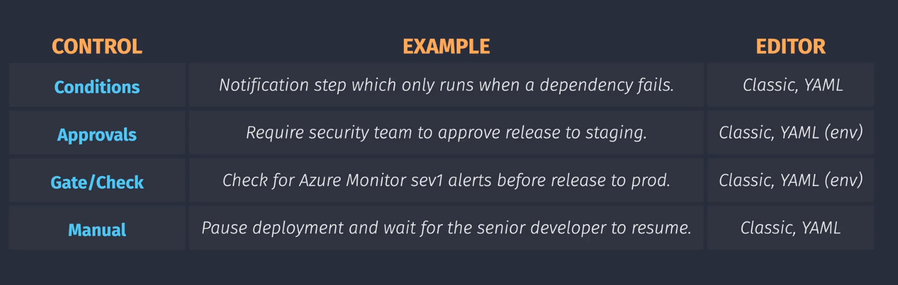

# 🧭 Azure Pipeline Controls

<div align="center">
  
</div>

---

## ✅ 1. Conditions

### 🧠 What is it?

**Conditions** let you control _when_ a step, job, or stage should run — based on success, failure, skipped status, variable values, or expressions.

### 📦 Example: Run deployment **only if build succeeded**

```yaml
- job: Deploy
  dependsOn: Build
  condition: succeeded() # 👈 Only run if Build job succeeded
  steps:
    - script: echo "Deploying app..."
```

### 💡 Common `condition` functions

| Function                       | Meaning                           |
| ------------------------------ | --------------------------------- |
| `succeeded()`                  | Previous stage/job was successful |
| `failed()`                     | It failed                         |
| `always()`                     | Run regardless of result          |
| `eq(variables['env'], 'prod')` | Run if variable equals value      |

---

## 🙋‍♀️ 2. Approvals (via **Environment Approvals**)

### 🧠 What is it?

Human **approvers** are required before deploying to a specific **Environment** (like Production). Approvals delay deployment until a team member clicks “Approve”.

### 🎯 Where is it used?

In **multi-stage pipelines** or **deployment jobs** with `environment`.

---

### 📦 Example: Require manual approval before deploying to `prod`

```yaml
- deployment: DeployProd
  environment: prod-env # 👈 approval must be configured in the Azure UI for this environment
  strategy:
    runOnce:
      deploy:
        steps:
          - script: echo "Deploying to Production"
```

> 🔐 Set up the `prod-env` environment in Azure DevOps UI and assign approvers from there.

---

## ⛔ 3. Gates / Checks

### 🧠 What are they?

**Automated or manual checks** that must pass before moving forward. Used in **environments** to run validations like:

- Run scripts
- Call APIs
- Wait for approvals
- Check Azure Monitor alerts

---

### 📦 Example: Add delay + REST API check before production deploy

> ✅ Defined in Azure DevOps portal under **Environment > Checks**

| Check Type    | What it does                     |
| ------------- | -------------------------------- |
| Approval      | Requires manual approval         |
| REST API      | Calls an endpoint and expects OK |
| Timeout       | Adds wait time before deployment |
| Azure Monitor | Verifies metrics or alerts       |

> 💡 You **don’t define these in YAML** — you configure them in the **Azure portal** for the target environment.

---

## ✋ 4. Manual Trigger (Manual Intervention)

### 🧠 What is it?

Allows a stage/job to **wait for human interaction** during the pipeline — not just before deploy.

Unlike environment approval (which is before a deployment), **manual steps** can be anywhere.

---

### 📦 Example: Pause for manual input before testing

```yaml
- task: ManualValidation@0
  inputs:
    instructions: "Please validate the app manually before proceeding"
    onTimeout: "reject"
    timeout: "1d"
```

| Property       | Purpose                       |
| -------------- | ----------------------------- |
| `instructions` | What you ask the user to do   |
| `timeout`      | Max wait time (e.g., `1d`)    |
| `onTimeout`    | What to do if no one responds |

---

## 📊 Summary Table

| Control Type    | Human Involved? | YAML Needed? | Purpose                                |
| --------------- | --------------- | ------------ | -------------------------------------- |
| **Condition**   | ❌              | ✅           | Control when jobs run                  |
| **Approval**    | ✅              | ✅ + UI      | Require human approval via environment |
| **Gate/Check**  | ✅ or ❌        | ❌ (UI only) | Block deploy with checks (REST, delay) |
| **Manual Step** | ✅              | ✅           | Pause inside pipeline for validation   |
