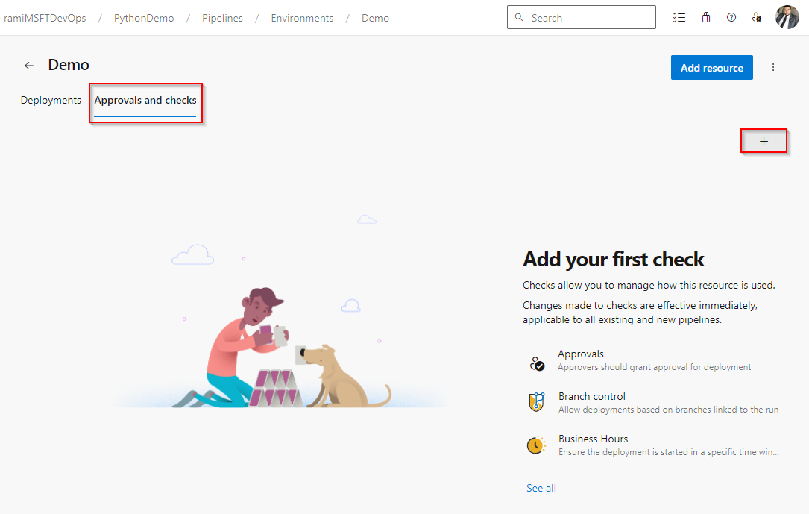
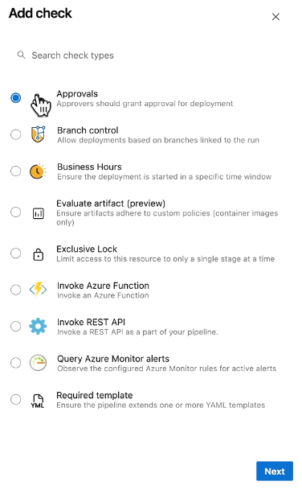
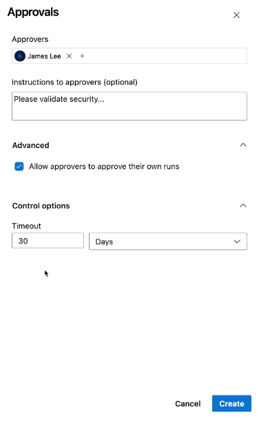
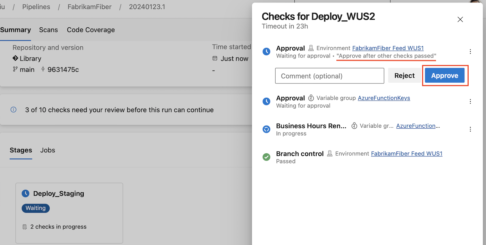
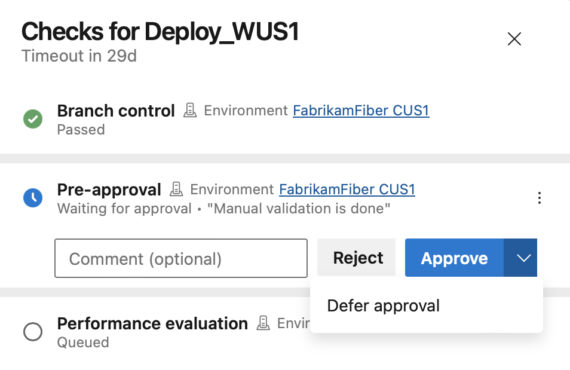
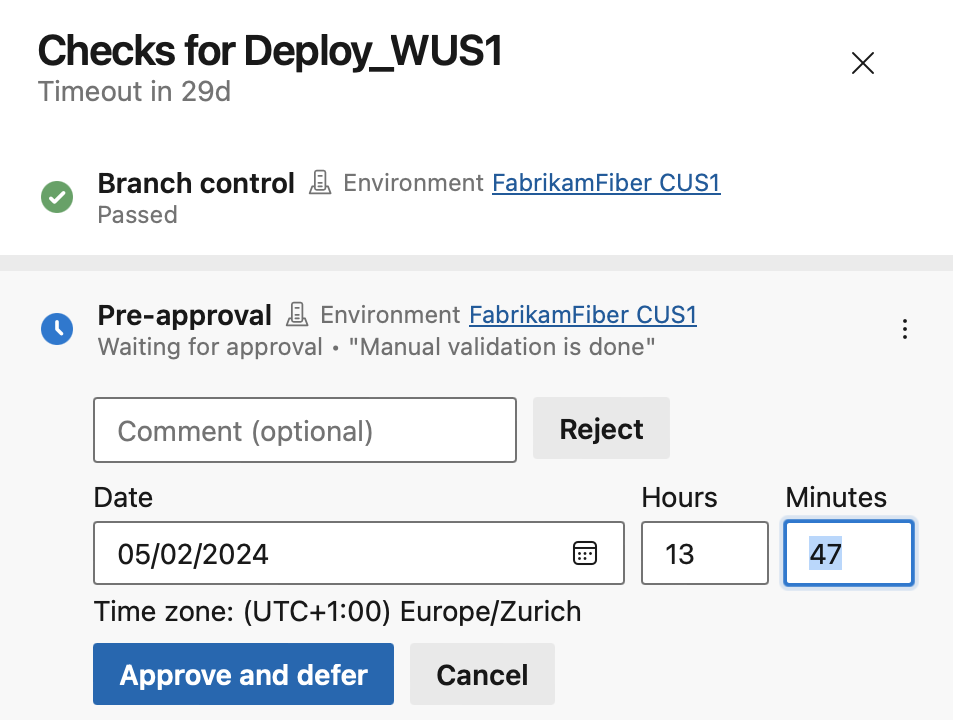

# ✅ **Azure Pipeline Approvals**

> _“Stop the deployment bus until a human says go.”_

Azure DevOps **Approvals** are manual checks you can add before a deployment job proceeds. They're commonly used to prevent production deployments without human intervention.

---

## 🎯 **What are Approvals?**

- **Definition**: A checkpoint requiring a human (or group) to manually approve the continuation of a pipeline (usually before or after a deployment).
- **Use Case**: “Don’t deploy to production unless a senior engineer, QA lead, or stakeholder clicks Approve.”
- **Where**: Approvals are attached to **environments** via **Checks**.

---

## ⚙️ **How It Works**

### 🧭 1. Navigate to the Environment

1. Go to `Pipelines > Environments`
2. Select your environment (e.g., `ausemartwebapp-prod`)
3. Click **“Approvals and checks”**

<div align="left"style="margin: 0 40px;">
    
</div>

---

### ➕ 2. Add an Approval Check

1. Click the **+** button on the right to add a check
2. Choose **“Approvals”**

<div align="left" style="margin: 0 40px;">
  
</div>

---

### 🧑‍⚖️ 3. Configure Approval Options

- **Approvers**: Select one or more users/groups (e.g., `James Lee`)
- **Instructions**: Optional message (e.g., “Please validate security…”)
- **Advanced**:

  - ✅ Allow approvers to approve their own runs (optional)

- **Control Options**:

  - **Timeout**: Auto-reject after X minutes/hours/days

- Click **Create**, and you’re done! 🎉

<div align="left" style="margin: 0 40px;">
  
</div>

---

### ✅ 4. Approve the Pipeline

Once the approval check is triggered, a prompt window, as shown in the following example, is presented in the user interface. This window provides the option for approvers to either reject or approve the run, along with any accompanying instructions.

<div align="left">
  
</div>

> 📒 Note:  
> If a group is designated as an approver, only one user within the group needs to approve for the run to proceed.

## 🕒 **Defer Approval**

In **Azure DevOps**, **Defer Approval** refers to a deployment control mechanism where an approver can **approve a stage but delay its execution** until a later time — rather than triggering it immediately.

---

### 🤔 What It Means

When you're using **pre-deployment approvals** (especially in release pipelines or environments), the approver has two choices:

- ✅ **Approve and deploy now**
- ⏳ **Approve but defer** — meaning the deployment will wait until a specified time or condition is met.

This is useful when:

- You want to **schedule deployments during business hours** or maintenance windows.
- You’ve approved the release but want to **coordinate with other teams** before executing.
- You’re using **checks like “Business Hours”** or custom logic to delay execution.

---

### 🔧 How It Works

- The approval is granted, but the pipeline **pauses** until the deferred condition is satisfied.
- You can use **comments** to specify a scheduled time, and scripts (PowerShell/Bash) to parse and delay execution accordingly.
- Azure DevOps also supports **Business Hours checks**, which automatically defer deployment until the allowed time window.

---

### 🧠 Strategic Use Case for You

For senior DevOps workflows, this is ideal when:

- Coordinating **multi-region rollouts**.
- Aligning with **incident response windows** or **change management policies**.
- Automating **safe deployment gates** without manual intervention.

Want help modeling this into a reusable YAML pattern or integrating it with approval logic across environments? I can sketch that out modularly.

### 🪜 Steps to Configure

- **1. Select Defer approval.**

<div align="left">
  
</div>

- **2. Set the approval time.**

<div align="left">
  
</div>

## 🧪 **Example** YAML Pipeline with Approval

Once your environment has an approval check, just refer to it in your pipeline:

```yaml
jobs:
  - deployment: DeployToProd
    displayName: Deploy to Production
    environment: ausemartwebapp-prod # Has the approval check
    strategy:
      runOnce:
        deploy:
          steps:
            - script: echo "Deploying to production..."
```

> When the pipeline reaches this job, it will **pause** until `James Lee` (or whoever is listed) clicks **Approve** from the UI.

---

## 🧩 **Key Facts**

| Feature              | Value                                                                |
| -------------------- | -------------------------------------------------------------------- |
| Where to Add         | Under **Environments** > “Approvals and Checks”                      |
| Trigger Type         | Manual approval by user                                              |
| Who Can Approve      | Any user/group you select                                            |
| Auto-Timeout Support | ✅ (set timeout in hours/days)                                       |
| Multi-Stage Support  | ✅ (great in production deployments)                                 |
| YAML Required?       | ❌ The approval is managed from the UI, not the pipeline YAML itself |

---

## 💡 **Pro Tips**

- 📛 **Environment Name must match** in YAML, or approval won’t be triggered.
- 🔒 Use \[Branch Control] check with approvals for even stricter gates.
- 🔁 Combine approvals with **Rolling** or **Canary** strategies for advanced production flows.
