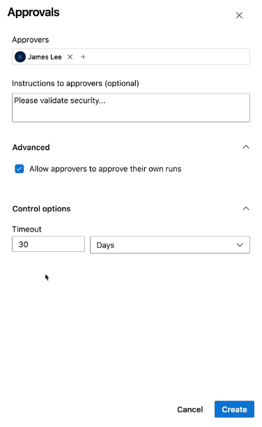

# ✅ Azure Pipeline Approvals

> _“Stop the deployment bus until a human says go.”_

Azure DevOps **Approvals** are manual checks you can add before a deployment job proceeds. They're commonly used to prevent production deployments without human intervention.

---

## 🎯 What are Approvals?

- **Definition**: A checkpoint requiring a human (or group) to manually approve the continuation of a pipeline (usually before or after a deployment).
- **Use Case**: “Don’t deploy to production unless a senior engineer, QA lead, or stakeholder clicks Approve.”
- **Where**: Approvals are attached to **environments** via **Checks**.

---

## 🤔 How It Works (with Screenshots)

### 🧭 1. Navigate to the Environment

1. Go to `Pipelines > Environments`
2. Select your environment (e.g., `ausemartwebapp-prod`)
3. Click **“Approvals and checks”**

<div align="left"style="margin: 0 40px;">
    
</div>

---

### ➕ 2. Add an Approval Check

1. Click the **+** button on the right to add a check
2. Choose **“Approvals”**

<div align="left" style="margin: 0 40px;">
  
</div>

---

### 🧑‍⚖️ 3. Configure Approval Options

- **Approvers**: Select one or more users/groups (e.g., `James Lee`)
- **Instructions**: Optional message (e.g., “Please validate security…”)
- **Advanced**:

  - ✅ Allow approvers to approve their own runs (optional)

- **Control Options**:

  - **Timeout**: Auto-reject after X minutes/hours/days

<div align="left" style="margin: 0 40px;">
  

Click **Create**, and you’re done! 🎉

</div>

---

## 🧪 Example YAML Pipeline with Approval

Once your environment has an approval check, just refer to it in your pipeline:

```yaml
jobs:
  - deployment: DeployToProd
    displayName: Deploy to Production
    environment: ausemartwebapp-prod # Has the approval check
    strategy:
      runOnce:
        deploy:
          steps:
            - script: echo "Deploying to production..."
```

> When the pipeline reaches this job, it will **pause** until `James Lee` (or whoever is listed) clicks **Approve** from the UI.

---

## 🧩 Key Facts Summary

| Feature              | Value                                                                |
| -------------------- | -------------------------------------------------------------------- |
| Where to Add         | Under **Environments** > “Approvals and Checks”                      |
| Trigger Type         | Manual approval by user                                              |
| Who Can Approve      | Any user/group you select                                            |
| Auto-Timeout Support | ✅ (set timeout in hours/days)                                       |
| Multi-Stage Support  | ✅ (great in production deployments)                                 |
| YAML Required?       | ❌ The approval is managed from the UI, not the pipeline YAML itself |

---

## 💡 Pro Tips

- 📛 **Environment Name must match** in YAML, or approval won’t be triggered.
- 🔒 Use \[Branch Control] check with approvals for even stricter gates.
- 🔁 Combine approvals with **Rolling** or **Canary** strategies for advanced production flows.
