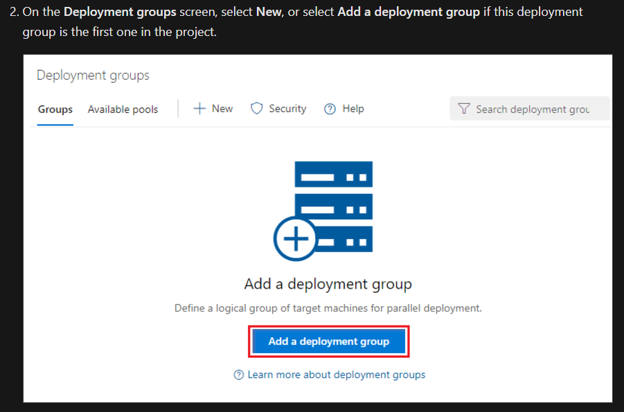
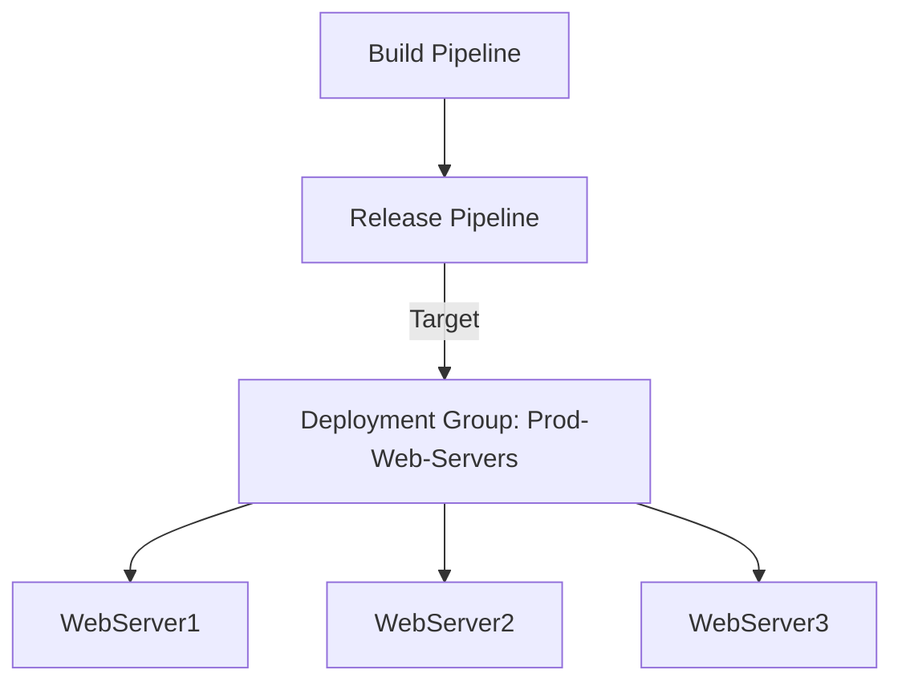

# 🚀 Deployment Groups in Azure DevOps

## 📌 1. What is a Deployment Group?

👉 A **Deployment Group** is a **collection of target machines** (on-prem servers, Azure VMs, cloud VMs) that you register with Azure DevOps so you can **deploy applications to them directly** using pipelines.

- Each machine in the group runs a **Deployment Agent** (like a build agent, but specialized for deployments).
- Deployment Groups are mostly used in **classic release pipelines**.
- In **YAML pipelines**, the newer equivalent is **Environments**.

💡 Think:

- **Agent Pool** → Where builds/tests run.
- **Deployment Group** → Where apps are deployed.

---

## 📌 2. Real-World Use Case

Imagine you have a **.NET Core Web API** that needs to be deployed to **3 IIS servers**:

- `Prod-Web-1`
- `Prod-Web-2`
- `Prod-Web-3`

👉 Instead of manually copying files, you:

1. Create a **Deployment Group** called “Prod-Web-Servers.”
2. Register those servers with Azure DevOps.
3. Your release pipeline deploys the app to **all servers in the group**.

---

## 📌 3. Hands-On: Creating a Deployment Group

 <div align="center">
   
 </div>

---

### 🔹 Step 1: Create Deployment Group

1. Go to **Azure DevOps → Project Settings**.
2. Under **Pipelines**, select **Deployment groups**.
3. Click **+ New Deployment Group**.
4. Name it (e.g., `Prod-Web-Servers`).
5. Add a description.
6. Save → you’ll see a **PowerShell script** (Windows) or **bash script** (Linux).

---

### 🔹 Step 2: Register Target Machine(s)

On each VM you want in the group:

- For Windows server:

```powershell
# Example PowerShell command from Azure DevOps UI
# Replace with your personal org/project values
mkdir agent ; cd agent

Invoke-WebRequest `
  -Uri https://vstsagentpackage.azureedge.net/agent/2.220.0/vsts-agent-win-x64-2.220.0.zip `
  -OutFile agent.zip

Expand-Archive -Path agent.zip -DestinationPath .

.\config.cmd --deploymentgroup `
  --deploymentgroupname "Prod-Web-Servers" `
  --agent "Prod-Web-1" `
  --runasservice `
  --url https://dev.azure.com/YourOrg `
  --projectname "EcommerceProject" `
  --auth PAT `
  --token <YOUR_PERSONAL_ACCESS_TOKEN>
```

👉 This registers the VM as part of the Deployment Group.

Repeat for `Prod-Web-2` and `Prod-Web-3`.

---

### 🔹 Step 3: Verify in Azure DevOps

- Go back to **Deployment Groups** → `Prod-Web-Servers`.
- You’ll see all machines listed with status: ✅ Online.

---

## 📌 4. Using Deployment Groups in a Release Pipeline

### 🔹 Step 1: Create Release Pipeline

1. Go to **Pipelines → Releases → New Pipeline**.
2. Add artifact = your build (e.g., web app artifact).
3. Add a stage → **Deployment group job**.

---

### 🔹 Step 2: Configure Deployment Group Job

- Choose your Deployment Group: `Prod-Web-Servers`.
- Add tasks → e.g.,
  - Extract zip artifact.
  - Deploy to IIS.
  - Run smoke tests.

```yaml
# Classic UI generates behind the scenes (for YAML you’d use environments instead)
jobs:
  - deployment: DeployWeb
    pool: server
    deploymentGroup:
      name: Prod-Web-Servers
    strategy:
      runOnce:
        deploy:
          steps:
            - task: IISWebAppDeploymentOnMachineGroup@0
              inputs:
                WebSiteName: "Default Web Site"
                Package: "$(Pipeline.Workspace)/drop/**/*.zip"
```

---

### 🔹 Step 3: Deploy

- Run the release.
- Azure DevOps pushes the artifact to all registered machines in `Prod-Web-Servers`.
- Logs show per-server progress.

---

## 📌 5. Deployment Strategies Supported

With Deployment Groups, you can configure:

- 🔄 **Rolling deployment** → Deploy one server at a time (minimize downtime).
- 🐤 **Canary release** → Deploy to 1 machine first, then expand to rest.
- 🎯 **Phased deployment** → Deploy to sets of machines in stages.

---

## 📌 6. Pros & Cons

✅ **Pros**:

- Easy deployment to many servers.
- Supports strategies (rolling/canary).
- Good for hybrid/on-prem scenarios.

⚠️ **Cons**:

- Only available in **classic release pipelines**.
- For modern YAML → you should use **Environments** instead.

---

## 📊 Visual Flow

<div align="center">



</div>

---

## ✅ TL;DR

- **Deployment Group** = collection of machines where you deploy apps.
- Requires **deployment agent** installed on each target machine.
- Used in **classic release pipelines** (modern = **Environments**).
- Supports **rolling, canary, phased deployments**.
- Great for **on-prem & hybrid deployments**.

## 📚 References

- [Deploy Web App to IIS Using Deployment Group](https://www.youtube.com/watch?v=RyPEFWL-Gbk)
