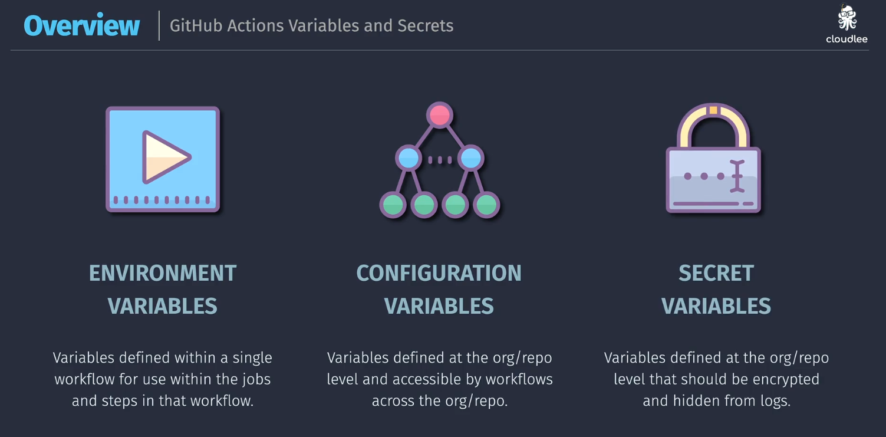
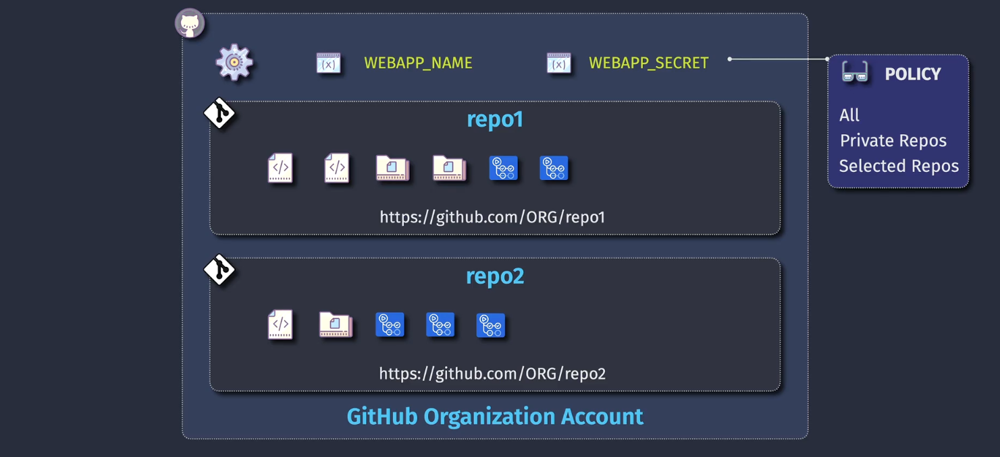

# 🔐 GitHub Actions: Variables & Secrets

## 🧠 Overview

GitHub Actions allows you to define **variables** and **secrets** that you can use across workflows to:

- Pass configuration
- Keep credentials secure
- Simplify workflows
- Reuse values

But each type (environment, config, secret) has **scope**, **usage rules**, and **limitations**.

---

<div align="center">
  
</div>

---

## 📦 Types of Variables

### 1. 🔁 Environment Variables (Temporary)

Used temporarily within a job or step — not secure.

| Key Point     | Description                       |
| ------------- | --------------------------------- |
| Scope         | Step, Job, or Workflow            |
| Secure?       | ❌ No                             |
| Where defined | `env:` block or `echo` in scripts |
| Use case      | .NET version, regions, flags      |
| Example usage | `echo "ENV=$ENV"`                 |

#### ✅ How to define

```yaml
jobs:
  build:
    runs-on: ubuntu-latest
    env:
      DOTNET_VERSION: 6.0

    steps:
      - name: Print .NET Version
        run: echo "Using version $DOTNET_VERSION"
```

#### ✅ Define dynamically (script)

```yaml
- run: echo "API_URL=https://api.example.com" >> $GITHUB_ENV
```

> 🧠 `$GITHUB_ENV` is the special file GitHub uses to persist env variables between steps.

---

## 🔑 Configuration & Secret Variables

| Type          | Secure | Redacted in logs | Can override via workflow? | Best For                        |
| ------------- | ------ | ---------------- | -------------------------- | ------------------------------- |
| Configuration | ❌ No  | ❌ No            | ✅ Yes                     | Names, regions, feature toggles |
| Secrets       | ✅ Yes | ✅ Yes           | ❌ No (must use UI/API)    | Passwords, tokens, keys         |

---

### 📁 Repo-Level Configuration & Secrets

<div align="center">
  
</div>

✅ Defined under:

- **Settings → Secrets and Variables → Actions**
- Can set both:

  - 🧩 **Variables**
  - 🔐 **Secrets**

✅ Scope:

- Available to all workflows in that **repository**

#### Usage in Workflow

```yaml
env:
  REGION: ${{ vars.REGION }}
  DB_CONN: ${{ secrets.DB_CONN_STRING }}
```

---

### 🏢 Org-Level Configuration & Secrets

<div align="center">
  
</div>

✅ Defined under:

- **Org Settings → Actions → Secrets / Variables**

✅ Scope:

- Can be made available to **specific repos** or **all repos**

✅ Useful for:

- Shared deployment keys
- Corporate-wide API endpoints
- Global toggles

---

## 🛠️ Using Secrets & Variables in GitHub Actions

### Define in UI (Best Practice for Secrets)

```bash
Settings → Secrets and Variables → Actions → New repository secret
```

### Reference in Workflow

```yaml
jobs:
  deploy:
    runs-on: ubuntu-latest
    steps:
      - name: Login with secret token
        run: echo "${{ secrets.DEPLOY_TOKEN }}"
```

### 💡 Tip

Secrets are automatically redacted from logs.
But: avoid printing secrets to terminal or logs using `echo`.

---

## ⚙️ Dynamic Runtime Variables

> You can generate variables dynamically using special contexts.

### Built-in Contexts

| Context   | Example                     | Description                |
| --------- | --------------------------- | -------------------------- |
| `github`  | `${{ github.repository }}`  | Info about repo & trigger  |
| `env`     | `${{ env.MY_VAR }}`         | Env vars in workflow       |
| `secrets` | `${{ secrets.MY_SECRET }}`  | Secret values              |
| `vars`    | `${{ vars.MY_CONFIG_VAR }}` | Repo/org defined variables |
| `job`     | `${{ job.status }}`         | Status of a job            |

---

## ⚠️ Gotchas & Tips

| Gotcha / Mistake                       | What Happens / Fix                                |
| -------------------------------------- | ------------------------------------------------- |
| Using `env` for secrets                | ❌ Not secure! Use `secrets` instead.             |
| Using `secrets.MY_SECRET` in env block | ✅ Okay, but don’t echo it.                       |
| Trying to define secrets in YAML       | ❌ Not allowed. Must use UI/API.                  |
| Forgot to use `${{ }}` syntax          | Value will not be interpolated.                   |
| Secret not available in a PR from fork | GitHub disables secrets in fork PRs for security. |

---

## 🧪 Real Example: Secure Deployment

```yaml
name: Deploy to Prod

on:
  push:
    branches: [main]

jobs:
  deploy:
    runs-on: ubuntu-latest
    env:
      AZURE_REGION: ${{ vars.REGION }}

    steps:
      - name: Login to Azure
        uses: azure/login@v1
        with:
          creds: ${{ secrets.AZURE_CREDENTIALS }}

      - name: Deploy App
        run: |
          az webapp deploy --name myapp \
            --resource-group rg \
            --region $AZURE_REGION
```

---

## 🔄 How Variables Are Resolved

Order of precedence:

```text
1. Step-defined variables (`env:` in step)
2. Job-defined variables (`env:` in job)
3. Workflow-level `env`
4. Repo-level `vars`
5. Org-level `vars`
6. Default GitHub context values
```

> 🧠 Secrets always override variables with the same name.

---

## 🧩 Summary Table

| Feature                   | Secrets | Configuration Vars | Environment Vars |
| ------------------------- | ------- | ------------------ | ---------------- |
| Secure                    | ✅      | ❌                 | ❌               |
| Set in UI                 | ✅      | ✅                 | ❌               |
| Use in `${{ secrets.X }}` | ✅      | ❌                 | ❌               |
| Use in `${{ vars.X }}`    | ❌      | ✅                 | ❌               |
| Use in `env:`             | ✅      | ✅                 | ✅               |
| Redacted from logs        | ✅      | ❌                 | ❌               |

---

## 📘 Final Notes

- 🔐 Use **secrets** for anything sensitive (tokens, keys).
- 🧩 Use **configuration vars** for things that change per environment (region, appName).
- ⚙️ Use **`env`** for local, temporary values that don’t need to persist.
- 💬 Document all secrets and variables in your internal runbooks or repo wiki.
