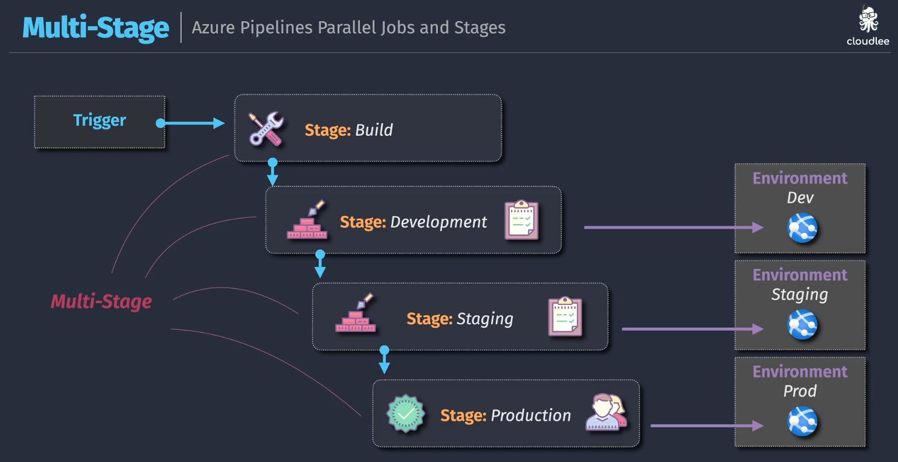
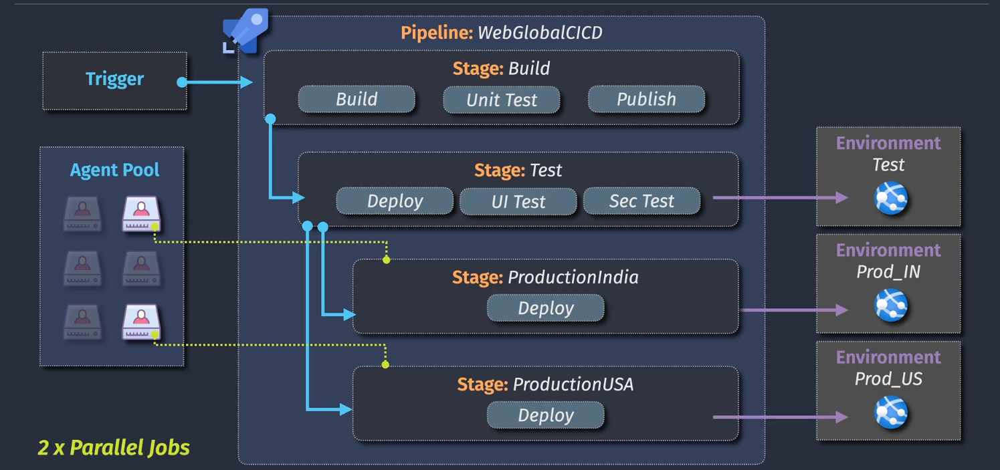

# Multi stages and parallel jobs

## Multi-stages

  

## Parallel Jobs

### One Parallel Job

  

### Multiple Parallel Jobs

  

### Multiple Parallel Stages

  

## Notes

> Classic pipelines supports multi-stages for release pipelines only.  
> YAML pipelines fully support multi-stages.

---

> if you require more than the free-tier parallel jobs, you must purchase self-hosted agents or microsoft-hosted agents.

---

> the free-tier includes a different number of parallel jobs for for public vs private repos.

---

> stages and jobs can run in parallel using multiple agents (parallel jobs), but steps/tasks/scripts cannot run in parallel.
