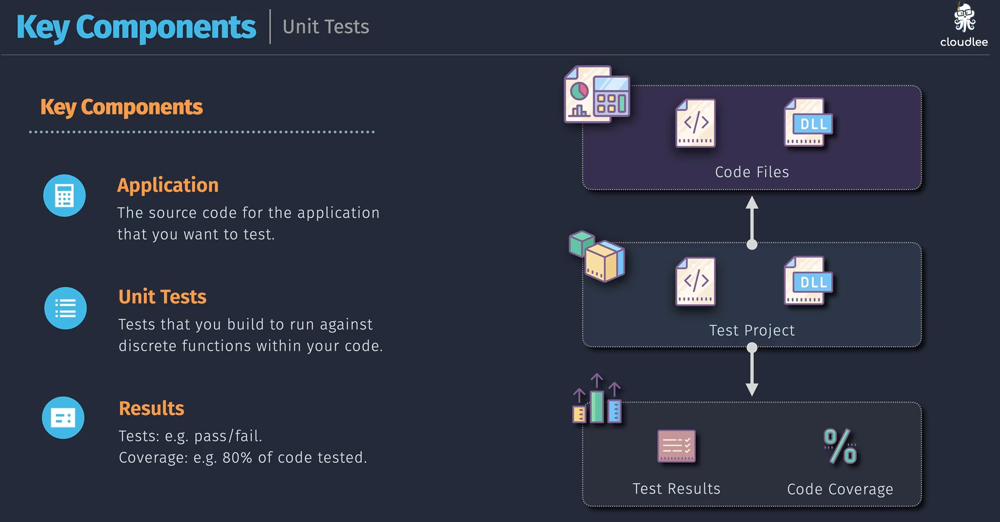
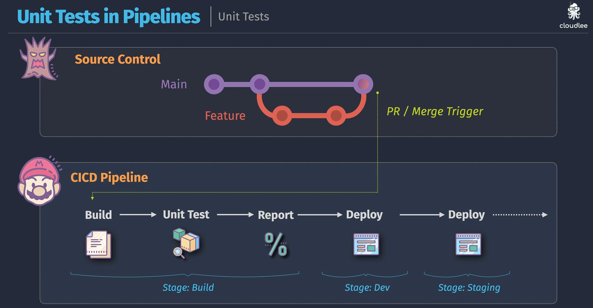

# 🧪 **Unit Testing in Azure DevOps**

## 📌 **1. What is a Unit Test?**

👉 A **Unit Test** is the smallest testable piece of code in your app (usually a function or method).
Its purpose is to **verify that a single piece of logic works correctly in isolation**.

Think of it like **checking each LEGO block 🧱 before building the castle**.

- **Scope** → one method/class, not the whole system
- **Speed** → should run fast (milliseconds)
- **Dependencies** → mocked or faked (no DB calls, no API calls)

---

## 📌 **2. Core Components of Unit Testing**

| Component 🔧       | Role                                                               |
| ------------------ | ------------------------------------------------------------------ |
| **Test Framework** | Provides test structure → e.g., `xUnit`, `NUnit`, `MSTest` in .NET |
| **Assertions**     | Verify outcomes → `Assert.Equal(expected, actual)`                 |
| **Mocks/Fakes**    | Replace real DB, API, services with fake objects                   |
| **Test Runner**    | Executes tests and reports results                                 |
| **Test Reports**   | Summaries & artifacts produced for pipelines                       |

---

<div align="left">
  
</div>

---

## 📌 **3. Example Unit Test in .NET (xUnit)**

### Code Under Test

```csharp
public class Calculator
{
    public int Add(int a, int b) => a + b;
}
```

### Unit Test

```csharp
using Xunit;

public class CalculatorTests
{
    [Fact]
    public void Add_ShouldReturnCorrectSum()
    {
        // Arrange
        var calc = new Calculator();

        // Act
        var result = calc.Add(2, 3);

        // Assert
        Assert.Equal(5, result);
    }
}
```

✅ If the result is **5**, test passes.  
❌ If not, pipeline fails.

---

## 📌 **4. How Unit Tests Fit into Azure Pipelines**

When you push code → CI pipeline runs:

1. **Restore packages**
2. **Build app**
3. **Run unit tests** (`dotnet test`)
4. **Publish results** (to Azure DevOps Test tab)
5. **Fail pipeline if tests fail**

---

## 📌 **5. Azure Pipeline Implementation**

<div align="center">
  
</div>

---

### 🔹 YAML Example (.NET Project with xUnit)

```yaml
trigger:
  - main

pool:
  vmImage: "windows-latest"

variables:
  buildConfiguration: "Release"

stages:
  - stage: BuildAndTest
    jobs:
      - job: UnitTests
        steps:
          - task: UseDotNet@2
            inputs:
              packageType: "sdk"
              version: "6.x"

          - task: DotNetCoreCLI@2
            displayName: "Restore packages"
            inputs:
              command: "restore"
              projects: "**/*.csproj"

          - task: DotNetCoreCLI@2
            displayName: "Build solution"
            inputs:
              command: "build"
              projects: "**/*.csproj"
              arguments: "--configuration $(buildConfiguration)"

          - task: DotNetCoreCLI@2
            displayName: "Run unit tests"
            inputs:
              command: "test"
              projects: "**/*Tests/*.csproj"
              arguments: "--configuration $(buildConfiguration) --logger trx"

          - task: PublishTestResults@2
            displayName: "Publish test results"
            inputs:
              testResultsFiles: "**/TestResults/*.trx"
              testRunTitle: "Unit Test Results"
              mergeTestResults: true
```

### 🔹 Explanation

- `UseDotNet@2` → install .NET SDK
- `DotNetCoreCLI@2 test` → runs all tests
- `--logger trx` → saves results as **.trx file**
- `PublishTestResults@2` → uploads results to **Azure DevOps Test tab**

---

## 📌 **6. Where You See Results**

- In **Azure DevOps → Pipelines → Runs → Tests tab**
- Results include:

  - ✅ Passed tests
  - ❌ Failed tests (with error message & stack trace)
  - ⏱ Duration per test
  - 📊 Summary graph

---

## 📌 **7. Best Practices for Unit Tests in Pipelines**

- ✅ Keep tests **fast** → should run in seconds, not minutes
- ✅ Cover **logic edge cases** (nulls, negatives, boundaries)
- ✅ Use **mocks/fakes** for DBs, APIs
- ✅ Fail pipeline on test failures → ensures code quality
- ✅ Run in **CI** (not only before release)

---

## 🏁 **TL;DR**

- **Unit Tests = verify smallest code units in isolation**
- **Frameworks**: xUnit, NUnit, MSTest (in .NET)
- **Pipeline** runs `dotnet test`, collects `.trx`, publishes results
- Results visible in **Azure DevOps Test tab**
- If a test fails → pipeline fails → code can’t ship 🚫
