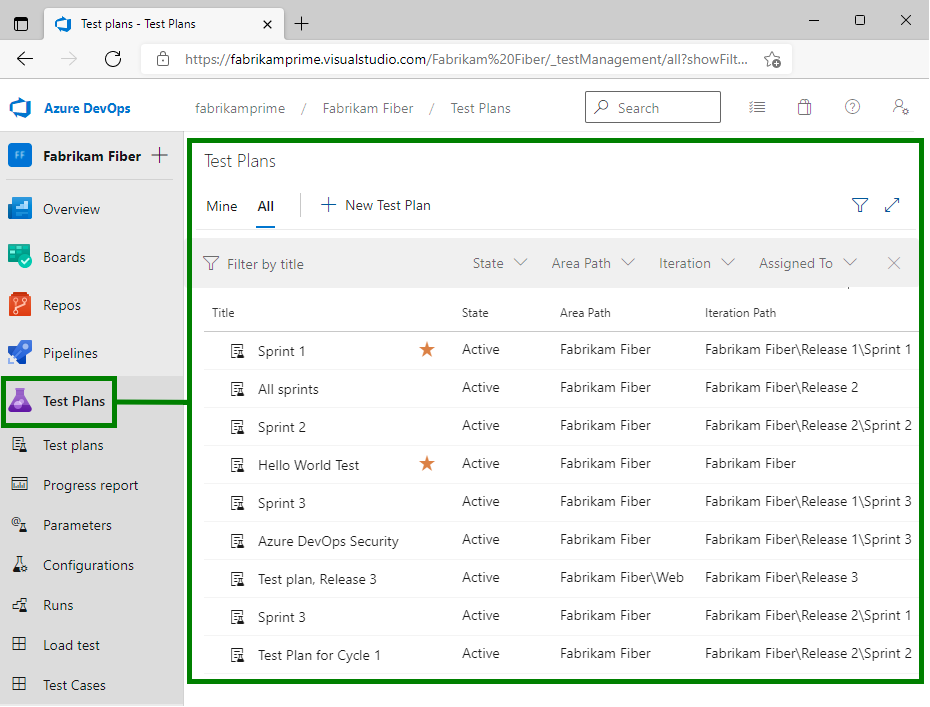
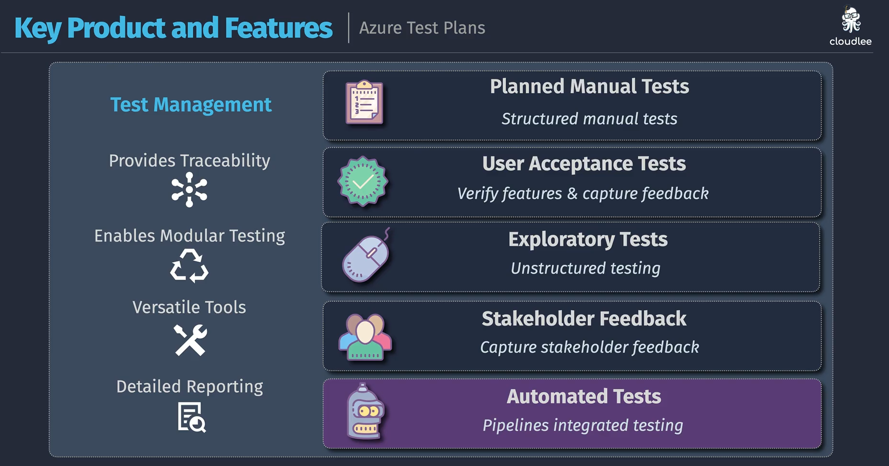
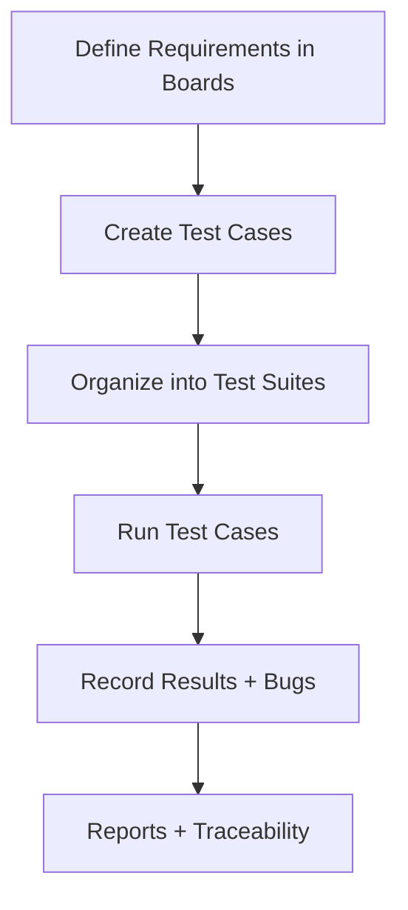
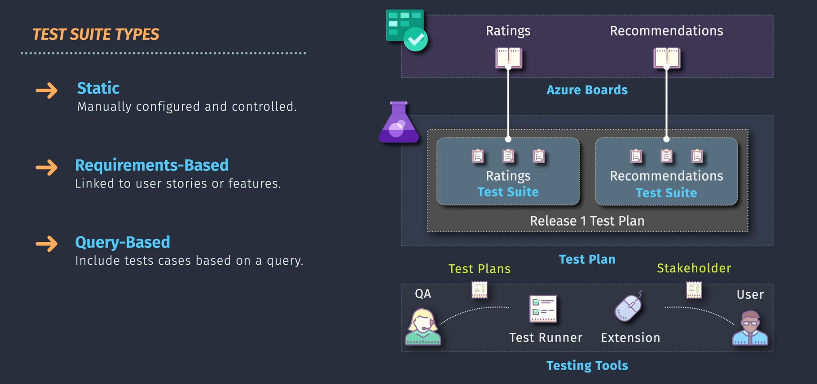

# 🧪 **Azure Test Plans (ATP)**

## 📌 **What is Azure Test Plans?**

Azure Test Plans is Microsoft’s **cloud-based testing service** that helps teams plan, track, and run manual and exploratory tests.

👉 Think of it as the **QA dashboard + execution engine** inside Azure DevOps:

- Organize test cases and suites.
- Run manual & exploratory tests.
- Capture test results with screenshots, logs, and bug links.
- Measure coverage & traceability (requirement → test → bug).

> 💡 Analogy:  
> If your DevOps pipeline is the **factory**, Test Plans is the **QA station** where humans (and assisted automation) verify products before shipping 🚦.

---

  

---

## 📌 **Core Components**

| Component             | Description                                                                         |
| --------------------- | ----------------------------------------------------------------------------------- |
| **Test Plans**        | A container for organizing your test suites (like a project-level folder).          |
| **Test Suites**       | Logical grouping of test cases (by feature, sprint, requirement, etc.).             |
| **Test Cases**        | Individual steps/scripts testers will execute (preconditions → steps → exp result). |
| **Test Runs**         | Execution instance of test cases (records actual outcomes).                         |
| **Exploratory Tests** | Free-form testing sessions with session notes & bug filing.                         |
| **Parameters**        | Variables used in test cases to re-run same test with different data.               |
| **Configurations**    | Define environments (OS, browser, device) to run tests across variations.           |

---

## 📌 **Features at a Glance**

| Category 🚀                  | Features                                                                    |
| ---------------------------- | --------------------------------------------------------------------------- |
| **Manual Testing**           | Step-by-step test case execution with pass/fail tracking.                   |
| **Exploratory Testing**      | Capture screenshots, videos, logs while testing without predefined steps.   |
| **Traceability**             | Link test cases to requirements (User Stories, PBIs).                       |
| **Defect Filing**            | Create bugs directly from failed test cases with repro steps auto-attached. |
| **Parameters & Data-driven** | Reuse test cases with different data values.                                |
| **Configurations**           | Run same test across browsers/devices.                                      |
| **Reports & Analytics**      | Test progress, requirement coverage, failure trends.                        |

---

  

---

## 📌 **Workflow**

Here’s how a typical **Test Plan lifecycle** looks:

---

## 📌 **Types of Test Suites**

1️⃣ **Static suite** → manually add test cases.  
2️⃣ **Requirement-based suite** → auto-links to work items (e.g., User Story “Checkout Flow”).  
3️⃣ **Query-based suite** → pulls test cases dynamically from a query (e.g., all "Priority 1" cases).

  

---

## 📌 **Example Flow**

Imagine you’re building an **e-commerce app**:

- Requirement: “As a user, I can checkout my cart.”
- Create a **Requirement-based Test Suite** linked to that story.
- Add test cases:

  - ✅ Valid checkout with Visa
  - ❌ Invalid card declines
  - 🛒 Empty cart prevents checkout

- Tester runs the suite → one test fails → clicks “Create Bug”.
- Bug gets logged with **screenshot + environment details + test steps** auto-attached.
- Developer fixes → rerun the test case → now passes.
- Azure Boards shows **traceability**: Requirement → Tested → Bug Fixed.

---

## 📌 **Exploratory Testing**

- Launch the **Exploratory Test extension** in browser.
- Tester clicks around the app freely (no pre-written steps).
- Every action, screenshot, and note gets logged.
- At the end → export findings as bugs or new test cases.
  👉 Great for uncovering edge cases that scripted tests missed.

---

## 📌 **Integration with Pipelines**

- Test Plans itself is **manual/exploratory-focused**, but…
- You can link **automated tests** (from CI/CD pipelines) back into test cases → so coverage reports show **both manual + automated results** together.

Example:

- Your unit/integration tests run via `dotnet test` in pipelines.
- You link those to test cases in Test Plans.
- When pipeline runs → Test Plan shows those cases as “automated passed/failed”.

---

## 📌 **Benefits**

- 📊 **Visibility:** Central dashboard for all test progress.
- 🔗 **Traceability:** Requirements ↔ Test Cases ↔ Bugs.
- 🎥 **Repro Power:** Rich bug reports with screenshots/videos/logs.
- 🤝 **Collaboration:** Dev + QA + PM see same view.
- ⚙️ **Hybrid:** Supports both manual & automated tests.

---

## 📌 **Licensing**

  

---

> - Azure Test Plans is an **add-on license** (not free in Basic DevOps).
> - Testers need a Test Plans license (or Visual Studio Enterprise).
> - Viewers can see results without a license.

---

## 🏁 **TL;DR**

- Azure Test Plans = the **manual/exploratory testing hub** of Azure DevOps.
- Organize → Execute → Record → Report.
- Features: Test Plans, Suites, Cases, Runs, Parameters, Configurations.
- Adds **traceability** between requirements, tests, and bugs.
- Works together with **Pipelines (automation)** and **Boards (requirements)** for full ALM.
