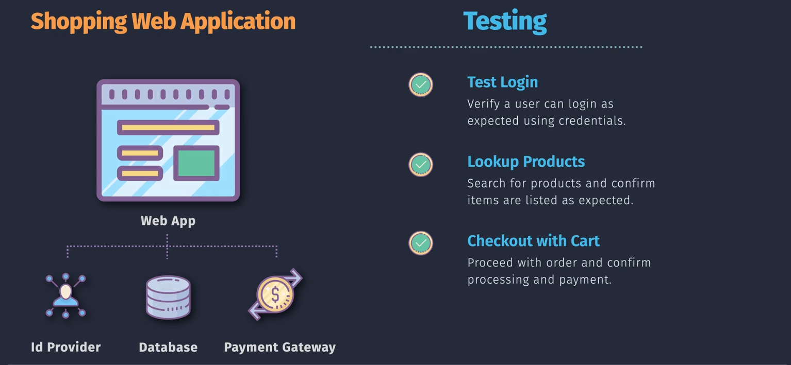
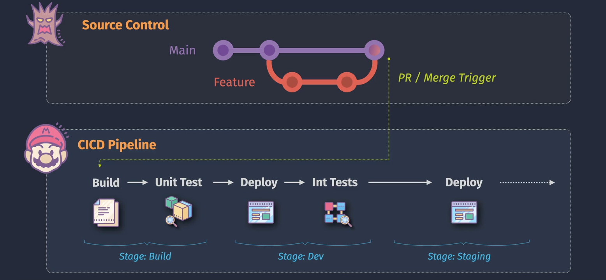

# 🔗 **Integration Testing in Azure DevOps**

## 🧠 **1. What’s an Integration Test (vs Unit)?**

- **Unit test:** tests a _single_ function/class in **isolation** (DB/API mocked).
- **Integration test:** tests how **components work together** (e.g., Web API ↔ DB ↔ Cache).

> **Scope:** real framework pipeline (routing, filters, DI), real database (or close), real HTTP pipeline (TestServer/HttpClient).  
> **Goal:** catch issues that unit tests miss (misconfig, connection strings, EF mappings, serialization, filters, auth, etc.).

---

<div align="center">
    
</div>

---

## 🔩 **2. Core Components of Integration Tests**

| Component             | What it is                                                       | Why it matters                     |
| --------------------- | ---------------------------------------------------------------- | ---------------------------------- |
| **Host/Test Server**  | Boot the app (ASP.NET Core `WebApplicationFactory`/`TestServer`) | Use the real middleware/DI/routing |
| **External Services** | DB, message bus, cache, other APIs                               | Validate wiring + data access      |
| **Seed/Test Data**    | Known initial state                                              | Deterministic tests                |
| **Orchestration**     | How you bring up deps (Docker, Testcontainers)                   | Repeatable in CI                   |
| **Assertions**        | HTTP status, payloads, DB state                                  | E2E correctness                    |
| **Isolation**         | Reset state per test/class                                       | Avoid cross-test flakiness         |

---

## 🧱 **3. Typical .NET Patterns**

<div align="center">
    
</div>

---

### Pattern A — **In-memory/lightweight** (fastest)

- Use **`WebApplicationFactory<TProgram>`** + **SQLite in-memory** (or EF Core InMemory) for a real HTTP pipeline without a heavy DB.
- Great for **API behavior**; not perfect for SQL differences.

**Example (ASP.NET Core):**

```csharp
// TestStartup for overriding DB to SQLite InMemory
public class TestWebAppFactory : WebApplicationFactory<Program>
{
    protected override void ConfigureWebHost(IWebHostBuilder builder)
    {
        builder.ConfigureServices(services =>
        {
            var descriptor = services.Single(d => d.ServiceType == typeof(DbContextOptions<AppDb>));
            services.Remove(descriptor);

            services.AddDbContext<AppDb>(o =>
                o.UseSqlite("DataSource=:memory:")); // realistic provider

            // build provider and seed
            var sp = services.BuildServiceProvider();
            using var scope = sp.CreateScope();
            var db = scope.ServiceProvider.GetRequiredService<AppDb>();
            db.Database.OpenConnection();
            db.Database.EnsureCreated();
            Seed(db);
        });
    }

    private static void Seed(AppDb db) => db.Orders.Add(new Order { Id = 1, Item = "Book" });
}
```

```csharp
public class OrdersApiTests : IClassFixture<TestWebAppFactory>
{
    private readonly HttpClient _client;
    public OrdersApiTests(TestWebAppFactory factory) => _client = factory.CreateClient();

    [Fact]
    public async Task GetOrder_Existing_Returns200()
    {
        var res = await _client.GetAsync("/api/orders/1");
        res.EnsureSuccessStatusCode();
        var json = await res.Content.ReadAsStringAsync();
        Assert.Contains("\"Item\":\"Book\"", json);
    }
}
```

### Pattern B — **Realistic with containers** (most faithful)

- Use **Testcontainers for .NET** or **service containers** in the pipeline to run SQL Server/Postgres/Redis.
- Pros: closest to prod behavior (indexes, collation, timeouts).
- Cons: slower than in-memory.

**Testcontainers snippet:**

```csharp
public class SqlFixture : IAsyncLifetime
{
    public string ConnectionString { get; private set; } = default!;
    private MsSqlContainer _sql = new MsSqlBuilder().Build();

    public async Task InitializeAsync()
    {
        await _sql.StartAsync();
        ConnectionString = _sql.GetConnectionString();
        // run migrations + seed
        using var db = new AppDb(new DbContextOptionsBuilder<AppDb>()
          .UseSqlServer(ConnectionString).Options);
        db.Database.Migrate();
        Seed(db);
    }
    public Task DisposeAsync() => _sql.DisposeAsync().AsTask();
}
```

---

## 🧪 **4. What to Test (Integration)**

- ✅ **HTTP behavior**: routes, model binding, filters, versioning, status codes
- ✅ **Auth & Policies**: JWT/cookies, `[Authorize]`, role claims
- ✅ **Persistence**: EF Core mappings, migrations, transactions
- ✅ **Serialization**: casing, date formats, enums
- ✅ **Dependencies**: calls to other services (stub with WireMock if needed)
- ✅ **Edge cases**: 404/409/422, validation errors, concurrency, idempotency

---

## 🧼 **5. Test Isolation & Data Reset**

- **Per-test DB** (fast with SQLite; slower with SQL): create & drop per test/class.
- **Truncate strategy**: clear tables between tests.
- **Unique schema per run** (SQL Server): schema named by test run ID.

> Keep tests parallel-safe or disable parallelization for DB-heavy specs:

```csharp
[assembly: CollectionBehavior(DisableTestParallelization = true)]
```

---

## ⚙️ **6. Azure Pipelines — 3 Ready Approaches**

### A. **Fast** (SQLite in-memory) — no external deps

```yaml
trigger: [main]
pool:
  vmImage: "ubuntu-latest"

stages:
  - stage: Test
    jobs:
      - job: IntegrationFast
        steps:
          - task: UseDotNet@2
            inputs: { packageType: "sdk", version: "8.x" }

          - task: DotNetCoreCLI@2
            displayName: Restore
            inputs: { command: "restore", projects: "**/*.csproj" }

          - task: DotNetCoreCLI@2
            displayName: Build
            inputs:
              command: "build"
              projects: "**/*.csproj"
              arguments: "--configuration Release --no-restore"

          - task: DotNetCoreCLI@2
            displayName: Run Integration Tests (SQLite)
            inputs:
              command: "test"
              projects: "**/*IntegrationTests/*.csproj"
              arguments: "--configuration Release --no-build --logger trx"
          - task: PublishTestResults@2
            inputs:
              testResultsFiles: "**/TestResults/*.trx"
              testRunTitle: "Integration (SQLite)"
```

### B. **Realistic** (SQL Server service container in the job)

```yaml
trigger: [main]
pool:
  vmImage: "ubuntu-latest"

stages:
  - stage: Test
    jobs:
      - job: IntegrationWithSQL
        displayName: Integration with SQL Server
        container: mcr.microsoft.com/dotnet/sdk:8.0 # optional, run steps inside SDK image
        services:
          mssql:
            image: mcr.microsoft.com/mssql/server:2022-latest
            env:
              ACCEPT_EULA: "Y"
              SA_PASSWORD: "Your_strong_password123!"
            ports:
              - 1433:1433
            options: >-
              --health-cmd "(/opt/mssql-tools/bin/sqlcmd -S localhost -U sa -P 'Your_strong_password123!' -Q 'select 1') || exit 1"
              --health-interval 10s --health-timeout 5s --health-retries 10
        steps:
          - script: |
              echo "Waiting for SQL to be healthy..."
              for i in {1..30}; do
                /opt/mssql-tools/bin/sqlcmd -S mssql -U sa -P 'Your_strong_password123!' -Q "select 1" && break
                sleep 2
              done
            displayName: Wait for SQL

          - task: UseDotNet@2
            inputs: { packageType: "sdk", version: "8.x" }

          - task: DotNetCoreCLI@2
            displayName: Restore+Build
            inputs:
              command: "build"
              projects: "**/*.csproj"
              arguments: "--configuration Release"

          - script: |
              export ConnectionStrings__Default="Server=mssql,1433;Database=app_it;User Id=sa;Password=Your_strong_password123!;Encrypt=false"
              dotnet ef database update --project src/App/App.csproj
              dotnet test tests/App.IntegrationTests/App.IntegrationTests.csproj \
                --configuration Release --logger trx \
                -- DataCollectionRunSettings.DataCollectors.DataCollector.Configuration.ConnectionString="$ConnectionStrings__Default"
            displayName: Migrate + Run Integration Tests
          - task: PublishTestResults@2
            inputs:
              testResultsFiles: "**/TestResults/*.trx"
              testRunTitle: "Integration (SQL service container)"
```

> Notes
>
> - `services:` spins up a sibling container named `mssql`.
> - Use `Server=mssql,1433` (service name) from the job container.
> - `Encrypt=false` for local pipeline containers unless you provide certificates.

### C. **Testcontainers for .NET** (self-orchestration)

- No `services:` block; tests **create and manage** the DB container.
- Pipeline YAML is same as **A**, code handles container lifecycle (see snippet above).

---

## 🧪 **7. Filtering & Grouping Tests**

- Use **traits/categories** to run only integration tests in CI:

```csharp
[Trait("Type", "Integration")]
public class OrdersApiTests { ... }
```

```yaml
dotnet test --filter "Type=Integration" --logger trx
```

---

## 🔐 **8. Secrets & Config in Pipeline**

- Put connection strings/seeds in **Variable Groups** or **Library** (masked).
- Pass as env vars:

```yaml
- script: |
    export ConnectionStrings__Default="$(DbConn)"
    dotnet test tests/*IntegrationTests*.csproj --logger trx
  env:
    DbConn: $(DbConnString) # secret variable from Library
```

---

## 🧭 **9. When Integration Tests Fail — Where to Look**

- **Pipelines → Tests tab**: failing test names + stack traces
- **Attachments**: logs / screenshots (if you save them)
- **App logs**: write server logs to console so they appear in the job log
- **Flaky suspects**: missing awaits, parallel tests sharing DB, clock/tz dependencies, seeds not reset

---

## ✅ **10. Best Practices Checklist**

- [ ] Clear **test naming**: `Method_Scenario_Expected`
- [ ] Stable **seed/reset** strategy (per test or test class)
- [ ] Use **SQLite InMemory** for speed where acceptable
- [ ] Use **real DB containers** for critical persistence paths
- [ ] Make tests **idempotent**; avoid time/locale surprises
- [ ] **Fail fast** in CI; publish `.trx` so failures are readable
- [ ] Keep **integration tests under 5–10 min** total
- [ ] Separate **Unit**, **Integration**, **E2E** suites + filters

---

## 🏁 **TL;DR**

- **Integration tests** validate **wiring + behavior** across components (API ↔ DB ↔ middleware).
- Implement with **WebApplicationFactory** (fast) or **containers/Testcontainers** (realistic).
- In **Azure Pipelines**, either run with **no services** (SQLite), **service containers** (SQL), or let **Testcontainers** manage infra.
- Publish **TRX** results so you get rich test reporting.
