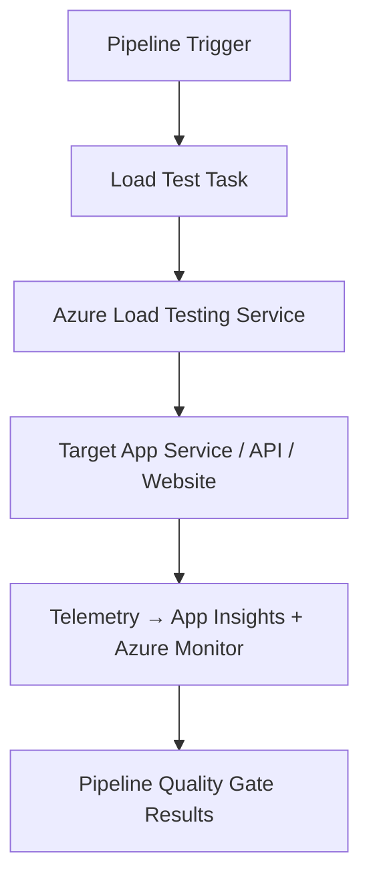

# ⚡ **Load Testing in Azure DevOps**

## 📌 **What is Load Testing?**

👉 Load Testing checks how your **app behaves under pressure** when **many users** or **many requests** hit it at once.

- **Goal:** Can the app **handle expected traffic** (or more) without crashing?
- **Focus:** Performance (response time), Stability, Scalability.
- **When used:** Before releasing to production OR when scaling infra.

💡 Analogy → Like testing how much weight a bridge 🏗 can carry before it cracks.

---

<div align="center">
  
</div>

---

## 📌 **Key Concepts**

| Term 🔑                | Meaning                                                             |
| ---------------------- | ------------------------------------------------------------------- |
| **Load**               | Number of users/requests hitting the system simultaneously          |
| **Throughput (RPS)**   | Requests per second your system can handle                          |
| **Latency/Response**   | Time taken to respond to requests                                   |
| **Error Rate**         | Percentage of failed requests                                       |
| **Scalability**        | How well the system handles increased load (linear or bottlenecked) |
| **Baseline vs Stress** | Normal expected traffic vs extreme beyond limits                    |

---

## 📌 **Types of Load Tests**

1. **Load Test** → Normal expected traffic (e.g., 1,000 users)
2. **Stress Test** → Beyond normal (e.g., 10,000 users, see where it breaks)
3. **Spike Test** → Sudden traffic jump (e.g., Black Friday sales)
4. **Soak Test** → Long-duration test (e.g., 500 users for 12 hours, check memory leaks)

---

## 📌 **Tools in Azure World**

- 🔹 **Azure Load Testing Service** (fully managed, integrates with DevOps pipelines)
- 🔹 **Apache JMeter** (classic, open-source; Azure Load Testing runs JMeter scripts)
- 🔹 **k6** (modern open-source, CLI-based load testing tool)

👉 For DevOps pipelines, **Azure Load Testing** is the most seamless.

---

## 📌 **How Azure Load Testing Works**

<div align="center">



</div>

**Flow:**

1. Pipeline triggers load test →
2. Azure Load Testing spins up engines →
3. Engines hammer your API/App →
4. Results + telemetry collected →
5. Pipeline marks success/failure based on thresholds.

---

## 📌 **CI/CD Pipeline Example**

<div align="center">
  
</div>

---

### 🔹 Load Test YAML (Azure Pipeline)

```yaml
stages:
  - stage: LoadTest
    jobs:
      - job: RunLoadTest
        pool:
          vmImage: "ubuntu-latest"
        steps:
          - task: AzureLoadTest@1
            inputs:
              azureSubscription: "MyServiceConnection" # ARM service connection (SP)
              resourceGroup: "rg-loadtest"
              loadTestResource: "my-loadtest-service"
              loadTestConfigFile: "loadtest-config.yaml"
```

### 🔹 loadtest-config.yaml (JMeter-based)

```yaml
version: v0.1
testId: "dotnet-api-loadtest"
displayName: ".NET API Load Test"
testPlan: "tests/my-test.jmx"
engineInstances: 2
failureCriteria:
  - avg(response_time_ms) > 2000
  - percentage(error) > 1
```

👉 This says:

- Run test with 2 load engines.
- Fail pipeline if **avg response > 2s** OR **error rate > 1%**.

---

## 📌 **Where Results Appear**

- **Azure DevOps → Pipeline run** → Quality Gate results
- **Azure Portal → Azure Load Testing resource** → Graphs:

  - Response time distribution
  - Error % over time
  - Requests per second

- **App Insights integration** → Drill down to see bottlenecks (DB slow? CPU spike?).

---

## 📌 **Best Practices**

- ✅ Start with **baseline load** (normal usage)
- ✅ Define **SLOs/SLAs** (e.g., p95 < 1s, error < 1%)
- ✅ Use **realistic scenarios** (login, checkout, search)
- ✅ Run in **staging** first, then production shadow mode
- ✅ Automate in pipeline → fail build if thresholds are exceeded
- ✅ Pair with **Application Insights** for root cause (server vs DB vs cache)

---

## 🏁 **TL;DR**

- **Load Testing** = Can your app survive real-world traffic?
- **Azure Load Testing** runs JMeter scripts inside Azure.
- In pipelines: **add a stage** → run load test → set **failure criteria** → block bad builds.
- Use results in **Azure Monitor/App Insights** for bottleneck analysis.
