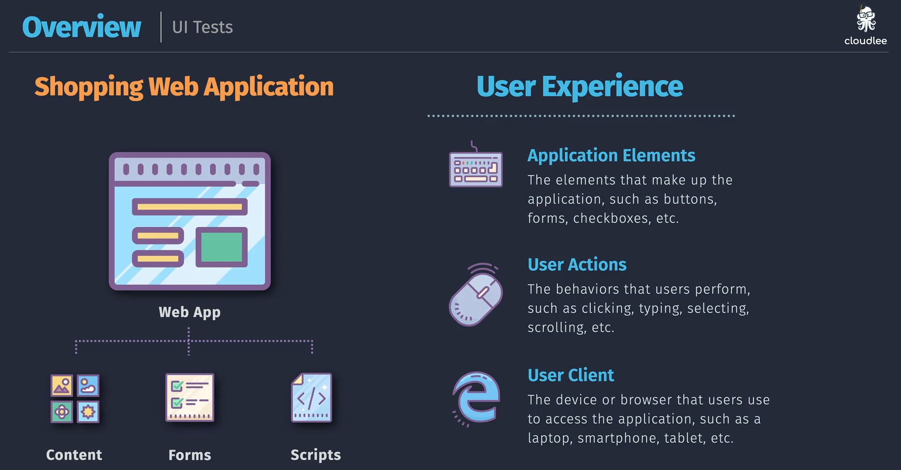
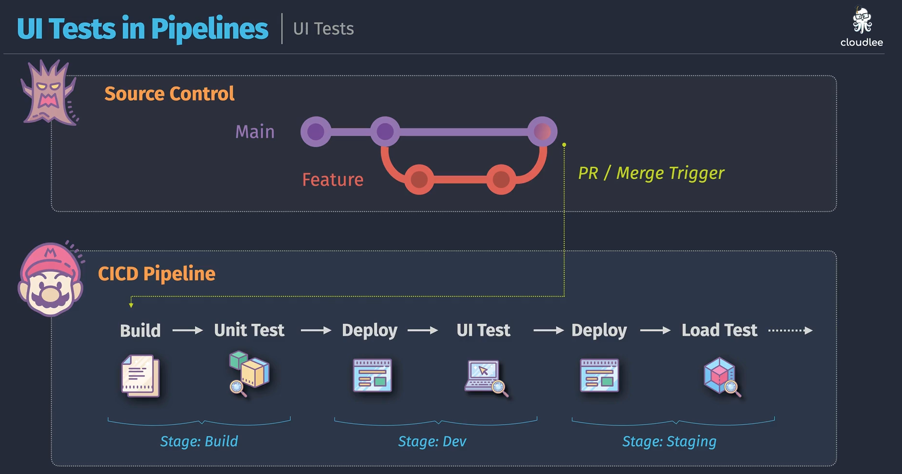

# 🖥️ **UI Testing with Selenium in Azure DevOps**

## 📌 **What is UI Testing?**

👉 **UI Testing** (a.k.a. end-to-end / functional testing) checks whether your application’s **user interface works as expected** when a real user clicks, types, and navigates.

- **Unit Test** → checks a function (backend).
- **Integration Test** → checks components together (API ↔ DB).
- **UI Test** → checks **the app from the user’s eyes** (browser automation).

💡 Example: Open login page → type username/password → click Login → assert "Welcome John" appears.

---

<div align="center">
  
</div>

---

## 📌 **What is Selenium?**

**Selenium** is the most popular **UI test automation framework**.
It automates **web browsers** (Chrome, Edge, Firefox, Safari).

- **Selenium WebDriver** → API to control the browser
- **Selenium IDE** → Record & replay tool (simple cases)
- **Selenium Grid** → Run tests across multiple browsers/devices in parallel

👉 Think of it like a **robot user 🤖** clicking around your site.

---

## 📌 **Core Components of Selenium UI Tests**

| Component          | Purpose                                         |
| ------------------ | ----------------------------------------------- |
| **WebDriver**      | The engine that controls browsers               |
| **Locators**       | How you find elements (ID, Name, CSS, XPath)    |
| **Actions**        | Click, type, scroll, drag & drop                |
| **Assertions**     | Verify expected UI behavior                     |
| **Test Framework** | Runs tests (e.g., MSTest, NUnit, JUnit, PyTest) |

---

## 📌 **Example Selenium Test (.NET + NUnit)**

```csharp
using NUnit.Framework;
using OpenQA.Selenium;
using OpenQA.Selenium.Chrome;

namespace UITests
{
    public class LoginTests
    {
        private IWebDriver driver;

        [SetUp]
        public void Setup()
        {
            driver = new ChromeDriver(); // launch Chrome
        }

        [Test]
        public void Login_ShouldShowWelcomeMessage()
        {
            // Arrange
            driver.Navigate().GoToUrl("https://myapp.azurewebsites.net/login");

            // Act
            driver.FindElement(By.Id("username")).SendKeys("john");
            driver.FindElement(By.Id("password")).SendKeys("password123");
            driver.FindElement(By.Id("loginButton")).Click();

            // Assert
            var welcome = driver.FindElement(By.Id("welcomeMessage")).Text;
            Assert.AreEqual("Welcome John", welcome);
        }

        [TearDown]
        public void Cleanup()
        {
            driver.Quit(); // close browser
        }
    }
}
```

✅ Opens Chrome → logs in → verifies welcome text.

---

## 📌 **Running Selenium Tests in Azure Pipelines**

You can run Selenium UI tests inside your **CI/CD pipeline**.

<div align="center">
  
</div>

---

### 🔹 Pipeline YAML (with Chrome + Selenium)

```yaml
trigger:
  - main

pool:
  vmImage: "ubuntu-latest"

steps:
  - task: UseDotNet@2
    inputs:
      packageType: "sdk"
      version: "6.x"

  - task: DotNetCoreCLI@2
    displayName: Restore
    inputs:
      command: "restore"
      projects: "**/*.csproj"

  - task: DotNetCoreCLI@2
    displayName: Build
    inputs:
      command: "build"
      projects: "**/*.csproj"
      arguments: "--configuration Release"

  # Run Selenium UI tests
  - task: DotNetCoreCLI@2
    displayName: Run UI Tests
    inputs:
      command: "test"
      projects: "**/*UITests/*.csproj"
      arguments: "--configuration Release --logger trx"

  - task: PublishTestResults@2
    inputs:
      testResultsFiles: "**/TestResults/*.trx"
      testRunTitle: "Selenium UI Tests"
```

👉 Azure Pipelines’ hosted agents come with **Chrome & Edge** pre-installed 🚀.

---

## 📌 **Investigating Test Failures**

- **Failed step screenshot** → You can extend Selenium to capture screenshots:

  ```csharp
  ((ITakesScreenshot)driver).GetScreenshot().SaveAsFile("error.png");
  ```

- In pipelines, upload screenshots as artifacts.
- Debug by checking console logs + screenshots.

---

## 📌 **Best Practices**

✅ Run UI tests **after build & deployment to a test/staging env**  
✅ Keep UI tests **short and focused** (don’t test everything via UI)  
✅ Prefer **IDs** for element locators (avoid fragile XPath)  
✅ Add **retry logic** for async/wait issues (use `WebDriverWait`)  
✅ Combine with **Parallel runs** (Selenium Grid, Azure DevTest Labs, BrowserStack, Sauce Labs)  
✅ Keep a healthy **test pyramid**:

> - 🟢 Many unit tests
> - 🟡 Fewer integration tests
> - 🔴 Fewest UI tests (they’re slow & flaky if overused)

---

## 🏁 **TL;DR**

- **Selenium** = browser automation tool for UI testing.
- Use it to simulate real user actions (clicks, typing, login flows).
- In Azure Pipelines → run Selenium tests with Chrome/Edge → publish results.
- Best for **critical paths** (login, checkout, search).
- Don’t rely solely on UI tests → keep them small but powerful.
