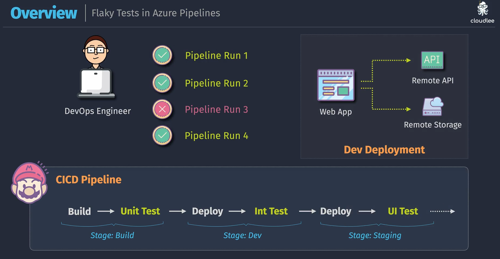
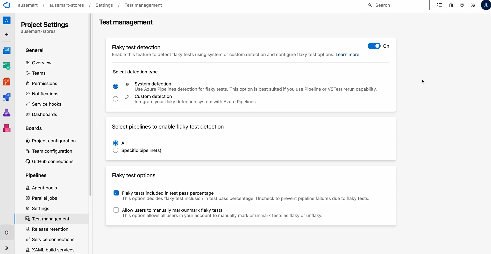

# 🎢 **Flaky Tests in CI/CD**

## 📌 **1. What is a Flaky Test?**

A **flaky test** is a test that sometimes **passes ✅** and sometimes **fails ❌**, **without any change in the code**.

👉 In other words:

- You run the same test, same code → different outcomes.
- It makes pipelines **unreliable** and developers **lose trust** in tests.

---

<div align="center">
  
</div>

---

## 📌 **2. Why Flaky Tests are Dangerous**

- Wastes developer time debugging “fake” failures.
- Slows down CI/CD pipelines (re-runs, retries).
- Reduces confidence → teams may start ignoring test failures (“oh, it’s just that flaky test again”).
- Hides real bugs behind noise.

---

## 📌 **3. Common Causes of Flaky Tests**

| Cause                         | Example                                                    |
| ----------------------------- | ---------------------------------------------------------- |
| **⏳ Timing issues**          | UI test clicks before page finished loading                |
| **⚡ Async race conditions**  | Two threads writing to DB → unpredictable result           |
| **🌍 External dependencies**  | API rate limits, network delay, DB server hiccup           |
| **🖥️ Environment dependency** | Test passes locally, fails in pipeline due to config or OS |
| **🔄 Shared state**           | Tests don’t clean up → leftover data causes random fails   |
| **🎲 Random data**            | Test relies on `DateTime.Now` or random IDs                |

---

## 📌 **4. Example of a Flaky Test**

### ❌ Wrong

```csharp
[Test]
public void TestLoginButton()
{
    driver.Navigate().GoToUrl("https://myapp/login");
    driver.FindElement(By.Id("loginButton")).Click();
    var msg = driver.FindElement(By.Id("welcome")).Text;
    Assert.AreEqual("Welcome!", msg);
}
```

This might fail if the page hasn’t finished loading yet.

---

### ✅ Fixed with Explicit Wait

```csharp
[Test]
public void TestLoginButton()
{
    driver.Navigate().GoToUrl("https://myapp/login");

    WebDriverWait wait = new WebDriverWait(driver, TimeSpan.FromSeconds(10));
    var button = wait.Until(drv => drv.FindElement(By.Id("loginButton")));
    button.Click();

    var msg = wait.Until(drv => drv.FindElement(By.Id("welcome"))).Text;
    Assert.AreEqual("Welcome!", msg);
}
```

---

## 📌 **5. How to Handle Flaky Tests in Azure Pipelines**

### 🔹 Detecting Flaky Tests

- **Test history trend** → If a test fails sometimes but passes on rerun, it’s flaky.
- **Azure DevOps Test Analytics** → highlights unstable tests.

### 🔹 Mitigating Flaky Tests

1. **Retries** (temporary relief, not a fix)

   ```yaml
   - task: DotNetCoreCLI@2
     inputs:
       command: "test"
       projects: "**/*Tests.csproj"
     retryCountOnTaskFailure: 2
   ```

   → Will re-run test step if it fails.

2. **Isolate & quarantine** flaky tests

   - Move unstable tests into a separate pipeline stage.
   - Don’t block main CI pipeline on them until fixed.

3. **Best practices to reduce flakiness**

   - Avoid hard-coded sleeps (`Thread.Sleep`) → use **waits**.
   - Mock external services (DB, APIs) instead of hitting real ones.
   - Clean test data/state after every run.
   - Use deterministic data instead of random.

---

## 📌 **What Azure DevOps Gives You**

<div align="center">
  
</div>

When you enable **Flaky Test Detection**, Azure DevOps will:

1. **Auto-detect flaky tests**

   - Azure looks at test execution history (pass/fail trend across builds).
   - If the same test is failing sometimes and passing sometimes → it’s marked as **flaky**.

2. **Auto-rerun failed tests**

   - If a test fails, Azure will rerun it in the same pipeline run.
   - If it passes on rerun → Azure **flags it as flaky**, not a hard failure.
   - This prevents your pipeline from failing just because of one unreliable test.

3. **Flaky Test Insights in UI**

   - You’ll see a **“Flaky” tag** next to test names in the Test tab of pipeline results.
   - Reports (Test Analytics) show a **Flaky Test trend chart** → so you can identify which tests are unreliable.

---

### ⚙️ **Options**

#### 🔹 **System detection**

Azure Pipelines does the detection automatically using rerun + history. (Default & easiest)

#### 🔹 **Custom detection**

You plug in your own detection logic (rarely needed).

---

#### 🔹 **Flaky tests included in test pass percentage**

- **Checked (default):** flaky tests affect the pipeline status. If reruns fail, the pipeline fails.
- **Unchecked:** flaky tests are excluded from pass rate calculation → pipeline may still pass even with flaky failures.

💡 If you’re early in a project and have many flaky tests → uncheck this so the team isn’t blocked.
But best practice: keep it **checked** to force fixing them.

---

#### 🔹 **Allow users to manually mark/unmark flaky tests**

Lets developers flag/unflag tests as flaky right in Azure DevOps UI (if detection didn’t catch it).
Useful for faster triage.

---

## 📌 **Where You See Flaky Tests**

1. **Pipeline Run → Tests Tab**

   - You’ll see results grouped as **Passed / Failed / Flaky**.
   - Example:

     - ✅ 100 tests passed
     - ❌ 2 tests failed
     - ⚠️ 1 flaky test

2. **Analytics → Test Results Trend**

   - Dedicated chart for flaky test trends.
   - Helps you track which test methods are unstable over time.

---

## 📌 **Example Flow in Action**

1. You enable **Flaky Test Detection** in Project Settings.
2. Pipeline runs → `OrderTests.CheckoutTest` fails.
3. Azure reruns that test automatically.

   - If it **passes on rerun** → test marked as **Flaky** ⚠️.
   - If it **fails again** → stays as **Failed** ❌.

4. In results, you see a **“Flaky” badge** and Azure shows historical flaky % for that test.

---

## 📌 **6. Best Practices for Stable Tests**

- ✅ Keep **unit tests** pure (no external deps).
- ✅ Use **integration test environments** (dedicated DB, test API).
- ✅ For UI tests → use explicit waits, stable locators.
- ✅ Monitor test history to catch flakiness early.
- ✅ Fix root cause — retries should be temporary.
- ✅ **Enable rerun** → prevents false negatives blocking CI.
- ✅ Use Analytics to **prioritize fixing flaky tests** (don’t just ignore them).
- ✅ Keep **“included in pass %”** checked to maintain test quality pressure.
- 🚫 Don’t rely on reruns forever → fix root cause (waits, mocks, cleanup).

---

## 🏁 **TL;DR**

- A **flaky test** = sometimes passes, sometimes fails with no code change.
- Causes: timing issues, async, network, shared state, randomness.
- Impact: slows down pipelines, kills trust in tests.
- Fix: stable waits, mocks, cleanup, deterministic data.
- In Azure DevOps → detect via test history, temporarily quarantine/retry, but always **fix root cause**.
