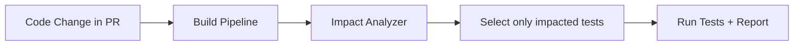

# 🧪 Test Impact Analysis (TIA) in Azure DevOps

## 📌 1. What is TIA?

👉 **Test Impact Analysis** = a **smart test selection technique** that runs **only the tests impacted by recent code changes**, instead of running the **entire test suite** every time.

- Traditional pipelines → run all 5,000 tests, even if you only changed one line.
- With TIA → pipeline analyzes code changes + test coverage map → runs only affected tests.

⚡ Saves **time, money, and compute resources** in CI/CD.

---

## 📌 2. Why Use TIA?

- 🚀 **Faster builds** → large projects cut test time by 50–90%.
- 💰 **Cost savings** → less agent time, fewer compute hours.
- 🎯 **Focused validation** → runs the tests that matter most.
- 🔄 **Feedback loop** → devs get results quicker.

---

## 📌 3. How TIA Works



- Azure DevOps tracks **which tests touch which code files** (via previous runs).
- When code changes, TIA checks → “Which tests cover this code?”
- Runs only those tests → skips unrelated ones.

---

## 📌 4. Example

Imagine you have **3 modules**:

- Module A → User Login
- Module B → Shopping Cart
- Module C → Checkout

You have 300 tests total.

- Developer changes **CartService.cs**.
- TIA detects: only **50 cart-related tests** are impacted.
- Pipeline runs 50 instead of 300 tests.
- ✅ Faster feedback, still safe.

---

## 📌 5. Enabling TIA in Azure DevOps

### YAML Example for .NET

```yaml
- task: VSTest@2
  inputs:
    testSelector: "testAssemblies"
    testAssemblyVer2: |
      **\*test*.dll
      !**\*TestAdapter.dll
      !**\obj\**
    runInParallel: true
    runOnlyImpactedTests: true # ✅ Enables Test Impact Analysis
    vsTestVersion: "latest"
```

🔑 Key flag:

```yaml
runOnlyImpactedTests: true
```

---

## 📌 6. Limitations of TIA

- Works best with **unit tests** (integration tests often skipped).
- Requires good **code-to-test mapping** (coverage data).
- If test history is missing → may fall back to running all tests.

---

## 📌 7. Exam Tips

- If question says:

  - _“Optimize test execution by running only tests impacted by recent changes”_ → Answer = **Test Impact Analysis**.
  - _“Reduce pipeline duration with selective testing”_ → Answer = **TIA**.

- If question says:

  - _“Run all tests every time to ensure no regression”_ → That’s **full regression testing**, not TIA.

---

## ✅ TL;DR

- **TIA = Test Impact Analysis**.
- Runs **only tests impacted by code changes**.
- Saves **time & cost** in CI/CD pipelines.
- Enabled in **Azure DevOps VSTest task** with `runOnlyImpactedTests: true`.
- Best for **large test suites** (enterprise projects).
