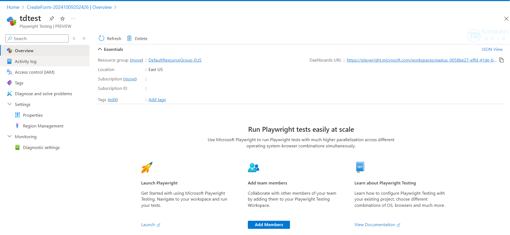

# 🎭 Microsoft Playwright

## 📌 1. What is Playwright?

👉 **Playwright** is an **open-source end-to-end (E2E) testing framework** created by Microsoft.
It’s used to **automate browsers** and test **web applications** the same way a real user would.

Think of it like **Selenium on steroids** 🚀 but more modern, faster, and reliable.

- Works with **all major browsers**: Chromium (Chrome/Edge), Firefox, WebKit (Safari).
- Works with **multiple languages**:

  - ✅ JavaScript / TypeScript
  - ✅ Python
  - ✅ .NET (C#)
  - ✅ Java

---

<div align="center">
  
</div>

---

## 📌 2. Why Use Playwright?

- 🧪 **End-to-End Testing** → verify full user journeys (login → search → checkout).
- 🌍 **Cross-Browser Testing** → Chrome, Firefox, Safari in one tool.
- 📱 **Mobile Simulation** → emulate devices like iPhone/Android.
- ⏱️ **Fast & Reliable** → auto-waits for UI elements, less flaky tests.
- 🔒 **Modern Apps Support** → handles **SPA frameworks** (React, Angular, Vue).
- 🤖 **CI/CD Friendly** → integrates into Azure DevOps, GitHub Actions, Jenkins.

---

## 📌 3. Example

Say you want to test a **login feature**:

```javascript
const { test, expect } = require("@playwright/test");

test("user can log in", async ({ page }) => {
  await page.goto("https://myecommerce.com/login");
  await page.fill("#username", "testuser");
  await page.fill("#password", "Passw0rd!");
  await page.click('button[type="submit"]');

  // Verify login successful
  await expect(page.locator("h1")).toHaveText("Welcome, testuser");
});
```

✅ Opens browser
✅ Enters username & password
✅ Clicks login
✅ Verifies user sees “Welcome” message

---

## 📌 4. Playwright vs Selenium

| Feature                    | Selenium                      | Playwright                           |
| -------------------------- | ----------------------------- | ------------------------------------ |
| Language Support           | Many                          | JS/TS, Python, C#, Java              |
| Speed                      | Slower                        | Faster (async, auto-wait)            |
| Reliability                | Flaky (manual waits)          | Auto-wait, less flaky                |
| Browser Support            | Chrome, Firefox, Edge, Safari | Chrome, Firefox, Safari (via WebKit) |
| Mobile Emulation           | Limited                       | Built-in                             |
| Modern Web (React/Angular) | Needs tweaks                  | Native support                       |

⚡ **Exam keyword**: Playwright is **modern E2E testing** → **faster, cross-browser, less flaky than Selenium**.

---

## 📌 5. Integration with Azure DevOps

Playwright can run inside **Azure Pipelines** to automate UI testing:

```yaml
- script: |
    npx playwright install --with-deps
    npx playwright test
  displayName: Run Playwright Tests
```

- Test results can be published back into the pipeline.
- Supports **parallel testing** and **headless browsers** for speed.

---

## 📌 6. When to Use

- 🛒 Testing **user flows** (checkout, login, search).
- 🖥️ Validating **UI across browsers**.
- 📱 Checking **mobile responsive design**.
- 🔄 Integrating into CI/CD → auto test before release.

---

## ✅ TL;DR

- **Microsoft Playwright** = modern **cross-browser E2E test automation framework**.
- Runs on **JS/TS, Python, C#, Java**.
- Better than Selenium (fast, auto-wait, less flaky).
- Perfect for **UI, user journey, and cross-browser testing**.
- Integrates with **Azure DevOps pipelines** for automated quality gates.
