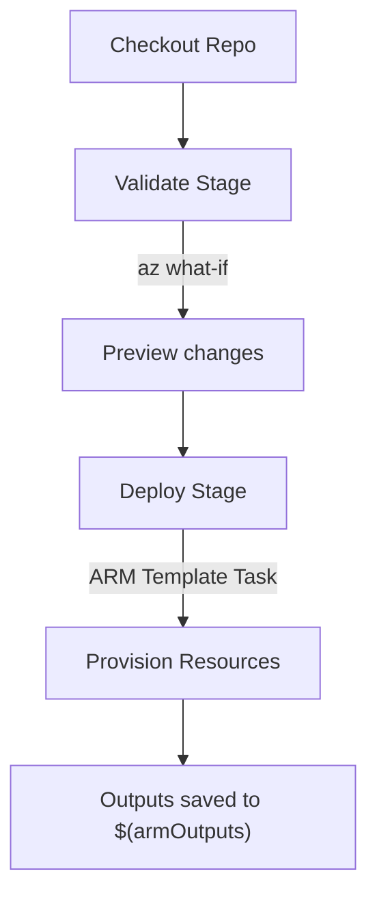

# 🚀 **Deploying ARM Templates in Azure Pipelines (YAML Style)**

When you want to provision Azure resources from a pipeline, the standard way is to use the **`AzureResourceManagerTemplateDeployment@3`** task in your YAML. Let’s break it down from scratch.

---

## 📌 **1. What is an ARM Template?**

- **ARM (Azure Resource Manager) template** = JSON file that describes **what resources** you want (Storage, VM, App Service, etc.).
- It’s **declarative**: you describe the end state, ARM makes it happen.
- Typically comes with two files:

  - `azuredeploy.json` → the template itself.
  - `azuredeploy.parameters.json` → parameter values.

---

## 📌 **2. Pipeline Requirements**

Before writing YAML:

1. **Service Connection** → Create an **Azure Resource Manager Service Connection** in DevOps. This is the “key” the pipeline uses to log in to Azure.

   - Example name: `sc-azure`.

2. **Resource Group** → You either create it upfront, or the pipeline creates it before deploying.
3. **Template + Parameters** → Check them into your repo under `/infra`.

---

## 📌 **3. File Layout Example**

```ini
/infra
  azuredeploy.json              # template
  azuredeploy.parameters.json   # default params
azure-pipelines.yml             # pipeline definition
```

---

## 📌 **4. ARM Template Example (Storage Account)**

👉 _infra/azuredeploy.json_

```json
{
  "$schema": "https://schema.management.azure.com/schemas/2019-04-01/deploymentTemplate.json#",
  "contentVersion": "1.0.0.0",
  "parameters": {
    "storageAccountName": {
      "type": "string",
      "minLength": 3,
      "maxLength": 24
    },
    "location": {
      "type": "string",
      "defaultValue": "[resourceGroup().location]"
    }
  },
  "resources": [
    {
      "type": "Microsoft.Storage/storageAccounts",
      "apiVersion": "2023-01-01",
      "name": "[parameters('storageAccountName')]",
      "location": "[parameters('location')]",
      "sku": { "name": "Standard_LRS" },
      "kind": "StorageV2",
      "properties": {}
    }
  ]
}
```

👉 _infra/azuredeploy.parameters.json_

```json
{
  "$schema": "https://schema.management.azure.com/schemas/2019-04-01/deploymentParameters.json#",
  "contentVersion": "1.0.0.0",
  "parameters": {
    "location": { "value": "eastus" }
  }
}
```

---

## 📌 **5. YAML Pipeline Breakdown**

### 🔹 Step 1: Define variables

```yaml
variables:
  azureServiceConnection: "sc-azure"
  rgName: "rg-arm-demo"
  location: "eastus"
  templateFile: "infra/azuredeploy.json"
  parametersFile: "infra/azuredeploy.parameters.json"
  saName: "st$(Build.BuildId)" # unique storage name per run
```

---

### 🔹 Step 2: Validation Stage (What-If)

```yaml
- stage: Validate
  displayName: "Validate ARM Template"
  jobs:
    - job: WhatIf
      pool:
        vmImage: "ubuntu-latest"
      steps:
        - checkout: self

        - task: AzureCLI@2
          displayName: "Ensure RG exists"
          inputs:
            azureSubscription: $(azureServiceConnection)
            scriptType: bash
            scriptLocation: inlineScript
            inlineScript: |
              az group create -n "$(rgName)" -l "$(location)"

        - task: AzureCLI@2
          displayName: "What-If Deployment"
          inputs:
            azureSubscription: $(azureServiceConnection)
            scriptType: bash
            scriptLocation: inlineScript
            inlineScript: |
              az deployment group what-if \
                --name whatif-$(Build.BuildId) \
                --resource-group "$(rgName)" \
                --template-file "$(templateFile)" \
                --parameters @"$(parametersFile)" \
                --parameters storageAccountName="$(saName)"
```

---

### 🔹 Step 3: Deployment Stage

```yaml
- stage: Deploy
  displayName: "Deploy ARM Template"
  dependsOn: Validate
  jobs:
    - job: DeployStorage
      pool:
        vmImage: "ubuntu-latest"
      steps:
        - checkout: self

        - task: AzureResourceManagerTemplateDeployment@3
          displayName: "ARM Deploy"
          inputs:
            deploymentScope: "Resource Group"
            azureResourceManagerConnection: $(azureServiceConnection)
            resourceGroupName: $(rgName)
            location: $(location)

            templateLocation: "Linked artifact"
            csmFile: $(templateFile)
            csmParametersFile: $(parametersFile)
            overrideParameters: -storageAccountName $(saName)

            deploymentMode: "Incremental"
            deploymentName: "arm-$(Build.BuildId)"
            deploymentOutputs: "armOutputs"
```

---

## 📌 **6. Run Flow**

<div align="center">



</div>

---

## 📌 **7. Key Points**

- **`Incremental` mode**: Adds/updates resources without deleting others.
- **`Complete` mode**: Makes resource group exactly like template (deletes extras ⚠️).
- **`overrideParameters`**: Lets you pass dynamic values (like unique storage names).
- **Outputs**: Saved into `$(armOutputs)` as JSON, can be parsed with `jq` or PowerShell.

---

## 🏁 **TL;DR**

1. Store your **ARM template + params** in repo.
2. Create an **Azure RM Service Connection**.
3. Add two stages:

   - **Validate (What-If)** → preview changes.
   - **Deploy** → run `AzureResourceManagerTemplateDeployment@3`.

4. Use `overrideParameters` for dynamic values (like unique storage names).
