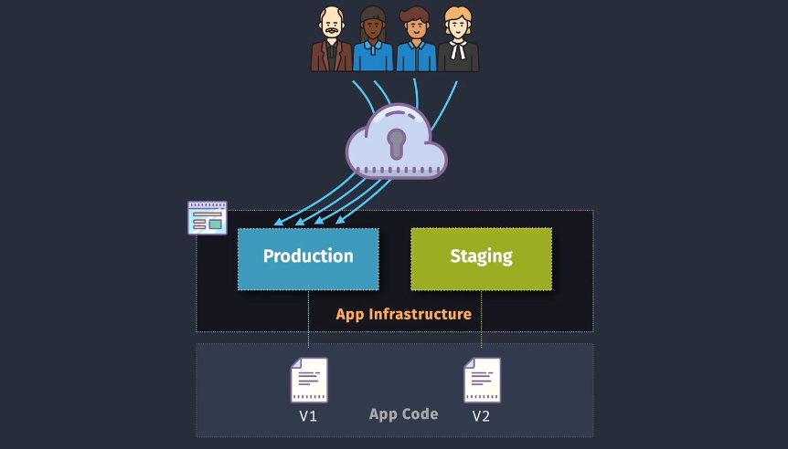
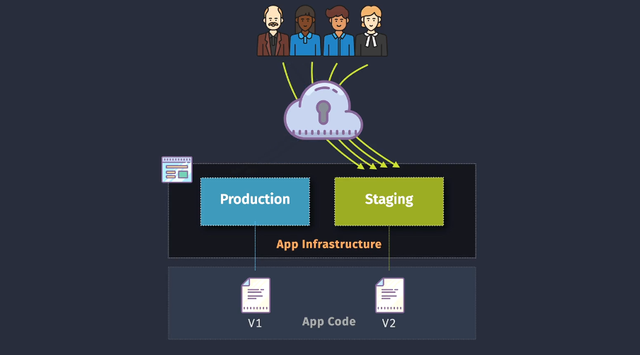
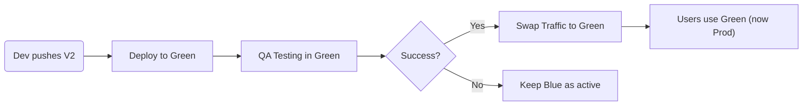

# 🌍 Azure Blue/Green Deployments

Blue/Green Deployment is a zero-downtime deployment strategy that reduces risk during application upgrades by running **two identical environments** (Blue = Production, Green = Staging) and **switching traffic** between them.

---

## 📦 What is Blue/Green Deployment?

> Blue/Green is a release strategy that allows seamless switching between two environments: **Blue (live/prod)** and **Green (new/test)**.

- **Blue** = Current production version (V1)
- **Green** = New version (V2), deployed in parallel
- Traffic is shifted from Blue ➝ Green once testing is complete
- If something breaks, rollback is instant (just shift traffic back)

---

## 🎨 Diagrams Explained

<div align="center">
  
</div>

<div align="center">
  
</div>

---

## 🧱 Key Components in Azure

Here’s how it maps to Azure services:

| Component                 | Azure Equivalent / Tools Used                          |
| ------------------------- | ------------------------------------------------------ |
| **Production Env (Blue)** | Azure App Service Slot, AKS Prod Cluster, VMSS Prod    |
| **Staging Env (Green)**   | Azure Deployment Slot, AKS Staging, VMSS Staging       |
| **Routing Control**       | Azure Front Door, Traffic Manager, Application Gateway |
| **App Code Versions**     | Different versions of your code in each environment    |

---

## 🔁 Typical Flow



---

## ❓ Is the **Blue Environment** Destroyed After a Blue/Green Switch?

> **No, by default the Blue environment is NOT destroyed** after switching to Green. It remains available <ins>**intentionally**</ins> for rollback purposes.

---

### 👉🏻 Why Do We Keep Blue?

- 💥 If something breaks in Green (V2), you can **instantly switch traffic back** to Blue (V1) — **fast rollback**.
- 📊 You may want to **monitor** Green under real user load before committing.
- 🛠️ Sometimes teams keep Blue around for **A/B testing** or **gradual migration**.

---

### 👉🏻 What Happens Typically?

After routing is switched from Blue ➜ Green:

| Action                              | Description                               |
| ----------------------------------- | ----------------------------------------- |
| ✅ **Green becomes Production**     | All traffic now goes to Green             |
| 💡 **Blue is idle but intact**      | It's preserved in case rollback is needed |
| 🧼 Optional: **Destroy Blue later** | Once you're confident Green is stable     |

---

### 👉🏻 When to Destroy Blue?

You can clean up Blue **only if**:

- Green has been **running stably** for some time
- Rollback is no longer needed
- You want to **save costs**

Example in Azure:

- **App Service Slots**: You may choose to delete the old slot
- **AKS or VMSS**: You can remove the old namespace/deployment/VMSS after monitoring

```bash
# Clean up staging slot (previous Blue)
az webapp deployment slot delete \
  --resource-group my-rg \
  --name my-app-service \
  --slot blue
```

---

## 🧪 Azure Implementation Scenarios

### ✅ Scenario 1: Azure App Service with Deployment Slots

Azure App Services (Web Apps) support **Deployment Slots**, allowing easy blue/green switching.

#### 🔹 Features:

- **Blue = Production slot**
- **Green = Staging slot**
- Slots share the same App Service Plan (no cost duplication for infra)
- Slot Swap can be **manual** or **automated via DevOps pipeline**

#### 🧾 Azure DevOps Pipeline Example (YAML):

```yaml
- task: AzureWebApp@1
  inputs:
    azureSubscription: "MyAzureServiceConnection"
    appName: "my-app-service"
    package: "$(System.DefaultWorkingDirectory)/drop.zip"
    deployToSlotOrASE: true
    resourceGroupName: "my-rg"
    slotName: "staging"
```

- After deployment, use the **Swap Slot** task:

```yaml
- task: AzureAppServiceManage@0
  inputs:
    azureSubscription: "MyAzureServiceConnection"
    action: "Swap Slots"
    appName: "my-app-service"
    resourceGroupName: "my-rg"
    sourceSlot: "staging"
    targetSlot: "production"
```

---

### ✅ Scenario 2: Azure Kubernetes Service (AKS)

Deploy two versions (V1, V2) to two separate namespaces or services.

#### 🔹 Use Azure Application Gateway + AGIC or Istio/NGINX Ingress

- **Blue** = current service (`svc-app-v1`)
- **Green** = new service (`svc-app-v2`)
- Modify the Ingress or Gateway to switch routing

```yaml
# Example Istio VirtualService
spec:
  http:
    - route:
        - destination:
            host: svc-app-v2
          weight: 100
```

Rollback? Just change back to `svc-app-v1`.

---

### ✅ Scenario 3: Azure Virtual Machine Scale Set (VMSS)

Deploy V2 to a parallel VMSS. Use Azure Traffic Manager or Application Gateway to route traffic:

- **Blue** = Original VMSS
- **Green** = New VMSS
- **Routing** = Done via Traffic Manager DNS or App Gateway backend pool

---

## 🎯 Routing Techniques in Azure

| Tool                 | Description                                                   |
| -------------------- | ------------------------------------------------------------- |
| **Azure Front Door** | Global load balancer with URL-based routing and health checks |
| **Traffic Manager**  | DNS-based traffic distribution between regions or versions    |
| **App Gateway**      | L7 (HTTP/HTTPS) routing with path-based or weighted rules     |

---

## 📊 Pros & Cons

### ✅ Advantages

| Benefit         | Explanation                                             |
| --------------- | ------------------------------------------------------- |
| Zero Downtime   | Switch happens instantly using routing                  |
| Fast Rollback   | Easy fallback by switching routing back                 |
| Reduced Risk    | Full testing on live infra before switch                |
| Identical Infra | Staging = Prod, minimizing "works on my machine" issues |

---

### ⚠️ Disadvantages

| Drawback         | Explanation                                           |
| ---------------- | ----------------------------------------------------- |
| Costly           | Duplicate environments double resource usage          |
| Complex Routing  | Managing traffic routing requires extra configuration |
| Infra Management | Keeping 2 environments in sync can be a challenge     |

---

## ✅ Best Practices

- Automate using Azure DevOps / GitHub Actions
- Always test the **Green** environment thoroughly before switching
- Use **health probes** in routing (App Gateway, Front Door)
- Monitor metrics and logs during the switch
- Use **App Configuration** or feature flags to toggle functionality

---

## 🔚 Summary Table

| Feature           | Blue/Green Deployment |
| ----------------- | --------------------- |
| Zero Downtime     | ✅                    |
| Fast Rollback     | ✅                    |
| Cost Efficient    | ❌                    |
| Easy to Implement | ⚠️ Moderate           |
| Ideal for         | Critical releases     |

---

## 🧠 Final Thought

> **Blue/Green Deployment in Azure is a robust strategy** for high-availability updates when combined with tools like **App Service Slots**, **AKS**, and **Azure DevOps Pipelines**.
