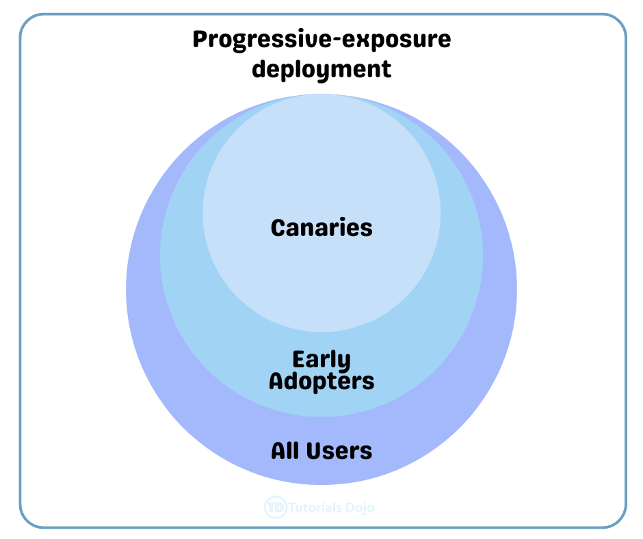
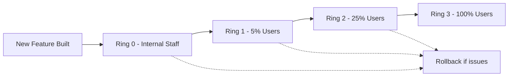

# 🌗 Progressive Exposure in DevOps

## 📌 1. What is Progressive Exposure?

👉 **Progressive Exposure** = the practice of **gradually releasing new features or changes** to **small subsets of users or systems first**, then expanding exposure once confidence increases.

It’s all about **reducing risk** while still delivering continuously.

💡 Instead of saying:

> “Ship it to everyone and pray 🙏”
> We say:
> “Ship it to 1%, monitor, then 10%, monitor, then 100%.”

---

<div align="center">
  
</div>

---

## 📌 2. Why Do We Use It?

- 🛡️ **Risk reduction** → catch bugs before everyone suffers.
- 📊 **Real-world feedback** → validate features with real users.
- 🔄 **Fast rollback** → if things go wrong, roll back before major impact.
- 🚀 **Confidence in delivery** → supports DevOps principle of **safe continuous delivery**.

---

## 📌 3. Progressive Exposure Techniques

| Technique                   | What It Does                                     | Example                                                           |
| --------------------------- | ------------------------------------------------ | ----------------------------------------------------------------- |
| **Canary Release**          | Deploy to small % of users/servers first         | 5% of traffic → new version                                       |
| **Feature Flags (Toggles)** | Turn features on/off dynamically for user groups | Enable “dark mode” for internal staff only                        |
| **Ring-Based Deployment**   | Release in **rings** (internal → beta → global)  | Microsoft Teams updates go first to “Ring 0” (internal employees) |
| **A/B Testing**             | Split users between versions and measure impact  | Show 50% new checkout UI, 50% old UI                              |

---

## 📌 4. Real-World Example

Let’s say you’re rolling out a **new payment feature** in your e-commerce app:

1. **Ring 0 (Internal staff only)**

   - Feature flag ON for employees.
   - Monitor → OK.

2. **Ring 1 (5% external users)**

   - Canary release → only 5% traffic gets it.
   - Monitor errors, user feedback.

3. **Ring 2 (25% users)**

   - Expand rollout → 25% traffic.
   - Monitor performance (latency, failures).

4. **Ring 3 (100% global rollout)**

   - If stable, release to everyone.

👉 If anything fails at **Ring 1**, rollback → most customers never notice.

---

## 📊 Visual Flow



---

## 📌 5. Progressive Exposure in Azure DevOps

In **Azure DevOps Pipelines** you implement progressive exposure with:

- **Stages/Environments** → Dev → QA → Staging → Prod.
- **Approvals & Checks** → Hold before rollout expansion.
- **Deployment Strategies** →

  - **Canary strategy** in YAML pipelines:

```yaml
strategy:
  canary:
    increments: [10, 50, 100]
    deploy:
      steps:
        - script: echo "Deploy new version"
```

- **Feature Flags** → use **Azure App Configuration** or **LaunchDarkly** integrated into pipeline.
- **Monitoring Integration** → Azure Monitor / App Insights to decide whether to continue rollout.

---

## 📌 6. Exam / Interview Tips

- If the question says:

  - “Minimize risk while releasing to production” → Progressive Exposure.
  - “Release feature gradually to % of users” → Canary Release.
  - “Turn features on/off dynamically” → Feature Flags.
  - “Microsoft ring-based rollout” → Progressive Exposure (rings).

⚡ **Exam keywords**:

- Risk reduction
- Gradual rollout
- Canary / Feature Flags
- Safe Continuous Delivery

---

## ✅ TL;DR

- **Progressive Exposure** = gradually exposing new features to reduce risk.
- Done via **canary releases, feature flags, rings, A/B testing**.
- Azure DevOps supports it via **pipelines strategies + feature flags + approvals + monitoring**.
- Key benefit → Deliver continuously **without breaking everyone at once**.
