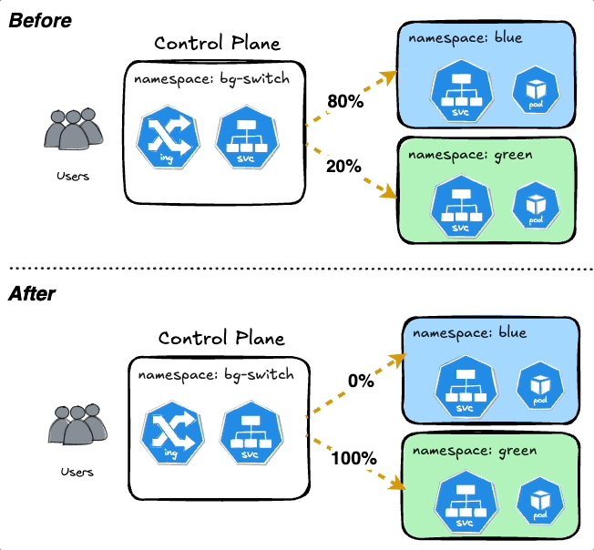
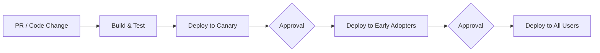

# 🚦 Canary & Ringed Deployments: Progressive Exposure Strategy

> A **safe and controlled release strategy** used to **gradually roll out** application changes to users while minimizing risk and improving rollback capabilities.

---

## 🧠 What is Canary Deployment?

**Canary Deployment** is a strategy where a **new version** of your application is released to a **small subset of users** before rolling it out to everyone.

🎯 Think of a “canary in a coal mine” — early warning if something goes wrong.

---

  

---

### 🧬 Real-World Analogy

- 🐤 A single **canary user group** gets the new version.
- 🧪 If the app behaves correctly → expand release.
- 🚨 If bugs arise → roll back quickly and minimize blast radius.

---

## 🔄 What is Ringed Deployment?

Ringed deployment (also called **progressive delivery**) builds upon Canary by rolling out to **segments of users in stages (rings)**:

1. **Canaries** – Internal teams or early testers.
2. **Early Adopters** – A larger slice of real users.
3. **All Users** – The full user base.

It's like expanding **rings on a dartboard** outward ⭕.

---

## 📊 Diagram: Progressive Exposure Workflow

---

## 🧑‍🤝‍🧑 Ringed User Groups Explained

| Group                 | Description                                                               |
| --------------------- | ------------------------------------------------------------------------- |
| 🐤 **Canaries**       | Small group of internal testers/devs. Used to verify basic functionality. |
| 🧪 **Early Adopters** | External users, often power users or beta testers. Catch deeper issues.   |
| 🌍 **All Users**      | Full production rollout after all prior stages are stable.                |

---

## 🛠️ Implementation Steps

1. ✅ Merge PR / Commit to main branch.
2. 🔧 Build and run tests.
3. 🚀 Deploy to **Canary** environment.
4. 🔍 Observe logs, metrics, health checks.
5. 👩‍⚖️ Manual or automated approval gate.
6. 🧪 Deploy to **Early Adopters**.
7. ✔️ Approve for full rollout.
8. 🌍 Deploy to **All Users**.

---

## 🧩 Benefits of Canary & Ringed Deployments

| Benefit           | Description                                                    |
| ----------------- | -------------------------------------------------------------- |
| ✅ Reduced Risk   | Catch issues early before widespread impact.                   |
| 🔄 Easy Rollback  | Fail fast at early stages. Restore previous version quickly.   |
| 🧪 Real Feedback  | Get real-world usage insights from real users early.           |
| 📉 Lower Downtime | Avoid full-outage scenarios during risky deployments.          |
| 🔍 Metrics Driven | Use observability (logs, metrics, alerts) for stage approvals. |

---

## 🔥 Challenges and Considerations

| Challenge            | Notes                                                                                 |
| -------------------- | ------------------------------------------------------------------------------------- |
| 🧩 Complexity        | Requires robust release pipeline and traffic management (load balancer / gateway).    |
| 🔄 Rollback Handling | Must be automatic or fast. Test rollback paths just like forward paths.               |
| 🛠 Infra Cost         | Slight increase in infra cost for parallel versions, but minimal vs. full blue/green. |

---

## ⚙️ Tooling Options

| Tool                                  | Role                                                            |
| ------------------------------------- | --------------------------------------------------------------- |
| **Azure DevOps** / **GitHub Actions** | Pipeline & approvals for progressive delivery                   |
| **AWS CodeDeploy**                    | Native support for canary/linear/blue-green deployments         |
| **Kubernetes + Argo Rollouts**        | Fine-grained progressive rollouts with metrics and gating rules |
| **LaunchDarkly / Feature Flags**      | Toggle features per user group for canary + ringed rollout      |

---

## 🔚 Final Summary

| Strategy        | Canary                      | Ringed Deployment                            |
| --------------- | --------------------------- | -------------------------------------------- |
| Scope           | 1 small group               | Multiple concentric groups (rings)           |
| Rollout Type    | One-phase preview           | Multi-phase gradual exposure                 |
| Purpose         | Validate before full launch | Reduce blast radius with progressive rollout |
| Recommended For | Minor or critical updates   | Full-feature staged production delivery      |

---

### 💬 Pro Tip:

Use **automated health checks + manual approvals** at each ring stage to avoid rolling out bugs to everyone.
