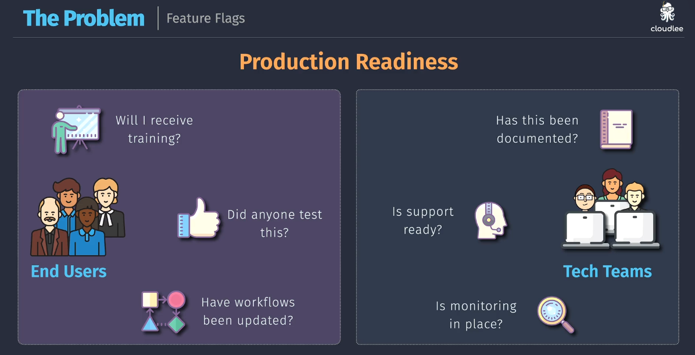
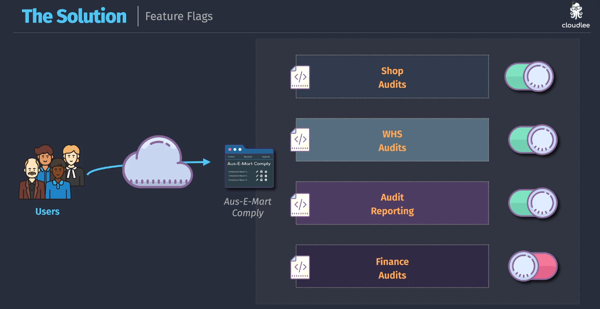
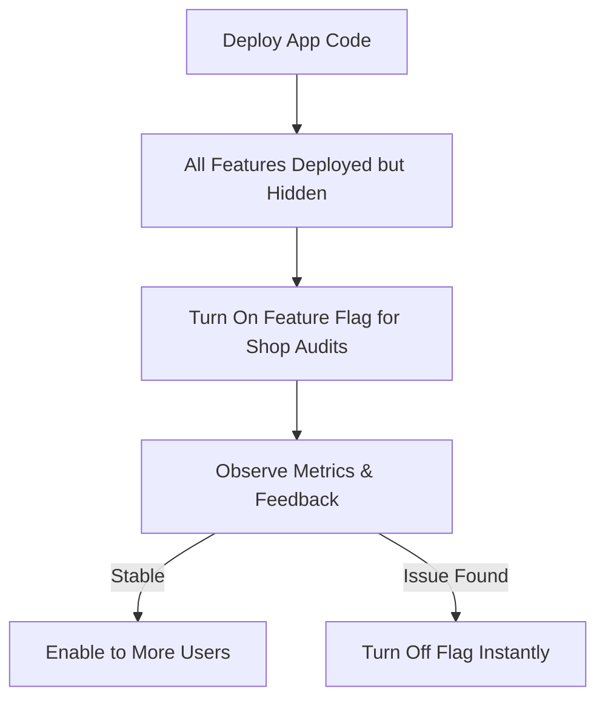

# 🧪 Feature Flags (aka Feature Toggles)

Shipping a new feature into production is **not just about code deployment**—it's about **controlled activation**, **risk reduction**, and **ensuring readiness** across both **end users** and **tech teams**.

Feature Flags allow you to **toggle features on/off at runtime**, _without redeploying code_, making them an essential DevOps and release engineering tool.

---

## 🚨 The Problem: Production ≠ Readiness

<div align="center">
  
</div>

Deploying code is easy. But:

### 👤 End Users ask:

- “Will I receive training?”
- “Did anyone test this?”
- “Have my workflows changed?”

### 🛠️ Tech Teams ask:

- “Is support ready?”
- “Has this been documented?”
- “Is monitoring in place?”

> ⚠️ **Deploying without readiness leads to confusion, broken workflows, and increased support tickets.**

---

## ✅ The Solution: Feature Flags to the Rescue

<div align="center">
  
</div>

### 💡 What are Feature Flags?

Feature Flags are **binary switches** (🟢 ON / 🔴 OFF) inside your application that control **whether a feature is active** or not — **even if the code is deployed**.

They allow:

- Safe releases to production
- Gradual exposure to users (like ringed/canary deployments)
- Instant rollback of problematic features (just flip a switch!)
- Independent lifecycle of features and deployments

---

### 🎯 How Feature Flags Help

| 🧩 Use Case                    | ✅ Benefit                                                   |
| ------------------------------ | ------------------------------------------------------------ |
| **Toggle incomplete features** | Ship code to prod without showing unfinished features        |
| **Canary testing**             | Show new features to select users before full rollout        |
| **A/B testing**                | Compare user behaviors on old vs new logic                   |
| **Hotfix rollback**            | Turn off faulty features instantly without rollback/redeploy |
| **Progressive delivery**       | Enable features gradually for different user segments        |

---

## 🧰 Where Are Flags Used?

You’ll often configure flags per environment or user group:

```json
{
  "shop_audits": true,
  "whs_audits": true,
  "audit_reporting": true,
  "finance_audits": false
}
```

In your code:

```python
if feature_flags["finance_audits"]:
    render_finance_section()
else:
    hide_feature()
```

> 🔁 Feature flags can be toggled **live**, even during a CI/CD pipeline or by product managers via dashboards (e.g. LaunchDarkly, ConfigCat, AWS AppConfig).

---

## 📊 Diagram: Real-World Flow

<div align="center">



</div>

---

## 🧠 Best Practices

- Use **namespaces** or **contexts** (e.g. `feature.shop_audits`) to organize flags.
- Implement **auditing and metrics** on flag usage.
- Combine flags with **monitoring/alerts** to detect bad rollouts.
- Set flags to **auto-expire** or be cleaned up after rollout.

---

## 🧨 Risks if Misused

- Flags become technical debt if not cleaned up.
- Business logic becomes hard to read if overused.
- Performance hit if flags are checked in hot paths without caching.

---

## 🧵 Summary

| 🔍 Feature        | ✅ Description                                                       |
| ----------------- | -------------------------------------------------------------------- |
| **Feature Flags** | Conditional switches that let you enable/disable features at runtime |
| **Benefits**      | Safer rollouts, quick rollback, progressive delivery                 |
| **Who benefits**  | DevOps, Developers, Product Managers, Support Teams                  |
| **When to use**   | Canary releases, testing in prod, staged rollout, hidden features    |
