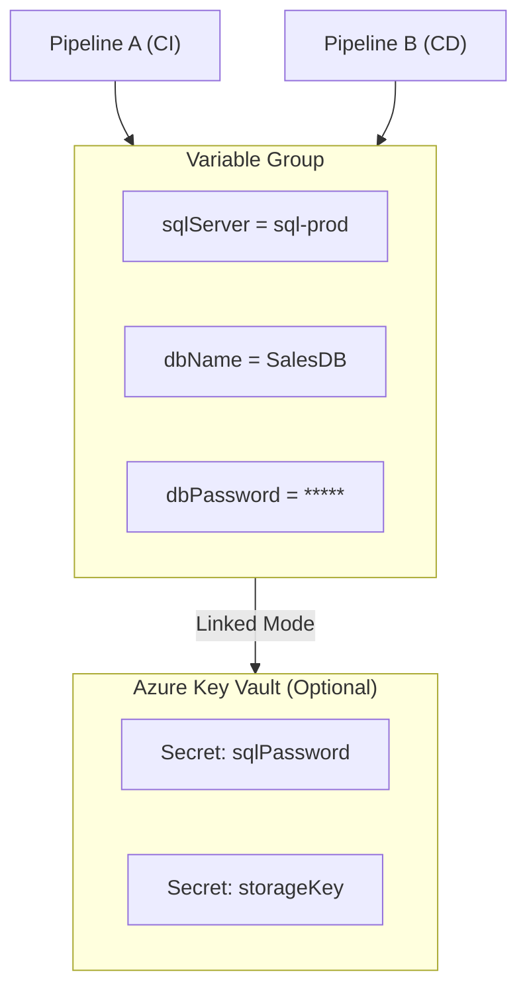

# 📦 **Variable Groups in Azure DevOps**

## 📌 **What is a Variable Group?**

A **Variable Group (VG)** = a **shared bucket of variables** in Azure DevOps.

- Centralized store for environment settings, secrets, connection strings, etc.
- Can be **linked to multiple pipelines** (YAML or Classic).
- Optional integration with **Azure Key Vault** to pull secrets automatically.

👉 Think of it like a **shared `.env` file** for your pipelines.

---

## 📌 **Why Do We Need It?**

Without Variable Groups:

- Each pipeline defines its own vars → duplication.
- If a secret changes (e.g., DB password) → update in 10+ pipelines manually. ❌

With Variable Groups:

- Update once → all pipelines using it get updated. ✅
- Separation of config from pipeline logic.
- Better governance (secure access control on variables).

---

## 📌 **Where They Live**

- Azure DevOps → **Pipelines → Library → Variable groups**.
- Each group has:

  - Name (`vg-prod-settings`)
  - Variables (key-value pairs)
  - Secret flags 🔒 (mask values in logs)
  - Optional **link to Azure Key Vault**

---

## 📌 **Types of Variable Groups**

### 🔹 **Unlinked Variable Group**

- Values stored directly in DevOps.
- Example:

```yaml
vg-prod-settings:
  SQL_SERVER: sql-prod.contoso.com
  DB_NAME: SalesDB
  API_KEY: (secret)
```

---

### 🔹 **Linked Variable Group (to Azure Key Vault)**

- Values **not stored in DevOps**.
- Instead, pulled dynamically from **Azure Key Vault** at runtime.
- Example:

```yaml
vg-prod-akv:
  SQL_PASSWORD: (from Key Vault secret)
  STORAGE_KEY: (from Key Vault secret)
```

👉 If secret is rotated in Key Vault → pipeline picks new value automatically.

---

## 📌 **How to Use in YAML Pipelines**

### Step 1: Define a Variable Group

In portal → Pipelines → Library → New variable group

- Name: `vg-prod`
- Vars:

  - `sqlServer = sql-prod.contoso.com`
  - `dbName = SalesDB`
  - `dbPassword = (secret)`

### Step 2: Reference in YAML

```yaml
trigger:
  - main

variables:
  - group: vg-prod # Attach variable group

pool:
  vmImage: ubuntu-latest

steps:
  - script: |
      echo "Connecting to $(sqlServer) / $(dbName)"
      # secret variable like $(dbPassword) will be masked in logs
```

---

## 📌 **Access Control**

- You can restrict which pipelines can use a VG.
- Example: `vg-prod` only usable by Prod pipelines.
- Developers might have access to **staging VGs**, but not prod ones.

---

## 📌 **Diagram**

<div align="center">



</div>

---

## 📌 **Example Use Cases**

1. **Multi-pipeline shared config**

   - One `vg-shared-dev` with dev DB connection string → used by 3 microservices pipelines.

2. **Secrets management**

   - Link `vg-prod-akv` to Key Vault with DB password, storage keys.

3. **Environment separation**

   - `vg-dev`, `vg-test`, `vg-prod` → each holds environment-specific values.

---

## 📌 **Best Practices**

- 🔐 Use **linked AKV variable groups** for secrets.
- ✅ Use **naming conventions** (`vg-dev`, `vg-prod`) for clarity.
- 🧑‍🤝‍🧑 Control access → don’t let devs use `vg-prod`.
- 📌 Reference groups in YAML, not inline hardcoded values.
- ⚡ Rotate secrets in Key Vault → pipelines automatically updated.

---

## 🏁 **TL;DR**

- **Variable Group = shared set of pipeline variables** (like `.env` in Git).
- **Two types**:

  - Unlinked (stored in DevOps)
  - Linked (to Azure Key Vault)

- Used in YAML via:

  ```yaml
  variables:
    - group: vg-name
  ```

- Helps centralize config, manage secrets securely, and reduce duplication.
