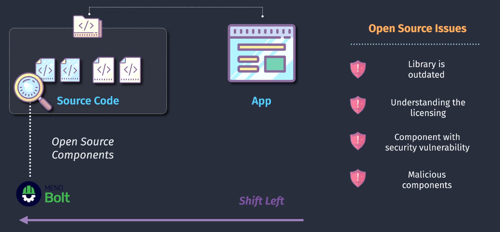
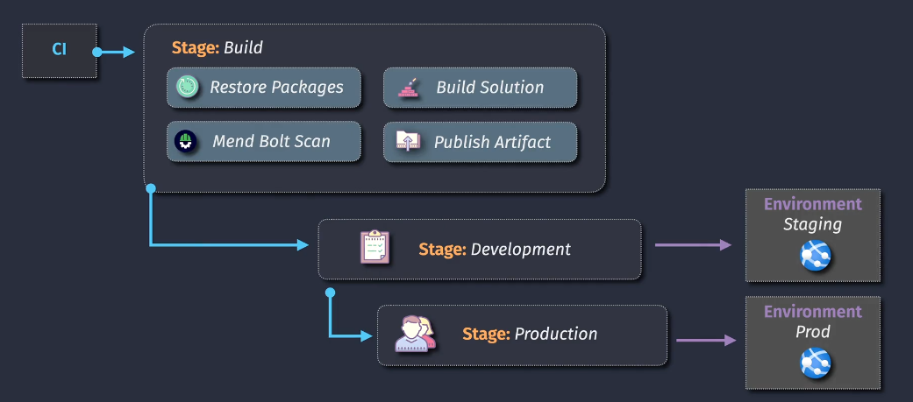
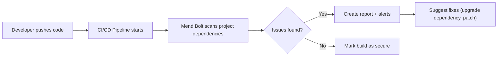
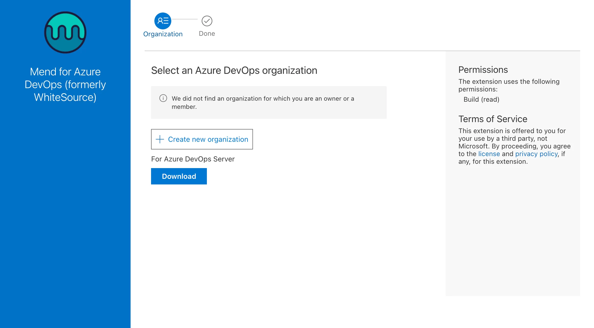
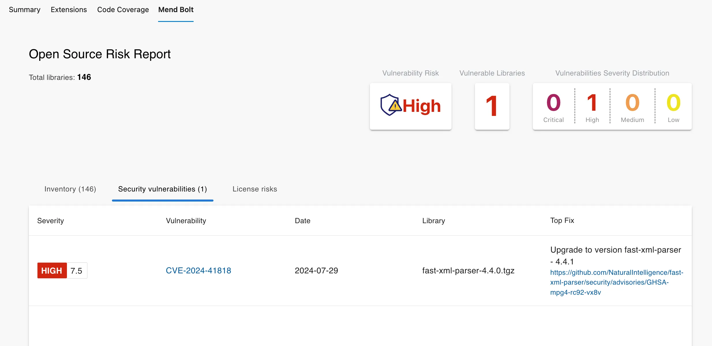
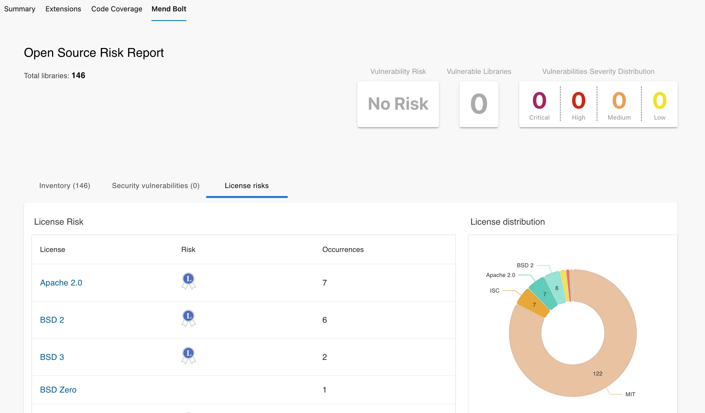
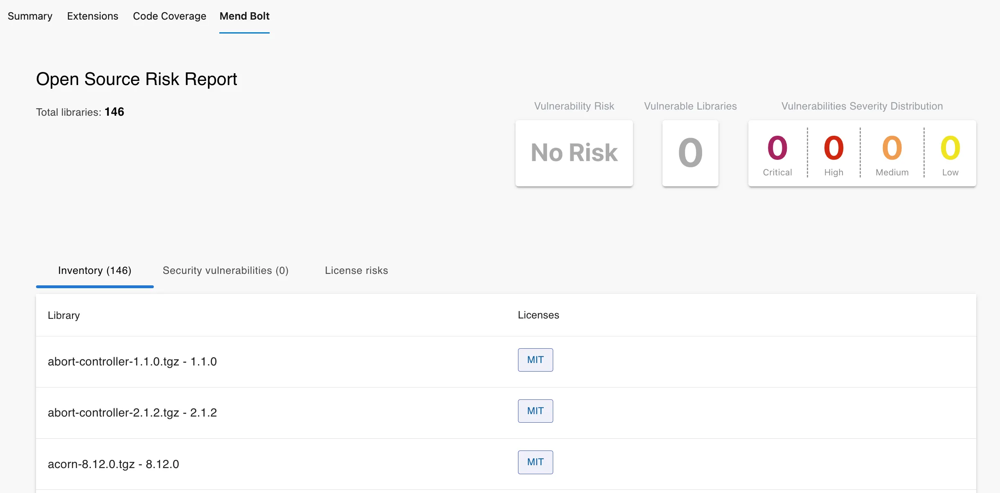

# 🛡️ **Mend Bolt (Formerly WhiteSource Bolt)**

## 📌 **What is Mend Bolt?**

**Mend Bolt** is a **free tool** for developers that automatically scans your projects for:

- 🔐 **Open-Source Vulnerabilities** (security flaws in dependencies)
- 📜 **License Compliance Issues** (GPL, MIT, Apache, etc.)

👉 It integrates with your **Azure DevOps** or **GitHub** projects and runs scans on every **build or push**.
You get **real-time alerts** with suggested fixes.

---

<div align="center">
  
</div>

---

## 📌 **Why Use Mend Bolt?**

Without it:

- You manually check dependencies for CVEs (slow, risky).
- You might accidentally ship code with security holes.
- You might violate license obligations (e.g., GPL → legal issues).

With Mend Bolt:

- ✅ **Auto scans every commit/build**
- ✅ **Blocks vulnerable dependencies early**
- ✅ **Flags risky licenses**
- ✅ **Integrates directly into DevOps workflow**
- ✅ **Free for individual teams**

---

## 📌 **How It Works (Internals)**

Here’s the **lifecycle**:

<div align="center">
  
</div>



- Mend Bolt inspects **package managers** (npm, NuGet, Maven, pip, etc.)
- Matches your dependencies against:

  - **CVE Database** for vulnerabilities
  - **License DB** for compliance issues

- Reports show **where the issue is** and **how to fix it**.

---

## 📌 **Supported Environments**

| Platform                 | Integration Mode         | Behavior                                                            |
| ------------------------ | ------------------------ | ------------------------------------------------------------------- |
| **Azure DevOps**         | Extension in Marketplace | Runs during CI/CD builds, produces reports in pipeline              |
| **GitHub**               | GitHub App               | Runs on every push, adds checks, creates issues for vulnerabilities |
| **Local Dev** (optional) | Manual CLI tool          | Run scans on demand before commit                                   |

---

## 📌 **Installation**

### 🔹 **On Azure DevOps**

- **1.** Go to [Mend Bolt Extension](https://marketplace.visualstudio.com/items?itemName=whitesource.whiteSource-bolt-v2).
- **2.** Install into your DevOps org.

    <div align="left">
    
    </div>

- **3.** Add Mend Bolt task into your **pipeline YAML**:

  ```yaml
  steps:
    - task: WhiteSourceBolt@21
       inputs:
           cwd: "$(System.DefaultWorkingDirectory)"
           projectName: "YourProjectName"
  ```

---

### 🔹 **On GitHub**

1. Go to [GitHub Marketplace: Mend Bolt](https://github.com/marketplace/whitesource-bolt).
2. Install the app → choose repo(s).
3. On every push → Mend Bolt runs, creates **issues** for vulnerabilities, and suggests fixes.

---

## 📌 **Example Usage**

### In **Azure Pipelines (Node.js app)**

```yaml
trigger:
  - main

pool:
  vmImage: ubuntu-latest

steps:
  - task: NodeTool@0
    inputs:
      versionSpec: "18.x"
  - script: npm install

  - task: WhiteSourceBolt@20
    displayName: "Mend Bolt Scan"
```

👉 Output:

- Build continues, but you get **Mend Report** in pipeline summary.
- If vulnerabilities found → they show up in logs + dashboard.

---

Here’s your updated and cleaned-up version of the **Mend Bolt Reports & Fixes** section, with properly styled and centered images using HTML inside Markdown:

---

## 📌 **Reports & Fixes**

- **Security Report** List of vulnerable dependencies, CVE ID, severity (Critical/High/Medium/Low).

  <div align="left">
    
  </div>

- **License Report** Flags if dependency uses restricted license (GPL, AGPL).

  <div align="left">
    
  </div>

- **Inventory Report** Overview of scanned dependencies and their metadata.

  <div align="left">
    
  </div>

---

## 📌 **Best Practices**

- 🔄 **Run Mend Bolt in every CI build** (catch issues early).
- 📌 **Break builds** if critical vulnerabilities are found.
- 🔐 **Use it with Azure Key Vault / GitHub Secrets** to keep auth tokens safe.
- 🧩 Pair it with **Dependabot** or **Renovate** → auto PR upgrades + Mend validation.

---

## 📌 **Limitations**

- Free version = limited to **1 org + 5 repos** (good for small teams).
- Advanced features (policies, enforcement, dashboards) need **Mend commercial**.

> 📒NOTE:  
> For the Mend Bolt version, API Key is not required. For the enterprise Mend edition, users will have to set up an account in Mend.io, select a pricing plan, and then retrieve a project API Key to be used in the DevOps Pipeline configuration.

---

## 🏁 **Summary**

- ✅ **Mend Bolt** = free, automated OSS security & license scanner.
- ✅ Works with **Azure DevOps + GitHub**.
- ✅ Scans dependencies → finds CVEs & license risks.
- ✅ Gives **reports + suggested fixes** in pipeline.
- ✅ Essential for modern DevSecOps, even in small teams.
