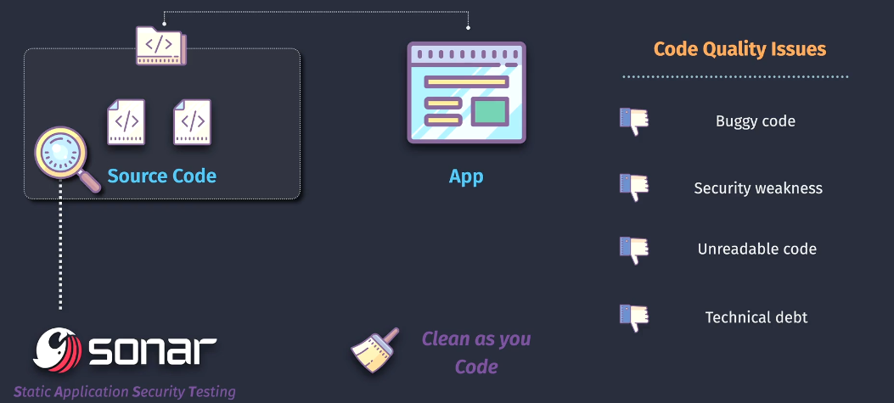
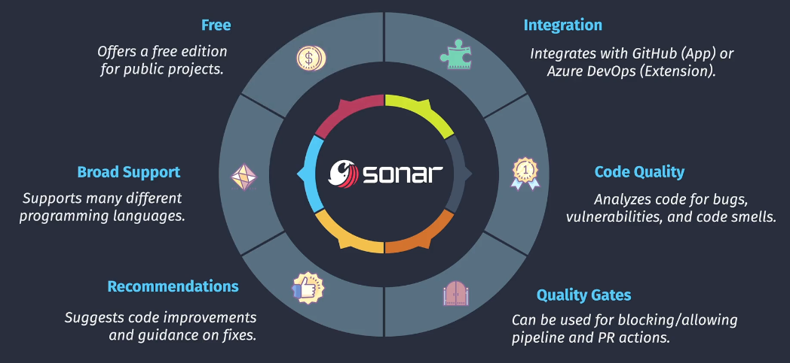
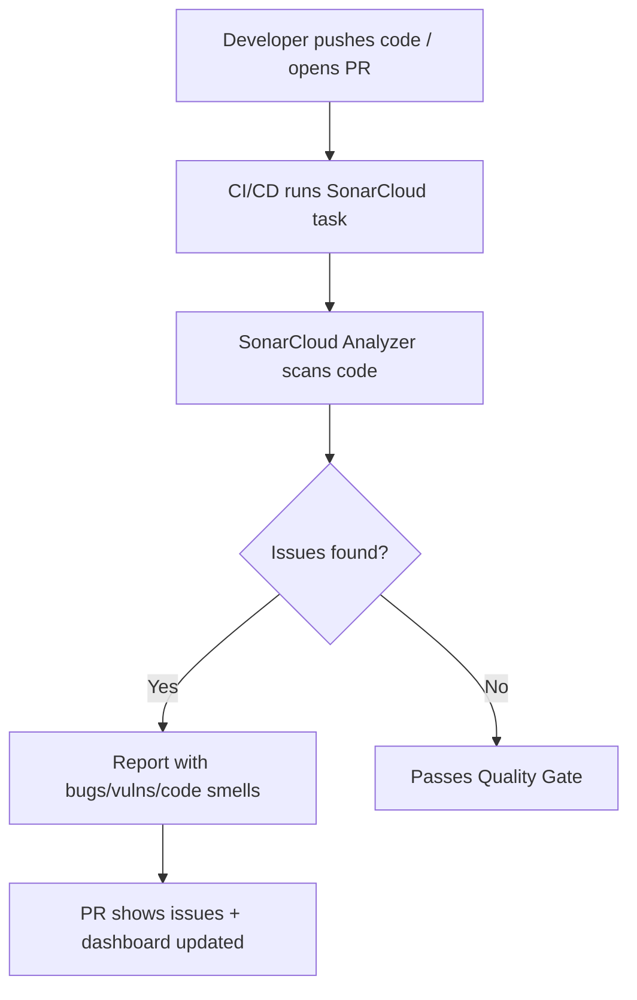
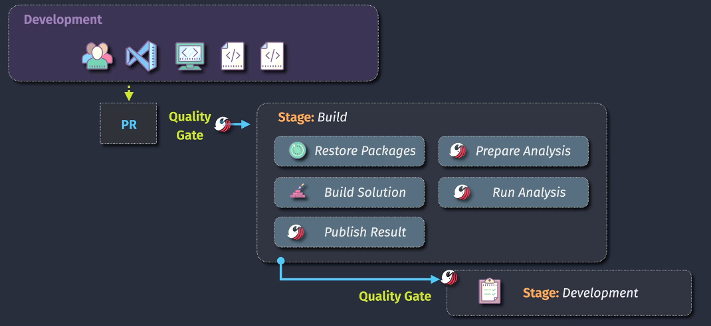

# 🌨️ **SonarCloud – Cloud Code Quality & Security for DevOps**

## 📌 **1. What is SonarCloud?**

**SonarCloud** is a **cloud-based code quality and security service** by **SonarSource**.

👉 Think of it as an **X-ray for your source code**:

- It finds **bugs**, **security vulnerabilities**, **code smells**, **duplication**, and **test coverage issues**.
- It integrates directly with **Azure DevOps**, **GitHub**, **Bitbucket**, and **GitLab**.
- Runs automatically in your **CI/CD pipeline** and gives **actionable feedback**.

💡 Analogy: If **Mend Bolt** checks your **dependencies**, **SonarCloud** checks **your own code**.

---



## 📌 **2. Why Use It?**

Without SonarCloud:

- Code reviews might miss subtle **security flaws**.
- Developers might introduce **bad practices** unnoticed.
- No central **quality gate** before merging code.

With SonarCloud:

- ✅ **Automated analysis** in every build/PR
- ✅ **Quality Gate** → block merges if code doesn’t meet standards
- ✅ **Security scanning** → detect OWASP Top 10 & CWE issues
- ✅ **Multi-language support** (C#, Java, Python, JS, etc.)
- ✅ **Cloud dashboards** → trending metrics, team visibility

---



---

## 📌 **3. How It Works (Lifecycle)**



- Analyzer runs inside your pipeline agent.
- Results uploaded to **SonarCloud dashboard**.
- Pull Requests get **inline comments** with detected issues.

---

## 📌 **4. Core Concepts**

| Concept           | Meaning                                                                                      |
| ----------------- | -------------------------------------------------------------------------------------------- |
| **Issue**         | A problem in code (bug, vuln, code smell).                                                   |
| **Bug**           | Logic error that might cause incorrect behavior.                                             |
| **Vulnerability** | Security weakness (e.g., SQL injection risk).                                                |
| **Code Smell**    | Maintainability issue (e.g., duplicated code, long method).                                  |
| **Coverage**      | % of code tested by unit tests.                                                              |
| **Duplication**   | Copy-paste detected across files.                                                            |
| **Quality Gate**  | A set of rules (e.g., _“No critical issues, 80% test coverage”_). Pipeline fails if not met. |

---

## 📌 **5. Supported Languages**

- C#, Java, JavaScript, TypeScript, Python, C, C++, Go, PHP, Ruby, Kotlin, Swift, Terraform, IaC… (20+).

💡 Great for **.NET + Angular full stack** like your background.

---

## 📌 **6. Integration with Azure DevOps**



---

### 🔹 Install Extension

- Marketplace → [SonarCloud Extension](https://marketplace.visualstudio.com/items?itemName=SonarSource.sonarcloud).
- Add **Service Connection** → authenticate to SonarCloud.

### 🔹 Pipeline Example (YAML)

```yaml
trigger:
  - main

pool:
  vmImage: "ubuntu-latest"

steps:
  - task: SonarCloudPrepare@1
    inputs:
      SonarCloud: "sc-service-conn" # Service connection to SonarCloud
      organization: "your-org"
      scannerMode: "MSBuild"
      projectKey: "myproject"
      projectName: "MyProject"

  - task: DotNetCoreCLI@2
    inputs:
      command: "build"
      projects: "**/*.csproj"

  - task: SonarCloudAnalyze@1

  - task: SonarCloudPublish@1
    inputs:
      pollingTimeoutSec: "300"
```

👉 Flow:

1. **Prepare** → sets scanner config.
2. **Build** → runs MSBuild with SonarCloud hooks.
3. **Analyze** → scans code.
4. **Publish** → sends results to SonarCloud dashboard.

---

## 📌 **7. Reports & Dashboards**

- **Dashboard Metrics**: Bugs, Vulnerabilities, Code Smells, Coverage %, Duplication %
- **Trends**: Track over time → did quality improve or worsen?
- **Pull Request Decoration**: Inline GitHub/Azure DevOps PR comments showing issues before merging.

---

## 📌 **8. Example Quality Gate Rules**

- ❌ Fail if any **new critical bug**
- ❌ Fail if test coverage on **new code < 80%**
- ❌ Fail if **duplication > 5%**
- ✅ Only allow merges if all rules pass

👉 This enforces **"don’t make the code worse"** principle.

---

## 📌 **9. Best Practices**

- 🔄 Run SonarCloud on **every PR**, not just main branch.
- 🎯 Define a strict but fair **Quality Gate** (start light, tighten later).
- 🧪 Combine with **unit tests** for full coverage.
- 👀 Use **dashboard visibility** to motivate devs (gamify clean code).

---

## 📌 **10. SonarCloud vs SonarQube**

| Feature | **SonarCloud** (SaaS)                   | **SonarQube** (Self-hosted)   |
| ------- | --------------------------------------- | ----------------------------- |
| Hosting | Cloud (SonarSource)                     | On-prem or self-hosted        |
| Setup   | Super easy                              | More work (server + DB)       |
| Pricing | Free for public repos, paid for private | Paid (Community Edition free) |
| Updates | Always latest                           | Manual upgrades needed        |

---

## 🏁 **TL;DR**

- **SonarCloud** = cloud-based code quality/security analyzer.
- Scans code for **bugs, vulnerabilities, code smells, duplication, coverage**.
- Works with **Azure DevOps, GitHub, GitLab, Bitbucket**.
- Enforces **Quality Gates** → no bad code slips in.
- Great for **DevSecOps pipelines** with your .NET + Angular projects.

---

👉 Do you want me to build a **real CI/CD pipeline project (like we did with Key Vault)**, showing **SonarCloud scanning a .NET API + Angular app** in Azure DevOps, with quality gates blocking bad code?
