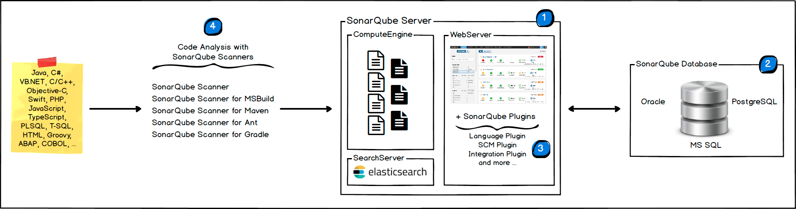
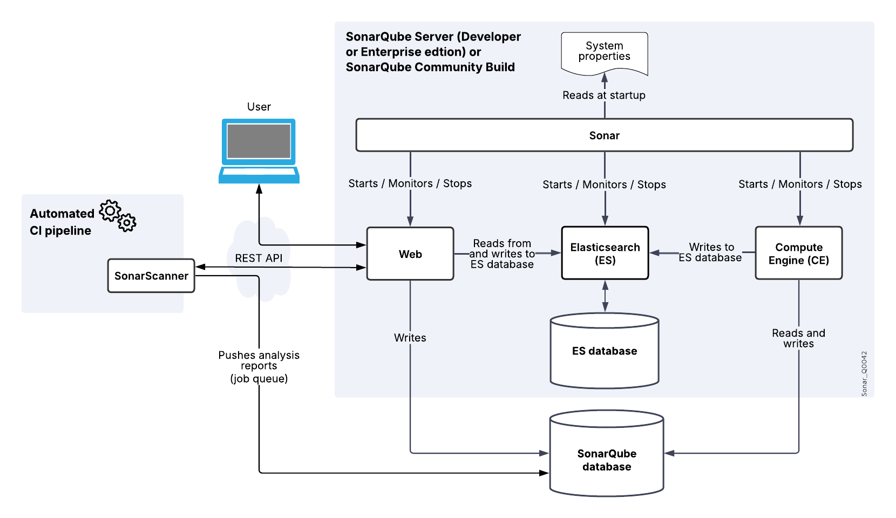
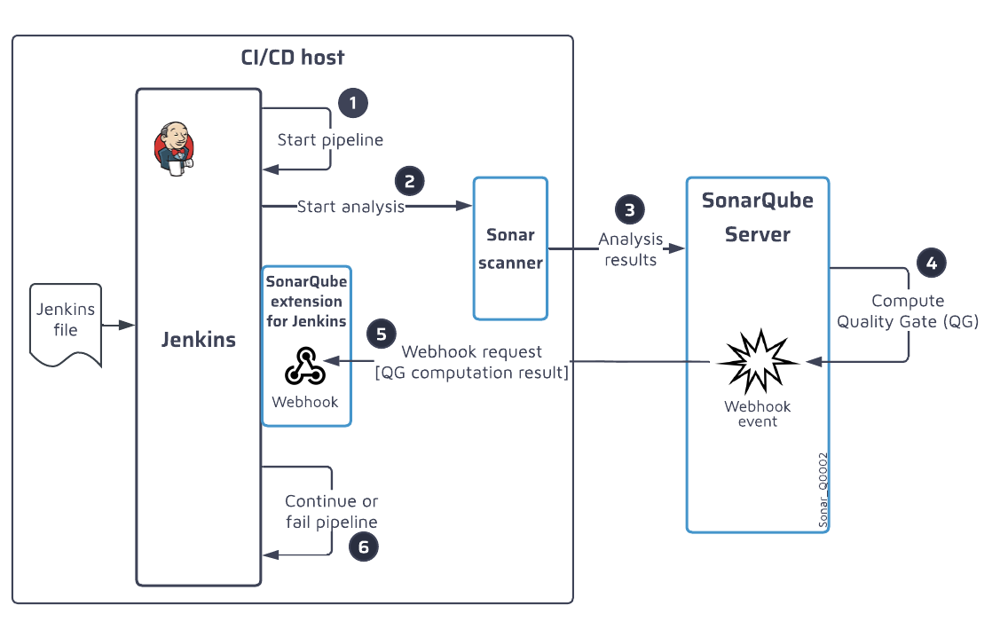

# 🍵 **SonarQube – Self-Hosted Code Quality & Security Platform**

## 📌 **What is SonarQube?**

**SonarQube** is an **open-source platform** (with commercial editions) that lets you **analyze, measure, and enforce code quality & security**.

- Runs on **your servers or containers** (on-prem or in your cloud).
- Scans source code for:

  - 🐛 **Bugs**
  - 🔐 **Vulnerabilities**
  - 🧹 **Code Smells**
  - 📊 **Coverage**
  - 📑 **Duplication**

> 💡 Analogy:  
> If **SonarCloud** = SaaS (like Gmail),  
> then **SonarQube** = Self-hosted mail server (you control infra, DB, upgrades).

---

## 📌 **Why Use SonarQube?**

- 🔒 Keep analysis **in your own environment** (good for **regulated industries**).
- 🛠️ Works even without internet (air-gapped networks).
- 🔧 **Custom rules** & plugins.
- 🌍 Supports huge **enterprise-scale projects**.
- 💰 Licensing: **Community Edition** (free, basic features), **Developer/Enterprise/Data Center Editions** (advanced features).

---

## 📌 **Architecture**

🔹 **1. SonarScanner**: Runs inside your pipeline or IDE.  
🔹 **2. SonarQube Server**: Processes & stores results.  
🔹 **3. Database**: Stores metrics & issues.  
🔹 **4. Dashboard**: Web UI with code quality reports.

<div align="center">
  
</div>

---

## 📌 **Key Features**

| Category                    | SonarQube Provides                         |
| --------------------------- | ------------------------------------------ |
| 🔍 **Static Code Analysis** | Bugs, vulnerabilities, smells              |
| 📊 **Metrics**              | Coverage, duplication, complexity          |
| 🚦 **Quality Gates**        | Block merge/deploy if thresholds not met   |
| 🔧 **Custom Rules**         | Add/disable coding rules per project       |
| 🌍 **Multi-Language**       | 20+ languages (C#, Java, Python, JS, etc.) |
| 🔒 **Security**             | Detects OWASP Top 10, CWE issues           |
| ⚡ **Integrations**         | Azure DevOps, Jenkins, GitHub, GitLab      |

---

## 📌 **Example Pipeline (Azure DevOps + SonarQube)**

```yaml
trigger:
  - main

pool:
  vmImage: "ubuntu-latest"

steps:
  - task: SonarQubePrepare@5
    inputs:
      SonarQube: "sq-service-conn" # Service Connection to self-hosted SonarQube
      scannerMode: "MSBuild"
      projectKey: "myproject"
      projectName: "MyProject"

  - task: DotNetCoreCLI@2
    inputs:
      command: "build"
      projects: "**/*.csproj"

  - task: SonarQubeAnalyze@5

  - task: SonarQubePublish@5
    inputs:
      pollingTimeoutSec: "300"
```

👉 Very similar to SonarCloud — but instead of sending results to the **SonarCloud SaaS**, they go to **your SonarQube server**.

---

## 📌 **SonarQube Editions**

| Edition              | Who It’s For              | Features                        |
| -------------------- | ------------------------- | ------------------------------- |
| **Community (Free)** | Small teams               | Basic static analysis           |
| **Developer**        | Teams needing depth       | Branch analysis, PR decoration  |
| **Enterprise**       | Large orgs                | Portfolio reporting, governance |
| **Data Center**      | Enterprises with HA needs | Clustering, scaling             |

---

## 📌 **SonarQube vs SonarCloud**

| Feature            | **SonarQube** (Self-Hosted)       | **SonarCloud** (SaaS)                   |
| ------------------ | --------------------------------- | --------------------------------------- |
| Hosting            | You host (VMs, K8s, etc.)         | SonarSource hosts                       |
| Setup              | Manual (server, DB, config)       | Super easy                              |
| Maintenance        | You upgrade & scale               | Automatic                               |
| Internet required? | ❌ Works offline                  | ✅ Needs internet                       |
| Security           | Your data stays internal          | Data stored in SonarCloud               |
| Pricing            | Free + paid editions              | Free for public repos, paid for private |
| Best for           | Enterprises, regulated industries | Startups, small/medium teams            |

---

## 📌 **Best Practices with SonarQube**

- 🛠️ Run **scanner in CI/CD** for every PR.
- 🚦 Set **Quality Gates** → block builds with high-severity issues.
- 🧪 Combine with **unit test coverage**.
- 🔄 Upgrade regularly → new rules & bug fixes.
- 🛡️ Secure DB + server (since data is internal).

---

## 🏁 **TL;DR**

- **SonarQube** = self-hosted **code quality & security platform**.
- Similar to **SonarCloud**, but you run & manage the server.
- Great for **enterprises needing data control, customization, or offline use**.
- Works seamlessly with **Azure DevOps, Jenkins, GitHub, GitLab**.

---

<div align="center">
  
</div>

---

## 🎁 **SonarQube with Jenkins**

<div align="center">
  
</div>
