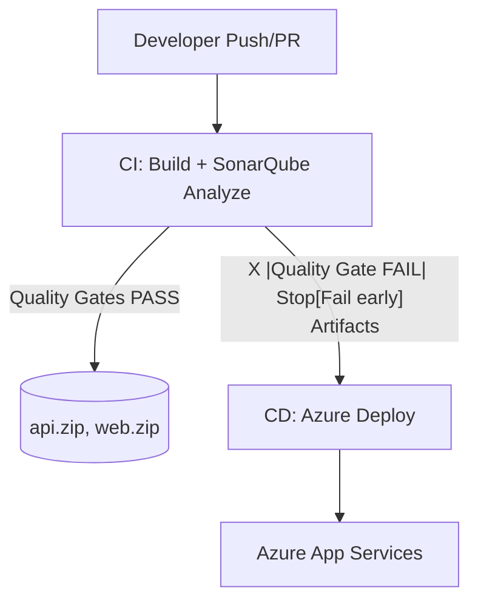

# 🏗️ SonarQube CI/CD for **.NET API + Angular** (Azure DevOps)

## 🎯 Goal

- Run **SonarQube** analysis on **API (.NET)** and **Web (Angular)** for every push/PR.
- **Fail the pipeline** if the **Quality Gate** fails (no deploy).
- Deploy only when **both** projects pass the gate.

---

## 📦 Repo Layout

```ini
/api
  src/YourApi/YourApi.csproj
  src/YourApi/Program.cs
  tests/YourApi.Tests/YourApi.Tests.csproj
/web
  package.json
  angular.json
  src/...
azure-pipelines-ci.yml       # CI: Build + SonarQube scan (two jobs: api & web)
azure-pipelines-cd.yml       # CD: Deploy only if CI succeeded (gates passed)
README.md
```

> Coverage:
>
> - **.NET** via `coverlet.collector` (OpenCover).
> - **Angular** via Karma/Jest producing `coverage/lcov.info`.

---

## 🧩 Architecture



---

## ✅ Prerequisites

1. **SonarQube server** reachable from build agents

   - Create **organization/projects**: `contoso-api`, `contoso-web`
   - Create a **SonarQube token** (admin or project-level)

2. **Azure DevOps service connections**

   - **SonarQube**: `sq-connection` (type “SonarQube”; set Server URL + token)
   - **Azure Resource Manager**: `sc-azure` (scope to RG/subscription for deploy)

3. **.NET coverage**
   Add to `/api/tests/YourApi.Tests/YourApi.Tests.csproj`:

   ```xml
   <ItemGroup>
     <PackageReference Include="coverlet.collector" Version="3.*" />
   </ItemGroup>
   ```

4. **Angular coverage**
   Ensure `ng test --watch=false --code-coverage` writes `web/coverage/lcov.info`.

> ℹ️ **PR decoration** in Azure DevOps requires **SonarQube Developer Edition+**. Community still enforces **Quality Gate** (the publish task will fail the job).

---

## 🔧 Minimal App Skeletons (optional)

### `/api/src/YourApi/Program.cs`

```csharp
var app = WebApplication.CreateBuilder(args).Build();
app.MapGet("/health", () => Results.Ok(new { ok = true }));
app.Run();
```

### `/api/src/YourApi/YourApi.csproj`

```xml
<Project Sdk="Microsoft.NET.Sdk.Web">
  <PropertyGroup>
    <TargetFramework>net8.0</TargetFramework>
  </PropertyGroup>
</Project>
```

### `/web/package.json` (excerpt)

```json
{
  "name": "contoso-web",
  "scripts": {
    "build": "ng build --configuration=production",
    "test": "ng test --watch=false --code-coverage"
  },
  "devDependencies": { "@angular/cli": "^17.0.0" }
}
```

---

## 🧪 CI: Build + SonarQube Scan + Enforce Quality Gate

**`azure-pipelines-ci.yml`**

```yaml
trigger:
  - main

pr:
  - main

pool:
  vmImage: "ubuntu-latest"

stages:
  - stage: BuildAndScan
    displayName: "Build & SonarQube Scan"
    jobs:
      # ===== API (.NET) =====
      - job: api
        displayName: "API - .NET Build, Test, SonarQube"
        steps:
          - checkout: self

          # Prepare (MSBuild mode)
          - task: SonarQubePrepare@5
            displayName: "SonarQube Prepare (API)"
            inputs:
              SonarQube: "sq-connection" # SonarQube service connection
              scannerMode: "MSBuild"
              projectKey: "contoso-api"
              projectName: "Contoso API"
              extraProperties: |
                sonar.cs.opencover.reportsPaths=$(Build.SourcesDirectory)/**/coverage.opencover.xml
                sonar.cs.vstest.reportsPaths=$(Agent.TempDirectory)/*.trx

          - task: UseDotNet@2
            inputs:
              packageType: "sdk"
              version: "8.x"

          - task: DotNetCoreCLI@2
            displayName: "Restore"
            inputs:
              command: "restore"
              projects: "api/**/*.csproj"

          - task: DotNetCoreCLI@2
            displayName: "Build"
            inputs:
              command: "build"
              projects: "api/**/*.csproj"
              arguments: "--configuration Release --no-restore"

          - task: DotNetCoreCLI@2
            displayName: "Test (with coverage)"
            inputs:
              command: "test"
              projects: "api/tests/**/*.csproj"
              arguments: >-
                --configuration Release --no-build
                --logger trx
                /p:CollectCoverage=true
                /p:CoverletOutputFormat=opencover
                /p:CoverletOutput=$(Build.SourcesDirectory)/api/TestResults/Coverage/

          - task: SonarQubeAnalyze@5
            displayName: "SonarQube Analyze (API)"

          - task: SonarQubePublish@5
            displayName: "SonarQube Publish (API) - Enforce Quality Gate"
            inputs:
              pollingTimeoutSec: "300" # fail job if gate fails

          # Package API artifact
          - script: |
              dotnet publish api/src/YourApi/YourApi.csproj -c Release -o $(Build.ArtifactStagingDirectory)/api_publish
              cd $(Build.ArtifactStagingDirectory)/api_publish
              zip -r $(Build.ArtifactStagingDirectory)/api.zip .
            displayName: "Package API"

          - task: PublishBuildArtifacts@1
            inputs:
              pathToPublish: "$(Build.ArtifactStagingDirectory)/api.zip"
              artifactName: "api"
              publishLocation: "Container"

      # ===== WEB (Angular) =====
      - job: web
        displayName: "WEB - Angular Build, Test, SonarQube"
        steps:
          - checkout: self

          - task: NodeTool@0
            inputs:
              versionSpec: "18.x"

          - script: |
              cd web
              npm ci
              npm run test -- --watch=false --code-coverage
              npm run build -- --configuration=production
            displayName: "Build & Test (Angular)"

          # Prepare (Other/CLI mode)
          - task: SonarQubePrepare@5
            displayName: "SonarQube Prepare (WEB)"
            inputs:
              SonarQube: "sq-connection"
              scannerMode: "Other"
              configMode: "manual"
              projectKey: "contoso-web"
              projectName: "Contoso Web"
              extraProperties: |
                sonar.sources=web/src
                sonar.exclusions=**/*.spec.ts,**/node_modules/**,**/dist/**
                sonar.tests=web/src
                sonar.test.inclusions=**/*.spec.ts
                sonar.javascript.lcov.reportPaths=web/coverage/lcov.info

          - task: SonarQubeAnalyze@5
            displayName: "SonarQube Analyze (WEB)"

          - task: SonarQubePublish@5
            displayName: "SonarQube Publish (WEB) - Enforce Quality Gate"
            inputs:
              pollingTimeoutSec: "300"

          # Package WEB artifact
          - script: |
              cd web/dist
              APP_DIR=$(ls -1 | head -n 1)
              cd $APP_DIR
              zip -r $(Build.ArtifactStagingDirectory)/web.zip .
            displayName: "Package WEB"

          - task: PublishBuildArtifacts@1
            inputs:
              pathToPublish: "$(Build.ArtifactStagingDirectory)/web.zip"
              artifactName: "web"
              publishLocation: "Container"
```

**What happens:**

- Each job **fails** if its **Quality Gate** fails → stage fails → **no CD**.

---

## 🚀 CD: Deploy only if CI succeeded

**`azure-pipelines-cd.yml`**

```yaml
resources:
  pipelines:
    - pipeline: ci
      source: CI-Pipeline-Name # <-- replace with your CI pipeline name
      trigger:
        branches:
          - main

pool:
  vmImage: "ubuntu-latest"

variables:
  azureServiceConnection: "sc-azure"
  resourceGroup: "rg-contoso-prod"
  location: "eastus"
  planName: "asp-contoso-prod"
  apiAppName: "contoso-api-prod"
  webAppName: "contoso-web-prod"

stages:
  - stage: Deploy
    displayName: "Deploy API + Web"
    jobs:
      - job: API
        displayName: "Deploy API App Service"
        steps:
          - download: ci
            artifact: api

          - task: AzureCLI@2
            displayName: "Create/Ensure Plan & API WebApp"
            inputs:
              azureSubscription: $(azureServiceConnection)
              scriptType: bash
              scriptLocation: inlineScript
              inlineScript: |
                # ensure plan
                az appservice plan show -n "$(planName)" -g "$(resourceGroup)" >/dev/null 2>&1 \
                  || az appservice plan create -n "$(planName)" -g "$(resourceGroup)" -l "$(location)" --sku P1v3 --is-linux
                # ensure webapp
                az webapp show -n "$(apiAppName)" -g "$(resourceGroup)" >/dev/null 2>&1 \
                  || az webapp create -n "$(apiAppName)" -g "$(resourceGroup)" -p "$(planName)" --runtime "DOTNET:8" --https-only true

                # deploy zip
                az webapp deploy \
                  --name "$(apiAppName)" \
                  --resource-group "$(resourceGroup)" \
                  --src-path "$(Pipeline.Workspace)/api/api.zip" \
                  --type zip

      - job: WEB
        displayName: "Deploy Web App Service"
        dependsOn: API
        steps:
          - download: ci
            artifact: web

          - task: AzureCLI@2
            displayName: "Create/Ensure Web WebApp & Deploy"
            inputs:
              azureSubscription: $(azureServiceConnection)
              scriptType: bash
              scriptLocation: inlineScript
              inlineScript: |
                # ensure plan (idempotent)
                az appservice plan show -n "$(planName)" -g "$(resourceGroup)" >/dev/null 2>&1 \
                  || az appservice plan create -n "$(planName)" -g "$(resourceGroup)" -l "$(location)" --sku P1v3 --is-linux
                # ensure webapp
                az webapp show -n "$(webAppName)" -g "$(resourceGroup)" >/dev/null 2>&1 \
                  || az webapp create -n "$(webAppName)" -g "$(resourceGroup)" -p "$(planName)" --runtime "NODE:18-lts" --https-only true

                # deploy zip
                az webapp deploy \
                  --name "$(webAppName)" \
                  --resource-group "$(resourceGroup)" \
                  --src-path "$(Pipeline.Workspace)/web/web.zip" \
                  --type zip
```

---

## 🧪 Quality Gates (blocking)

- Configure gates in **SonarQube UI** (per project or global):

  - ❌ Fail if **new critical/blocker issues > 0**
  - ❌ Fail if **coverage on new code < 80%**
  - ❌ Fail if **duplication on new code > 3%**

- `SonarQubePublish@5` **waits** for analysis and **fails the job** if the gate fails.

---

## 🔐 Security & Governance

- **SonarQube** service connection holds server URL + token (no secrets in YAML).
- **Azure RM** service connection manages deploy creds.
- Enforce **branch policies** so PRs must pass CI (thus pass gates) before merge.

---

## 🧭 Runbook

1. Create SonarQube projects (`contoso-api`, `contoso-web`) and **`sq-connection`** in ADO.
2. Create Azure RM service connection **`sc-azure`**.
3. Push repo with both YAMLs; run **CI**.
4. If both gates pass, **artifacts** appear.
5. **CD** triggers from CI success → deploys API + Web.
6. Visit App Service URLs to verify.

---

## 🛠 Troubleshooting

- **Gate never finishes** → increase `pollingTimeoutSec` in `SonarQubePublish@5` (e.g., `600`).
- **.NET coverage missing** → confirm OpenCover file path and `coverlet.collector` present.
- **Angular coverage missing** → ensure `web/coverage/lcov.info` path (adjust if your builder writes elsewhere).
- **PR comments missing** → PR decoration needs **Developer Edition+**.
- **Deploy fails** → ensure RG exists and `sc-azure` has rights; the script now **creates plan/webapp if missing**.

---

## 🏁 TL;DR

- **CI**: Two jobs (API + Web) → **SonarQube Prepare → Build/Test → Analyze → Publish**.
- **Quality Gates** enforced by **Publish** tasks → **fail fast** if code is bad.
- **CD** only runs when CI succeeds → deploy to App Service.
- Clean, secure, and easy to extend (Key Vault, slots, approvals, etc.).
