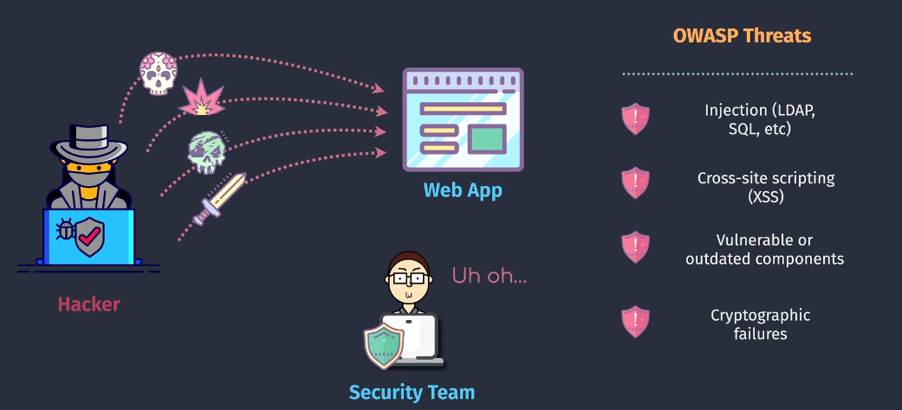
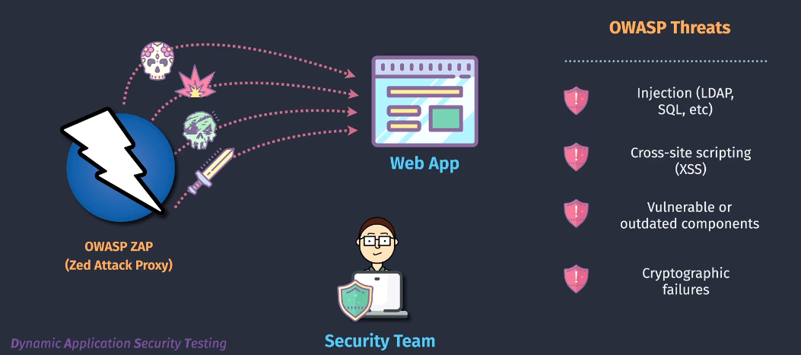
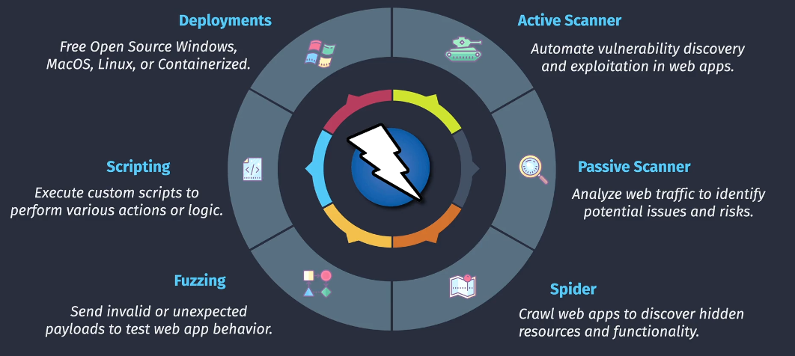
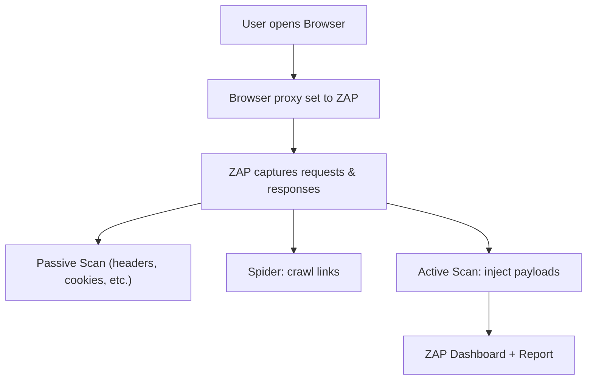
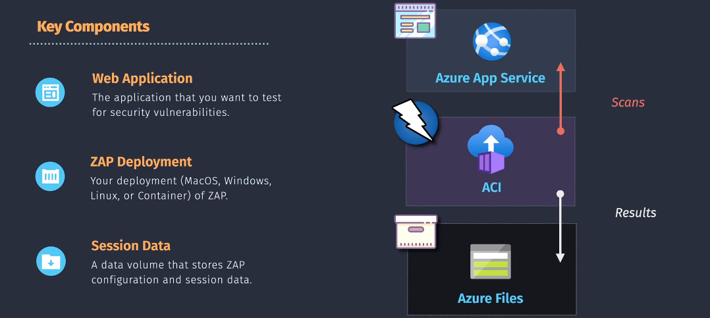
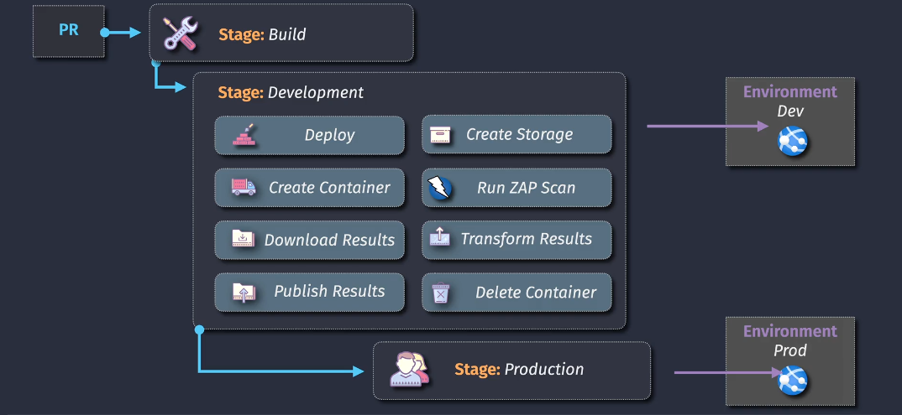

# 🕵️‍♂️ **OWASP ZAP (Zed Attack Proxy)**

## 📌 **What is OWASP ZAP?**

**OWASP ZAP** is a **free, open-source web application security testing tool**, developed under the **OWASP (Open Web Application Security Project)** community.

👉 Think of it as a **security scanner for your web apps**.

- Detects **vulnerabilities** (SQLi, XSS, CSRF, etc.)
- Acts as a **man-in-the-middle proxy** → lets you **inspect, modify, replay HTTP(S) traffic**
- Useful for **pentesters**, **developers**, and **DevSecOps pipelines**

💡 Nickname: **“Burp Suite’s free cousin”** (similar purpose, but open source).

---

<!--
<div align="center">
  
</div>
-->

---

<div align="center">
  
</div>

---

## 📌 **Why Use ZAP?**

- 🔍 Automatically finds **common vulnerabilities** in web apps.
- 🛠️ Works for **manual testing** (exploring, fuzzing) & **automation** (CI/CD).
- 💰 Free & Open Source (no enterprise paywall).
- ⚙️ Extensible via **add-ons** (marketplace).

---

## 📌 **Core Features**

| Feature 🚀             | What it Does                                                               |
| ---------------------- | -------------------------------------------------------------------------- |
| **Intercepting Proxy** | Acts between browser ↔ server; lets you view & modify traffic.             |
| **Spidering**          | Crawls your site like a search engine; maps all links/endpoints.           |
| **Active Scan**        | Actively attacks site with payloads (XSS, SQLi, etc.).                     |
| **Passive Scan**       | Observes traffic without attacking; flags issues (headers, cookies, etc.). |
| **Fuzzer**             | Sends multiple payloads to test input validation.                          |
| **Automation**         | CI/CD pipeline integration via CLI, APIs, and Docker images.               |
| **Reports**            | Generates HTML/PDF/JSON reports of findings.                               |

---

<div align="center">
  
</div>

---

## 📌 **How ZAP Works**

<div align="center">



</div>

- You configure your **browser to use ZAP as a proxy** (e.g., localhost:8080).
- ZAP **captures** all requests/responses.
- You can **manipulate, replay, fuzz, or scan** them.
- Vulnerabilities appear in the **ZAP Dashboard** + can be exported.

---

<div align="center">
  
</div>

## 📌 **Typical Vulnerabilities Found**

- **SQL Injection (SQLi)**
- **Cross-Site Scripting (XSS)**
- **Cross-Site Request Forgery (CSRF)**
- **Insecure HTTP headers** (missing CSP, HSTS, etc.)
- **Insecure cookies** (HttpOnly, Secure flags missing)
- **Directory traversal / exposed endpoints**
- **Weak authentication flows**

---

## 📌 **Ways to Use ZAP**

### 🖥️ Desktop GUI (Manual Testing)

- Full-featured **UI** with tabs for sites, requests, alerts, fuzzing.
- Great for **exploring apps interactively**.

### ⚙️ Automation in CI/CD

- Use **ZAP CLI** or **ZAP Docker** images.
- Run **baseline scan** in pipelines → break builds on high-severity findings.

Example (Azure DevOps / GitHub Actions):

```bash
docker run -t owasp/zap2docker-stable zap-baseline.py \
  -t https://myapp.com -r zap_report.html
```

👉 Produces `zap_report.html` with issues.

### 📡 API Mode

- ZAP runs as a **daemon**.
- You can send commands to its **REST API** (start scan, get results).

---

## 📌 **Example Workflow (Developer + Pipeline)**

1. Developer starts ZAP locally, sets browser to `localhost:8080`.
2. Visits web app → ZAP captures traffic.
3. Runs **Spider** → ZAP maps the site.
4. Runs **Active Scan** → ZAP injects test payloads.
5. Vulnerabilities appear in ZAP UI → export HTML/PDF.
6. CI/CD → baseline scan on staging app, block release if high-severity issues.

---

<div align="center">
  
</div>

---

## 📌 **Example Reports**

- **Summary** → number of issues by severity (High/Medium/Low/Info).
- **Detailed** → request/response, vulnerable parameter, payload used.
- **Exportable** → HTML, XML, JSON → integrate with JIRA, DevOps boards.

---

## 📌 **Pros & Cons**

✅ **Pros**

- 100% Free & Open Source
- Strong community + OWASP backing
- Flexible (manual + automation)
- Multi-platform (Windows/Linux/Mac/Docker)

❌ **Cons**

- Slower & less polished than Burp Suite Pro
- Active scanning can be noisy (may trigger alerts on prod)
- Some false positives

---

## 📌 **Best Practices**

- 🧪 Use **Passive Scan** for dev builds (fast, safe).
- 🔥 Run **Active Scan** only on test/staging (can crash apps).
- 🚦 Define **severity thresholds** in pipelines (e.g., block build if High issues > 0).
- 🔄 Combine ZAP with **SonarQube/SonarCloud** → code + runtime scanning.

---

## 🏁 **TL;DR**

- **OWASP ZAP** = free **web app penetration testing tool**.
- Acts as a **proxy + scanner** for HTTP(S).
- Can run **manual (GUI)** or **automated (CLI/Docker)**.
- Finds **SQLi, XSS, CSRF, headers, cookies, etc.**
- Perfect for **DevSecOps pipelines** to **block bad deployments**.
