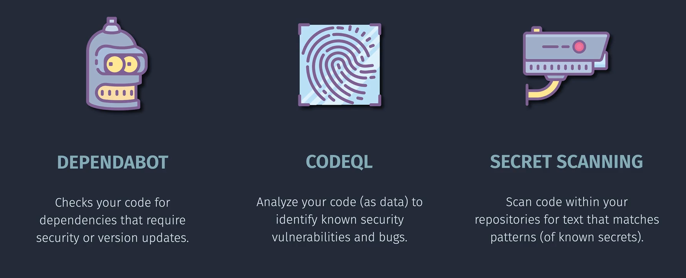

# 🛡️ **GitHub Code Security Tools**

GitHub has **built-in security features** that run in your repos to help catch vulnerabilities **before they reach production**. The three most important are:

---

  

---

## 1️⃣ **Dependabot**

👉 **What it does:**
Dependabot is GitHub’s bot that **keeps your dependencies secure and up to date**.

- Watches your repo’s `package.json`, `requirements.txt`, `pom.xml`, `csproj`, etc.
- Compares your dependencies against GitHub’s **Advisory Database** (security CVEs).
- If a vulnerability is found → it **opens a Pull Request** to update the dependency to a safe version.

⚡ **Types of Dependabot Alerts**

- **Security Updates** → "Upgrade `lodash` from 4.17.10 to 4.17.21 to fix CVE-xxxx"
- **Version Updates** → "Upgrade minor/patch versions automatically"

💡 Example:
If your Angular app uses `npm` and one package has a known RCE bug, Dependabot will PR a fix with the updated version.

---

## 2️⃣ **CodeQL**

👉 **What it does:**
**CodeQL** is GitHub’s **static analysis engine**.
Think of it like “SQL for code” — you write queries to detect vulnerable patterns.

- Analyzes source code like a database.
- Detects:

  - SQL injection
  - Path traversal
  - Unsafe deserialization
  - Memory issues

- Comes with **ready-made queries** for OWASP Top 10, CWE, etc.

⚡ **How it runs**

- Configured via a **GitHub Action workflow** (`codeql-analysis.yml`).
- Runs on **push, PR, or schedule**.
- Produces alerts visible under the repo’s **Security tab**.

💡 Example:
In your .NET API, if you concatenate SQL strings directly with user input, CodeQL can detect **SQL Injection** risk.

---

## 3️⃣ **Secret Scanning**

👉 **What it does:**
**Secret scanning** looks for **credentials accidentally committed** into your repo.

- Scans for **API keys, tokens, passwords, SSH keys**.
- Uses built-in **patterns for providers** (AWS, Azure, GCP, Stripe, etc.).
- You can also add **custom patterns** (regex).
- Alerts repo admins immediately if secrets are found.

⚡ **Two Modes**

- **Public repos** → always enabled for free.
- **Private repos (with GitHub Advanced Security)** → full secret scanning + push protection.

💡 Example:
If someone commits an **Azure Storage Account key** into GitHub → Secret Scanning flags it → you can revoke the key immediately.

---

## 🔄 **How They Work Together in CI/CD**

1. **Developer pushes code** →

   - **Secret Scanning** checks for exposed secrets.
   - **Dependabot** already knows if vulnerable dependencies are used.

2. **PR runs GitHub Actions** →

   - **CodeQL** scans code for security bugs.

3. **Security Tab (central view)** →

   - You see **Dependabot Alerts**, **CodeQL Alerts**, and **Secret Scanning Alerts** in one place.

---

## 📊 **Quick Comparison**

| Tool            | Purpose                             | When It Runs                   | Example Finding               |
| --------------- | ----------------------------------- | ------------------------------ | ----------------------------- |
| **Dependabot**  | Outdated/vulnerable dependencies    | Daily / PR trigger             | "Upgrade `express` to 4.18.2" |
| **CodeQL**      | Vulnerabilities in your source code | Push/PR/Workflow               | SQL Injection, XSS            |
| **Secret Scan** | Secrets accidentally in repo        | On push + retroactive scanning | AWS Key exposed               |

---

## ✅ **Best Practices**

- 🔒 Always enable **Dependabot security updates** at minimum.
- ⚙️ Add **CodeQL workflow** to critical repos (.NET, Angular).
- 🧑‍💻 Use **Secret Scanning Push Protection** to block risky commits.
- 🔄 Treat the **Security tab in GitHub** as your "Security Dashboard".

---

👉 Do you want me to create a **full GitHub CI/CD workflow file (`.github/workflows/security.yml`)** that enables **Dependabot, CodeQL, and Secret Scanning** in one project so you can see it in action?
