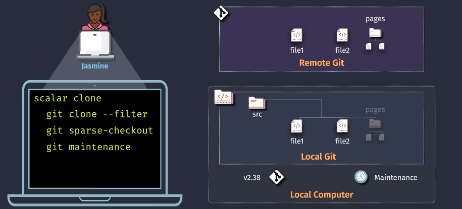
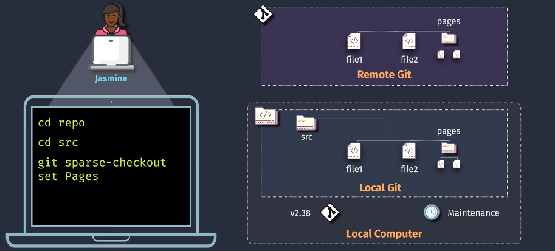
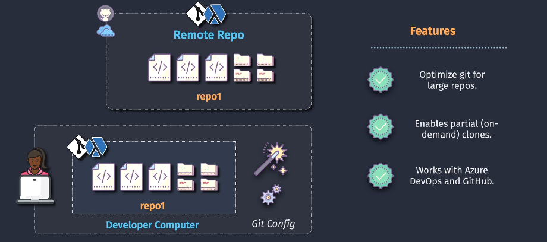

# ⚙️ Scalar: Optimizing Git for Large Repositories

> **[Scalar](https://github.com/microsoft/scalar)**, a Microsoft-backed tool designed to optimize Git performance on **very large monorepos**.

---

## 🎯 Why Scalar Exists

### ❌ Problem with Large Repos:

- Git clones **everything** by default (all branches, full history)
- 🐢 Slows down dev machines with large codebases
- 🧠 Developers might only need a **tiny part of the repo** (a few folders)

### ✅ Solution: Scalar

- Improves Git with:

  - Partial clone
  - Sparse checkout
  - Background maintenance

- Now integrated into **core Git ≥ v2.30+** with these features:

  - `git clone --filter`
  - `git sparse-checkout`
  - `git maintenance`

---

## 🛠️ Scalar in Action (Diagram 1 + 2 + 3 Breakdown)

### 🔹 Scalar Basics



Commands used:

```bash
scalar clone <url>     # Clone optimized repo (sets config + sparse)
git clone --filter=blob:none  # Partial clone (downloads files on-demand)
git sparse-checkout init --cone
git maintenance start
```

🔍 This does the following:

- Only fetches minimal data
- Sets up **on-demand file loading** (like lazy-loading)
- Starts Git background maintenance to auto-optimize

✅ **Scalar clones quickly**, even for huge monorepos.

---

### 🔹 Selective Folder Checkout



---

```bash
cd repo
cd src
git sparse-checkout set Pages
```

✅ This tells Git:

> “I only want the `Pages` folder in my working directory.”

👩‍💻 Result:

- You **see only relevant folders/files**
- Other content stays in Git’s database (not in working directory)
- Ideal for huge repos with thousands of folders

---

## 🧬 Scalar + Azure DevOps or GitHub

> Scalar works with **Azure DevOps**, **GitHub**, and **GitHub Enterprise**  
> It helps developers only **clone what's needed** from the monorepo  
> Background Git maintenance (gc, fetch pruning, etc.) runs automatically



---

## 🔑 Key Features of Scalar

| Feature                  | Description                                                                  |
| ------------------------ | ---------------------------------------------------------------------------- |
| 🧠 Smart Cloning         | Uses `--filter=blob:none` to avoid downloading all file contents immediately |
| 🧹 Git Maintenance       | Runs background maintenance tasks like garbage collection                    |
| 📁 Sparse Checkout       | Developers can select specific folders to work on                            |
| 🚀 Fast Repo Startup     | Works great for huge codebases (e.g. OS-level)                               |
| 🧑‍💻 Developer-Friendly | Looks and behaves like Git — you just get performance for free!              |

---

## ✅ Scalar vs Vanilla Git

| Action                  | Git (default)          | Git with Scalar Setup                           |
| ----------------------- | ---------------------- | ----------------------------------------------- |
| Clone whole repo        | 🚫 Slow for big repos  | ✅ Fast — only metadata + shallow blobs         |
| View only part of repo  | ❌ Needs full checkout | ✅ Use sparse-checkout to see only subfolders   |
| Background optimization | ❌ Manual `gc` needed  | ✅ Git runs `gc` and cleanups in the background |
| Great for monorepos?    | ❌ Not practical       | ✅ Optimized for them                           |

---

## 🚀 Example: Scalar Commands Cheat Sheet

```bash
# 🧠 Clone optimized repo
scalar clone https://dev.azure.com/org/project/_git/monorepo

# 🧼 Enable background maintenance
git maintenance start

# 📁 Use sparse checkout to get only needed folders
git sparse-checkout init --cone
git sparse-checkout set src/pages
```

---

## 🤔 When to Use Scalar?

| Scenario                           | Use Scalar?   |
| ---------------------------------- | ------------- |
| Huge monorepo (10k+ files)         | ✅ Yes        |
| Azure DevOps or GitHub repo        | ✅ Yes        |
| Small project                      | ❌ Not needed |
| Working on full repo (not partial) | ⚠️ Optional   |
| Want faster Git performance        | ✅ Yes        |

---

## 📦 Summary

> Scalar = **Git on steroids** for large codebases.

✅ It gives you:

- Partial clones
- Sparse checkouts
- Background maintenance
- Git speedup without changing your workflow

And as of Git v2.30+, you can use most of its benefits **without installing Scalar**, just by using:

```bash
git clone --filter=blob:none
git sparse-checkout ...
git maintenance start
```
