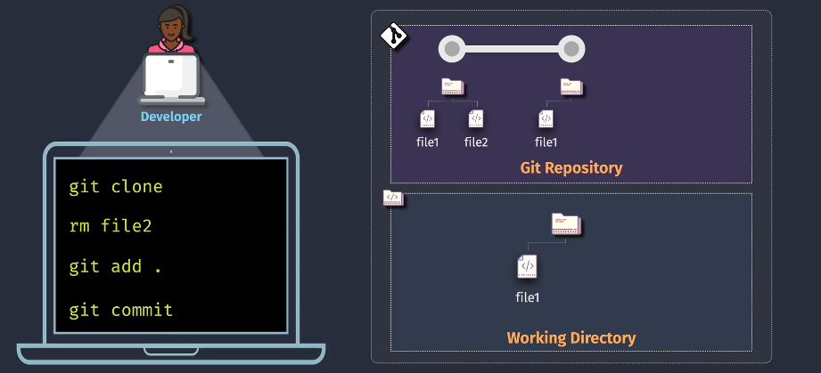
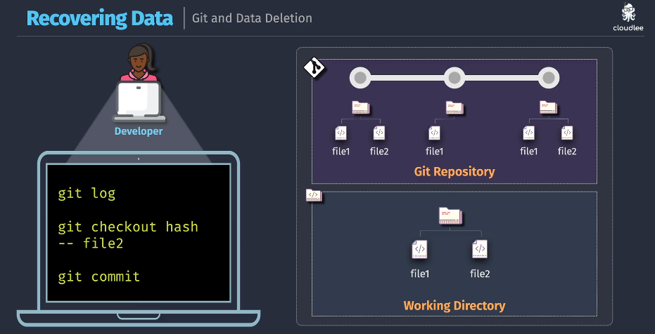

# 🧹 Git Data Deletion

Sometimes, we need to:

1. 🗑️ **Delete a file** normally
2. 🔁 **Recover a deleted file** from history
3. 🧨 **Permanently erase a file** (e.g., secrets or large binaries)

---

## 1️⃣ Deleting Data (Removing File Normally)

📸 **Diagram:**

<div align="center">
  
</div>

This is the standard way to delete a file. It's safe, but the file **still exists in Git history**.

### 💻 Commands

```bash
# Clone your repo
git clone <repo-url>
cd <repo>

# Remove the file from working directory
rm file2

# Stage the deletion
git add .

# Commit the change
git commit -m "Remove file2"
```

✅ **Result:**
File is gone from latest version, but still recoverable via history or `git log`.

---

## 2️⃣ Recovering Deleted Data (Bring File Back)

📸 **Diagram:**

<div align="center">
  
</div>

Let’s say `file2` was deleted by mistake — no worries! Git never forgets. You can restore it from history.

### 💻 Commands

```bash
# Check history to find the commit that still had file2
git log

# Checkout the file from that commit (replace <hash>)
git checkout <hash> -- file2

# Stage and recommit
git add file2
git commit -m "Recovered file2"
```

✅ **Result:**
File is restored as if it was never gone!

---

## 3️⃣ Purging Data (Remove File from ALL History)

📸 **Diagram:**

<div align="center">
  
</div>

If you pushed **API keys**, **passwords**, or **large binaries** and need to erase them from **all commits and history**, you must rewrite the Git history.

> **⚠️ WARNING:** This is destructive. You must force-push and coordinate with teammates to re-clone the repo.

---

### 🧰 Two Tools to Purge Git History

| Tool               | Status                                       | Recommended        |
| ------------------ | -------------------------------------------- | ------------------ |
| `git filter-repo`  | ✅ Official replacement for `filter-branch`  | ✅ Best choice     |
| `bfg-repo-cleaner` | 🚀 Fast alternative, good for binary cleanup | ✅ Fast and simple |

---

## 🔧 Option A: Using `git filter-repo` (Recommended)

### ✅ Step 1: Install it

#### **Linux/macOS (via Homebrew):**

```bash
brew install git-filter-repo
```

#### **Windows (via pip):**

```bash
pip install git-filter-repo
```

> Or manually from: [https://github.com/newren/git-filter-repo](https://github.com/newren/git-filter-repo)

---

### ✅ Step 2: Run Purge Command

```bash
# Delete file2 from all history
git filter-repo --path file2 --invert-paths
```

- `--path file2`: target file
- `--invert-paths`: **removes** that path

### ✅ Step 3: Force Push to Remote

```bash
git push origin --force
```

> All collaborators must re-clone the repository after this.

---

## 🧨 Option B: Using BFG Repo-Cleaner

> Best for **large files**, binaries, and quick filtering.

### ✅ Step 1: Download

Download JAR from:
🔗 [https://rtyley.github.io/bfg-repo-cleaner](https://rtyley.github.io/bfg-repo-cleaner)

---

### ✅ Step 2: Prepare Repo

BFG works on **bare repos**, so:

```bash
# Clone as bare (no working directory)
git clone --mirror <repo-url>
cd <repo-name>.git
```

---

### ✅ Step 3: Run BFG Command

```bash
# Delete file2 from all history
java -jar bfg.jar --delete-files file2
```

Or to delete by filename pattern:

```bash
java -jar bfg.jar --delete-files '*.mp4'
```

---

### ✅ Step 4: Cleanup and Push

```bash
# Clean reflog
git reflog expire --expire=now --all
git gc --prune=now --aggressive

# Push new history
git push --force
```

---

## 🚨 After Purge: Inform Your Team

Because history was rewritten:

- ✅ Ask everyone to **delete and re-clone**
- 🧪 Run automated tests to ensure repo integrity
- 📁 Remove file from backups if it contained secrets

---

## ⚠️ Be Careful: Purging Is Destructive

| Action                 | Effect                                   |
| ---------------------- | ---------------------------------------- |
| Normal delete & commit | Still stored in history                  |
| Checkout deleted file  | Easy recovery from any past commit       |
| Filter-repo / BFG      | History rewritten, file gone permanently |
| `git push --force`     | **Required** after history rewrite       |
| Everyone must re-clone | If repo history is rewritten             |

---

## 💡 Bonus: Preventing Large or Sensitive Files

- Use `.gitignore` to prevent tracking files
- Use Git LFS for binaries
- Use pre-commit hooks or CI policies to scan for secrets or large files
- Use tools like [talisman](https://github.com/thoughtworks/talisman) or [git-secrets](https://github.com/awslabs/git-secrets)

---

## 🧠 Summary Table

| Operation    | Command/Tool                     | Keeps History? | Safe?        |
| ------------ | -------------------------------- | -------------- | ------------ |
| Delete file  | `rm` + `git commit`              | ✅ Yes         | ✅ Easy      |
| Restore file | `git checkout <hash> -- file`    | ✅ Yes         | ✅ Easy      |
| Purge file   | `git filter-repo --invert-paths` | ❌ No          | ⚠️ Dangerous |
| Purge binary | `bfg --delete-files`             | ❌ No          | ⚠️ Dangerous |
| Force Push   | `git push --force`               | N/A            | 🚨 Required  |
