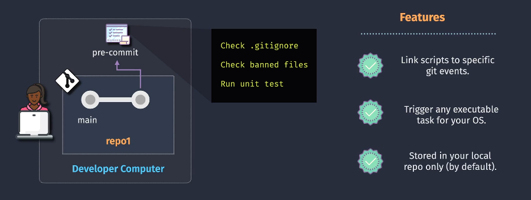
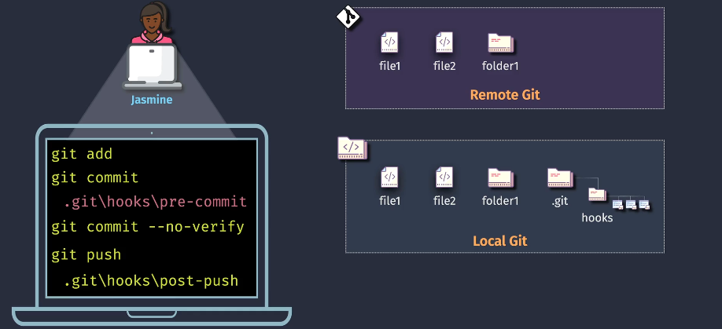

# ⚓ Git Hooks

> **Git Hooks** are customizable scripts that Git runs `locally` and **automatically** in response to certain events like commits, pushes, merges, etc.

They let you **enforce rules, automate tasks, or trigger tests** in your local repo. Think of them as “event listeners” for Git actions.

---

<div align="center">
  
</div>

---

## 🎯 Hooks are stored in `.git/hooks`

This folder is local to your repository (not committed by default). Common hook types:

| Hook Type       | Triggered When?                           | Purpose Example                           |
| --------------- | ----------------------------------------- | ----------------------------------------- |
| `pre-commit`    | Before `git commit` is finalized          | Check code formatting, lint, banned files |
| `commit-msg`    | After commit message is entered           | Validate commit message format            |
| `pre-push`      | Before pushing to remote                  | Ensure tests pass, block dangerous pushes |
| `post-merge`    | After `git merge` completes               | Run build, reconfigure project            |
| `post-checkout` | After checking out a new branch or commit | Sync files, reinit configs                |

---

## ⚙️ How Git Hooks Work

<div align="center">
  
</div>

---

You can:

- Add scripts in `.git/hooks/`
- Make them **executable**
- Git will run them at specific lifecycle stages

```bash
.git/hooks/pre-commit      # runs before every commit
.git/hooks/post-push       # runs after every push
```

Example of usage:

```bash
git add .
git commit       # runs pre-commit hook
git commit --no-verify  # skips hook
git push         # triggers post-push hook (if it exists)
```

---

## 🧪 Example Use Case (from image)

Let’s say Jasmine:

- Adds code to the repo
- The `pre-commit` hook:

  - Checks `.gitignore`
  - Detects banned files (e.g., no `.env`, no `.exe`)
  - Runs unit tests

Only if all these pass, her commit goes through.

If Jasmine uses:

```bash
git commit --no-verify
```

✅ The hook is **skipped** (useful for emergencies — but discouraged in teams!)

---

## ✍️ Sample Pre-Commit Hook Script

Here’s a basic shell script to check staged Python files using `flake8`:

```bash
#!/bin/bash
echo "Running Python lint check..."
files=$(git diff --cached --name-only --diff-filter=ACM | grep '\.py$')

if [ "$files" != "" ]; then
    flake8 $files
    if [ $? -ne 0 ]; then
        echo "❌ Lint errors found. Aborting commit."
        exit 1
    fi
fi

echo "✅ Pre-commit checks passed!"
exit 0
```

Save this as `.git/hooks/pre-commit` and make it executable:

```bash
chmod +x .git/hooks/pre-commit
```

---

## 💡 Features (from diagram)

✅ Trigger scripts **automatically** on Git events  
✅ Can run any **OS executable/script**  
✅ Are **local by default** (not pushed with repo unless shared using tools like Husky or `.githooks`)

---

## 🔐 Git Hooks Caveats

| ❗ Problem                   | ✅ Solution                                                                      |
| ---------------------------- | -------------------------------------------------------------------------------- |
| Not shared in repo           | Use tools like [Husky](https://typicode.github.io/husky) to version control them |
| Skippable with `--no-verify` | Use server-side hooks (e.g. pre-receive on Git server)                           |
| OS-specific scripts          | Use cross-platform tooling or containerized checks                               |

---

## 🔁 Shareable Hook Strategy (Team-Wide)

If you want hooks **shared and versioned**, consider:

### ✅ Using [Husky](https://typicode.github.io/husky/)

- JavaScript-based Git hooks for Node projects
- Version-controlled via `package.json`
- Easy cross-platform automation

---

## ✅ Summary

| Feature    | Git Hooks Behavior                      |
| ---------- | --------------------------------------- |
| Scope      | Local to repo (not pushed)              |
| Purpose    | Enforce standards, run automation       |
| Location   | `.git/hooks/`                           |
| Examples   | Linting, test runs, filename validation |
| Skippable  | Yes (`--no-verify`)                     |
| Shareable? | Not by default (needs extra tooling)    |
