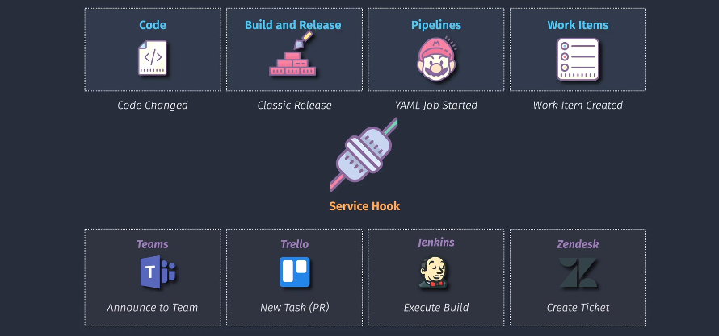
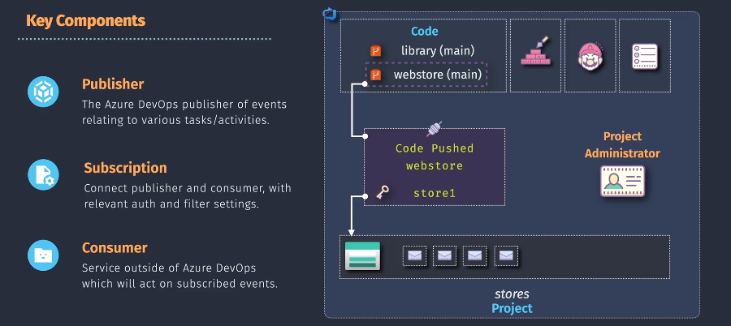
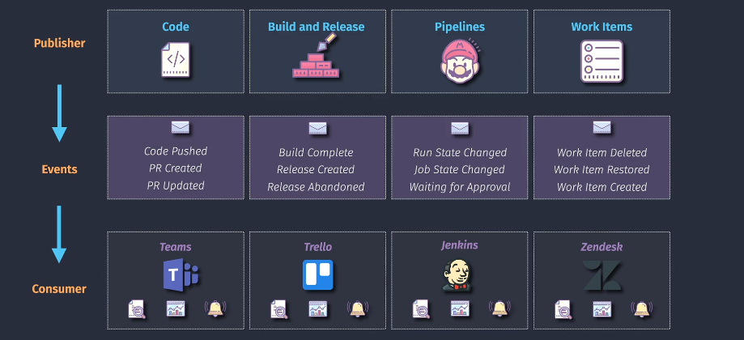
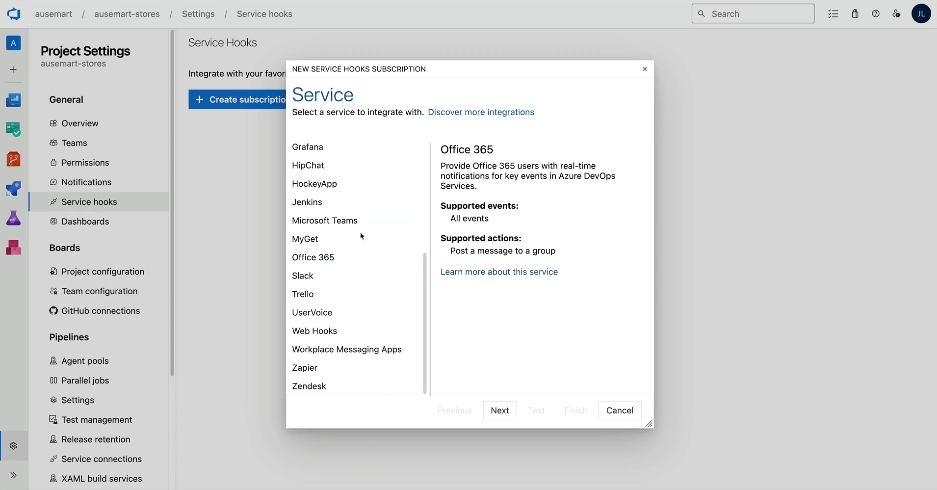

# 🔌 Azure DevOps Service Hooks

Service Hooks let **Azure DevOps** notify external services when events happen in your project. Think of them like automated messengers that shout:

> “Hey Jenkins, a build just finished!”
> “Hey Teams, a PR was created!”

---

  

---

## 🎯 What Are Service Hooks?

Service hooks are **event-driven integrations** between **Azure DevOps** and **external systems** such as:

- 🧑‍💻 **Developers/DevOps** tools (Jenkins, Trello)
- 💬 **Communication platforms** (Microsoft Teams, Slack)
- 🎫 **Ticketing systems** (Zendesk)
- 🧠 **Custom webhooks** (any REST endpoint)

They _react_ to events like:

- Pull Request Created
- Code Pushed
- Build Succeeded
- Work Item Changed

---

## 🧩 Architecture Overview

1️⃣ **Publisher**: The origin of the event (Azure DevOps Repo, Build, Work Items, Pipelines).  
2️⃣ **Subscription**: The config layer that links events to consumers (includes auth, filters, triggers).  
3️⃣ **Consumer**: The target that reacts to the event (like running a Jenkins job or sending a Teams message).

---

## 🚀 Supported Publishers & Events & Consumers

  

---

### 📤 Publisher

| **Publisher**      | **Events**                                           |
| ------------------ | ---------------------------------------------------- |
| `Code`             | Code pushed, PR created, PR updated                  |
| `Build & Release`  | Build completed, Release created, Release abandoned  |
| `Pipelines (YAML)` | Job state changed, Run started, Waiting for approval |
| `Work Items`       | Created, Updated, Deleted, Restored                  |

---

### 📥 Common Consumers & Use Cases

| **Consumer**      | **Use Case**                                 |
| ----------------- | -------------------------------------------- |
| `Microsoft Teams` | Announce commits, PRs, or build results      |
| `Trello`          | Automatically create a card for new PRs      |
| `Jenkins`         | Trigger build jobs after PR merges           |
| `Zendesk`         | Open support ticket when bug item is created |

---

## ⚙️ How to Create a Service Hook in Azure DevOps

1. Go to **Project Settings > Service Hooks**.
2. Click **+ Create Subscription**.
3. Choose a **service** (e.g., Jenkins, Slack, Trello).
4. Select a **trigger** (e.g., PR Created).
5. Configure **filters** (e.g., only PRs to `main`).
6. Enter **consumer endpoint or auth token**.
7. Test and finish.

---

  

---

## 🔐 Security & Authentication

- Some consumers use **OAuth or Personal Access Tokens (PAT)** (e.g., Jenkins).
- Others use **webhooks with secrets** for signature validation.
- Azure DevOps ensures **event delivery**, retries on failure, and logs the response.

---

## 🧠 Best Practices

- ✅ **Filter events** — don’t spam consumers with every push.
- ✅ Use **Teams for announcements**, **Jenkins for CI**, **Trello/Zendesk** for task creation.
- 🚫 Don’t expose unvalidated webhook endpoints.
- ⏱️ Consider **rate limits** or backoff logic if your consumer is custom.
