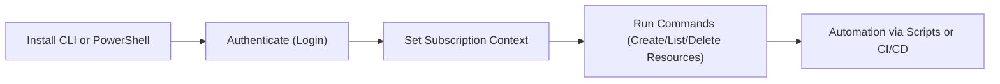

# 🌐 Connecting to Azure Resources via CLI & PowerShell

Azure offers multiple ways to interact with your resources from a terminal:

| Tool                               | Purpose                                                                    | AWS Equivalent           |
| ---------------------------------- | -------------------------------------------------------------------------- | ------------------------ |
| **Azure CLI (`az`)**               | Cross-platform command-line tool for Azure                                 | AWS CLI                  |
| **Azure PowerShell (`Az` module)** | PowerShell cmdlets for Azure management                                    | AWS Tools for PowerShell |
| **Cloud Shell**                    | Browser-based terminal in Azure Portal with CLI & PowerShell pre-installed | AWS CloudShell           |

---



---

## ⚙️ Installation & Setup

### 1️⃣ [Azure CLI](https://learn.microsoft.com/en-us/cli/azure/install-azure-cli-windows?view=azure-cli-latest&pivots=msi)

**Install** (cross-platform):

- **Windows (MSI)**

  ```powershell
  Invoke-WebRequest -Uri https://aka.ms/installazurecliwindows -OutFile .\AzureCLI.msi
  Start-Process msiexec.exe -ArgumentList '/I AzureCLI.msi /quiet' -Wait
  ```

- **macOS (Homebrew)**

  ```bash
  brew update && brew install azure-cli
  ```

- **Linux (Debian/Ubuntu)**

  ```bash
  curl -sL https://aka.ms/InstallAzureCLIDeb | sudo bash
  ```

**Verify**:

```bash
az --version
```

---

### 2️⃣ [Azure PowerShell (`Az` module)](https://learn.microsoft.com/en-us/powershell/azure/install-azps-windows?view=azps-14.3.0&tabs=powershell&pivots=windows-psgallery)

**Install**:

- **Windows (PowerShell 5.1+)**

  ```powershell
  Install-Module -Name Az -Scope CurrentUser -Repository PSGallery -Force
  ```

- **macOS/Linux (PowerShell Core)**

  ```bash
  pwsh
  Install-Module -Name Az -Scope CurrentUser -Repository PSGallery -Force
  ```

**Verify**:

```powershell
Get-Module -ListAvailable Az
```

---

### 3️⃣ Cloud Shell (No Install Required)

- Open [Azure Portal](https://portal.azure.com/) → Click **Cloud Shell** (top-right)
- Choose **Bash** (CLI) or **PowerShell**
- Persistent `$HOME` storage in Azure File Share
- **Tip:** Great for quick tests, no local setup needed.

---

## 👮🏻 Authentication Methods

### 🔑 Azure CLI

```bash
az login                 # Interactive browser login
az login --tenant <tenant-id>   # Login to specific tenant
az login --service-principal \
   --username <appId> \
   --password <password-or-cert> \
   --tenant <tenant-id>   # Non-interactive automation
```

---

### 🔑 Azure PowerShell

```powershell
Connect-AzAccount                    # Interactive login
Connect-AzAccount -Tenant <tenant-id> # Specific tenant
Connect-AzAccount -ServicePrincipal `
   -ApplicationId <appId> `
   -Credential (Get-Credential) `
   -Tenant <tenant-id>              # Automation
```

---

## ✍🏻 Basic Usage Examples

### 📌 Azure CLI

```bash
# List subscriptions
az account list --output table

# Set default subscription
az account set --subscription "My Subscription Name"

# List resource groups
az group list --output table

# Create a resource group
az group create --name myRG --location eastus

# Create a storage account
az storage account create \
    --name mystorageacct123 \
    --resource-group myRG \
    --location eastus \
    --sku Standard_LRS
```

---

### 📌 Azure PowerShell

```powershell
# List subscriptions
Get-AzSubscription

# Set default subscription
Set-AzContext -Subscription "My Subscription Name"

# List resource groups
Get-AzResourceGroup

# Create a resource group
New-AzResourceGroup -Name "myRG" -Location "EastUS"

# Create a storage account
New-AzStorageAccount `
    -Name "mystorageacct123" `
    -ResourceGroupName "myRG" `
    -Location "EastUS" `
    -SkuName "Standard_LRS"
```

---

## ✅ Best Practices

- ✅ **Use service principals** for automation — avoids storing personal credentials.
- ✅ **Always set default subscription** to prevent accidental changes in multi-sub environments.
- ✅ **Use `--output table/json`** for readable CLI output.
- ✅ **In PowerShell, use `Out-GridView`** for interactive filtering.
- ✅ **Enable Azure CLI autocompletion** for speed (`az completion`).
- ✅ **Keep CLI & modules updated** for the latest features:

```bash
az upgrade
```

```powershell
Update-Module -Name Az
```

---

## ✍🏻 Quick Automation Example (Azure CLI)

```bash
#!/bin/bash
# create a resource group and a VM in one go
az group create --name devRG --location eastus
az vm create \
    --name DevVM \
    --resource-group devRG \
    --image UbuntuLTS \
    --admin-username azureuser \
    --generate-ssh-keys
```

---

> ✅ **Exam Tip for AZ-104:**  
> You must know **how to log in, set subscription, and create/manage resources** using both Azure CLI and PowerShell. Also, remember that **Cloud Shell** is exam-friendly — it has **built-in storage** and supports both Bash & PowerShell.
