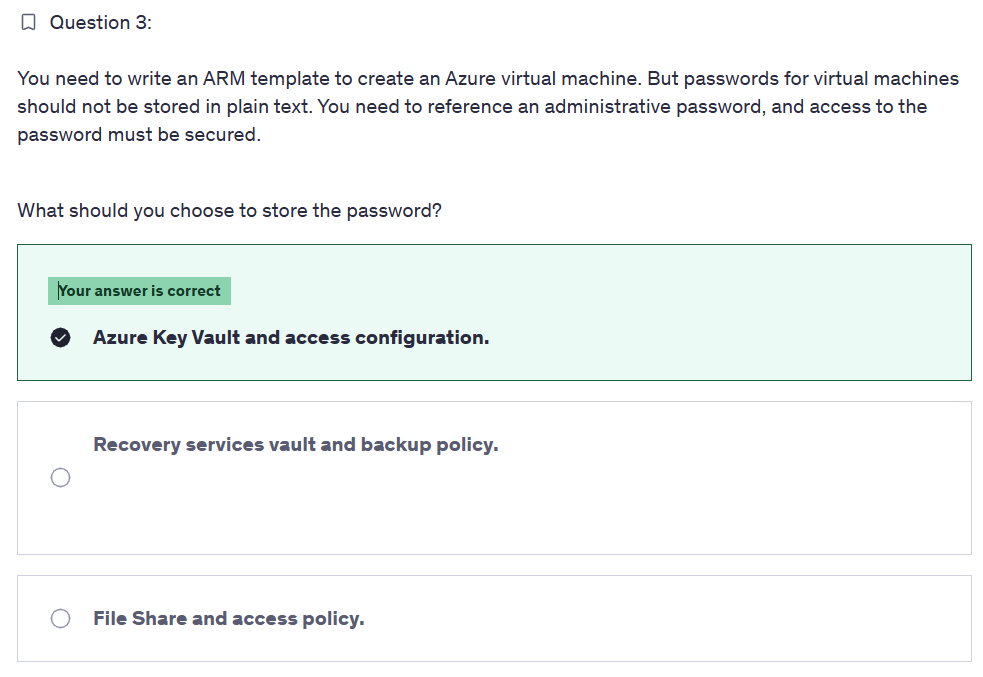
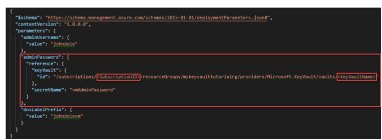
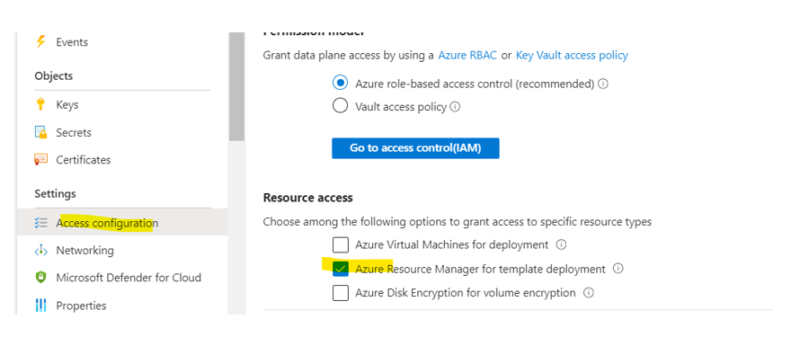
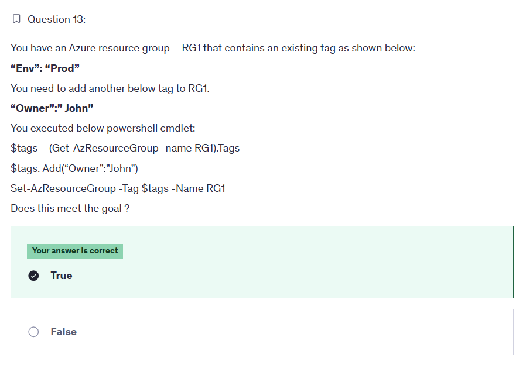
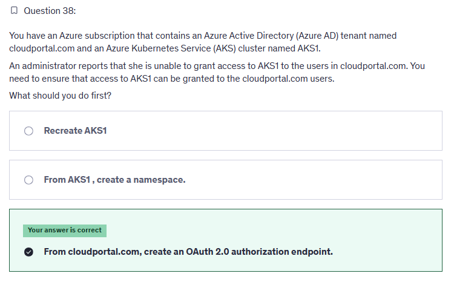
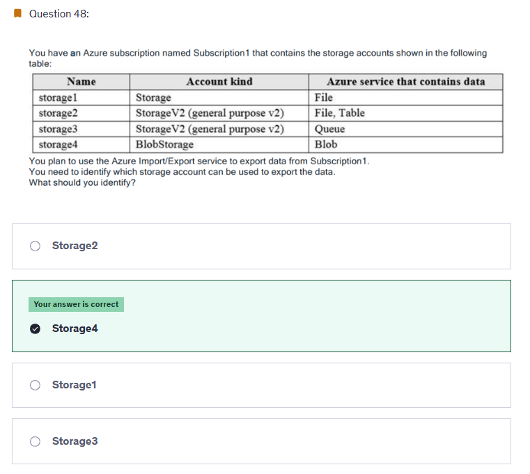
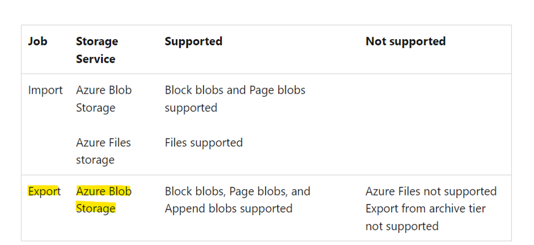

# 📒 **Notes 1**

## Questions 1

  

---

  

  

---

> 👉🏻 **Explanation**  
> You can use Azure Key Vault to store the password and refer to the resource ID of the key vault in the ARM template, as you can see in the above screenshot.  
> Also, you must enable an access configuration called Enable Access to ARM for template deployment before the template can retrieve secrets from the vault, as you can see in the below screenshot.

## Questions 2

  

---

> <https://learn.microsoft.com/en-us/powershell/module/az.resources/set-azresourcegroup?view=azps-10.4.1&viewFallbackFrom=azps-2.6.0>

---

## Question 3

  

---

> 👉🏻 **Explanation**  
> There are different ways to authenticate, control access/authorize and secure Kubernetes clusters.
>
> Azure AD authentication is provided to AKS clusters with OpenID Connect. OpenID Connect is an identity layer built on top of the OAuth 2.0 protocol.
>
> <https://learn.microsoft.com/en-us/azure/aks/concepts-identity>

---

## Question 4

  

  

> 👉🏻 **Explanation**  
> <https://learn.microsoft.com/en-us/azure/import-export/storage-import-export-requirements>

## Questions 5
