# Practice Test 1

## ⁉️ Q2

<div align="left">
  
</div>

---

> 👉🏻 **Explanation**
> Soft delete is enabled by default on newly created vaults to protect backup data from accidental or malicious deletes. Backup data that exists in a soft deleted state before disabling this feature will remain in a soft deleted state for a period of 14 days. If you wish to permanently delete these immediately, then you need to undelete and delete them again to get them permanently deleted.
>
> [https://learn.microsoft.com/en-us/azure/backup/backup-azure-delete-vault?tabs=portal](https://learn.microsoft.com/en-us/azure/backup/backup-azure-delete-vault?tabs=portal)  
> [https://learn.microsoft.com/en-us/azure/backup/backup-azure-security-feature-cloud](https://learn.microsoft.com/en-us/azure/backup/backup-azure-security-feature-cloud)

---

## ⁉️ Q5

<div align="left">
  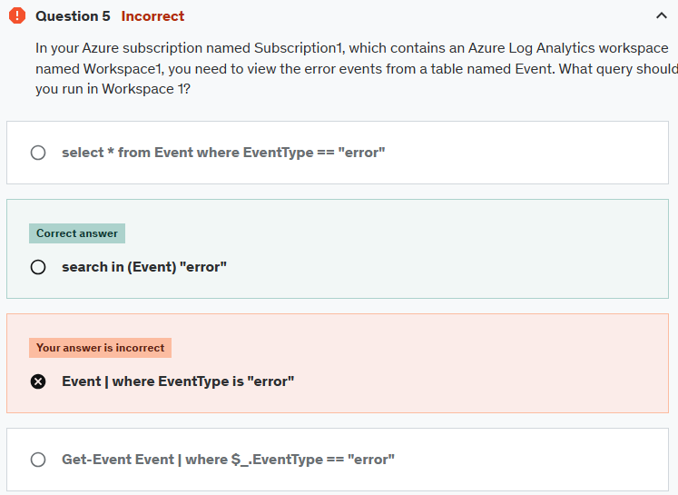
</div>

---

> 👉🏻 **Explanation** > [https://learn.microsoft.com/en-us/kusto/query/search-operator?view=azure-data-explorer&preserve-view=true](https://learn.microsoft.com/en-us/kusto/query/search-operator?view=azure-data-explorer&preserve-view=true)

---

## ⁉️ Q11

<div align="left">
  
</div>

---

> 👉🏻 **Explanation**  
> 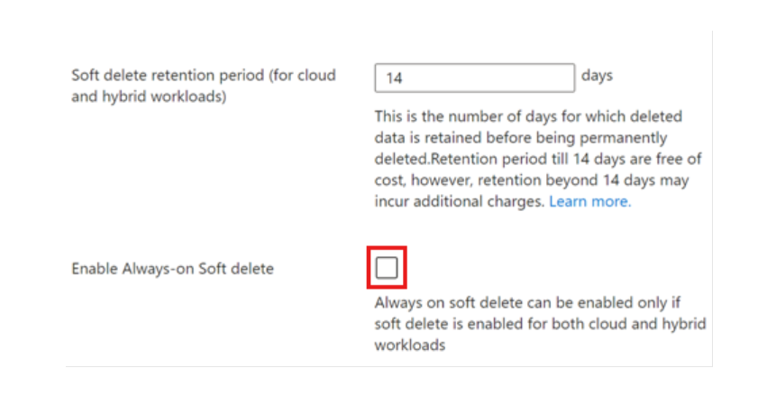
>
> [https://learn.microsoft.com/en-us/azure/backup/backup-azure-enhanced-soft-delete-configure-manage?tabs=recovery-services-vault](https://learn.microsoft.com/en-us/azure/backup/backup-azure-enhanced-soft-delete-configure-manage?tabs=recovery-services-vault)

---

## ⁉️ Q14

<div align="left">
  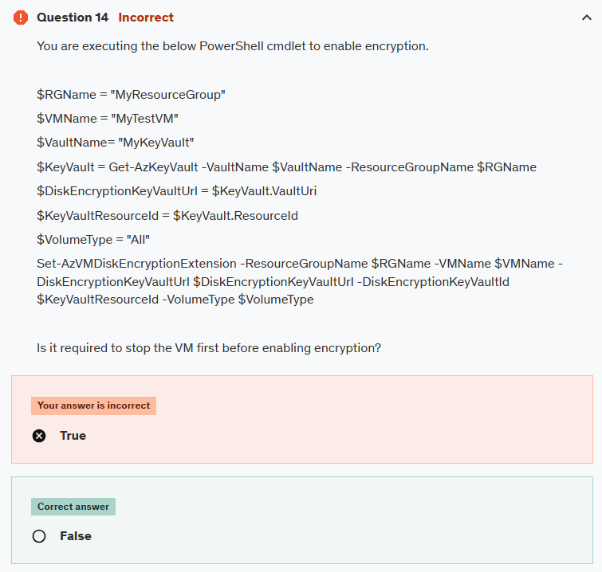
</div>

---

> 👉🏻 **Explanation**
> We can enable encryption on a running IaaS virtual machine in Azure.
>
> [https://learn.microsoft.com/en-us/powershell/module/az.compute/set-azvmdiskencryptionextension?view=azps-13.0.0&viewFallbackFrom=azps-10.4.1](https://learn.microsoft.com/en-us/powershell/module/az.compute/set-azvmdiskencryptionextension?view=azps-13.0.0&viewFallbackFrom=azps-10.4.1)

---

## ⁉️ Q15

<div align="left">
  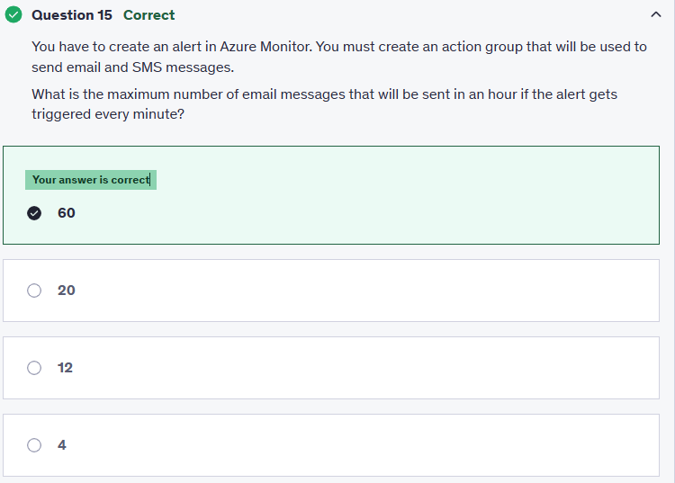
</div>

---

> 👉🏻 **Explanation**
> An email message will be generated every minute.  
> <https://learn.microsoft.com/en-us/azure/azure-monitor/alerts/action-groups>

---

## ⁉️ Q19

<div align="left">
  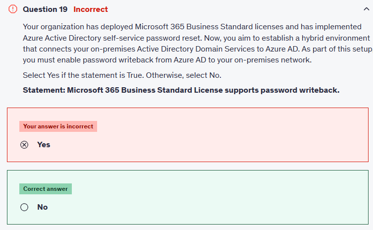
</div>

---

> 👉🏻 **Explanation**
> You need at least an Azure AD Premium P1 or P2 license, or a Microsoft 365 Business Premium license for password writeback.
>
> <https://learn.microsoft.com/en-us/azure/active-directory/authentication/concept-sspr-licensing>

---

### ⁉️ Q25

<div align="left">
  
</div>

---

### ⁉️ Q27

<div align="left">
  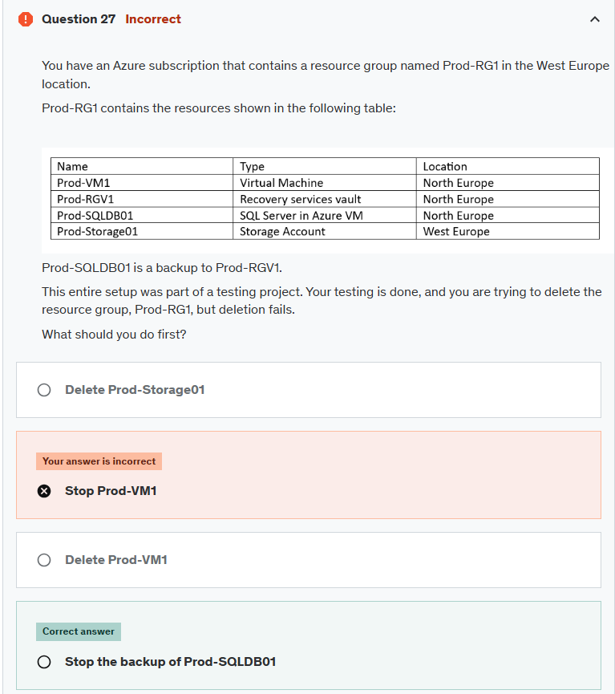
</div>

---

> 👉🏻 **Explanation**
>
> - You can't delete a vault that contains protected data sources (for example, IaaS VMs, SQL databases, or Azure file shares).
> - You can't delete a vault that contains backup data. Once backup data is deleted, it will go into the soft deleted state.
> - You can't delete a vault that contains backup data in the soft deleted state.
> - You can't delete a vault that has registered storage accounts.
> - So, before you can delete a recovery services vault, you need to stop the backup and delete the backup data.

---

### ⁉️ Q28

<div align="left">
  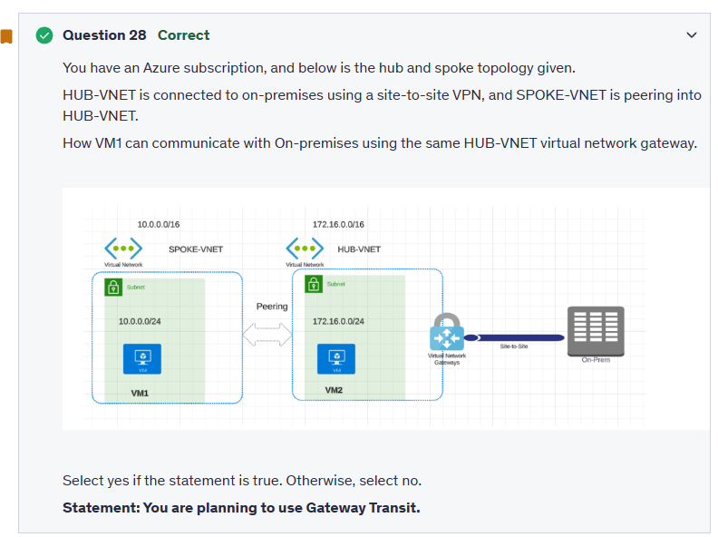
</div>

---

> 👉🏻 **Explanation**
>
> **Gateway transit** is a peering property that lets one virtual network use the VPN gateway in the peered virtual network for cross-premises or VNet-to-VNet connectivity.  
> To add peering, you can go to HUB-VNET and configure the below settings.  
> checking the box: `Allow traffic to be forwarded from the remote virtual network` (allow gateway transit).

---

### ⁉️ Q31

<div align="left">
  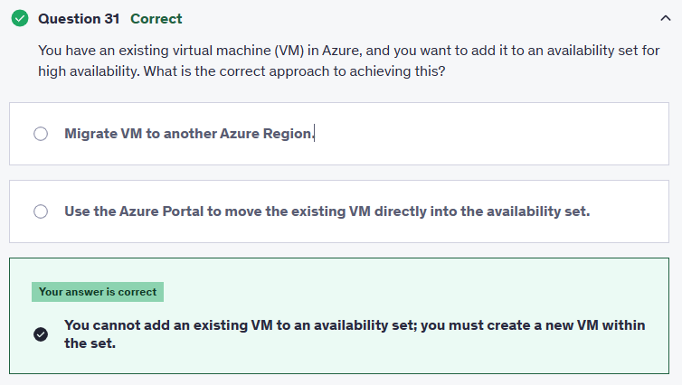
</div>

---

> 👉🏻 **Explanation**
> A VM can only be added to an availability set when it is created. To change the availability set, you need to delete and then recreate the virtual machine.  
> <https://learn.microsoft.com/en-us/azure/virtual-machines/windows/change-availability-set>

---

## ⁉️ Q37

<div align="left">
  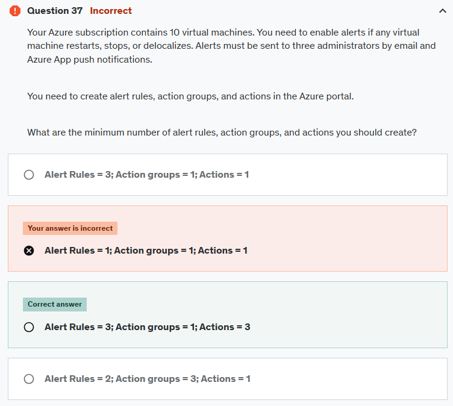
</div>

---

> 👉🏻 **Explanation**

### ✅ The Answer

- **Alert rules:** 3
- **Action groups:** 1
- **Actions:** 3

---

### 🤔 Why This Is the Best Answer

#### 1. **Alert Rules (3)**

- You need to trigger alerts when a VM is:

  1. **Restarted**
  2. **Stopped / Powered off**
  3. **Deallocated (moved off a host)**

👉 Each of these is a **different operation name in the Activity Log**, so you need **three separate alert rules**.
👉 Bonus: Instead of 10 rules (one per VM), you scope the alert rule at the **subscription level**, which automatically covers **all 10 VMs**.

---

#### 2. **Action Groups (1)**

- An **Action Group** is a reusable container for notification settings.
- Instead of creating one per alert, you create **a single Action Group** and reuse it across all 3 rules.

---

#### 3. **Actions (3)**

- Inside the Action Group, you define who gets notified.
- You have **3 administrators** → so that’s **3 actions** (one per admin).
- Each action can send **both email + push notifications** at once.
  👉 So you don’t double-count (not 6 actions).

---

### 🧠 Memorization Hack

Think of it like a **formula**:

```ini
(# of event types you care about) = # of alert rules
(Always 1 action group if possible)
(# of admins) = # of actions
```

For this case:

- Events = 3 → 3 rules
- Action group = 1
- Admins = 3 → 3 actions

---

📚 **Reference**: [Azure Monitor Action Groups](https://learn.microsoft.com/en-us/azure/azure-monitor/alerts/action-groups)

---

## ⁉️ Q39

<div align="left">
  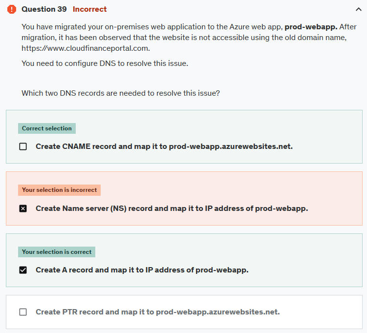
</div>

---

> 👉🏻 **Explanation**
>
> **A record:** points the domain (**<www.cloudfinanceportal.com>**) to the specific IP address where your Azure Web App is hosted. Make sure the IP address you provide is the correct public IP address of your Azure Web app.
>
> **The CNAME record:** allows you to alias one domain name to another.
>
> [https://learn.microsoft.com/en-us/azure/app-service/app-service-web-tutorial-custom-domain?tabs=root%2Cazurecli](https://learn.microsoft.com/en-us/azure/app-service/app-service-web-tutorial-custom-domain?tabs=root%2Cazurecli)

---

## ⁉️ Q50

<div align="left">
  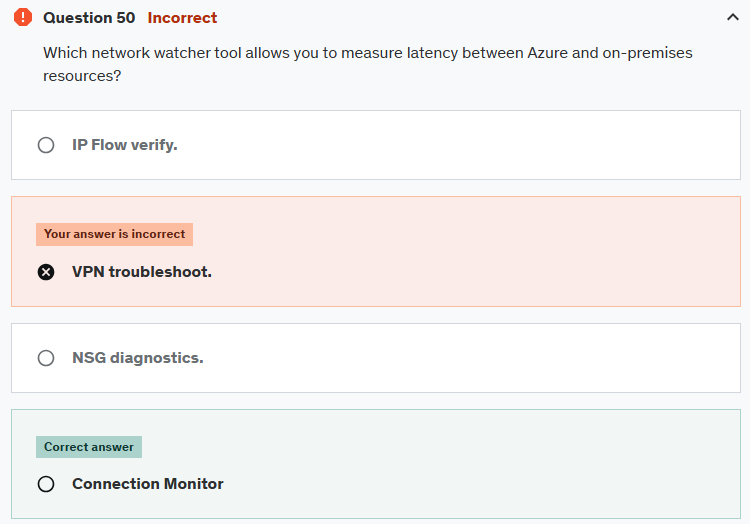
</div>

---

> 👉🏻 **Explanation**
>
> The Connection Monitor monitors communication at regular intervals. It informs you of changes in reachability and latency.
>
> [https://learn.microsoft.com/en-us/azure/network-watcher/connection-monitor-overview](https://learn.microsoft.com/en-us/azure/network-watcher/connection-monitor-overview)

---

## 📒 **Notes Questions**

- Review logs query
- Review Azure Recovery and Backup Services
- you should be monster in powershell for at least creating and configure all common resources
- maximum number of email messages that will be sent in an hour for azure alert is **100**
- Adding a group to an administrative unit brings the group itself into the management scope of the administrative unit, but not the members of the group.
- A data disk is always attached to a VM. You can't access the data on the data disk directly from the internet.
- You can't delete a vault that contains protected data sources (for example, IaaS VMs, SQL databases, or Azure file shares).
- You can't delete a vault that contains backup data. Once backup data is deleted, it will go into the soft deleted state.
- You can't delete a vault that contains backup data in the soft deleted state.
- You can't delete a vault that has registered storage accounts.
- So, before you can delete a recovery services vault, you need to stop the backup and delete the backup data.
- **Gateway transit** is a peering property that lets one virtual network use the VPN gateway in the peered virtual network for cross-premises or VNet-to-VNet connectivity.
- A VM can only be added to an availability set when it is created. To change the availability set, you need to delete and then recreate the virtual machine.
- Both SMS and voice are limited to no more than one notification **every five minutes**.
