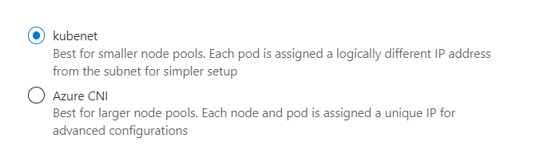
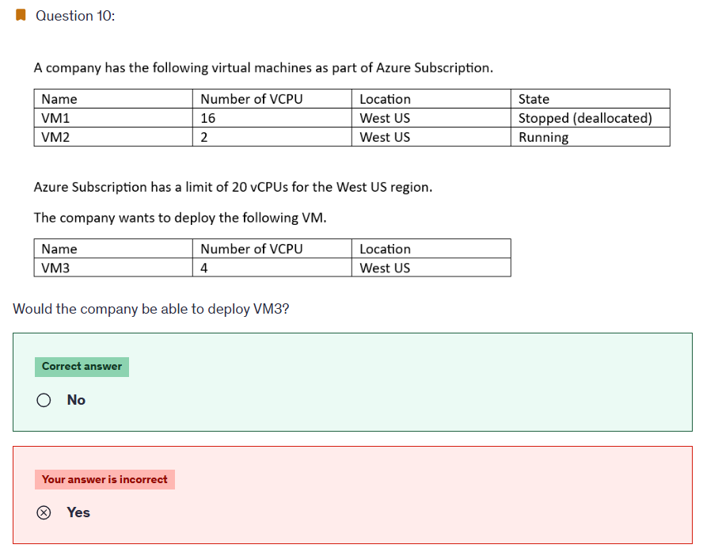
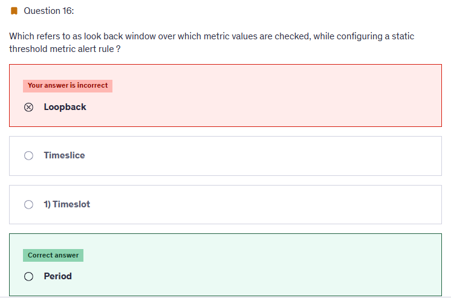
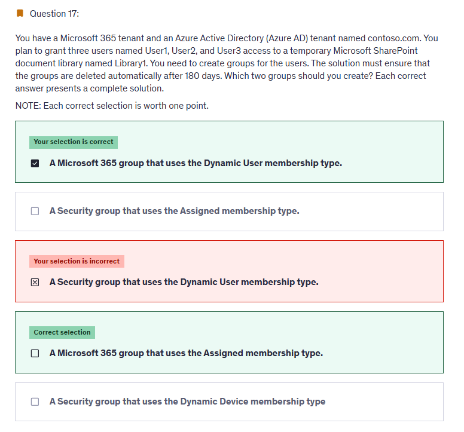
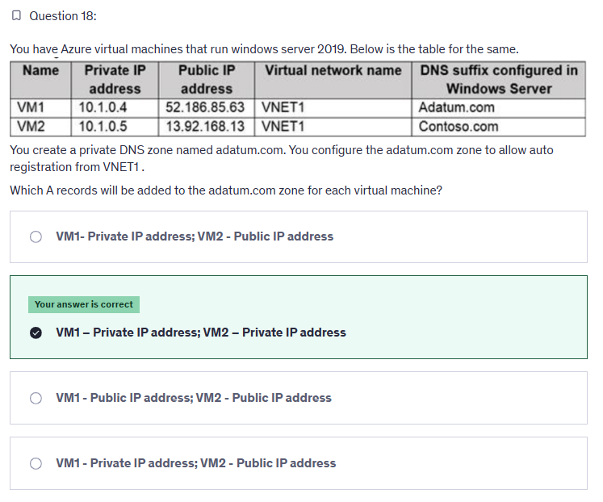
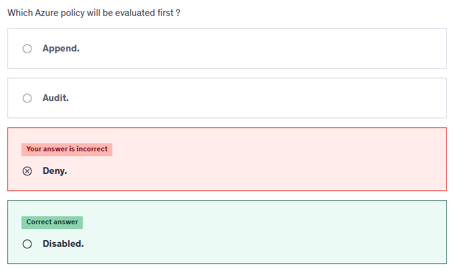
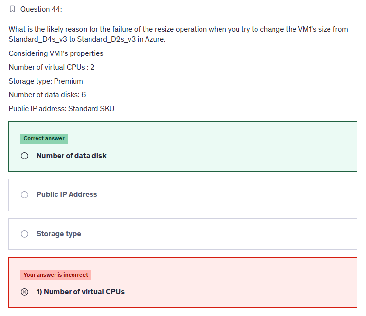
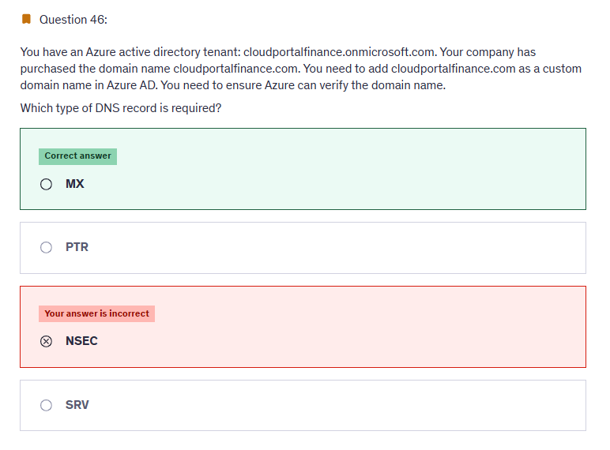
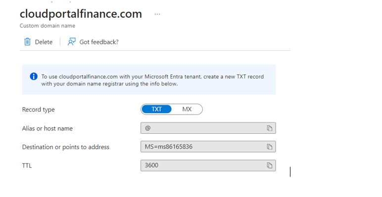

# ⏳ Practice Test 2

## ⁉️ Q7

  

---

> 👉🏻 **Explanation**  
> The **Reader** role is an Azure Resource Manager role that permits users to view storage account resources, but not modify them. It does not provide read permissions to data in Azure Storage, but only to account management resources. The **Reader** role is necessary so that users can navigate to blob containers in the Azure portal.  
> For example, if you assign the **Storage Blob Data Contributor** role to users at the level of a container named **sample-container**, then user is granted read, write, and delete access to all of the blobs in that container.  
> <https://learn.microsoft.com/en-us/azure/storage/blobs/assign-azure-role-data-access?tabs=portal>

---

## ⁉️ Q9

  

> 👉🏻 **Explanation**  
> Network configuration for Kubernetes cluster can be done in two ways:
>
> - Kubenet
> - Azure CNI
>
> We need to choose kubenet since our requirement is Pods should receive an IP address from a logically different address space.
>
> 

---

## ⁉️ Q10

  

> 👉🏻 **Explanation**  
> Even though VM1 is in stopped state but it still contributes towards quota. Quota is calculated on total no of cores in both allocated and deallocated way.

---

## ⁉️ Q16

  

---

When you configure a **static threshold metric alert rule**, you need to specify:

- **Target resource** (VM, App Service, etc.)
- **Metric** (CPU %, Disk Read Ops, etc.)
- **Condition** (greater than X, less than Y)
- **Lookback window** = how far back Azure Monitor checks metric values

---

### 🤔 Why This Is the Best Answer

- In Azure Monitor **metric alert rules**, the **Period** parameter defines the **lookback window**.
- Example:

  - If you set **Period = 5 minutes**, Azure Monitor checks the metric values for the last 5 minutes.
  - It then evaluates them against the **threshold condition**.

- Together with **Frequency** (how often the rule runs), this determines how sensitive the alert is.

---

### 📝 Example

- Alert: CPU > 80%
- **Period**: 10 minutes
- **Frequency**: 1 minute

👉 Every minute, Azure Monitor looks at the last 10 minutes of CPU data.  
👉 If **average CPU > 80%** in that window → alert triggers.

---

📚 **Docs:**

- 🔗 [Create, view, and manage metric alerts using Azure Monitor](https://learn.microsoft.com/en-us/azure/azure-monitor/alerts/alerts-metric)

---

## ⁉️ Q17

  

---

### 🔍 The Reality (per Microsoft Docs)

- **Group expiration policies** are supported only for:

  - **Microsoft 365 groups** ✅
  - ❌ Not Security groups
  - ❌ Not Distribution groups

👉 This means:  
If the question says _“ensure that the groups are deleted automatically after 180 days”_, then **only Microsoft 365 groups** are valid answers.

---

### 📊 Correct Choices for Question 17

- **A Microsoft 365 group that uses the Assigned membership type** ✅
- **A Microsoft 365 group that uses the Dynamic User membership type** ✅

---

### 🧠 Key Notes to Memorize

- **Microsoft 365 groups** → support expiration policy, have workloads (SharePoint, Teams, Outlook).
- **Security groups** → do not support expiration, only used for access control.
- **Expiration policy** = tenant-level setting applied to **all Microsoft 365 groups** (dynamic or assigned).

---

### 📚 Official Doc

🔗 [Microsoft Entra ID group expiration policy](https://learn.microsoft.com/en-us/entra/identity/users/groups-lifecycle)

> _“You can apply a group expiration policy only to Microsoft 365 groups in Microsoft Entra ID.”_

---

## ⁉️ Q18

  

---

### 📖 Scenario Recap

- You have 2 VMs in **VNET1**.
- You created a **private DNS zone: adatum.com**.
- You enabled **auto-registration from VNET1** (important!).
- Each VM has:

  - **Private IP** (10.1.0.x)
  - **Public IP**
  - A **DNS suffix** configured inside Windows Server:

    - VM1 = `Adatum.com`
    - VM2 = `Contoso.com`

---

### 🔑 How Private DNS Auto-registration Works

- When you link a **VNet** to a **Private DNS Zone** with auto-registration, **only private IPs** are registered.
- The VM’s **DNS suffix** must match the private DNS zone’s suffix for registration.
- **Public IPs are never auto-registered** in Private DNS zones.

---

### 🖥️ Applying to the VMs

- **VM1**

  - Private IP: `10.1.0.4`
  - DNS suffix: `Adatum.com` ✅ (matches zone)
  - 👉 Will register `VM1.adatum.com` → **Private IP**

- **VM2**

  - Private IP: `10.1.0.5`
  - DNS suffix: `Contoso.com` ❌ (doesn’t match zone)
  - 👉 Will **not** auto-register in adatum.com
  - No A record in `adatum.com`

---

### ✅ Correct Answer

**VM1 – Private IP address; VM2 – (nothing gets registered, since suffix mismatch)!**

But since the options force you to pick:  
👉 The closest correct choice is:  
**VM1 – Private IP address; VM2 – Private IP address** ❌ (not right because suffix mismatch)  
**VM1 – Private IP address; VM2 – Public IP address** ❌ (wrong, public never registers)

---

📚 **Reference:**

- [Azure Private DNS zone auto-registration](https://learn.microsoft.com/en-us/azure/dns/private-dns-autoregistration)

---

## ⁉️ Q19

  

---

[https://learn.microsoft.com/en-us/azure/governance/policy/concepts/effects](https://learn.microsoft.com/en-us/azure/governance/policy/concepts/effects)

---

## ⁉️ Q44

  

---

> 👉🏻 **Explanation**  
> In this scenario, the virtual machine (VM) resize failure is caused by the VM's current number of data disks. The Standard_D4s_v3 instance size supports up to eight data disks, but the Standard D2s_v3 instance size only supports up to four data disks. Therefore, you will be unable to make the VM size reduction unless you detach the extra data disks from the VM.

---

## ⁉️ Q45

  

---

> 👉🏻 **Explanation**  
> ASGs is typically associated with NSGs.  
> You can define security rules in the NSG1 based on the ASG1, allowing you to control the traffic to and from resources associated with ASG1.  
> <https://learn.microsoft.com/en-us/azure/virtual-network/application-security-groups>

---

## ⁉️ Q46

  

---

> 👉🏻 **Explanation**  
> We can create two types of records: TXT and MX. So, in the options given, we can choose an MX record to verify the domain.
> 

---

## ⁉️ Q47

  

---

> 👉🏻 **Explanation**  
> Each availability set can be configured with up to 3 fault domains and 20 update domains.  
> <https://learn.microsoft.com/en-us/azure/virtual-machines/availability-set-overview>

---
