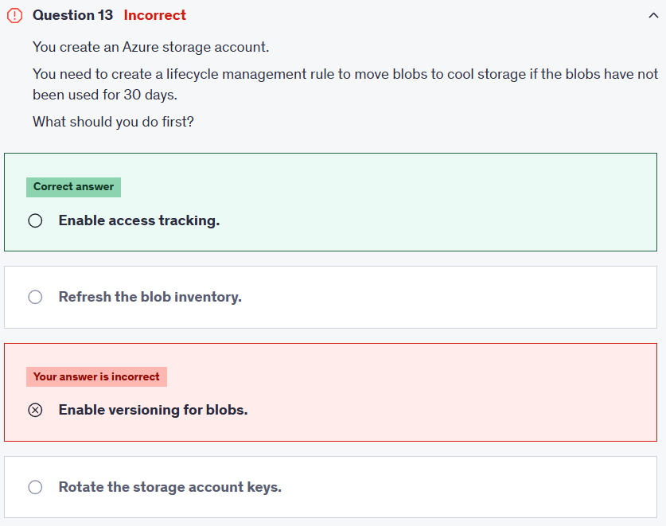
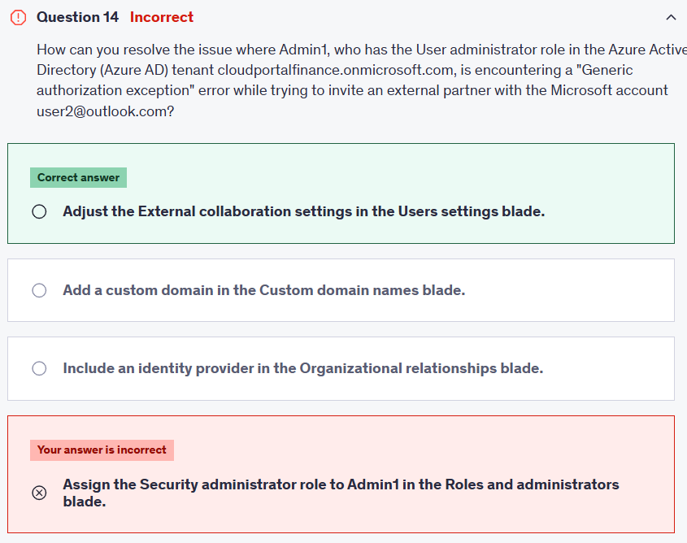
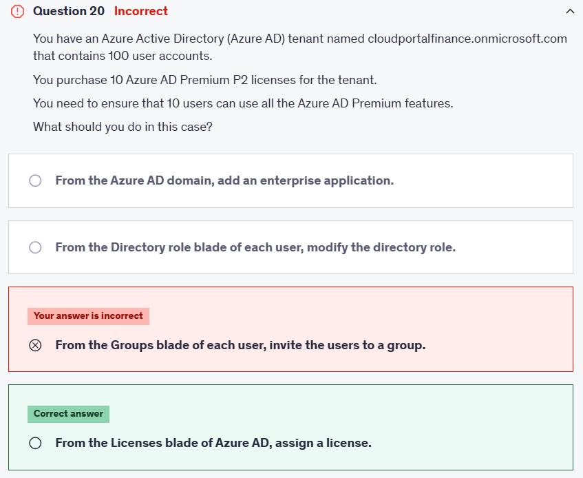
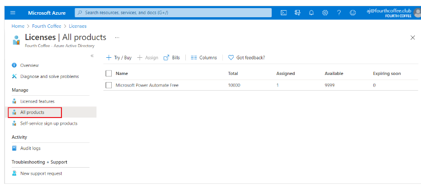
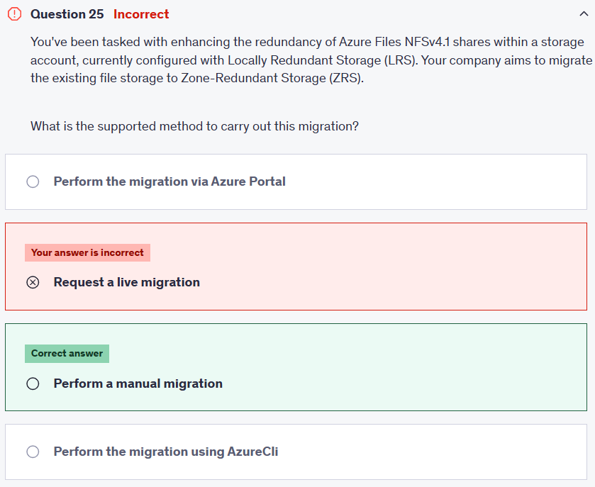

# ⏳ Practice Test 4

## ⁉️ Q13

> 👉🏻 Overall explanation:  
> A lifecycle management rule can be used to move or delete blobs automatically.  
> The rule can be based on the time the blob was last modified or the time the blob was last accessed (read or write).  
> To perform an action based on the access time, access tracking must be enabled, This can incur additional storage costs.
>
> [📚 References](https://learn.microsoft.com/en-us/azure/storage/blobs/lifecycle-management-policy-configure?tabs=azure-portal)

## ⁉️ Q14

> 👉🏻 Overall explanation:  
> [📚 References](https://techcommunity.microsoft.com/t5/microsoft-entra/generic-authorization-exception-inviting-azure-ad-gests/m-p/274742)

## ⁉️ Q20

> You need to go to the Licenses blade of Azure AD to assign a license.
>
> 

## ⁉️ Q25

---

### 🤔 Why This Is the Best Answer

- Currently, **Azure Files with NFSv4.1** in a storage account using **LRS** cannot be “live migrated” to **ZRS**.
- Changing redundancy **is not supported directly** for NFS file shares (unlike some Blob scenarios where you can request account failover/migration).
- The only supported method is to:

  1. **Create a new storage account** with ZRS redundancy.
  2. **Manually migrate the data** (e.g., AzCopy, Azure File Sync, robocopy, rsync).
  3. Redirect applications to the new share.

This ensures redundancy across zones, but it’s a **manual process**, not an in-place upgrade.

### 📝 Key Notes to Memorize (Exam Tip)

- **LRS → ZRS migration = Manual only** for Azure Files (SMB or NFS).
- AzCopy is the recommended tool for file migration.
- For **Blob storage**, you can sometimes change replication (LRS → GRS/ZRS) in-portal, but **not for Azure Files NFSv4.1**.
- Always create the storage account with the correct redundancy upfront when planning production workloads.

---

📚 **Docs to Review:**

- 🔗 [Redundancy options in Azure Storage](https://learn.microsoft.com/en-us/azure/storage/common/storage-redundancy)
- 🔗 [Planning for high availability in Azure Files](https://learn.microsoft.com/en-us/azure/storage/files/storage-files-planning)
