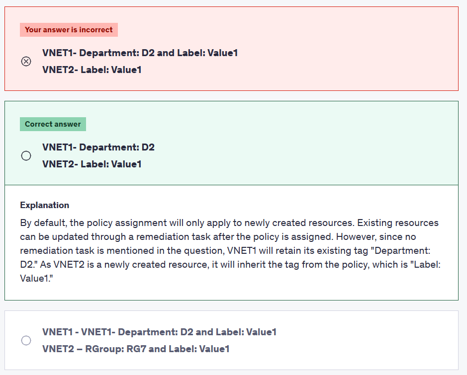

# ⏳ Practice Test 5

## ⁉️ Q1

  

  

> 👉🏻 Overall explanation:  
> By default, the policy assignment will only apply to newly created resources. Existing resources can be updated through a remediation task after the policy is assigned. However, since no remediation task is mentioned in the question, VNET1 will retain its existing tag "Department: D2." As VNET2 is a newly created resource, it will inherit the tag from the policy, which is "Label: Value1."

## ⁉️ Q2

  

> 👉🏻 Overall explanation:
>
> - Azure Container Instances can schedule both Windows and Linux containers with the same API. You can specify your OS type preference when you create your container groups. Some features are currently restricted to Linux containers.
>
> - <https://learn.microsoft.com/en-us/azure/container-instances/container-instances-overview>
>
> - Azure Container Apps supports: Any Linux-based x86-64 (linux/amd64) container image with no required base image Containers from any public or private container registry Sidecar and init containers
>
> - <https://learn.microsoft.com/en-us/azure/container-apps/containers>
>
> - Azure App Service is an HTTP-based service for hosting web applications, REST APIs, and mobile back ends. You can develop in your favorite language, be it .NET, .NET Core, Java, Node.js, PHP, and Python. Applications run and scale with ease on both Windows and Linux-based environments.
>
> - <https://learn.microsoft.com/en-us/azure/app-service/overview>

## ⁉️ Q3

  

