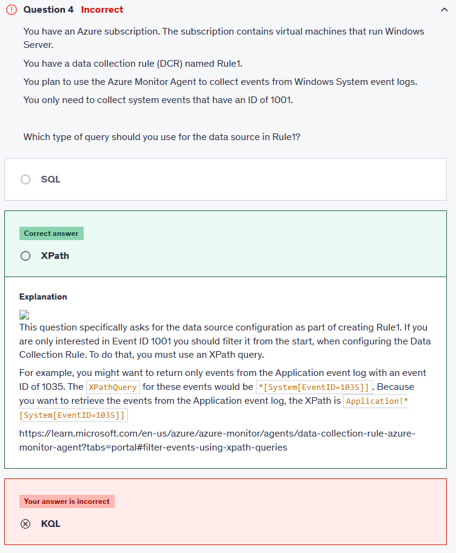
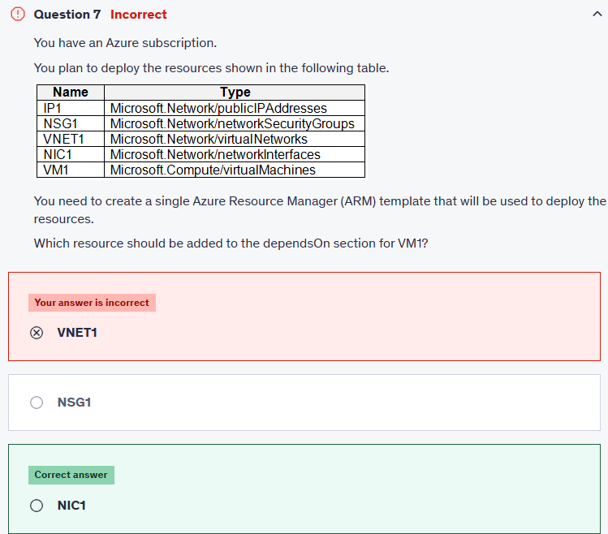

# ⏳ Practice Test 6

## ⁉️ Q4

<div align="left">
  
</div>

---

### 🤔 Why This Is the Best Answer

- When you configure a DCR with **Windows Event Logs** as a source, you must specify **which events to collect**.
- Azure Monitor supports **XPath queries** for filtering events inside event logs.
- Example XPath filter for Event ID **1001**:

  ```xml
  *[System[(EventID=1001)]]
  ```

- This ensures only events with ID = 1001 are collected, reducing noise and ingestion cost.

---

### ❌ Why Other Options Are Wrong

- **SQL**

  - ❌ Wrong: SQL queries are used against relational databases, not Windows Event Logs.
  - AMA doesn’t support SQL queries for event log filtering.

- **KQL (Kusto Query Language)**

  - ❌ Wrong in this context: KQL is used **after ingestion** in Log Analytics (to query collected data).
  - But filtering at the source (before ingestion) must be done with **XPath**.

---

### 🧠 Key Notes to Memorize (Exam Tip)

- **AMA (Azure Monitor Agent)** → uses **Data Collection Rules (DCRs)**.
- **Windows Event Logs filtering in DCR** → **XPath**.
- **After ingestion in Log Analytics** → **KQL**.
- ✅ Think: **Before ingestion = XPath | After ingestion = KQL**.

---

📚 **Docs:**

- 🔗 [Collect events and performance counters with Azure Monitor Agent](https://learn.microsoft.com/en-us/azure/azure-monitor/agents/data-collection-rule-overview)
- 🔗 [Filter Windows event log data using XPath queries](https://learn.microsoft.com/en-us/azure/azure-monitor/agents/data-collection-windows-events#filtering-events)

---

## ⁉️ Q7

<div align="left">
  
</div>

---

### 🤔 Why This Is the Best Answer

- In Azure, a **Virtual Machine (VM)** does not directly depend on the **VNet, IP, or NSG**.
- Instead, it depends on a **Network Interface (NIC)**.
- The **NIC** itself depends on:

  - **VNet/Subnet** (to get an IP)
  - **Public IP** (if attached)
  - **NSG** (if associated)

- So in the **dependsOn** of the VM, you only need **NIC1**.
- ARM automatically resolves transitive dependencies (because NIC1 already depends on VNet1, IP1, NSG1).
