# 📋 Mock Exam 1

## ⁉️ Q1

<div align="left">
  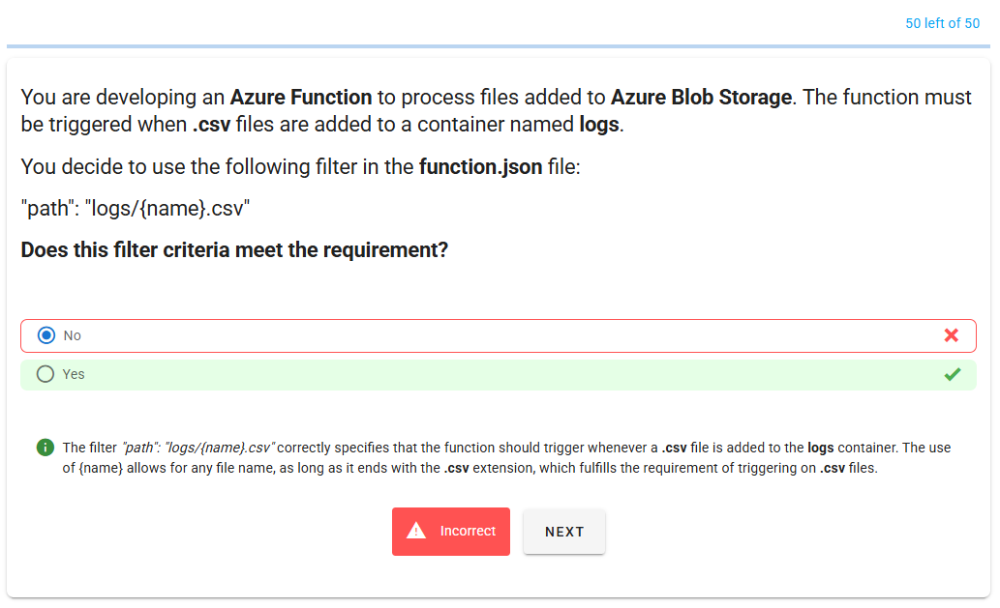
</div>

---

> 👉🏻 **Explanation**

---

## ⁉️ Q2

<div align="left">
  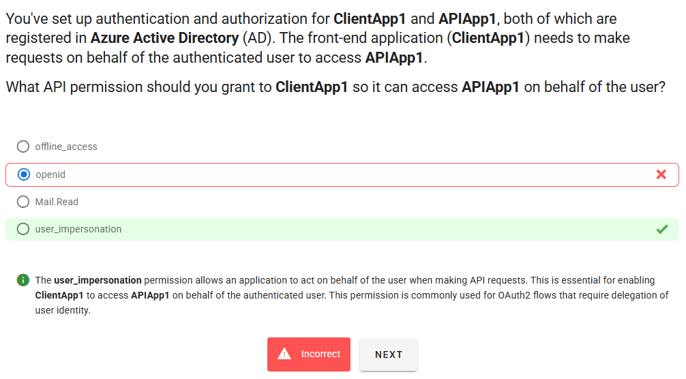
</div>

---

> 👉🏻 **Explanation**

---

## ⁉️ Q3

<div align="left">
  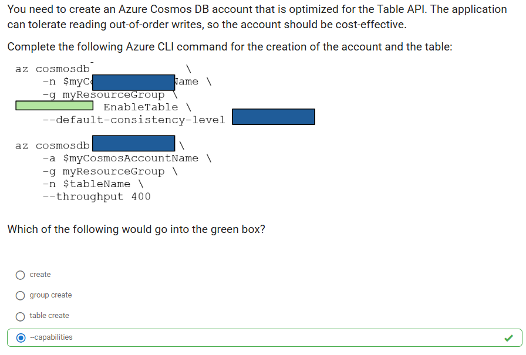
</div>

---

> 👉🏻 **Explanation**
>
> ```bash
> az cosmosdb create \
>   -n $myCosmosAccountName \
>   -g myResourceGroup \
>   --capabilities EnableTable \
>   --default-consistency-level Eventual
>
> az cosmosdb table create \
>   -a $myCosmosAccountName \
>   -g myResourceGroup \
>   -n $tableName \
>   --throughput 400
> ```

---

## ⁉️ Q4

<div align="left">
  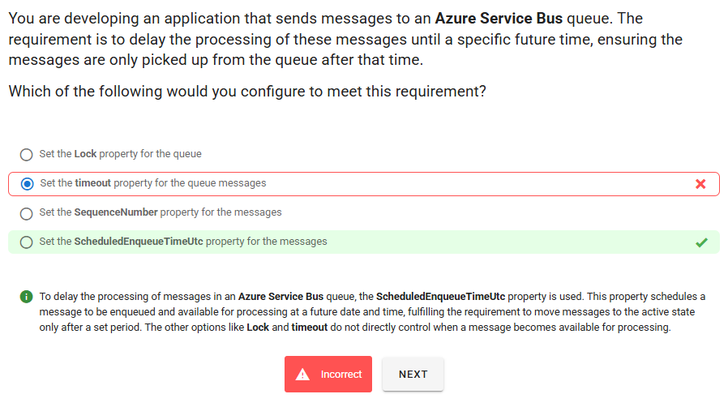
</div>

---

> 👉🏻 **Explanation**  
> To delay the processing of messages in an Azure Service Bus queue, the `ScheduledEnqueueTimeUtc` property is used. This property schedules a message to be enqueued and available for processing at a future date and time, fulfilling the requirement to move messages to the active state only after a set period. The other options like Lock and timeout do not directly control when a message becomes available for processing.

---

## ⁉️ Q5

<div align="left">
  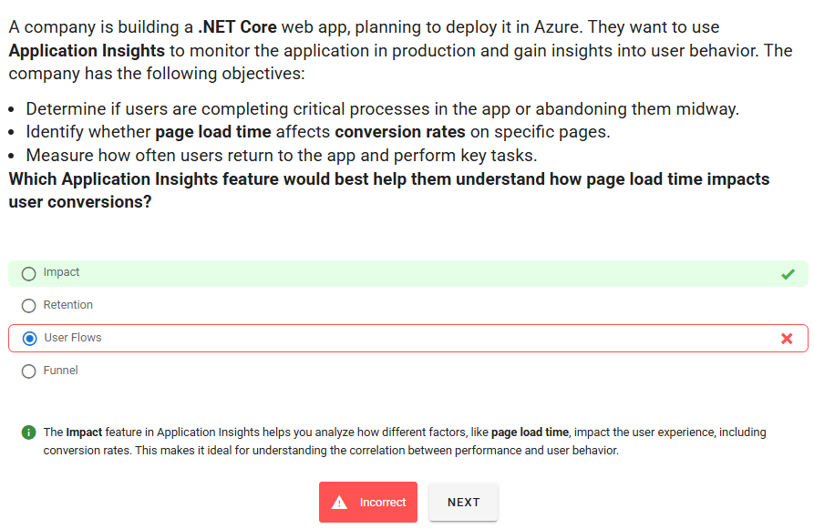
</div>

---

> 👉🏻 **Explanation**  
> The `Impact` feature in Application Insights helps you analyze how different factors, like page load time, impact the user experience, including conversion rates. This makes it ideal for understanding the correlation between performance and user behavior.

---

## ⁉️ Q6

<div align="left">
  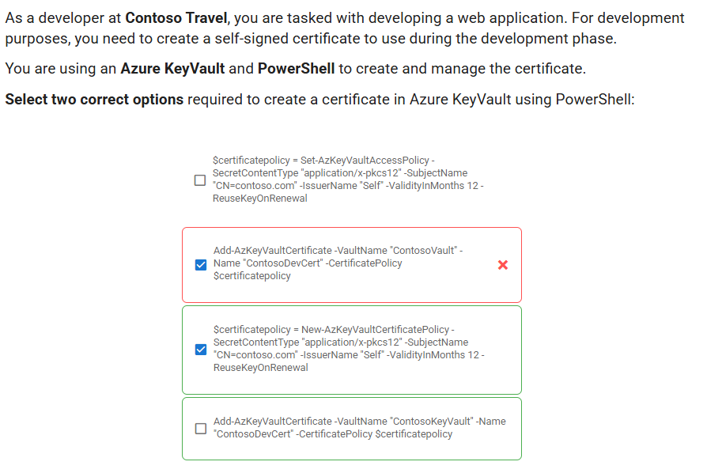
</div>

---

> 👉🏻 **Explanation**
>
> **✅ the answer:**
> The two correct options are:
> 1-
>
> ```powershell
> $certificatepolicy = New-AzKeyVaultCertificatePolicy `
>   -SecretContentType "application/x-pkcs12" `
>   -SubjectName "CN=contoso.com" `
>   -IssuerName "Self" `
>   -ValidityInMonths 12 `
>   -ReuseKeyOnRenewal
> ```
>
> 2-
>
> ```powershell
> Add-AzKeyVaultCertificate -VaultName "ContosoKeyVault" `
>   -Name "ContosoDevCert" `
>   -CertificatePolicy $certificatepolicy
> ```

---

## ⁉️ Q7

You are planning to use Azure Functions to build an app that handles non-HTTP triggers. However, the language you want to use is not supported natively by Azure Functions. You decide to write a custom handler and ensure that your custom handler can handle processing requests within 90 seconds of function invocation.

Will this approach meet the execution requirements of Azure Functions?

---

> 👉🏻 **Explanation**
>
> **✅ the answer:**
> No — it will not meet the requirement. A custom handler must respond to the Functions host within **60 seconds** of invocation; 90 seconds is too slow.
>
> **🤔 Why This Is the Best Answer:**
> Azure Functions custom handlers have a host–handler handshake timeout: when any trigger fires, the Functions host sends an HTTP request to your custom handler and expects a response **within 60s**. If the handler doesn’t respond in that window, the invocation is marked failed, regardless of the broader execution limits of your plan.
>
> **❌ Why Other Options Are Wrong:**
>
> - “Yes, because Consumption allows 5–10 minutes.” → That’s the **overall function timeout**, not the **custom-handler response window**; the 60s handshake still applies.
> - “Yes on Premium/Dedicated (unlimited).” → Plan limits don’t override the 60s custom-handler response requirement.
> - “Only HTTP triggers have a short timeout.” → Even for non-HTTP triggers, the host calls the custom handler over HTTP internally, so the 60s response rule still applies.

---

## ⁉️ Q8

<div align="left">
  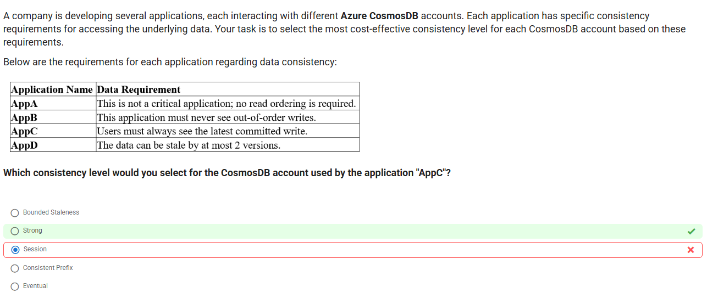
</div>

---

> 👉🏻 **Explanation**
>
> **✅ the answer:**
> Strong consistency
>
> **🤔 Why This Is the Best Answer:**
> “Users must always see the latest committed write” requires linearizable reads across all clients. Only **Strong** consistency guarantees no stale reads and immediate visibility of the most recent committed write globally.
>
> **❌ Why Other Options Are Wrong:**
>
> - **Session** — read-your-writes only within the same session; other users can still see stale data.
> - **Bounded staleness** — allows some lag (by time or versions), so reads may be stale.
> - **Consistent prefix** — prevents out-of-order reads but still allows staleness.
> - **Eventual** — allows both staleness and reordering; least strict.

---

## ⁉️ Q9

<div align="left">
  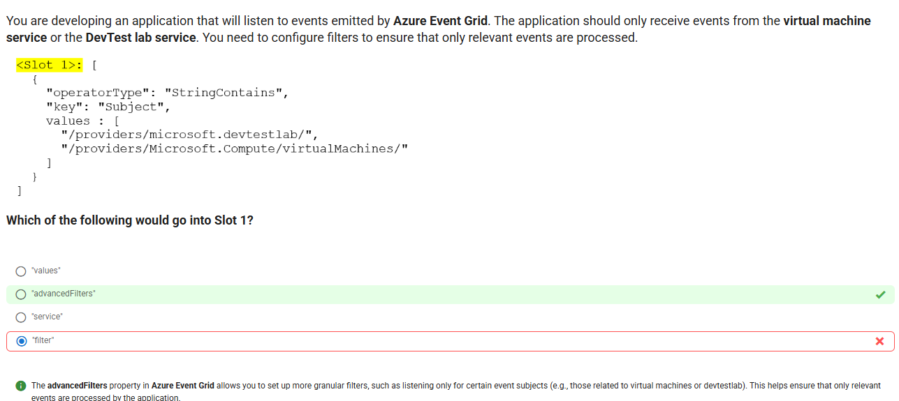
</div>

---

> 👉🏻 **Explanation**
>
> The advancedFilters property in Azure Event Grid allows you to set up more granular filters, such as listening only for certain event subjects (e.g., those related to virtual machines or devtestlab). This helps ensure that only relevant events are processed by the application.

---

## ⁉️ Q10

<div align="left">
  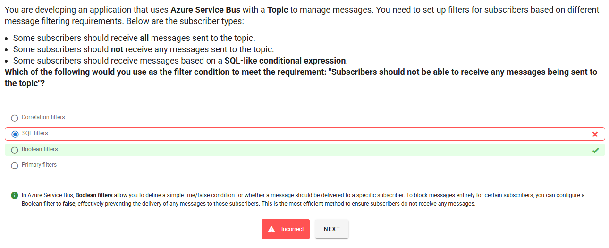
</div>

---

> 👉🏻 **Explanation**
>
> The advancedFilters property in Azure Event Grid allows you to set up more granular filters, such as listening only for certain event subjects (e.g., those related to virtual machines or devtestlab). This helps ensure that only relevant events are processed by the application.

---

## ⁉️ Q11

<div align="left">
  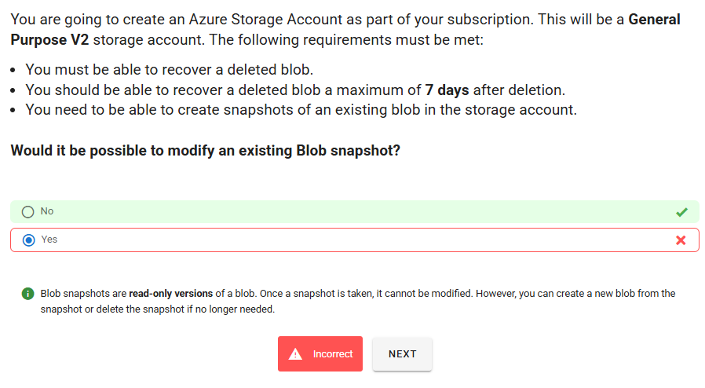
</div>

---

> 👉🏻 **Explanation**
>
> Blob snapshots are `read-only versions` of a blob. Once a snapshot is taken, it cannot be modified. However, you can create a new blob from the snapshot or delete the snapshot if no longer needed.

---

## ⁉️ Q12

<div align="left">
  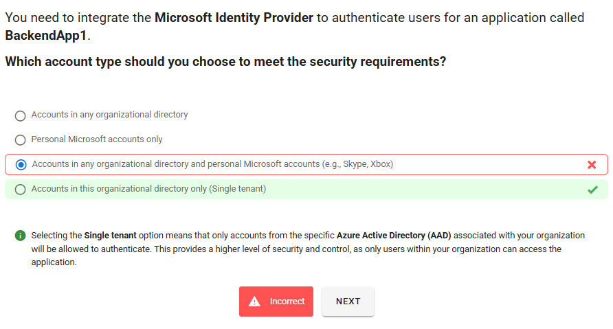
</div>

---

> 👉🏻 **Explanation**
>
> Selecting the Single tenant option means that only accounts from the specific Azure Active Directory (AAD) associated with your organization will be allowed to authenticate. This provides a higher level of security and control, as only users within your organization can access the application.

---

## ⁉️ Q13

<div align="left">
  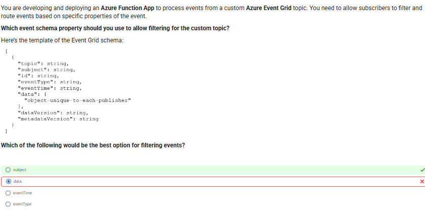
</div>

---

> 👉🏻 **Explanation**
>
> The subject property in the Event Grid schema is commonly used to route and filter events. It contains detailed information about the specific resource or action that the event refers to, making it a useful field for setting up filters based on resource types or event actions. The other fields like eventType and eventTime provide additional context but are not typically used for event filtering.

---

## ⁉️ Q14

<div align="left">
  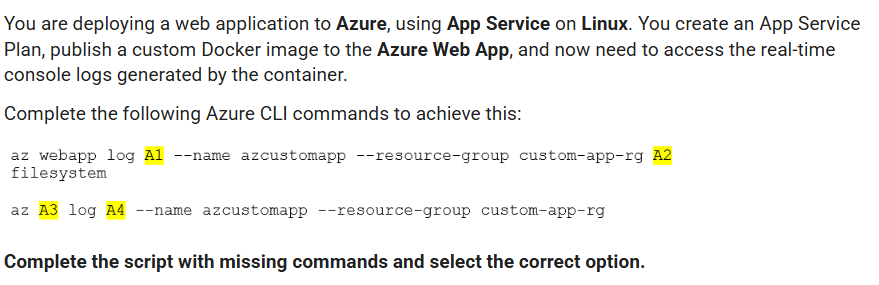
</div>

<div align="left">
  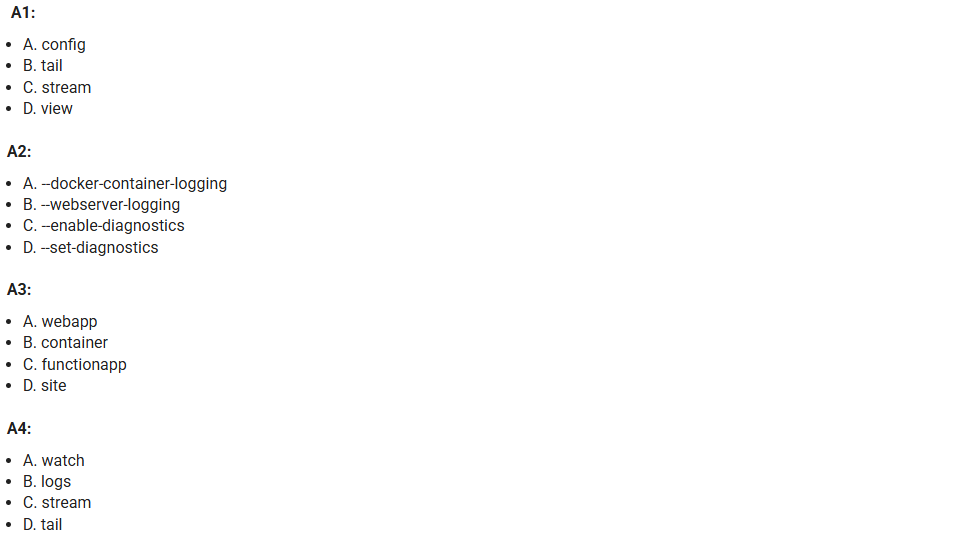
</div>

---

> 👉🏻 **Explanation**
>
> ```bash
> az webapp log config \
>   --name <app-name> \
>   --resource-group <resource-group-name> \
>   --docker-container-logging filesystem
> ```
>
> > This enables logging to the file system for your container.
>
> ---
>
> ### ✅ Step 2: Stream the logs in real time
>
> ```bash
> az webapp log tail \
>   --name <app-name> \
>   --resource-group <resource-group-name>
> ```
>
> > This command shows live logs from your container—similar to `docker logs -f`.

---

## ⁉️ Q15

<div align="left">
  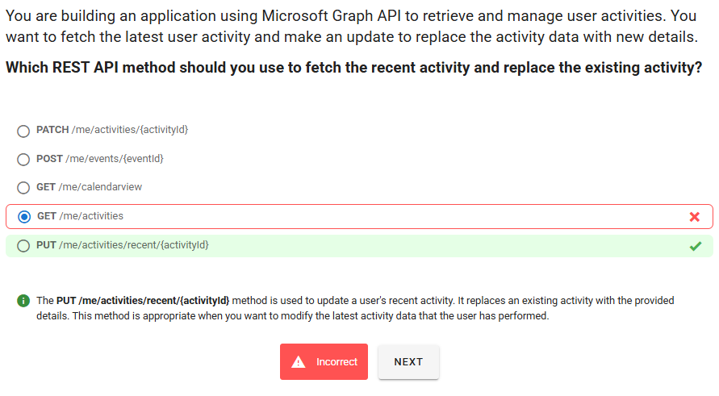
</div>

---

> 👉🏻 **Explanation**
>
> The `PUT` `/me/activities/recent/{activityId}` method is used to update a user's recent activity. It replaces an existing activity with the provided details. This method is appropriate when you want to modify the latest activity data that the user has performed.

---
