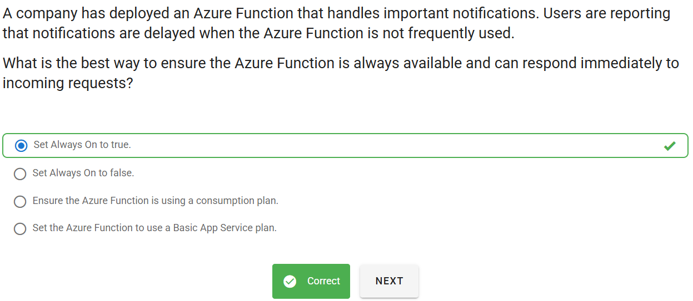
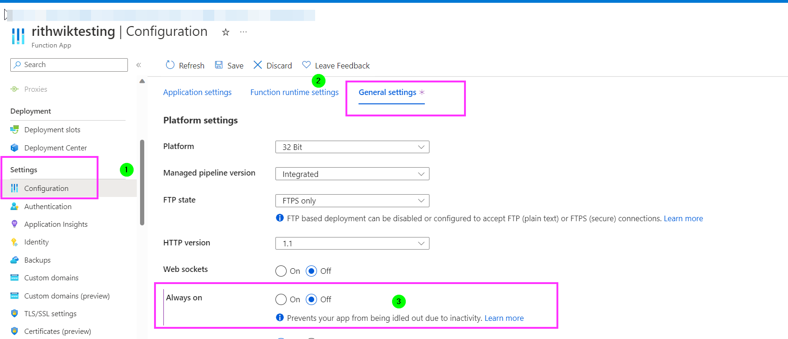
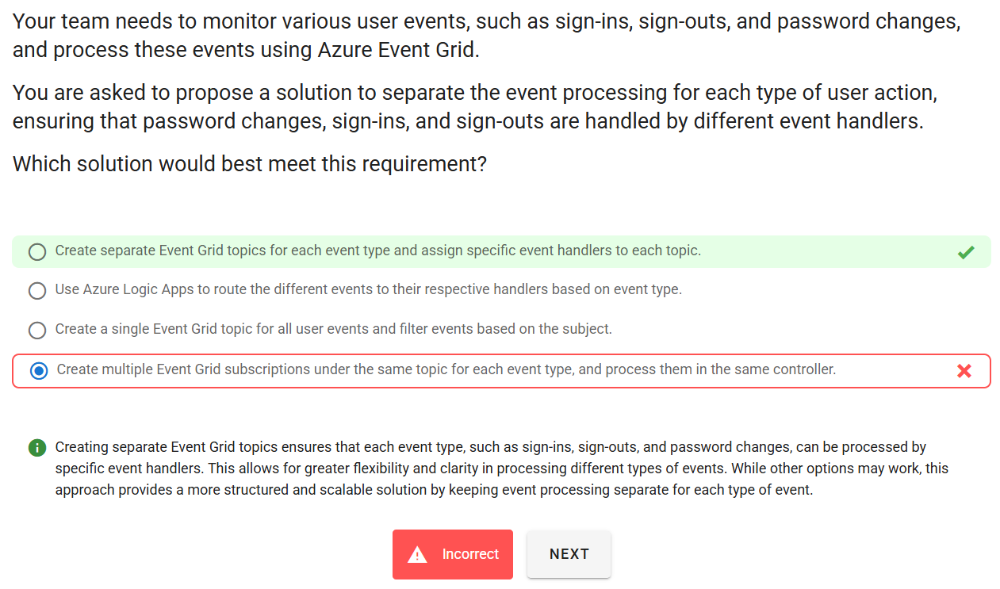

# 📋 Mock Exam 2

## ⁉️ Q1

  

---

> 👉🏻 **Explanation**  
> **✅ the answer:**  
> Implement **adaptive sampling using the Application Insights SDK**.
>
> **🤔 Why This Is the Best Answer:**
>
> - Adaptive sampling (via SDK) dynamically adjusts the rate of telemetry collection based on the application’s traffic load.
> - This ensures Application Insights only sends a manageable subset of telemetry when traffic spikes, keeping ingestion volume (and cost) under control while still maintaining statistical accuracy.
> - Since the requirement is to **not exceed a pre-set budget**, adaptive sampling is the most cost-effective solution.
>
> **❌ Why Other Options Are Wrong:**
>
> - _Ingestion sampling using the Azure portal_ → This is fixed-rate sampling at ingestion, less flexible and may still generate high cost during spikes.
> - _Adaptive sampling using the Azure portal_ → Not available; adaptive sampling must be configured in the **SDK**.
> - _Set a daily cap for the Application Insights instance_ → Caps stop data ingestion completely once the limit is reached, meaning you lose telemetry visibility for the rest of the day. Not suitable for reliable monitoring.
> - _Ingestion sampling using the Application Insights SDK_ → Fixed-rate sampling; doesn’t auto-adjust based on load, so it’s less efficient than adaptive sampling.

---

## ⁉️ Q2

  

---

> 👉🏻 **Explanation**
>
> 

>   
> 

---

## ⁉️ Q3

  

---

> 👉🏻 **Explanation**
>
> **✅ the answer:**  
> 👉 **Create separate Event Grid topics for each event type and assign specific event handlers to each topic.**
>
> **🤔 Why This Is the Best Answer:**
>
> - Separating Event Grid topics by event type (sign-ins, sign-outs, password changes) ensures **clear separation of concerns**.
> - Each topic can have its own subscribers/handlers, making the architecture **more scalable, flexible, and easier to maintain**.
> - Troubleshooting is easier: if a handler for sign-ins fails, it won’t affect password change events.
> - This design aligns with **best practices** in event-driven architecture where event categories should not be overloaded into a single topic unless necessary.
>
> **❌ Why Other Options Are Wrong:**
>
> - **Use Azure Logic Apps to route events** → Possible, but adds extra cost and unnecessary complexity compared to directly assigning handlers via topics.
> - **Create a single Event Grid topic and filter by subject** → Works, but filtering all in one topic leads to a **tightly coupled design**. Handlers might process irrelevant events before filtering, wasting compute and increasing noise.
> - **Multiple subscriptions under the same topic, handled in one controller** → This causes a **bottleneck** since all events go through the same controller. It reduces clarity and increases risk of mixing unrelated logic.

---
