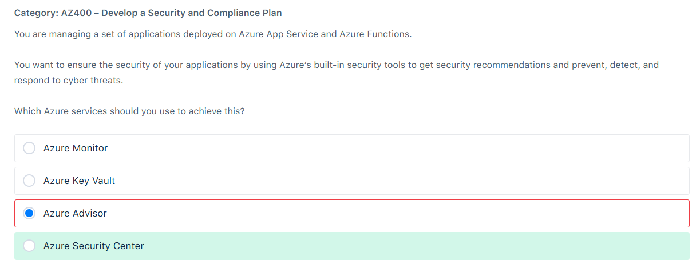

# 📋 Review Mode Diagnostic Test

## ⁉️ Q1

  

---

> 👉🏻 **Explanation**  
> The Security Center offers several controls to help minimize exposure to attacks. For example, Adaptive Application Controls use machine learning to recommend whitelisted applications, thereby blocking malware and other unwanted applications from running. Additionally, Just-in-Time VM Access helps protect against threats like brute force attacks by limiting access to virtual machine management ports only when necessary.
>
> It provides comprehensive security management and threat protection for all your Azure resources, including Azure App Service and Azure Functions. The Security Center continually monitors your resources, offers security recommendations, and helps detect, prevent, and respond to cyber threats.
>
> 

>   
> 

> Hence, the correct answer is: Azure Security Center.
>
> - The option that says: `Azure Advisor` is incorrect. While it provides recommendations to help you optimize your Azure resources for high availability, security, performance, and cost, it does not specialize in real-time threat detection and response.
>
> - The option that says: `Azure Monitor` is incorrect because this service is primarily focused on collecting, analyzing, and acting on telemetry data from your applications and infrastructure. It’s great for monitoring and diagnostics but not specifically for security threat management.
>
> - The option that says: `Azure Key Vault` is incorrect because this service is mainly designed to securely store and manage sensitive information such as keys, secrets, and certificates. It’s vital for securing access to your applications and protecting sensitive data, but it does not provide comprehensive security recommendations or threat detection.
>
> References:
>
> <https://azuremarketplace.microsoft.com/en-us/marketplace/apps/microsoft.azuresecuritycenter>
>
> <https://learn.microsoft.com/en-us/azure/defender-for-cloud/>
>
> Check out these Azure Security Services Cheat Sheets:
>
> <https://tutorialsdojo.com/azure-cheat-sheets-security-services/>

---
