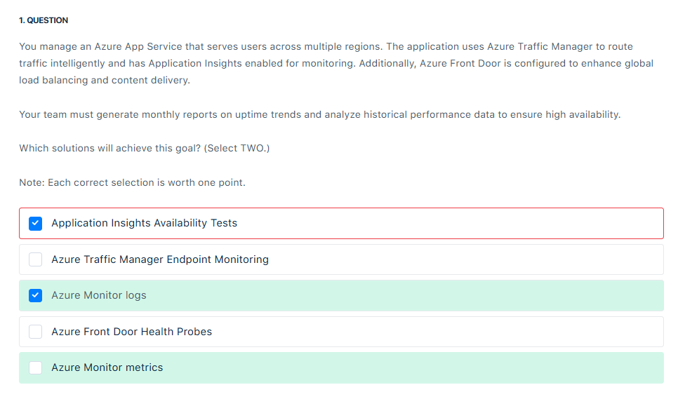
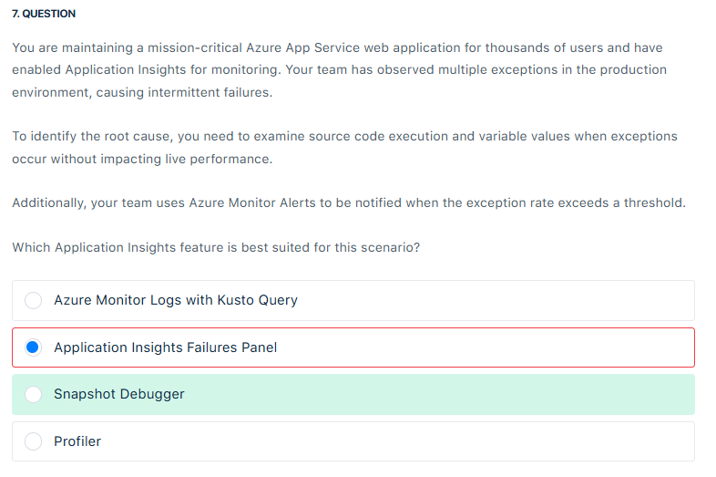
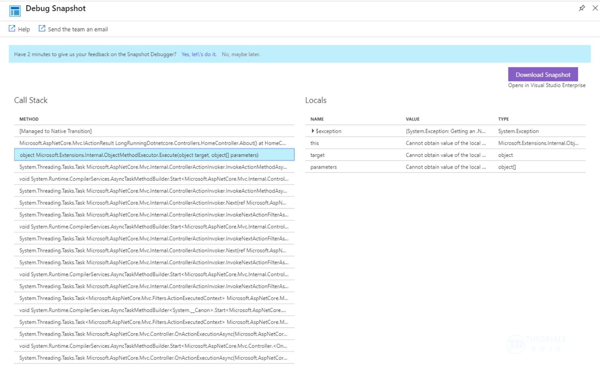
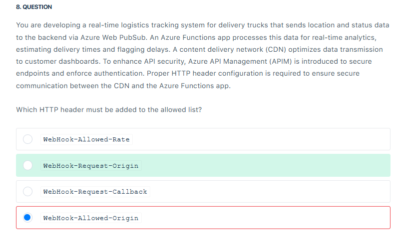
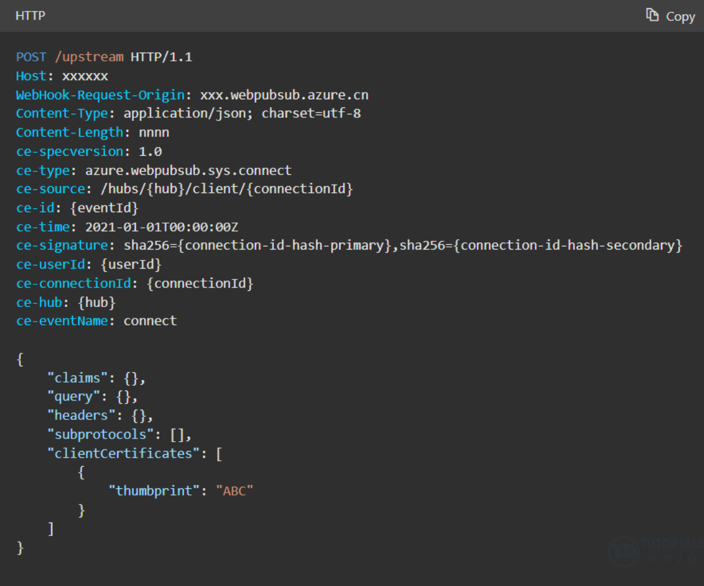

# 📋 Time Mode Diagnostic Test

## ⁉️ Q1

  

---

> 👉🏻 **Explanation**
>
> **✅ The Answer:**
>
> - **Azure Monitor Logs**
> - **Azure Monitor Metrics**
>
> ---
>
> **🤔 Why This Is the Best Answer:**
>
> - **Azure Monitor Logs** allow collection and analysis of telemetry data across resources. With Kusto Query Language (KQL), you can query historical logs to generate **monthly uptime reports** and analyze long-term performance patterns.
> - **Azure Monitor Metrics** provides real-time and near real-time numerical data on performance (CPU, memory, request counts, availability). These metrics can be stored, charted, and exported to show **uptime trends** over time.
>   Together, logs (deep analysis & history) and metrics (high-frequency measurements & trends) cover both **trend reporting** and **historical availability analysis**—exactly what the question requires.
>
> ---
>
> **❌ Why Other Options Are Wrong:**
>
> - **Application Insights Availability Tests:** Great for simulating user traffic and alerting on downtime, but they only check specific endpoints at intervals and are not designed for **long-term trend analysis** or **monthly uptime reporting**.
> - **Azure Traffic Manager Endpoint Monitoring:** Useful for health-based routing and ensuring endpoints are online, but it focuses on **real-time failover decisions**, not historical uptime/performance reporting.
> - **Azure Front Door Health Probes:** These are designed for load-balancing and real-time endpoint health checks. Like Traffic Manager, they don’t provide **historical data storage or analytical capability** needed for monthly reporting.
>
> 👉 So, only **Azure Monitor Logs** + **Azure Monitor Metrics** deliver the required **historical reporting and uptime trend analysis**.

---

## ⁉️ Q2

  

---

> 👉🏻 **Explanation**
>
> **✅ The Answer:**
>
> - **Snapshot Debugger**
>
> ---
>
> **🤔 Why This Is the Best Answer:**
> The **Snapshot Debugger** in Application Insights is designed exactly for this scenario:
>
> - It lets you capture snapshots of the application’s **state, variable values, and code execution flow** when exceptions occur in production.
> - Crucially, it does this **without impacting live performance**, which is critical for mission-critical apps serving thousands of users.
> - These snapshots help developers **pinpoint the root cause** of intermittent failures by showing what was happening in code at the time of error.
>
> ---
>
> 

>   
> 

>
> ---
>
> **❌ Why Other Options Are Wrong:**
>
> - **Azure Monitor Logs with Kusto Query:** Useful for querying telemetry and exception logs, but it won’t give you **detailed variable states or line-level code execution context**. It’s better for trend analysis and correlation, not root-cause debugging.
> - **Application Insights Failures Panel:** Helpful for identifying failure patterns, exception rates, and dependency issues, but it **summarizes failures** rather than showing the **exact code/variable state** when the failure happened.
> - **Profiler:** Focuses on performance bottlenecks (CPU, memory, latency) by sampling requests. It’s great for optimizing performance, but it does not provide **snapshots tied to exceptions** or variable inspection.
>
> 👉 Therefore, **Snapshot Debugger** is the only feature that directly satisfies the need to capture **execution details and variables during exceptions in production**.
>
> **References:**
>
> - <https://learn.microsoft.com/en-us/azure/azure-monitor/snapshot-debugger/snapshot-debugger-data>
> - <https://docs.azure.cn/en-us/azure-monitor/snapshot-debugger/snapshot-debugger-troubleshoot>

---

## ⁉️ Q3

  

---

> 👉🏻 **Explanation**
>
> **✅ The Answer:**
>
> - **WebHook-Request-Origin**
>
> ---
>
> **🤔 Why This Is the Best Answer:**
> When integrating Azure API Management (APIM) with webhooks or CDNs, APIM validates requests by checking the **origin of the request**. The correct header for this validation is **`WebHook-Request-Origin`**, which is part of the [Azure Event Grid/WebHook security model](https://learn.microsoft.com/en-us/azure/event-grid/security-authentication).
>
> - This ensures that only requests from trusted origins (e.g., the CDN) are allowed.
> - Adding `WebHook-Request-Origin` to the allowed list guarantees secure communication between the **CDN** and the **Azure Functions app** via APIM.
>
> ---
>
> **❌ Why Other Options Are Wrong:**
>
> - **WebHook-Allowed-Rate:** Not a valid security header. There’s no such header in webhook authentication—it doesn’t exist in APIM configuration.
> - **WebHook-Request-Callback:** This is used during the _handshake process_ where the subscriber confirms intent to receive events, not for ongoing request validation.
> - **WebHook-Allowed-Origin:** Looks similar but is incorrect—it’s not a real header. The valid one recognized by APIM is **`WebHook-Request-Origin`**, not `Allowed-Origin`.
>
> 👉 Therefore, the only correct header to whitelist for secure communication is **`WebHook-Request-Origin`**.
>
> ---
>
> 

>   
> 

>
> ---
>
> **References:**
>
> - <https://learn.microsoft.com/en-us/azure/azure-web-pubsub/howto-develop-eventhandler>
> - <https://learn.microsoft.com/en-us/azure/event-grid/end-point-validation-cloud-events-schema>

---
