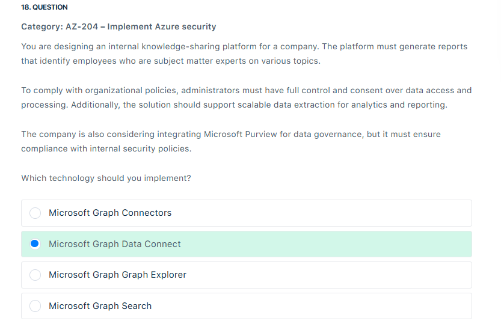

# 📋 Review Mode Set 1

## ⁉️ Q2

<div align="left">
  
</div>

---

> 👉🏻 **Explanation**
>
> **✅ The Answer:**
>
> - **List → Maintain a queue of tasks to process user-generated requests in the order they are received.**
> - **Channel → Implement a publish/subscribe mechanism for real-time notifications.**
> - **Set → Store unique user roles efficiently to prevent duplication.**
>
> ---
>
> **🤔 Why This Is the Best Answer:**
>
> Redis Provide a lot of data structure types each one for its specific purpose
>
> - **List** works like a queue (FIFO or LIFO), making it ideal for handling tasks sequentially in the order they were generated.
> - **Channel** enables a **pub/sub** model, perfect for broadcasting real-time notifications between distributed application components.
> - **Set** guarantees uniqueness, which is crucial for storing roles, tags, or IDs without duplicates.
>
> These match exactly with the question’s requirements for **queuing**, **real-time messaging**, and **role management**.
>
> ---
>
> **❌ Why Other Options Are Wrong:**
>
> - **Sorted Set:** While it supports ordered elements with scores (useful for leaderboards or priority queues), the scenario does not require scoring or ranking—only a simple task queue, which **List** handles better.
> - **Hash:** Useful for structured objects (e.g., user profiles with multiple fields), but it does not enforce uniqueness (like **Set**) or ordered task handling (like **List**), nor does it support messaging.
>
> 👉 Correct matches are **List, Channel, and Set**, not **Sorted Set** or **Hash**.
>
> References:
>
> - <https://learn.microsoft.com/en-us/azure/architecture/best-practices/caching>
> - <https://learn.microsoft.com/en-us/azure/azure-cache-for-redis/cache-overview>

---

## ⁉️ Q3

<div align="left">
  
</div>

---

> 👉🏻 **Explanation**
>
> **✅ The Answer:**
>
> - Active Directory Integrated authentication mode
>
> **📖 Explanation:**
>
> - Microsoft Entra ID provides centralized management for the identities of both individuals and services within your data estate. By integrating it with Azure SQL for authentication, you can streamline identity and access management while gaining enhanced conditional access controls and governance over all data connections.
> - To enable the Active Directory Integrated authentication mode, an on-premises Active Directory instance linked to Microsoft Entra ID in the cloud is required. Federation can be achieved using tools such as Active Directory Federation Services (AD FS).
> - With this mode, users signed in to a domain-joined machine can access Azure SQL data sources seamlessly without credential prompts. However, you cannot include a username and password in the connection string for .NET Framework applications. For .NET Core and .NET Standard applications, including a username in the connection string is optional. Additionally, the Credential property of the SqlConnection cannot be configured when using this mode.
>
> <div align="left">
>   
> </div>
>
> ---
>
> **❌ Why Other Options Are Wrong:**
>
> - **Active Directory Interactive authentication** is incorrect because it requires user interaction and prompts for authentication each time. This contradicts the requirement to minimize authentication prompts. It is typically used when Multi-Factor Authentication (MFA) is required.
>
> - **Microsoft Entra ID tokens** is incorrect because token-based authentication is primarily used for applications and services, not for direct user authentication through SSMS. It does not allow seamless authentication for users without manual intervention.
>
> - **SQL Server Authentication** is incorrect because it requires a username and password to be entered manually for every connection. It does not support integration with Microsoft Entra ID or on-premises Active Directory, making it unsuitable for the given requirements.
>
> ---
>
> 📚 **References:**
>
> - <https://learn.microsoft.com/en-us/azure/azure-sql/database/authentication-aad-overview?view=azuresql>
> - <https://learn.microsoft.com/en-us/sql/connect/ado-net/sql/azure-active-directory-authentication?view=sql-server-ver16#using-integrated-authentication>
> - <https://learn.microsoft.com/en-us/entra/identity/hybrid/connect/whatis-fed>

---

## ⁉️ Q4

<div align="left">
  
</div>

---

> 👉🏻 **Explanation**
>
> **✅ The Answer:**
>
> - `Telemetry.id`.
> - `Telemetry.Context.Operation.Id`.
>
> **📖 Explanation:**
>
> - When monitoring complex applications, especially those that interact with external services like payment gateways, **Telemetry.id** and **Telemetry.Context.Operation.Id** are crucial for ensuring comprehensive traceability and understanding the flow of requests.  
>   **Telemetry.id** uniquely identifies each telemetry item, providing a distinct reference for every event or dependency tracked within Application Insights. This allows you to pinpoint and analyze specific interactions with external services, such as the payment gateway. By associating each interaction with a unique ID, you can follow the lifecycle of a request through its various stages, helping you identify issues or delays in specific transactions. This granularity is significant in troubleshooting and debugging scenarios, as it allows you to track the exact flow of a transaction from start to finish.
> - **Telemetry.Context.Operation.Id** is equally important as it ties together multiple telemetry events under a single operation. In a distributed system, a single user request might involve multiple services. By using the Operation.Id, you can link these various components and track them as a unified operation. This property enables end-to-end tracing, allowing you to correlate telemetry across different services and gain insights into the overall performance of a user transaction. With this context, you can identify bottlenecks, measure service performance, and ensure that all system parts work harmoniously. In the case of a payment gateway interaction, Operation.Id allows you to tie the payment process back to the original user request, ensuring that you have a complete view of how the payment gateway fits into the broader application flow.
> - By combining **Telemetry.id** unique event tracking and **Telemetry.Context.Operation.Id**. For distributed tracing, Azure Application Insights offers a powerful mechanism to monitor, diagnose, and optimize applications that depend on external services. These properties provide the necessary context to understand the full scope of user interactions with external dependencies and help ensure that performance issues or failures are swiftly identified and addressed. This approach leads to better reliability, faster troubleshooting, and improved overall application health, particularly in systems where multiple services interact in complex workflows.
>
> ---
>
> **🧠 What Is Telemetry?**
>
> **Telemetry** just means: _“data your app sends about itself.”_
>
> Think of it like your app whispering:
>
> > “Hey, I just got a request.” 
> > “I called the payment gateway.” 
> > “Oops, something crashed.” 
> > “Here’s how long that SQL query took.”
>
> Application Insights collects these whispers and turns them into charts, logs, and maps.
>
> ---
>
> **🔍 Key Concepts in App Insights:**
>
> | Concept                  | What It Means                                                                |
> | ------------------------ | ---------------------------------------------------------------------------- |
> | **Request Telemetry**    | Tracks incoming HTTP requests to your app                                    |
> | **Dependency Telemetry** | Tracks outbound calls (SQL, HTTP, Service Bus, etc.)                         |
> | **Exception Telemetry**  | Captures errors and stack traces                                             |
> | **Trace Telemetry**      | Custom logs you write (e.g., `logger.LogInformation(...)`)                   |
> | **Operation.Id**         | Unique ID for a full transaction (e.g., placing an order)                    |
> | **ParentId**             | ID of the parent request (e.g., API call that triggered a SQL query)         |
> | **Telemetry.Id**         | ID of the individual telemetry item (e.g., one SQL call or one HTTP request) |
> | **Session.Id**           | Tracks user session across multiple requests (less useful for correlation)   |
>
> ---
>
> **🧭 Why This Matters for Distributed Systems:**
>
> In cloud-native apps, you often have:
>
> - Frontend → API → SQL + Payment Gateway + Service Bus → Azure Function
>
> You want to **correlate all those pieces** into one trace. That’s where:
>
> - `Operation.Id` = ties everything together
> - `ParentId` = shows who triggered what
> - `Telemetry.Id` = identifies each piece
> - `Session.Id` = tracks user behavior (not technical correlation)
>
> ---
>
> **🧠 In Your Quiz Scenario:**
>
> You’re integrating with a **third-party payment gateway**. To track that interaction and link it to the full order transaction, you need:
>
> ✅ `Telemetry.Context.Operation.Id` → links the payment call to the overall order  
> ✅ `Telemetry.Context.Operation.ParentId` → shows the API call that triggered the payment
>
> The selected answers (`Session.Id` and `Telemetry.Id`) aren’t wrong, but they’re **not ideal for correlation**:
>
> - `Session.Id` is more about user tracking
> - `Telemetry.Id` is just the ID of one telemetry item—not enough to link things together
>
> ---
>
> **🧠 Analogy:**
>
> Imagine you're tracking a pizza order:
>
> - `Operation.Id` = the whole order
> - `ParentId` = the call to the delivery service
> - `Telemetry.Id` = the delivery confirmation
> - `Session.Id` = the customer browsing history
>
> ---
>
> 📚 **References:**
>
> - <https://learn.microsoft.com/en-us/azure/azure-monitor/app/data-model-complete>
> - <https://learn.microsoft.com/en-us/azure/azure-monitor/app/transaction-search-and-diagnostics?tabs=transaction-search>

---

## ⁉️ Q5

<div align="left">
  
</div>

---

> 👉🏻 **Explanation**
>
> **✅ The Answer:**
>
> - **AppServiceEnvironmentPlatformLogs**
>
> **📖 Explanation:**
>
> - App Service Environments (ASE) host web applications in an isolated and highly scalable hosting environment. To track **configuration changes** at the ASE level, Azure Monitor provides **AppServiceEnvironmentPlatformLogs**, which record platform-level events such as configuration modifications, scaling operations, and infrastructure-related issues. These logs are essential for auditing and troubleshooting unexpected changes that affect compliance or stability.
>
> <div align="left">
>   
> </div>
>
> **🤔 Why This Is the Best Answer:**
>
> - The question specifically mentions unexpected **configuration modifications applied in the App Service Environment (ASE)**.
> - **AppServiceEnvironmentPlatformLogs** are designed to capture **platform-level events**, making them the correct source for identifying such changes.
> - This directly aligns with the requirement of monitoring **configuration changes for ASE** to ensure compliance and resolve issues.
>
> **❌ Why Other Options Are Wrong:**
>
> - **AppServiceAppLogs:** Captures application-level diagnostics such as errors, traces, and custom logs generated by the app itself. It does not track configuration changes to the ASE platform.
> - **AzureResourceChangesLogs:** Refers to Azure Resource Graph/Activity Logs that record create, update, and delete operations on Azure resources at the subscription level. While useful for auditing, it does not provide ASE-specific configuration change tracking.
> - **AzureDiagnosticsLogs:** These logs capture diagnostic data from different Azure resources, such as performance metrics or telemetry, but are not specialized for ASE platform configuration changes.
>
> **📚 References:**
>
> - [https://learn.microsoft.com/en-us/azure/azure-monitor/app/app-service-environment](https://learn.microsoft.com/en-us/azure/azure-monitor/app/app-service-environment)
> - [https://learn.microsoft.com/en-us/azure/azure-monitor/essentials/platform-logs-overview](https://learn.microsoft.com/en-us/azure/azure-monitor/essentials/platform-logs-overview)
> - <https://learn.microsoft.com/en-us/azure/app-service/troubleshoot-diagnostic-logs>
> - <https://learn.microsoft.com/en-us/azure/azure-monitor/reference/tables/appserviceenvironmentplatformlogs>
> - <https://learn.microsoft.com/en-us/azure/app-service/environment/using>

---

## ⁉️ Q8

<div align="left">
  
</div>

---

> 👉🏻 **Explanation**
>
> **✅ The Answer:**
>
> - **Use the Logic App Code View option in the Azure portal.**
>
> **📖 Explanation:**
>
> - When building enterprise integration solutions with automated workflows in Azure Logic Apps, the workflow definitions are described and validated using simple, declarative JSON and the Workflow Definition Language (WDL) schema. These formats are designed to be easily readable and understandable, even for those with minimal coding knowledge. To automate the creation and deployment of logic app resources, you can include workflow definitions as Azure resources in Azure Resource Manager templates. Logic apps can be created, managed, and deployed using Azure PowerShell, Azure CLI, or the Azure Logic Apps REST APIs.
> - To edit workflow definitions in JSON, you can use the code view editor in the Azure portal or Visual Studio Code. Additionally, you can copy and paste the definitions into any preferred editor.
> - In the Azure portal, Azure Logic Apps allows you to edit workflows either visually or programmatically. Once you open a logic app resource, navigate to the resource menu under “Developer” to choose between the Code view and the Designer view. Use the Designer view to visually create, edit, and execute your workflow. You can seamlessly switch between the Designer view and Code view whenever needed.
> - In Code view, you can directly modify the workflow definition file in JSON format. Remember to click Save to apply any changes you make in this mode.
>
> <div align="left">
>   
> </div>
>
> ---
>
> **❌ Why Other Options Are Wrong:**
>
> - **Delete the existing Logic App and create a new one with the updated logic:** is incorrect because this approach is inefficient and unnecessary. Deleting the Logic App results in the loss of execution history, logs, and connections, requiring a complete redeployment. Azure provides built-in editing capabilities that allow updates without creating a new instance.
>
> - **Modify the Logic App in the Azure portal using the Designer view:** is incorrect because while the Designer view enables workflow modifications, it does not offer full control over the workflow definition, especially for advanced customizations. Some configurations and complex logic adjustments can only be made using Code View.
>
> - **Export the Logic App as an ARM template, modify the workflow definition, and redeploy:** is incorrect because this method is primarily used for infrastructure as code (IaC) scenarios, such as managing Logic Apps through automation or version control. While valid for deployments, it is not the most efficient way to modify an existing Logic App instance, as it requires redeployment rather than direct in-place updates.

---

## ⁉️ Q11

<div align="left">
  
</div>

---

> 👉🏻 **Explanation**
>
> **✅ The Answer:**
>
> - **Use the Logic App Code View option in the Azure portal.**
>
> **📖 Explanation:**
>
> - The Traffic Manager does not handle caching or the distribution of static assets such as images, CSS, and JavaScript files. Its role is limited to routing traffic at the DNS level without directly serving content. In this scenario, the requirement emphasizes the need for an efficient solution to distribute static assets, minimizing server load and enhancing response times.

---

## ⁉️ Q13

<div align="left">
  
</div>

---

> 👉🏻 **Explanation**
>
> **✅ The Answer:**
>
> - **Object ID Claim (OID).**
>
> **📖 Explanation:**
>
> - Object ID Claim (OID) is a unique, permanent identifier assigned to each user within a Microsoft Entra ID tenant. This identifier consistently tracks and manages users across multiple applications and services within the same organization. Unlike other user attributes such as email addresses or usernames, the Object ID remains unchanged throughout the user’s lifecycle, even if other details like their name or contact information are updated. This makes the Object ID a reliable and immutable way to reference users securely within enterprise systems.
> - In authentication scenarios, the Object ID is typically included in the ID token issued by the Microsoft identity platform, ensuring that each user can be uniquely identified. This claim plays a key role in enabling secure access control, user tracking, and data management across a wide range of applications. Because it remains consistent and private to the tenant, the Object ID is an essential component for enterprises that require accurate user identification without the risk of changes or conflicts due to evolving user attributes.
>
> <div align="left">
>   
> </div>
>
> ---
>
> **❌ Why Other Options Are Wrong:**
>
> - **Tenant ID Claim (TID)** is incorrect because it is primarily used to identify the Microsoft Entra ID tenant to which a user belongs. While it’s useful for scenarios that require knowing which tenant a user is part of, it does not uniquely identify individual users. The Tenant ID helps identify the tenant context but is not intended for tracking users across services or applications within the tenant.
>
> - **User Principal Name (UPN):** is incorrect because it is typically used as a user’s login name, usually in the form of an email address. While the UPN is useful for authentication, it is not an immutable identifier. It can change if the user’s email address or domain changes, making it unsuitable for consistent user identification across multiple services or applications over time.
>
> - **Pairwise Pseudonymous Identifier (PPID):** is incorrect because it is used for privacy-preserving scenarios where a pseudonym is assigned to a user for interactions between applications. Although it provides a unique identifier for the user, it is typically used to protect user privacy across different applications. It is not intended for use as a permanent or immutable identifier. It is just useful in specific scenarios where user anonymity is required, rather than for consistently tracking users across services.
>
> ---
>
> 📚 References:
>
> - <https://learn.microsoft.com/en-us/entra/identity-platform/id-token-claims-reference>
> - <https://learn.microsoft.com/en-us/entra/identity-platform/access-token-claims-reference>

---

## ⁉️ Q14

<div align="left">
  
</div>

---

> 👉🏻 **Explanation**
>
> **✅ The Answer:**
>
> - Azure managed disk types: Premium SSD
> - Azure Storage Redundancy Type: ZRS (Zone-Redundant Storage)
>
> **📖 Explanation:**
>
> - Zone-redundant storage (ZRS) ensures your data is synchronously replicated across three Azure availability zones within the primary region. For applications that demand high availability, Microsoft advises utilizing ZRS in the primary region and implementing replication to a secondary region for added resilience.
> - ZRS is compatible only with Premium SSD and Standard SSD managed disks, but it does not support Premium SSD v2 managed disks. Additionally, force detach functionality is restricted to data disks only.
>
> ---
>
> **❌ Why Other Options Are Wrong:**
>
> - GRS (Geo-Redundant Storage) is incorrect because it replicates data across regions but does not provide automatic failover for managed disks, making it unsuitable for VM disks that need continuous availability.
> - RA-GRS (Read-Access Geo-Redundant Storage) is incorrect because it is typically used for storage accounts and blobs, not for Azure Managed Disks, and does not provide zone-level redundancy.
>
> ---
>
> 📚 References:
>
> - <https://learn.microsoft.com/en-us/azure/virtual-machines/disks-types>
> - <https://learn.microsoft.com/en-us/azure/storage/common/storage-redundancy>
> - <https://learn.microsoft.com/en-us/azure/virtual-machines/disks-redundancy>

---

## ⁉️ Q18

<div align="left">
  
</div>

---

> 👉🏻 **Explanation**
>
> **✅ The Answer:**
>
> - Microsoft Graph Data Connect.
>
> **📖 Explanation:**
>
> The scenario requires report generation to identify subject matter experts in a company while ensuring that administrators retain full control > over data access and consent. Microsoft Graph Data Connect is the best choice because:
>
> - It allows batch processing of Microsoft 365 data for advanced analytics.
> - It ensures strict data governance with administrative consent before data access.
> - It integrates with Azure Synapse Analytics and Azure Data Factory, making it ideal for large-scale reporting and insights generation.
>
> <div align="left">
>   
> </div>
>
> ---
>
> **❌ Why Other Options Are Wrong:**
>
> - **Microsoft Graph Search:** is incorrect because this is simply designed for querying indexed data within Microsoft 365 applications rather than extracting data for large-scale analytics. While it allows searching for users and documents, it does not support batch data extraction or administrative control over data access, making it unsuitable for this scenario.
> - **Microsoft Graph Connectors:** is incorrect because it only enables the integration of external data sources into Microsoft Graph Search, enhancing search results across Microsoft 365 applications. However, they do not facilitate large-scale data extraction or analytics from Microsoft 365, which is required for generating reports on subject matter experts.
> - **Microsoft Graph Graph Explorer:** is incorrect because it just is a developer tool used to interact with Microsoft Graph APIs. While it helps in testing and retrieving Microsoft 365 data, it is not intended for large-scale data processing or report generation. It lacks features for administrator control, bulk data extraction, and integration with analytics services.
>
> ---
>
> 📚 References:
>
> - <https://learn.microsoft.com/en-us/graph/data-connect-concept-overview>
> - <https://learn.microsoft.com/en-us/graph/data-connect-quickstart?tabs=AzureSynapsePipeline>

---

## ⁉️ Q21

<div align="left">
  
</div>

---

> 👉🏻 **Explanation**
>
> **✅ The Answer:**
>
> - Use Azure Blob Storage Change Feed to track all changes.
>
> **📖 Explanation:**
>
> - The change feed is designed to offer transaction logs for all changes made to blobs and their metadata in your storage account. It provides ordered, reliable, durable, unchangeable, and read-only logs of these updates. Applications can access these logs anytime, whether through streaming or batch processing. Each change results in a single transaction log entry, eliminating the need to handle duplicate entries for the same update. This functionality allows you to create cost-effective, efficient, and scalable solutions for processing change events in your Blob Storage account.
> - These logs can be processed asynchronously, either incrementally or in their entirety. Multiple client applications can independently access the change feed simultaneously, each operating at its own pace. Analytics tools like Apache Drill or Apache Spark can directly consume the logs as Avro files, enabling cost-effective, high-bandwidth processing without the need for custom applications.
>
> - Analytics logs capture records of all read, write, list, and delete operations, including both successful and failed requests. These logs operate on a best-effort basis and do not guarantee any specific order.
> - On the other hand, the change feed offers a transactional log of successful changes or mutations, such as blob creations, updates, and deletions within your account. It ensures that all events are logged and displayed in the exact order of successful changes for each blob. This eliminates the need to filter out noise from a huge volume of read operations or failed requests The change feed is specifically designed and optimized for application development scenarios where certain guarantees are essential.
> - To start capturing and recording changes, you need to enable the change feed on your storage account. If you want to stop capturing changes, simply disable it. You can manage this setup using Azure Resource Manager templates, the Azure Portal, or PowerShell.
> - Here are some important considerations to keep in mind when enabling the change feed:
>   - Each storage account has a single change feed for the blob service, with the records stored in the \$blobchangefeed container.
>   - Create, Update, and Delete changes are tracked only at the blob service level.
>   - The change feed logs all changes across available events in the account. Client applications can filter specific event types if needed.
>   - The change feed is supported only on standard general-purpose v2, premium block blob, and Blob storage accounts. Accounts with hierarchical namespace enabled aren’t currently supported. General-purpose v1 accounts aren’t eligible, but they can be upgraded to general-purpose v2 without downtime.
>
> <div align="left">
>   
> </div>
>
> ---
>
> **❌ Why Other Options Are Wrong:**
>
> - **Configure Azure Synapse Analytics to ingest blob transaction logs for auditing:** is incorrect because Azure Synapse is not primarily designed to capture detailed changes to blobs in real-time, making it unsuitable for auditing.
> - **Enable Azure Storage Analytics logs and configure them to capture blob transactions:** is incorrect because Azure Storage Analytics does not provide fine-grained event tracking and is focused more on usage and performance metrics than audit trails for blob changes.
> - **Enable soft delete and versioning in Azure Blob Storage to track all changes:** is incorrect because soft delete and versioning are only helpful for data protection recovery, they do not provide detailed event tracking and asynchronous processing needed for auditing changes.
>
> ---
>
> 📚 **References:**
>
> - <https://learn.microsoft.com/en-us/graph/data-connect-concept-overview>
> - <https://learn.microsoft.com/en-us/graph/data-connect-quickstart?tabs=AzureSynapsePipeline>

---

## ⁉️ Q21

<div align="left">
  
</div>

---

> 👉🏻 **Explanation**
>
> **✅ The Answer:**
>
> - Azure BlobFuse.
>
> **📖 Explanation:**
>
> - **Azure BlobFuse** is a virtual file system driver for Azure Blob Storage that enables Linux-based applications to mount Azure Blob Storage containers as local file systems. This allows applications to interact with blob storage using standard file system operations without requiring modifications to the application code.
>
> <div align="left">
>   
> </div>
>
> - Mount the Blob Storage Container
>   - Create a directory to serve as the mount point using this command:
>     - mkdir ~/blob_mount
>   - Mount the container using BlobFuse2:
>     - blobfuse2 mount ~/blob_mount --config-file=~/.blobfuse2/config.yaml
> - In the given scenario, the console application is Linux-based and interacts with Azure Blob Storage to upload and process image files. Some customer sites have phone-based internet connections, which may impact data transfer performance. By using Azure BlobFuse, the application can efficiently access and manage image files directly from blob storage, leveraging local file system semantics. This approach minimizes the need for extensive data downloads, which is beneficial, given the limited bandwidth at certain customer sites.
>
> ---
>
> 📚 **References:**
>
> - <https://learn.microsoft.com/en-us/azure/storage/blobs/blobfuse2-what-is>
> - <https://learn.microsoft.com/en-us/azure/storage/blobs/storage-how-to-mount-container-linux?tabs=RHEL>

---

## ⁉️ Q24

<div align="left">
  
</div>

---

> 👉🏻 **Explanation**
>
> **✅ The Answer:**
>
> - **Get-AzResource**
>
> **📖 Explanation:**
>
> - `Get-AzResource` is an Azure PowerShell command used to query and retrieve details about Azure resources, including virtual machines, storage accounts, and more. For VMs with **system-assigned managed identities**, this command returns metadata such as the **object ID**, which is required to configure access policies in services like **Azure Key Vault**.
>   By using `Get-AzResource`, administrators can efficiently pull identity-related attributes across multiple VMs to support **RBAC (role-based access control)** strategies and secure integrations with other Azure services.
>
> **🤔 Why This Is the Best Answer:**
>
> - The question asks specifically for retrieving the **object ID attribute** of system-assigned managed identities.
> - Only **Get-AzResource** provides detailed resource-level metadata, including the **identity object ID**.
> - This makes it the correct and most direct way to gather the needed identity information for **RBAC configurations**.
>
> **❌ Why Other Options Are Wrong:**
>
> - **Get-AzResourceProvider:** Lists registered Azure resource providers within a subscription. It shows which resource types are available but does **not return identity attributes** of resources.
> - **Get-AzResourceLock:** Retrieves information about resource locks (used to prevent deletion/modification). It does **not expose identity object IDs**.
> - **Get-AzProviderFeature:** Returns preview or feature flags of resource providers. It is unrelated to resources or managed identities and thus irrelevant for this scenario.
>
> ---
>
> **📚 References:**
>
> - [https://learn.microsoft.com/en-us/powershell/module/az.resources/get-azresource?view=azps-13.3.0](https://learn.microsoft.com/en-us/powershell/module/az.resources/get-azresource?view=azps-13.3.0)
> - [https://learn.microsoft.com/en-us/cli/azure/resource?view=azure-cli-latest](https://learn.microsoft.com/en-us/cli/azure/resource?view=azure-cli-latest)

---

## ⁉️ Q32

<div align="left">
  
</div>

---

> 👉🏻 **Explanation**
>
> **✅ The Answer:**
>
> - "Create an Azure Function App with an Azure Blob Storage trigger and host it on an App Service Plan for file processing."
>
> **📖 Explanation:**
>
> - The Blob storage trigger activates a function whenever it detects a new or updated blob, passing the blob’s contents as input to the function. This will ensure that the function reacts immediately to file uploads, without waiting for a scheduled check or an HTTP request.
> - The App Service Plan keeps the function app always warm and ready to process requests without the initial startup delay. This is more suitable for low-latency requirements than the Consumption Plan, which can experience cold starts when the app is idle.
>
> <div align="left">
>   
> </div>

---

## ⁉️ Q33

<div align="left">
  
</div>

---

> 👉🏻 **Explanation**
>
> **✅ The Answer:**
>
> <div align="left">
>   
> </div>

---

## ⁉️ Q33

<div align="left">
  
</div>

---

> 👉🏻 **Explanation**
>
> **✅ The Answer:**
>
> - resetRedemption
>
> <div align="left">
>   
> </div>
>
> ---
>
> **📖 Explanation:**
>
> - There may be situations where updating a user’s sign-in information becomes necessary, such as:
>
>   - When the user wants to sign in with a different email address and identity provider.
>   - If the user’s account in their home tenant has been deleted and then recreated.
>   - When the user has joined a different company but still requires access to your resources.
>   - If the user’s responsibilities have been transferred to someone else.
>
> - Previously, managing these scenarios required manually removing the guest user’s account from your directory and reinviting them. However, you can now utilize the Microsoft Entra admin center, PowerShell, or the Microsoft Graph invitation API to reset the user’s redemption status and reinvite them, all while retaining their object ID, group memberships, and app assignments.
> - resetRedemption – Resets a user’s redemption status and re-sends an invitation while preserving their user identifier, group memberships, and app assignments. This feature allows the user to sign in with a different email address than the one used in the original invitation. When set to true, the invitedUser/id relationship must be specified.
>
> ---
>
> **📚 References:**
>
> - <https://learn.microsoft.com/en-us/graph/api/resources/invitation?view=graph-rest-1.0>
> - <https://learn.microsoft.com/en-us/entra/external-id/reset-redemption-status>

---

## ⁉️ Q38

<div align="left">
  
</div>

---

> 👉🏻 **Explanation**
>
> **✅ The Answer:**
>
> 1. The compute instance – The change feed processor monitors and detects updates.
> 2. The delegate – The code specifies how each batch of changes from the change feed processor should be handled.
> 3. The monitored container – The change feed is generated from stored data, capturing any inserts and updates as they occur.
> 4. The lease container – State storage manages change feed processing across multiple workers and can be stored in the same or a separate account.
>
> <div align="left">
>   
> </div>
>
> ---
>
> **📚 References:**
>
> - <https://learn.microsoft.com/en-us/azure/cosmos-db/nosql/change-feed-processor?tabs=dotnet>
> - <https://learn.microsoft.com/en-us/azure/cosmos-db/change-feed>

---

## ⁉️ Q39

<div align="left">
  
</div>

---

> 👉🏻 **Explanation**
>
> **✅ The Answer:**
>
> - **Configure the `indexingMode` to `consistent`.**
>
> **📖 Explanation:**
> In Azure Cosmos DB, the **indexing mode** determines how the database updates indexes when documents are created, updated, or deleted.
>
> - Setting `indexingMode` to **consistent** ensures that the index is updated synchronously with every write operation. This guarantees that queries always reflect the latest data without delay.
> - This is the correct configuration when you require **real-time query accuracy** and cannot afford query results that lag behind recent writes.
>
> **📚 References:**
>
> - [https://learn.microsoft.com/en-us/azure/cosmos-db/index-policy](https://learn.microsoft.com/en-us/azure/cosmos-db/index-policy)
> - [https://learn.microsoft.com/en-us/azure/cosmos-db/index-overview](https://learn.microsoft.com/en-us/azure/cosmos-db/index-overview)

---

## ⁉️ Q41

<div align="left">
  
</div>

---

> 👉🏻 **Explanation**
>
> **✅ The Answer:**
>
> - **Use publisher policies to assign permissions to each branch based on a unique identifier.**
>
> **📖 Explanation:**
> Azure Event Hubs supports **publisher policies**, which allow you to manage permissions for multiple event publishers. Each publisher is assigned a **unique identifier** that is tied to its **Shared Access Signature (SAS) token**. This ensures that each branch can only publish its own events and cannot interfere with or access data from other branches. This approach also makes it easier to onboard new branches securely and quickly since you only need to generate a new publisher policy with its unique identifier.
>
> **🤔 Why This Is the Best Answer:**
>
> - The requirement is not only about separating data but also about ensuring **secure publishing per branch**.
> - Publisher policies provide **fine-grained authentication and authorization** for each event publisher, meeting the security requirement.
> - It also scales well, since adding new branches is as simple as issuing new SAS tokens mapped to unique publisher identities.
>
> **❌ Why Other Options Are Wrong:**
>
> - **Use partitions to separate the data by branch:** Partitions control **data distribution and throughput**, not security. Any publisher with access could still write to multiple partitions, so this does not meet the isolation and security requirement.
> - **Set up role-based access control (RBAC) for branches at the Event Hub level:** RBAC works at the **resource level** (e.g., Event Hub namespace or hub). It does not provide per-branch isolation or unique identifiers for publishers.
> - **Use Azure Virtual Networks to isolate branches:** VNETs isolate network access, but they cannot enforce **per-branch event publishing permissions** within Event Hubs. This only protects at a networking level, not at the **publisher identity** level.
>
> **📚 References:**
>
> - [https://learn.microsoft.com/en-us/azure/event-hubs/event-hubs-about](https://learn.microsoft.com/en-us/azure/event-hubs/event-hubs-about)
> - [https://learn.microsoft.com/en-us/azure/event-hubs/event-hubs-features](https://learn.microsoft.com/en-us/azure/event-hubs/event-hubs-features)

---

## ⁉️ Q42

<div align="left">
  
</div>

---

> 👉🏻 **Explanation**
>
> **✅ The Answer:**
>
> - ✅ **Call the managed identity endpoint and retrieve an access token within the VM using Azure PowerShell.**
> - ✅ **Use the application code running on the VM to call the Key Vault API using an access token.**
>
> ---
>
> **📖 Explanation:**  
> When you enable a **system-assigned managed identity** for an Azure VM, Azure automatically creates a secure identity in Entra ID for that VM. This identity can request OAuth 2.0 tokens from the **Managed Identity endpoint** (also called the Instance Metadata Service - IMDS). The workflow is:
>
> 1. The **VM’s managed identity** requests a token from the local endpoint (IMDS: `http://169.254.169.254/metadata/identity/oauth2/token`).
> 2. This endpoint returns a valid access token **for the resource you specify** (in this case, `https://vault.azure.net`).
> 3. Your application then uses that token to call **Azure Key Vault APIs** without needing secrets or SAS tokens.
>
> You don’t have to run PowerShell inside your application. The PowerShell option in the exam is just one way of **manually testing** the flow (e.g., an admin can retrieve the token using PowerShell). But in a **real app**, you would use SDKs or REST calls.
>
> ---
>
> **🤔 Why the two correct answers are best:**
>
> - **Call the managed identity endpoint with PowerShell:** This validates that the managed identity is working and shows how to retrieve the token manually (good for admin testing/troubleshooting).
> - **Use application code with access token:** This is the _real implementation_—your application running inside the VM calls the Key Vault API with the retrieved access token.
>
> ---
>
> **❌ Why your second guess (User Delegation SAS) is wrong:**
>
> - A **user delegation SAS** applies only to **Azure Storage (Blobs)**, not Key Vault. It is completely irrelevant here. Key Vault only works with **Azure AD tokens**, not SAS tokens.
>
> ---
>
> **💡 Real Developer Implementation Example:**
> Instead of PowerShell, your application typically uses the **Azure SDK**:
>
> Python example:
>
> ```python
> from azure.identity import ManagedIdentityCredential
> from azure.keyvault.secrets import SecretClient
>
> # Use managed identity to authenticate
> credential = ManagedIdentityCredential()
>
> # Connect to Key Vault
> vault_url = "https://<your-keyvault-name>.vault.azure.net/"
> client = SecretClient(vault_url=vault_url, credential=credential)
>
> # Get a secret
> secret = client.get_secret("MySecretName")
> print(secret.value)
> ```
>
> C# example:
>
> ```csharp
> using Azure.Identity;
> using Azure.Security.KeyVault.Secrets;
>
> // Use managed identity to authenticate
> var credential = new DefaultAzureCredential();
> var client = new SecretClient(new Uri("https://<your-keyvault-name>.vault.azure.net/"), credential);
>
> // Get secret
> KeyVaultSecret secret = client.GetSecret("MySecretName");
> Console.WriteLine(secret.Value);
> ```

---

## ⁉️ Q43

<div align="left">
  
</div>

---

> 👉🏻 **Explanation**
>
> **✅ The Answer:**
>
> - **Use Application Groups in Azure Event Hubs to define different throttling policies for each system.**
>
> ---
>
> **📖 Explanation:**
>
> 🔹 **Application Groups in Event Hubs**
> An **Application Group** is a feature in **Event Hubs Premium and Dedicated tiers** that allows fine-grained control of **throttling policies per application (or per system)**.
>
> - You can assign **publishers (systems like web servers, DB servers, app servers)** to an application group.
> - You define **throttling policies** for each group, such as:
>
>   - Max number of events per second
>   - Max throughput (MB/s)
>   - Connection limits
>
> - This ensures one system does not overwhelm Event Hub or starve others of resources.
>
> It’s basically like setting a **custom bandwidth/throughput quota per system**.
>
> ---
>
> **🤔 Why This Is the Best Answer:**
> The requirement says:
>
> - Each system (web servers, DB servers, etc.) must have its **own throttling policy**.
> - Event Hubs Premium tier supports **Application Groups**, which are explicitly designed for this scenario.
> - Application Groups allow defining **different policies per system**, ensuring fair resource usage and avoiding noisy-neighbor problems.
>
> ---
>
> **❌ Why Other Options Are Wrong:**
>
> - **Use Azure Functions to implement custom throttling before sending data:** This adds unnecessary complexity and cost. Event Hubs already supports built-in throttling through Application Groups.
> - **Create separate Event Hub namespaces for each system:** This would work but is costly and inefficient, and does not scale well compared to Application Groups.
> - **Use different consumer groups for each system:** Consumer groups only define how events are read, not how producers are throttled. This does nothing for controlling ingestion throttling.
>
> ---
>
> **📚 References:**
>
> - [Azure Event Hubs Overview](https://learn.microsoft.com/en-us/azure/event-hubs/event-hubs-about)
> - [Application Groups in Azure Event Hubs](https://learn.microsoft.com/en-us/azure/event-hubs/application-groups)

---

## ⁉️ Q50 - Q51

<div align="left">
  
</div>

<div align="left">
  
</div>

---

> 👉🏻 **Explanation**
>
> 🟦 Scenario Recap
>
> You’re building a **distributed event-driven system** using **Azure Event Grid**.
> Requirements:
>
> 1. Events must be routed to **thousands of endpoints** (scale).
> 2. Each organization should receive **only its relevant events**.
> 3. The system must publish **all events through a single endpoint** (simplify ingestion).
> 4. Authentication & authorization must be enforced with **Microsoft Entra ID**.
>
> ---
>
> ❌ Solution 1: Multiple Individual Custom Topics (One per Org)
>
> **Proposed Idea**
>
> - Create **one Event Grid custom topic per organization**.
> - Publisher sends events to the appropriate topic.
> - Each org subscribes to its own topic.
> - Use Entra ID for authentication.
>
> **✅ Pros**
>
> - Each org receives only the events meant for them.
> - Security and access control are straightforward (per topic).
>
> **❌ Cons**
>
> - **Breaks requirement #3** → Publisher must send events to **many endpoints** (Topic A, Topic B, Topic C...).
> - Adds complexity: publisher logic must decide which topic to send to.
> - Harder to scale and maintain when there are thousands of organizations.
>
> **👉 Verdict**: Does **NOT** meet the requirements.
> This matches the exam’s **Question 51 (Answer = No).**
>
> ---
>
> ✅ Solution 2: Event Grid Domain with Custom Topics
>
> **Proposed Idea**
>
> - Create **an Event Grid Domain**.
> - Publisher sends all events to the **single domain endpoint**.
> - Inside the domain, define **custom topics** for each organization.
> - Each org subscribes only to its **own topic**.
> - Entra ID secures topic-level access.
>
> **✅ Pros**
>
> - **Meets all requirements**:
>
>   - One publisher endpoint (requirement #3 ✅).
>   - Thousands of subscribers supported (requirement #1 ✅).
>   - Each org gets only its events (requirement #2 ✅).
>   - Entra ID authentication & authorization (requirement #4 ✅).
>
> - Publisher doesn’t need logic for routing — Event Grid handles it.
>
> **❌ Cons**
>
> - Slightly more advanced setup compared to individual topics.
>
> **👉 Verdict**: Meets all requirements.
> This matches the exam’s **Question 50 (Answer = Yes).**
>
> ---
>
> 🎯 Visual Comparison (Mermaid)
>
> ```mermaid
> ---
> config:
>   elk:
>     mergeEdges: false
> ---
> flowchart TD
>     subgraph Correct: Event Grid Domain
>         P2[Publisher] --> D[Event Grid Domain - Single Endpoint]
>         D --> T1A[Custom Topic A] --> OrgA
>         D --> T2B[Custom Topic B] --> OrgB
>         D --> T3C[Custom Topic C] --> OrgC
>     end
> ```
>
> ```mermaid
> ---
> config:
>   elk:
>     mergeEdges: false
> ---
> flowchart TD
>     subgraph Wrong: Multiple  Topics
>         P1[Publisher] -->|Event Type A| T1[Custom Topic A]
>         P1 -->|Event Type B| T2[Custom Topic B]
>         P1 -->|Event Type C| T3[Custom Topic C]
>         T1 --> OrgA
>         T2 --> OrgB
>         T3 --> OrgC
>     end
> ```
>
> ---
>
> 📝 Final Summary
>
> - **Solution 1 (Multiple Custom Topics)** → ❌ Fails because it requires multiple publisher endpoints.
> - **Solution 2 (Event Grid Domain with Custom Topics)** → ✅ Works perfectly, meets **all four requirements**.

---
