# 📋 Review Mode Set 2

## ⁉️ Q3

<div align="left">
  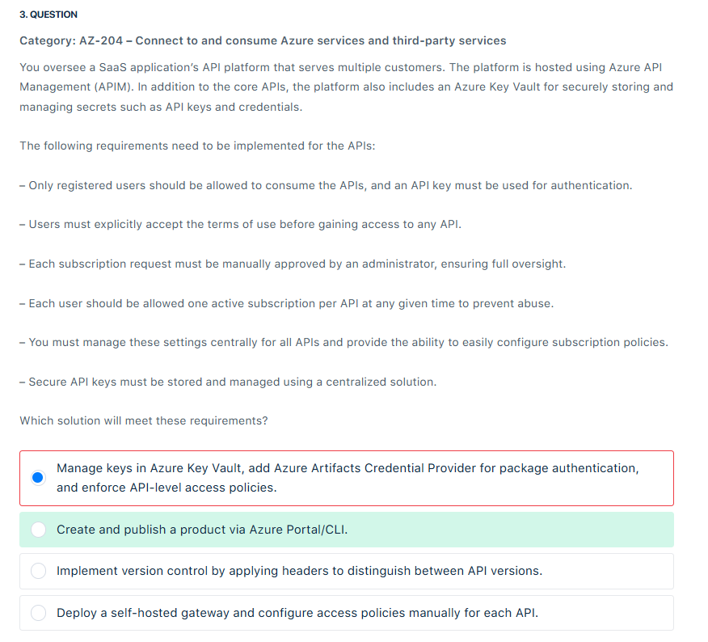
</div>

---

> 👉🏻 **Explanation**
>
> **✅ The Answer:**
>
> - **Create and publish a product via Azure Portal/CLI.**
>
> ---
>
> **📖 Explanation:**  
> In **Azure API Management (APIM)**, the best way to enforce subscription workflows, approvals, and central policies is through **Products**.
>
> - A **Product** groups one or more APIs and applies **terms of use, subscription requirements, and approval workflows**.
> - Admins can configure:
>
>   - **Subscription approval** (manual or automatic).
>   - **Terms of use acceptance** (users must agree before subscribing).
>   - **One subscription per API or product per user**.
>   - **API key authentication** (automatically issued to subscribers).
>
> - Centralized subscription management ensures that all APIs share consistent security and usage rules.
> - While Key Vault is excellent for secret storage, APIM already **integrates subscription key handling natively** — you don’t need to bolt on Azure Artifacts or Key Vault for this scenario.
>
> ---
>
> **🤔 Why This Is the Best Answer:**
> Because the requirements explicitly describe **APIM subscription/product features** (terms of use, approval, per-user subscription limits, API key enforcement). These map directly to **APIM Product functionality** — not Key Vault, not versioning, and not self-hosted gateways.
>
> ---
>
> **❌ Why Other Options Are Wrong:**
>
> - **Manage keys in Azure Key Vault, add Azure Artifacts Credential Provider…**
>
>   - Wrong because Key Vault stores secrets, but it doesn’t enforce **APIM subscription policies** like approval, terms of use, or per-user limits. Azure Artifacts is unrelated here.
>
> - **Implement version control by applying headers…**
>
>   - This only manages **API versions**, not subscriptions, policies, or key management. Irrelevant to the scenario.
>
> - **Deploy a self-hosted gateway and configure access policies manually…**
>
>   - Self-hosted gateways extend APIM to private/hybrid environments, but they don’t provide the **central subscription approval, terms of use, or per-user restrictions** needed. This adds complexity without solving the problem.
>
> ---
>
> **📚 References:**
>
> - [Azure API Management – Products](https://learn.microsoft.com/en-us/azure/api-management/api-management-howto-add-products)
> - [Azure API Management subscriptions and keys](https://learn.microsoft.com/en-us/azure/api-management/api-management-subscriptions)

---

## ⁉️ Q6

<div align="left">
  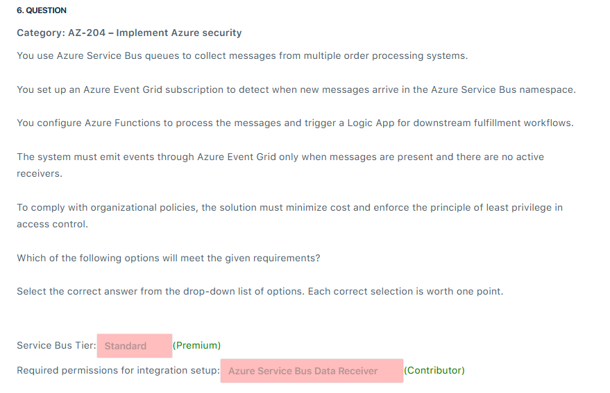
</div>

---

> 👉🏻 **Explanation**
>
> 📌 Question Breakdown
>
> - You’re using **Service Bus queues** for order messages.
> - You want **Event Grid notifications** when new messages arrive.
> - Processing is done by **Azure Functions + Logic Apps**.
> - Requirements:
>
>   1. **Emit events only when messages exist & no active receivers** (✅ Event Grid does this).
>   2. **Minimize cost** (Standard tier is cheaper than Premium).
>   3. **Least privilege** (don’t assign overly broad roles like Contributor).
>
> ---
>
> ✅ Correct Answers
>
> - Service Bus Tier → Premium
> - Permissions → Contributor
>
> ---
>
> **🤔 Why This Is the Best Answer:**
>
> 1. **Tier (Standard vs Premium)**
>
>    - **Fact:**
>
>      - Event Grid **integration with Service Bus events** (like `ActiveMessagesAvailableWithNoListeners`) is **NOT available in Basic or Standard**.
>      - Those advanced system events are **only supported in Premium tier**.
>
>    ➡️ So your source is correct here:  
>    👉 **Premium is required**, not Standard.
>
> 2. **Role (Data Receiver vs Contributor)**
>
>    - **Azure Service Bus Data Receiver**
>
>      - Allows apps to **read messages** from queues/subscriptions.
>      - Does **not allow configuring Event Grid subscriptions**.
>
>    - **Contributor**
>
>      - Has permission to **create/update/manage resources**, including **wiring up Event Grid subscriptions on Service Bus**.
>      - This is required in the scenario because you need to configure Event Grid integration.
>
>    ➡️ So again your source is correct here:  
>    👉 **Contributor** is required to set up Event Grid integration.
>
> ---
>
> **📚 References:**
>
> - <https://learn.microsoft.com/en-us/azure/service-bus-messaging/service-bus-messaging-overview>
> - <https://learn.microsoft.com/en-us/azure/service-bus-messaging/service-bus-to-event-grid-integration-concept?tabs=event-grid-event-schema>

---

## ⁉️ Q8

<div align="left">
  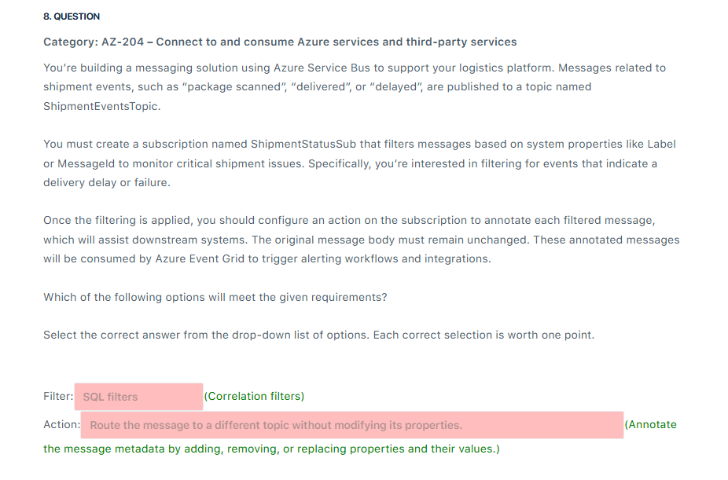
</div>

---

> 👉🏻 **Explanation**
>
> 📌 Question Breakdown
>
> You need a subscription (`ShipmentStatusSub`) on a topic (`ShipmentEventsTopic`) that:
>
> 1. Filters shipment messages by **system properties** like `Label` or `MessageId`.
> 2. Annotates filtered messages (changes metadata, not body) before downstream systems consume them.
> 3. Keeps the **original body unchanged** (so only metadata can be altered).
>
> ---
>
> 🟢 Step 1 – Choosing the Filter
>
> - **Correlation Filter**
>
>   - Used for **equality matches** on system properties (like `Label`, `MessageId`, `CorrelationId`).
>   - Lightweight and best when you know the property name + value you want to match.
>
> - **SQL Filter**
>
>   - Used for **more complex conditions** (SQL-like syntax: `<`, `>`, `LIKE`, multiple properties).
>
> ➡️ Since the question explicitly says **system properties like `Label` or `MessageId`**, the best choice is:  
> ✅ **Correlation filter**
>
> ---
>
> 🟢 Step 2 – Choosing the Action
>
> - **Route to another topic**
>
>   - Just sends the message elsewhere, doesn’t annotate metadata. ❌
>
> - **Annotate with metadata (add/remove/replace properties)**
>
>   - Allows you to **add custom metadata properties** or modify system/application properties, while leaving the **body unchanged**.
>   - Exactly what the scenario requires for downstream Event Grid alerts.
>
> ➡️ The right choice is:  
> ✅ **Annotate the message metadata by adding, removing, or replacing properties and their values**
>
> ---
>
> ✅ Final Answer
>
> - **Filter** → Correlation filters
> - **Action** → Annotate the message metadata by adding, removing, or replacing properties

---

## ⁉️ Q9

<div align="left">
  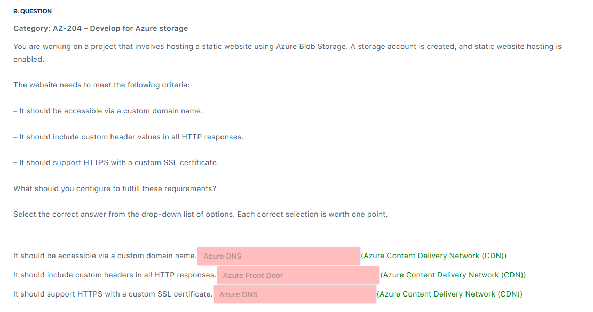
</div>

---

> 👉🏻 **Explanation**
>
> ❓ **Question Summary:**
>
> You’re hosting a static site in **Azure Blob Storage**. Requirements are:
>
> 1. Accessible via a **custom domain name**.
> 2. Add **custom headers** to all HTTP responses.
> 3. Support **HTTPS with a custom SSL certificate**.
>
> ---
>
> ✅ **Correct Answers:** (All: Azure CDN)
>
> - **Custom domain name** → ✅ Azure Content Delivery Network (CDN)
> - **Custom headers in HTTP responses** → ✅ Azure Content Delivery Network (CDN)
> - **Custom SSL certificate** → ✅ Azure Content Delivery Network (CDN)
>
> ---
>
> 📖 **Explanation:**
>
> Azure Blob Storage static websites **by themselves**:
>
> - Support only HTTPS with the `*.blob.core.windows.net` domain.
> - Do **not** support direct custom domains + SSL unless integrated with **Azure CDN** or **Front Door**.
> - Do **not** support injecting **custom headers** in HTTP responses.
>
> By fronting the storage account with **Azure CDN**, you unlock:
>
> - ✅ **Custom domains** (CNAME mapping to the CDN endpoint).
> - ✅ **Custom headers** injection through CDN rules engine.
> - ✅ **Custom SSL certificates** (bring-your-own cert or use Azure-managed certs).
>
> ---
>
> 🤔 **Why This Is the Best Answer:**
>
> - **Azure CDN** provides all three capabilities in a single solution: custom domain mapping, HTTPS with SSL, and header rewriting.
> - **Front Door** also supports these, but in the exam context, the more common match with **Blob Storage static site hosting** is **Azure CDN** (especially when talking about adding headers in responses).
>
> ---
>
> ❌ **Why Other Options Are Wrong:**
>
> - **Azure DNS** → Only resolves domains, does not handle SSL or headers.
> - **Azure Front Door** → Could work (supports custom domain, SSL, headers), but here the expected exam answer is **Azure CDN**, which integrates seamlessly with static websites in storage.
> - **Blob Storage alone** → Can’t inject headers, can’t serve custom SSL on custom domains.
>
> ---
>
> 📚 **References:**
>
> - [Azure Storage static website hosting](https://learn.microsoft.com/en-us/azure/storage/blobs/storage-blob-static-website)
> - [Azure CDN rules engine (headers, redirects, caching)](https://learn.microsoft.com/en-us/azure/cdn/cdn-rules-engine)
> - [Azure CDN custom domain & SSL](https://learn.microsoft.com/en-us/azure/cdn/cdn-custom-ssl)

---

## ⁉️ Q13

<div align="left">
  
</div>

---

> 👉🏻 **Explanation**
>
> - The Consumption hosting plan best fits event-driven workloads like a timer trigger. It automatically scales to accommodate the demand and charges based on the execution time, making it the most cost-efficient for your timer-triggered function. This hosting plan is ideal for executing functions based on the TimeSpan interval.
> - The host.json file is used to configure the timer trigger in Azure Functions. This file allows you to set the TimeSpan that dictates the function’s execution schedule. You would specify the schedule in a cron-like expression inside the host.json file, making it the most appropriate method to configure the timer-triggered schedule.
>
> <div align="left">
>   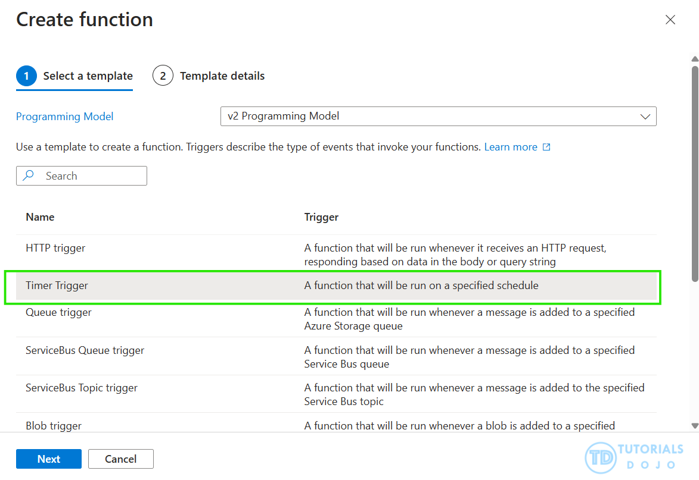
> </div>

---

## ⁉️ Q19

<div align="left">
  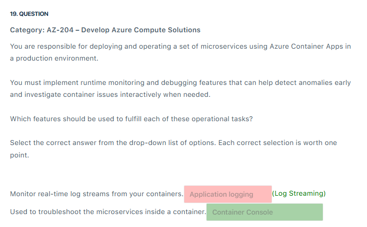
</div>

---

> 👉🏻 **Explanation**
>
> **❓ Question Recap**
>
> You’re running **Azure Container Apps** and need:
>
> 1. **Monitor real-time log streams** from containers.
> 2. **Troubleshoot inside a container** interactively.
>
> ---
>
> **✅ Correct Features**
>
> - **Monitor real-time log streams** → **Log Streaming**
> - **Troubleshoot inside a container** → **Container Console**
>
> ---
>
> **📖 Why?**
>
> **🔹 Log Streaming**
>
> - Shows **stdout** and **stderr** logs in real-time.
> - Useful during **deployments, debugging, and performance testing**.
> - Eliminates delays (you don’t wait for logs to be exported into Log Analytics or Storage).
> - Think of it as: `tail -f` for your container logs.
>
> ---
>
> **🔹 Container Console**
>
> - Provides an **interactive shell** into the running container.
> - Lets you:
>
>   - Run commands
>   - Inspect environment variables
>   - Check file system/network
>   - Debug microservices directly in runtime context
>
> - This is the “live troubleshooting mode” you use when logs aren’t enough.
>
> ---
>
> ❌ Why Not Other Options?
>
> - **Application Logging** → General logging mechanism; not real-time, not interactive.
> - **Azure Monitor Alerts** → Only alerts when thresholds are hit; no real-time or shell access.
> - **Log Analytics** → Great for querying historic logs, but not live streaming or interactive debugging.

---

## ⁉️ Q23

<div align="left">
  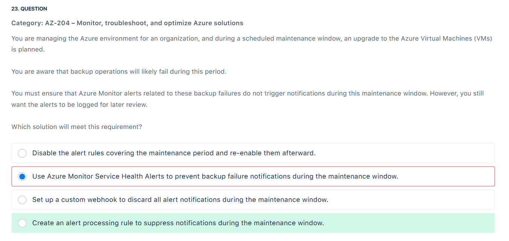
</div>

---

> 👉🏻 **Explanation**
>
> **❓ Question Recap:**
>
> - During a **maintenance window**, you know backup jobs will fail.
> - You **don’t want alerts to trigger notifications** (emails, SMS, webhooks) during this period.
> - BUT ❗ you still want the **alerts to be logged** for later review.
>
> ---
>
> **✅ Correct Answer**
>
> - **Create an alert processing rule to suppress notifications during the maintenance window.**
>
> ---
>
> **📖 Why?**
>
> 🔹 **Alert Processing Rules** let you **suppress notifications** (emails, SMS, ITSM, etc.) during scheduled periods (like maintenance).
>
> - The alert is still **fired and logged** in Azure Monitor.
> - Only the **notification action is suppressed**.
> - Perfect fit for this scenario.
>
> ---
>
> **❌ Why Other Options Are Wrong:**
>
> - **Disable the alert rules covering the maintenance period**
>
>   - ❌ Alerts won’t even fire, so nothing is logged → you lose visibility.
>
> - **Use Azure Monitor Service Health Alerts**
>
>   - ❌ Service Health alerts are for **Azure platform issues** (like region outage, VM host maintenance), not your app/service alerts.
>
> - **Set up a custom webhook to discard all alert notifications**
>
>   - ❌ You’d lose control and visibility, and it’s not the right way to handle planned suppression.
>
> ---
>
> **📝 Key Exam Tip:**
>
> - **Alert Processing Rule** = Suppress notifications but keep alerts logged.
> - **Disable Alert Rule** = No alerts fired at all.
> - **Service Health Alerts** = Only Azure-wide service events (not your resource alerts).
>
> ---
>
> ✅ So the exam correct answer is:
> **Create an alert processing rule to suppress notifications during the maintenance window.**

---

## ⁉️ Q27

<div align="left">
  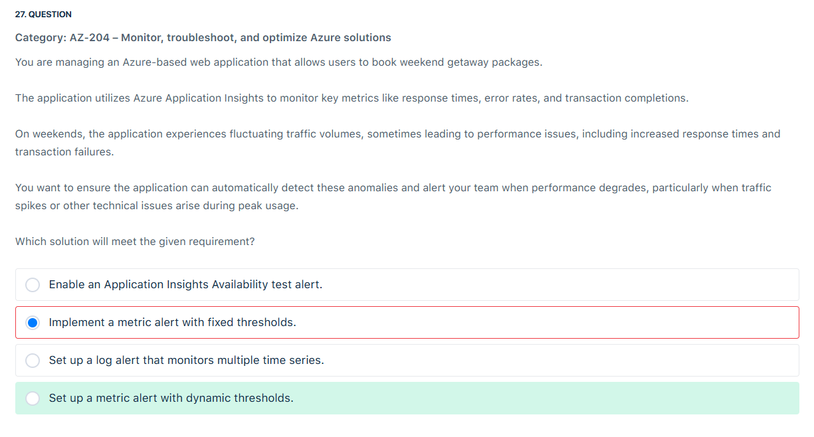
</div>

---

> 👉🏻 **Explanation**
>
> **🔑 Difference Between Fixed and Dynamic Threshold Alerts in Azure Monitor:**
>
> **1. Metric Alert with Fixed Thresholds:**
>
> - You manually configure a threshold (e.g., _alert if response time > 2 seconds_ or _CPU > 80%_).
> - This works well when the **expected performance baseline is stable**.
> - ❌ Problem: In environments with **fluctuating traffic** (like weekends with spikes), fixed thresholds can either:
>
>   - Trigger too many **false positives** (alerts firing even though the system is behaving normally under high load).
>   - Miss real issues if the threshold is set too high.
>
> ---
>
> **2. Metric Alert with Dynamic Thresholds:**
>
> - Uses **machine learning** built into Azure Monitor.
> - The system analyzes historical data and **automatically adjusts the threshold** based on patterns, time of day, day of week, seasonality, etc.
> - Example:
>
>   - On weekdays, normal response time = 200 ms.
>   - On weekends, normal response time = 500 ms (due to load).
>   - Dynamic thresholds will adjust to detect _abnormal behavior compared to baseline_, rather than firing every time the value exceeds a static number.
>
> ✔ This is **ideal when traffic is variable** (like the scenario in your question).
>
> ---
>
> **✅ Why Dynamic Threshold is Correct Here**
>
> The scenario says:
>
> - “On weekends, the application experiences **fluctuating traffic volumes** … leading to performance issues.”
> - That means the traffic/load baseline is not stable → fixed thresholds would cause **noisy alerts**.
> - Dynamic thresholds adapt to these fluctuations and only alert on **true anomalies**.
>
> 👉 That’s why the correct answer is:
> **Set up a metric alert with dynamic thresholds.**

---

## ⁉️ Q31

<div align="left">
  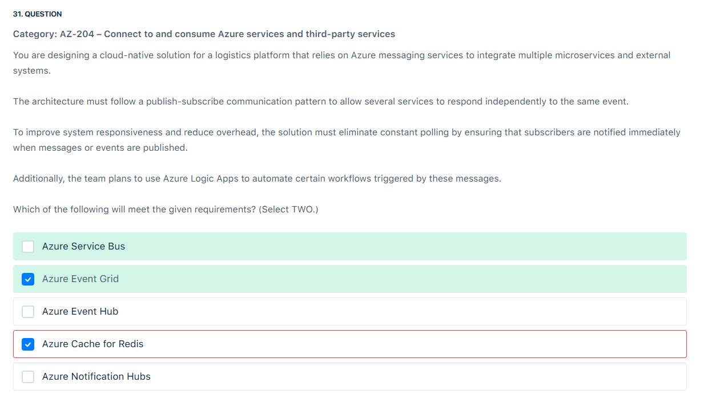
</div>

---

> 👉🏻 **Explanation**
>
> **✅ The Answer:**
>
> - **Azure Service Bus**
> - **Azure Event Grid**
>
> ---
>
> **🤔 Why This Is the Best Answer:**
>
> - The scenario requires a **publish-subscribe (Pub/Sub) communication pattern** where multiple microservices can independently respond to the same event.
> - It also explicitly says: _“the solution must eliminate constant polling by ensuring that subscribers are notified immediately”_.
>
> Here’s how the two correct services fit:
>
> 1. **Azure Event Grid**
>
>    - Event-driven, push-based (no polling needed).
>    - Ideal for notifying subscribers immediately when an event happens.
>    - Integrates natively with **Azure Logic Apps**, which is part of the requirement.
>    - Lightweight, scalable, and cost-efficient for routing events.
>
> 2. **Azure Service Bus**
>
>    - Provides **robust enterprise-grade messaging** with features like sessions, ordering, dead-letter queues, transactions, and duplicate detection.
>    - Supports **topics and subscriptions**, which implement the **Pub/Sub pattern** directly.
>    - Ensures reliability when multiple services must consume the same messages independently.
>
> Together:
>
> - **Event Grid** handles immediate event routing to subscribers (Logic Apps, Functions, etc.).
> - **Service Bus** provides strong guarantees and advanced messaging features when multiple microservices need consistent delivery.
>
> ---
>
> **❌ Why Other Options Are Wrong:**
>
> - **Azure Event Hub**: Designed for **high-throughput telemetry/event streaming** (e.g., IoT or log data ingestion). It’s not optimized for discrete Pub/Sub microservice communication.
> - **Azure Cache for Redis**: Redis has simple pub/sub but isn’t intended for large-scale system integration, lacks enterprise reliability (no dead-lettering, ordering, etc.), and doesn’t integrate with Logic Apps.
> - **Azure Notification Hubs**: Built for **mobile push notifications** (to iOS/Android devices), not microservice-to-microservice or backend event-driven workflows.

---

## ⁉️ Q32

<div align="left">
  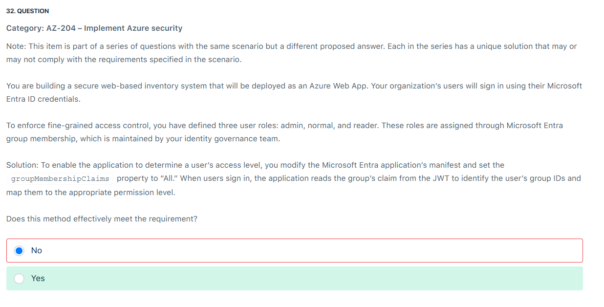
</div>

---

> 👉🏻 **Explanation**
>
> **📝 Question Recap**
>
> - App = Azure Web App secured with **Microsoft Entra ID** (formerly Azure AD).
> - Roles: **admin, normal, reader** → assigned through **Entra ID groups**.
> - Solution: Modify the **application manifest** → set `groupMembershipClaims = "All"`.
> - When user signs in, their **JWT token** will include group IDs.
> - The app can then read those group claims and enforce **role-based access**.
>
> Question: Does this meet the requirement?
>
> 👉 **Correct Answer: Yes** ✅
>
> ---
>
> **🔍 Why is "Yes" correct?**
>
> 1. **`groupMembershipClaims` in Manifest**
>
>    - When you set `groupMembershipClaims` to `"All"`, Entra ID includes the **group IDs** of the user in their **JWT token (ID token or access token)**.
>    - Example claim in JWT:
>
>      ```json
>      "groups": [
>        "3a1f2d34-xxxx-xxxx-xxxx-abcdef123456",  // Admin group
>        "7b2e8f90-xxxx-xxxx-xxxx-abcdef654321"   // Reader group
>      ]
>      ```
>
>    - Your app can check these GUIDs against known group IDs and map users to **admin, normal, reader** roles.
>
> 2. **Meets Fine-Grained Access Control**
>
>    - Access control is based on **group membership** already defined in Entra ID.
>    - The application simply reads the claims and enforces permissions.
>    - ✅ This is exactly the scenario described.
>
> 3. **Common Enterprise Pattern**
>
>    - This approach is widely recommended for **RBAC in applications**.
>    - Instead of storing roles inside the app, you leverage Entra ID groups.
>    - It centralizes role assignment → easier governance.
>
> ---
>
> <div align="left">
>   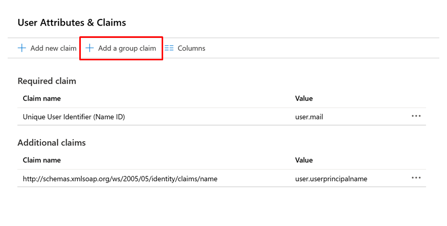
> </div>
>
> ---
>
> **❌ Why "No" is Wrong:**
>
> - Some candidates choose **No** thinking:
>
>   - "Group claims don’t scale well if a user belongs to thousands of groups" (true, in that case, Entra ID uses **Graph API overage claims** instead of embedding all IDs).
>   - But here, we only need **three roles** → group claims easily work.
>
> - The method does meet the requirement, so **No is incorrect**.
>
> ---
>
> **✅ Alternative Approaches (Exam Tip)**
>
> Besides `groupMembershipClaims`, there are two other ways:
>
> 1. **App Roles**
>
>    - Define roles (`admin`, `normal`, `reader`) in the app manifest → assigned per user/group.
>    - JWT includes `"roles"` claim.
>    - More direct than groups.
>
> 2. **Custom Claims Mapping**
>
>    - Use **Entra ID custom claims mapping policy** to enrich the token with extra claims.
>    - Flexible but overkill here.

---

## ⁉️ Q37

<div align="left">
  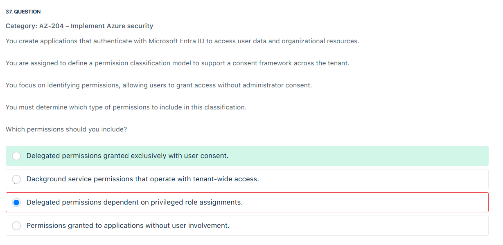
</div>

---

> 👉🏻 **Explanation**
>
> **🔍 What the Question Really Means:**
>
> - You’re building an app that uses **Microsoft Entra ID (Azure AD)** for login.
> - The app wants to **access user data** (like the signed-in user’s profile, calendar, or emails).
> - The exam says: “we want a consent framework where **the user can decide** whether to give the app permission. We **don’t want the administrator** to have to approve it.”
>
> So yes ✅ the requirement =
> 👉 The app needs **delegated permissions** that can be approved by the **logged-in user**, not by an **admin**.
>
> ---
>
> **💡 Example:**
>
> Imagine you log into an app with your Microsoft account.
>
> - The app pops up: _“This app wants to read your emails and calendar. Do you allow it?”_
> - **You** click “Yes” → that’s **user consent** for **delegated permissions**.
>
> But if the app wanted access like:
>
> - _“This app wants to read **all emails across your company**.”_ → that’s too powerful. It would need **admin consent**.
>
> ---
>
> **✅ The Answer:**
>
> The correct permissions type here is:
> **Delegated permissions granted exclusively with user consent**
>
> Because:
>
> - The user is logged in.
> - The app acts _on behalf of that user_.
> - The user can approve access themselves.

---

## ⁉️ Q3x

<div align="left">
  
</div>

---

> 👉🏻 **Explanation**
>