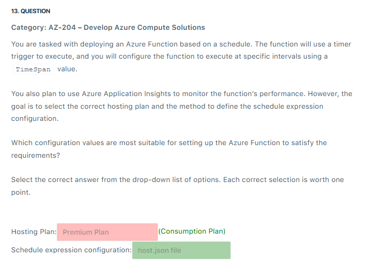

# 📋 Review Mode Set 2

## ⁉️ Q3

  

---

> 👉🏻 **Explanation**
>
> **✅ The Answer:**
>
> - **Create and publish a product via Azure Portal/CLI.**
>
> ---
>
> **📖 Explanation:**  
> In **Azure API Management (APIM)**, the best way to enforce subscription workflows, approvals, and central policies is through **Products**.
>
> - A **Product** groups one or more APIs and applies **terms of use, subscription requirements, and approval workflows**.
> - Admins can configure:
>
>   - **Subscription approval** (manual or automatic).
>   - **Terms of use acceptance** (users must agree before subscribing).
>   - **One subscription per API or product per user**.
>   - **API key authentication** (automatically issued to subscribers).
>
> - Centralized subscription management ensures that all APIs share consistent security and usage rules.
> - While Key Vault is excellent for secret storage, APIM already **integrates subscription key handling natively** — you don’t need to bolt on Azure Artifacts or Key Vault for this scenario.
>
> ---
>
> **🤔 Why This Is the Best Answer:**
> Because the requirements explicitly describe **APIM subscription/product features** (terms of use, approval, per-user subscription limits, API key enforcement). These map directly to **APIM Product functionality** — not Key Vault, not versioning, and not self-hosted gateways.
>
> ---
>
> **❌ Why Other Options Are Wrong:**
>
> - **Manage keys in Azure Key Vault, add Azure Artifacts Credential Provider…**
>
>   - Wrong because Key Vault stores secrets, but it doesn’t enforce **APIM subscription policies** like approval, terms of use, or per-user limits. Azure Artifacts is unrelated here.
>
> - **Implement version control by applying headers…**
>
>   - This only manages **API versions**, not subscriptions, policies, or key management. Irrelevant to the scenario.
>
> - **Deploy a self-hosted gateway and configure access policies manually…**
>
>   - Self-hosted gateways extend APIM to private/hybrid environments, but they don’t provide the **central subscription approval, terms of use, or per-user restrictions** needed. This adds complexity without solving the problem.
>
> ---
>
> **📚 References:**
>
> - [Azure API Management – Products](https://learn.microsoft.com/en-us/azure/api-management/api-management-howto-add-products)
> - [Azure API Management subscriptions and keys](https://learn.microsoft.com/en-us/azure/api-management/api-management-subscriptions)

---

## ⁉️ Q6

  

---

> 👉🏻 **Explanation**
>
> 📌 Question Breakdown
>
> - You’re using **Service Bus queues** for order messages.
> - You want **Event Grid notifications** when new messages arrive.
> - Processing is done by **Azure Functions + Logic Apps**.
> - Requirements:
>
>   1. **Emit events only when messages exist & no active receivers** (✅ Event Grid does this).
>   2. **Minimize cost** (Standard tier is cheaper than Premium).
>   3. **Least privilege** (don’t assign overly broad roles like Contributor).
>
> ---
>
> ✅ Correct Answers
>
> - Service Bus Tier → Premium
> - Permissions → Contributor
>
> ---
>
> **🤔 Why This Is the Best Answer:**
>
> 1. **Tier (Standard vs Premium)**
>
>    - **Fact:**
>
>      - Event Grid **integration with Service Bus events** (like `ActiveMessagesAvailableWithNoListeners`) is **NOT available in Basic or Standard**.
>      - Those advanced system events are **only supported in Premium tier**.
>
>    ➡️ So your source is correct here:  
>    👉 **Premium is required**, not Standard.
>
> 2. **Role (Data Receiver vs Contributor)**
>
>    - **Azure Service Bus Data Receiver**
>
>      - Allows apps to **read messages** from queues/subscriptions.
>      - Does **not allow configuring Event Grid subscriptions**.
>
>    - **Contributor**
>
>      - Has permission to **create/update/manage resources**, including **wiring up Event Grid subscriptions on Service Bus**.
>      - This is required in the scenario because you need to configure Event Grid integration.
>
>    ➡️ So again your source is correct here:  
>    👉 **Contributor** is required to set up Event Grid integration.
>
> ---
>
> **📚 References:**
>
> - <https://learn.microsoft.com/en-us/azure/service-bus-messaging/service-bus-messaging-overview>
> - <https://learn.microsoft.com/en-us/azure/service-bus-messaging/service-bus-to-event-grid-integration-concept?tabs=event-grid-event-schema>

---

## ⁉️ Q8

  

---

> 👉🏻 **Explanation**
>
> 📌 Question Breakdown
>
> You need a subscription (`ShipmentStatusSub`) on a topic (`ShipmentEventsTopic`) that:
>
> 1. Filters shipment messages by **system properties** like `Label` or `MessageId`.
> 2. Annotates filtered messages (changes metadata, not body) before downstream systems consume them.
> 3. Keeps the **original body unchanged** (so only metadata can be altered).
>
> ---
>
> 🟢 Step 1 – Choosing the Filter
>
> - **Correlation Filter**
>
>   - Used for **equality matches** on system properties (like `Label`, `MessageId`, `CorrelationId`).
>   - Lightweight and best when you know the property name + value you want to match.
>
> - **SQL Filter**
>
>   - Used for **more complex conditions** (SQL-like syntax: `<`, `>`, `LIKE`, multiple properties).
>
> ➡️ Since the question explicitly says **system properties like `Label` or `MessageId`**, the best choice is:  
> ✅ **Correlation filter**
>
> ---
>
> 🟢 Step 2 – Choosing the Action
>
> - **Route to another topic**
>
>   - Just sends the message elsewhere, doesn’t annotate metadata. ❌
>
> - **Annotate with metadata (add/remove/replace properties)**
>
>   - Allows you to **add custom metadata properties** or modify system/application properties, while leaving the **body unchanged**.
>   - Exactly what the scenario requires for downstream Event Grid alerts.
>
> ➡️ The right choice is:  
> ✅ **Annotate the message metadata by adding, removing, or replacing properties and their values**
>
> ---
>
> ✅ Final Answer
>
> - **Filter** → Correlation filters
> - **Action** → Annotate the message metadata by adding, removing, or replacing properties

---

## ⁉️ Q9

  

---

> 👉🏻 **Explanation**
>
> ❓ **Question Summary:**
>
> You’re hosting a static site in **Azure Blob Storage**. Requirements are:
>
> 1. Accessible via a **custom domain name**.
> 2. Add **custom headers** to all HTTP responses.
> 3. Support **HTTPS with a custom SSL certificate**.
>
> ---
>
> ✅ **Correct Answers:** (All: Azure CDN)
>
> - **Custom domain name** → ✅ Azure Content Delivery Network (CDN)
> - **Custom headers in HTTP responses** → ✅ Azure Content Delivery Network (CDN)
> - **Custom SSL certificate** → ✅ Azure Content Delivery Network (CDN)
>
> ---
>
> 📖 **Explanation:**
>
> Azure Blob Storage static websites **by themselves**:
>
> - Support only HTTPS with the `*.blob.core.windows.net` domain.
> - Do **not** support direct custom domains + SSL unless integrated with **Azure CDN** or **Front Door**.
> - Do **not** support injecting **custom headers** in HTTP responses.
>
> By fronting the storage account with **Azure CDN**, you unlock:
>
> - ✅ **Custom domains** (CNAME mapping to the CDN endpoint).
> - ✅ **Custom headers** injection through CDN rules engine.
> - ✅ **Custom SSL certificates** (bring-your-own cert or use Azure-managed certs).
>
> ---
>
> 🤔 **Why This Is the Best Answer:**
>
> - **Azure CDN** provides all three capabilities in a single solution: custom domain mapping, HTTPS with SSL, and header rewriting.
> - **Front Door** also supports these, but in the exam context, the more common match with **Blob Storage static site hosting** is **Azure CDN** (especially when talking about adding headers in responses).
>
> ---
>
> ❌ **Why Other Options Are Wrong:**
>
> - **Azure DNS** → Only resolves domains, does not handle SSL or headers.
> - **Azure Front Door** → Could work (supports custom domain, SSL, headers), but here the expected exam answer is **Azure CDN**, which integrates seamlessly with static websites in storage.
> - **Blob Storage alone** → Can’t inject headers, can’t serve custom SSL on custom domains.
>
> ---
>
> 📚 **References:**
>
> - [Azure Storage static website hosting](https://learn.microsoft.com/en-us/azure/storage/blobs/storage-blob-static-website)
> - [Azure CDN rules engine (headers, redirects, caching)](https://learn.microsoft.com/en-us/azure/cdn/cdn-rules-engine)
> - [Azure CDN custom domain & SSL](https://learn.microsoft.com/en-us/azure/cdn/cdn-custom-ssl)

---

## ⁉️ Q13

  

---

> 👉🏻 **Explanation**
>
> - The Consumption hosting plan best fits event-driven workloads like a timer trigger. It automatically scales to accommodate the demand and charges based on the execution time, making it the most cost-efficient for your timer-triggered function. This hosting plan is ideal for executing functions based on the TimeSpan interval.
> - The host.json file is used to configure the timer trigger in Azure Functions. This file allows you to set the TimeSpan that dictates the function’s execution schedule. You would specify the schedule in a cron-like expression inside the host.json file, making it the most appropriate method to configure the timer-triggered schedule.
>
> 

>   
> 

---

## ⁉️ Q19

  

---

> 👉🏻 **Explanation**
>
> **❓ Question Recap**
>
> You’re running **Azure Container Apps** and need:
>
> 1. **Monitor real-time log streams** from containers.
> 2. **Troubleshoot inside a container** interactively.
>
> ---
>
> **✅ Correct Features**
>
> - **Monitor real-time log streams** → **Log Streaming**
> - **Troubleshoot inside a container** → **Container Console**
>
> ---
>
> **📖 Why?**
>
> **🔹 Log Streaming**
>
> - Shows **stdout** and **stderr** logs in real-time.
> - Useful during **deployments, debugging, and performance testing**.
> - Eliminates delays (you don’t wait for logs to be exported into Log Analytics or Storage).
> - Think of it as: `tail -f` for your container logs.
>
> ---
>
> **🔹 Container Console**
>
> - Provides an **interactive shell** into the running container.
> - Lets you:
>
>   - Run commands
>   - Inspect environment variables
>   - Check file system/network
>   - Debug microservices directly in runtime context
>
> - This is the “live troubleshooting mode” you use when logs aren’t enough.
>
> ---
>
> ❌ Why Not Other Options?
>
> - **Application Logging** → General logging mechanism; not real-time, not interactive.
> - **Azure Monitor Alerts** → Only alerts when thresholds are hit; no real-time or shell access.
> - **Log Analytics** → Great for querying historic logs, but not live streaming or interactive debugging.

---

## ⁉️ Q1x

  

---

> 👉🏻 **Explanation**
