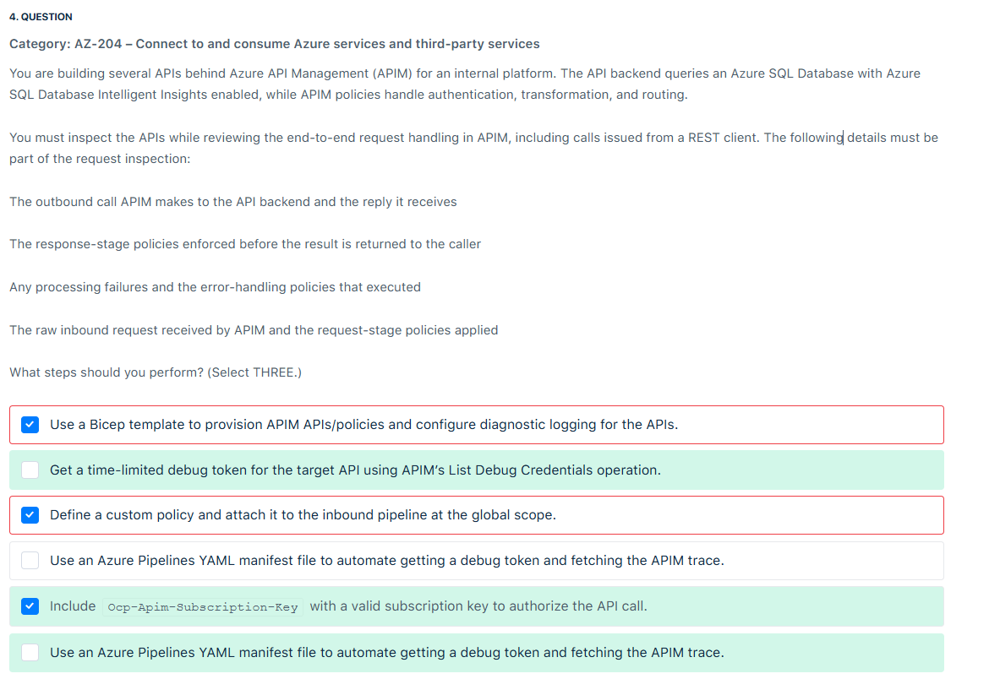
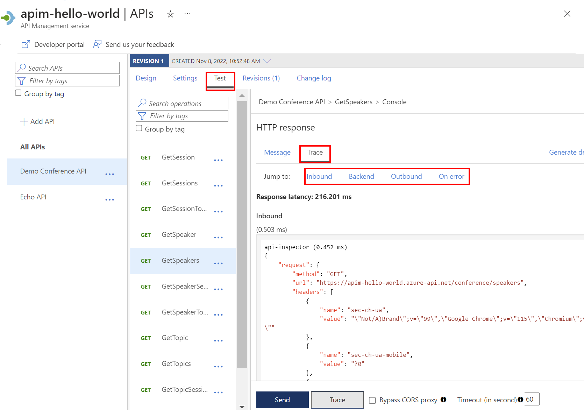
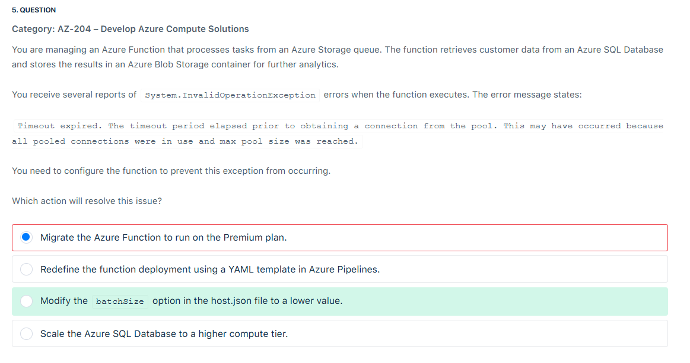
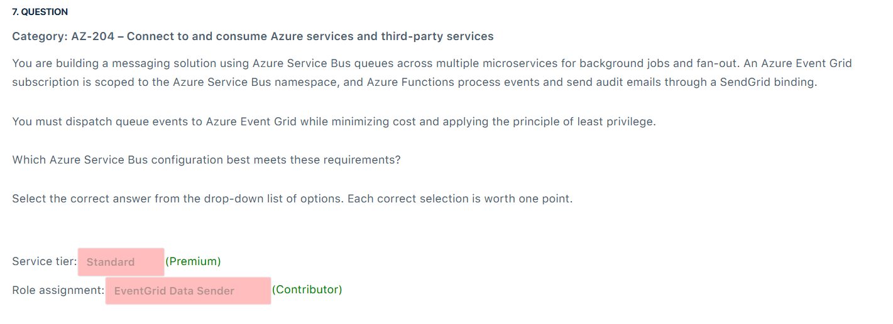
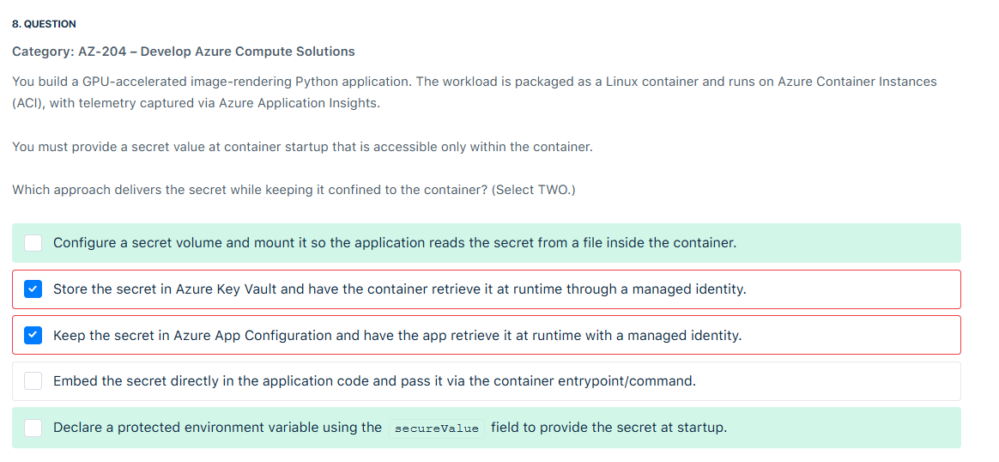
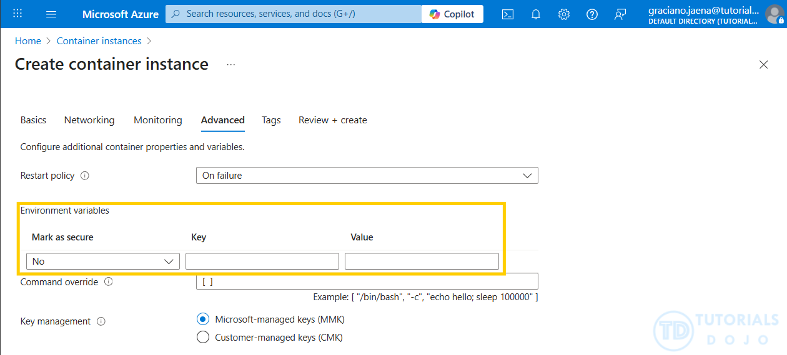

# 📋 Review Mode Set 3

## ⁉️ Q4

<div align="left">
  
</div>

---

> 👉🏻 **Explanation**
>
> 📌 **The Question Context:**
>
> You are using **Azure API Management (APIM)** and need to **trace API requests end-to-end**. The tracing must show:
>
> - The **inbound request** and policies applied.
> - The **outbound call** to the backend and its reply.
> - The **response-stage policies**.
> - Any **failures** and the **on-error path**.
>
> This means you want **per-request tracing**, not just global logs.
>
> ---
>
> 🚦 **How Tracing in APIM Actually Works:**
>
> Tracing in APIM is **not automatic**. You must explicitly enable it **per request** using **debug tokens**.
>
> 🔑 The Correct Workflow:
>
> 1. **Request Debug Token**
>
>    - Call the APIM REST API `List Debug Credentials`.
>    - This gives you a **short-lived token** (valid for ~1 minute).
>    - This token is used for tracing authorization.
>
> 2. **Send the API Request with Debug Headers**
>
>    - Attach the token in the request header:
>
>      ```ini
>      Apim-Debug-Authorization: <debug_token>
>      ```
>
>    - Also attach the **Ocp-Apim-Subscription-Key** if the API/product requires a subscription.
>
> 3. **Get Trace ID & Retrieve Trace**
>
>    - The APIM gateway responds with:
>
>      ```ini
>      Apim-Trace-Id: <trace_id>
>      ```
>
>    - Use the `List Trace` REST API to fetch the **full trace**.
>    - This trace shows inbound ➝ backend ➝ outbound ➝ on-error processing.
>
> ---
>
> ❌ **Why the Wrong Answers Are Wrong:**
>
> - **Bicep template** → Bicep can provision APIM APIs/policies, but it does **not enable per-request tracing**. Wrong tool for the job.
> - **Custom policy** → Defining a policy doesn’t activate tracing. Debug tracing is enabled via tokens, not policies.
> - **Azure Pipelines YAML** → Pipelines can automate calls, but tracing is not a CI/CD step. It’s APIM’s own debug system.
>
> ---
>
> ✅ **Correct Answers**
>
> The correct three steps are:
>
> 1. **Get a time-limited debug token for the target API using APIM’s List Debug Credentials operation.**
> 2. **Call the API with Apim-Debug-Authorization to enable tracing for that request.**
> 3. **Include Ocp-Apim-Subscription-Key with a valid subscription key to authorize the API call.**
>
> <div align="left">
>   
> </div>

---

## ⁉️ Q5

<div align="left">
  
</div>

---

> 👉🏻 **Explanation**
>
> **📝 Scenario Recap:**
>
> - Azure Function processes tasks from a **Storage Queue**.
> - Each task queries **Azure SQL Database**.
> - Error:
>
>   ```ini
>   System.InvalidOperationException
>   Timeout expired. The timeout period elapsed prior to obtaining a connection from the pool.
>   All pooled connections were in use and max pool size was reached.
>   ```
>
> - Translation: The function is **opening too many SQL connections at the same time**. The **ADO.NET connection pool** has a maximum (default 100 per connection string). When more concurrent requests arrive, new ones wait, then timeout.
>
> ---
>
> **🚩 Why This Happens:**
>
> Azure Functions **scale out** based on queue length. If 1,000 messages arrive:
>
> - Host spins up multiple function instances.
> - Each instance opens multiple DB connections.
> - Result: Connection pool exhaustion → **timeouts**.
>
> ---
>
> **✅ The Correct Fix:**
>
> **Modify the `batchSize` option in host.json to a lower value.**
>
> - `batchSize` = how many queue messages each function instance pulls at once.
> - If batch size is too high (say 32 or 64), each instance may try to open that many DB connections in parallel.
> - Lowering it (e.g., 1, 2, or 5) throttles concurrency, keeping connections under control.
>
> 📌 Example `host.json`:
>
> ```json
> {
>   "version": "2.0",
>   "extensions": {
>     "queues": {
>       "batchSize": 4,
>       "newBatchThreshold": 2
>     }
>   }
> }
> ```
>
> This means: each function host processes **4 messages at a time** instead of 16/32, reducing DB pool pressure.
>
> ---
>
> **❌ Why the Other Answers Are Wrong:**
>
> - **Migrate to Premium Plan**
>   Premium helps with scaling, cold starts, VNET integration, etc. But scaling faster would actually **make the connection pool exhaustion worse**, not fix it.
>
> - **Redefine using YAML template in Azure Pipelines**
>   Deployment method has **nothing to do with runtime connection pooling**. Wrong dimension.
>
> - **Scale Azure SQL Database to a higher compute tier**
>   This gives more CPU/memory, but **doesn’t change the ADO.NET client connection pool limit**. The bottleneck is on the client (function app), not SQL DB compute.

---

## ⁉️ Q7

<div align="left">
  
</div>

---

> 👉🏻 **Explanation**
>
> 📌 **What the Question is Asking:**
>
> You have:
>
> - **Service Bus Queues** used for background jobs (messages between microservices).
> - **Event Grid** subscription listening to Service Bus namespace events (like new message, dead-letter, etc.).
> - **Azure Functions** consume those events and trigger actions (like sending emails via SendGrid).
>
> You need to configure Service Bus so that:
>
> 1. It can **dispatch queue events to Event Grid**.
> 2. It **minimizes cost**.
> 3. It applies **principle of least privilege** (so only the required permissions are granted).
>
> So the question is basically:
> 👉 “Which Service Bus tier and which RBAC role are needed so Service Bus can publish events to Event Grid, while keeping cost low and permissions minimal?”
>
> ---
>
> **✅ Correct Answers:**
>
> - Service tier: **Premium**
> - Role assignment: **Contributor**
>
> **Explanation:**
>
> - Only the **Premium** tier of Azure Service Bus supports integration with **Azure Event Grid**. Standard and Basic do **not** support this.
> - The **Contributor** role at the Service Bus namespace scope allows creation and management of **Event Grid subscriptions**, which is required for dispatching events to Event Grid.
> - Other roles like **EventGrid Data Sender** or **Reader** do not provide the necessary permissions, and **Service Bus Data Owner** exceeds least privilege since it grants full data-plane access.
>
> ---
>
> ⚠️ **Why?**
>
> - **EventGrid Data Sender** is incorrect because it primarily grants permission to send events to Event Grid topics/domains and does not include permissions to create or manage Event Grid subscriptions on a Service Bus namespace.

---

## ⁉️ Q8

<div align="left">
  
</div>

---

<div align="left">
  
</div>

> 👉🏻 **Explanation**
>
> **📌 Question Recap:**
>
> You’re running a **GPU-accelerated Python app** inside **Azure Container Instances (ACI)**.
> At container startup, the app needs a **secret value**, but this secret must remain **confined inside the container** (not exposed outside).
>
> 👉 Which two approaches deliver the secret securely?
>
> ---
>
> **✅ Correct Answers:**
>
> - **Configure a secret volume and mount it so the application reads the secret from a file inside the container.**
> - **Declare a protected environment variable using the `secureValue` field to provide the secret at startup.**
>
> ---
>
> **🧠 Why These Are Correct**
>
> 1. Secret Volume 📂
>
>    - ACI supports **secret volumes** → mounted into the container’s file system.
>    - The secrets are stored in memory (`tmpfs`) and **only accessible within the container**.
>    - Once the container stops, the secrets disappear (not persisted).
>    - Official doc: [ACI secret volumes](https://learn.microsoft.com/en-us/azure/container-instances/container-instances-volume-secret)
>
>    🔑 **Benefit**: Perfect for scenarios where the app needs to read secrets as files (certificates, config tokens, etc.).
>
> 2. Secure Environment Variable (`secureValue`) 🔑
>
>    - ACI allows you to declare environment variables using **`secureValue`** instead of `value`.
>    - These secrets **do not show up in logs or portal outputs** (hidden in Azure Portal UI).
>    - Accessible only by the containerized app at runtime.
>    - Official doc: [ACI environment variables](https://learn.microsoft.com/en-us/azure/container-instances/container-instances-environment-variables)
>
>    🔑 **Benefit**: Ideal when the app needs the secret directly as an environment variable instead of file.
>
> ---
>
> **❌ Why Your Chosen Answers Were Incorrect:**
>
> You Picked:
>
> - **Azure Key Vault with Managed Identity**
> - **Azure App Configuration with Managed Identity**
>
> 👉 These are **valid real-world patterns**, but in the exam context:
>
> - They are **not native ACI startup secret injection methods**.
> - They require your **app code** to connect to Key Vault/App Config, fetch the secret, and handle retries.
> - The question explicitly asked for “secret at container startup, confined to the container.”
> - Exam expects the **ACI-native secret delivery methods**: secret volumes & secure environment variables.
>
> ---
>
> 📊 **Visual Summary:**
>
> ```mermaid
> flowchart TD
>     A[Secret Storage Options in ACI] --> B[Secret Volume 📂]
>     A --> C[Secure Environment Variable 🔑]
>     A --> D["External Services like Key Vault/App Config ❌ (require code)"]
>     B --> E[Mounted as file inside container / tmpfs memory]
>     C --> F[Injected via secureValue env variable, hidden from logs]
> ```

---
