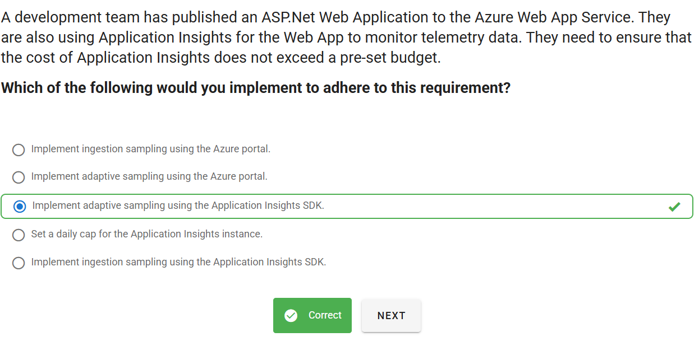

# 📋 Mock Exam 2

## ⁉️ Q1

  

---

> 👉🏻 **Explanation**  
> **✅ the answer:**  
> Implement **adaptive sampling using the Application Insights SDK**.
>
> **🤔 Why This Is the Best Answer:**
>
> - Adaptive sampling (via SDK) dynamically adjusts the rate of telemetry collection based on the application’s traffic load.
> - This ensures Application Insights only sends a manageable subset of telemetry when traffic spikes, keeping ingestion volume (and cost) under control while still maintaining statistical accuracy.
> - Since the requirement is to **not exceed a pre-set budget**, adaptive sampling is the most cost-effective solution.
>
> **❌ Why Other Options Are Wrong:**
>
> - _Ingestion sampling using the Azure portal_ → This is fixed-rate sampling at ingestion, less flexible and may still generate high cost during spikes.
> - _Adaptive sampling using the Azure portal_ → Not available; adaptive sampling must be configured in the **SDK**.
> - _Set a daily cap for the Application Insights instance_ → Caps stop data ingestion completely once the limit is reached, meaning you lose telemetry visibility for the rest of the day. Not suitable for reliable monitoring.
> - _Ingestion sampling using the Application Insights SDK_ → Fixed-rate sampling; doesn’t auto-adjust based on load, so it’s less efficient than adaptive sampling.
