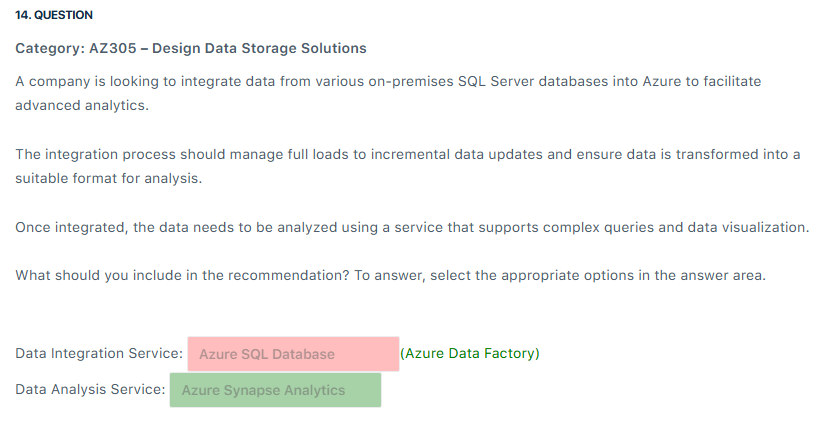

# 📋 Time Mode Diagnostic Test

## ⁉️ Q1

  

---

> 👉🏻 **Explanation**
>
> **✅ The Answer:**
>
> - **Azure Service Bus**
>
> **📖 Explanation:**
>
> - With Azure Service Bus, you can create queues or topics to which different cloud services can send and receive XML messages containing transaction information. This allows for decoupling of components, ensuring reliability, and scalability in handling transaction data.
> - Here are some features of Azure Service Bus:
>   - **Message queuing**: a way to decouple applications and services. This means that applications can send messages to a queue and then be notified when the messages are processed.
>   - **Topics and subscriptions**: a way to implement a publish/subscribe messaging pattern. This means that applications can send messages to a topic and then be notified when the messages are processed by one or more subscribers.
>
> 

>   
> 

>
> ---
>
> **❌ Why Other Options Are Wrong:**
>
> - **Azure Service Fabric** is incorrect because this is a distributed systems platform that enables the deployment, management, and scaling of microservices-based applications. While it can facilitate communication between microservices, it does not provide native messaging capabilities with XML messages, as the focus is more on service management and coordination.
>
> - **Azure Data Factory** is incorrect because this is an extract, transform, and load service designed to orchestrate data movement and data transformation workflows. While it can work with data in different formats, including XML, it is not specifically designed for asynchronous communication and messaging between services.
>
> - **Azure Data Lake** is incorrect because this is a data storage and analytics service that allows you to store and analyze large volumes of data. It is not intended for message passing and asynchronous communication between cloud services.
>
> ---
>
> 📚 **References:**
>
> - <https://docs.microsoft.com/en-us/azure/service-bus-messaging/service-bus-messaging-overview>

---

## ⁉️ Q2

  

---

> 👉🏻 **Explanation**
>
> **✅ The Answer:**
>
> - **Azure AD Application Proxy**
> - **Azure AD Enterprise Applications**
>
> **📖 Explanation:**
>
> - **Microsoft Entra Application Proxy:** provides secure remote access to on-premises web applications. After a single sign-on to Microsoft Entra, users can access both cloud and on-premises applications through an external URL or an internal application portal. For example, Application Proxy can provide remote access and single sign-on to Remote Desktop, SharePoint, Teams, Tableau, Qlik, and line of business (LOB) applications.
> - **Microsoft Entra Enterprise Applications:** allows you to integrate external applications, including on-premises applications, with Microsoft Entra. By configuring the application as an Enterprise Application, you can enable single sign-on (SSO) for remote users without the need for VPN access. Microsoft Entra can handle the authentication and authorization process for these applications.
> - By combining Microsoft Entra Enterprise Applications and Microsoft Entra Application Proxy, you can provide a seamless single sign-on experience for remote users without requiring them to be connected to the on-premises network via VPN.
>
> 

>   
> 

>
> ---
>
> **❌ Why Other Options Are Wrong:**
>
> - **Azure Application Gateway** is incorrect because this is a load balancer that allows you to manage and route incoming traffic for web applications. While it can enhance the performance and security of web applications, it is not directly related to providing single sign-on access to on-premises applications.
>
> - **Microsoft Entra Privileged Identity Management** is incorrect because this service is primarily focused on providing just-in-time privileged access to Azure resources and not on enabling remote users to access on-premises applications using single sign-on access.
>
> - **Azure Arc** is incorrect because this is just a service that extends Azure management capabilities to resources outside of Azure, such as on-premises servers, edge devices, and other cloud environments. While it can be used to manage resources in a hybrid environment, it is not directly related to enabling single sign-on access for remote users to on-premises applications.
>
> ---
>
> 📚 **References:**
>
> - <https://learn.microsoft.com/en-us/entra/identity/enterprise-apps/add-application-portal>
> - <https://learn.microsoft.com/en-us/entra/identity/app-proxy/application-proxy>
> - <https://learn.microsoft.com/en-us/aspnet/web-api/overview/security/integrated-windows-authentication>

---

## ⁉️ Q3

  

---

> 👉🏻 **Explanation**
>
> **✅ The Answer:**
>
> - **Data: Read-only**
> - **Log: None**
>
> **📖 Explanation:**
>
> - These are the recommended disk cache settings for data disks:
>
>   - **None**: This setting is ideal for data disks that are used for databases or write-heavy workloads. It ensures the strongest consistency and durability by writing all data directly to Azure Storage without caching.
>   - **Read-only**: This setting is suitable for OS disks or read-heavy workloads. It allows reads to be served from the host cache if available, while writes always go to storage. This can result in faster boot times and improved read access performance.
>   - **Read/Write**: This setting is best for temporary or scratch data, such as application caches. It provides the fastest I/O performance by caching both reads and writes on the host. However, it is important to note that data may be lost in the event of a crash, so it is not recommended for transactional workloads.
>
> - In this scenario, you should configure Read-only caching for the data disks that host SQL Server data files. This will make reads from the cache faster than uncached reads from the data disk. The total possible performance available from the VM within the VM’s limits is the sum of uncached IOPS and throughput plus cached IOPS and throughput.
> - For disks that host the transaction log, set the caching policy to None. There is no performance benefit to enabling caching for the transaction log disk. In fact, having either read-only or read/write caching enabled on the log drive can degrade the performance of writes to the drive and decrease the amount of cache available for reads on the data drive.
> - The option WriteOnly does not exist for host caching. If you need to write cached data, select the option ReadWrite instead.
>
> 

>   
> 

>
> ---
>
> 📚 **References:**
>
> - <https://learn.microsoft.com/en-us/azure/azure-sql/virtual-machines/windows/performance-guidelines-best-practices-storage?view=azuresql#data-file-caching-policies>
> - <https://learn.microsoft.com/en-us/azure/virtual-machines/premium-storage-performance#disk-caching>
> - <https://learn.microsoft.com/en-us/azure/virtual-machines/disks-performance>

---

## ⁉️ Q7

  

> 👉🏻 **Explanation**
>
> **✅ The Answer:**
>
> - **Implement Azure Site Recovery for Virtual Machines, use Active Geo-Replication for Azure SQL Database, and enable Geo-Redundant Storage (GRS) for Blob Storage.**
> - **Set up Azure Site Recovery for Virtual Machines, Azure SQL Database with Auto-Failover Groups, and Read-Access Geo-Redundant Storage (RA-GRS) for Blob Storage.**
>
> **📖 Explanation:**
>
> - Virtual Machines:
>
>   - Azure Site Recovery ensures continuous replication to a secondary Azure region, facilitating rapid service restoration in an alternate region during primary region outages. This capability is critical for meeting the rapid recovery requirement.
>
> - Azure SQL Database:
>
>   - Active Geo-Replication offers real-time data replication to a secondary region, which is crucial for data protection. Auto-failover groups enhance this by automating the failover process, which is essential for achieving rapid recovery with minimal manual intervention.
>
> - Blob Storage:
>
>   - GRS provides data replication to a secondary geographic location, ensuring data is protected against regional outages. RA-GRS adds the benefit of read access to the replicated data in the secondary region, ensuring data availability even if the primary region is compromised. Both features satisfy the requirement of storing the unstructured data in another region.
>
> 📚 **References:**
>
> - <https://learn.microsoft.com/en-us/azure/site-recovery/azure-to-azure-how-to-enable-replication>
> - <https://learn.microsoft.com/en-us/azure/azure-sql/database/active-geo-replication-overview>
> - <https://learn.microsoft.com/en-us/azure/storage/common/storage-redundancy>

## ⁉️ Q7

  

> 👉🏻 **Explanation**
>
> **✅ The Answer:**
>
> - **To manage web traffic, provide SSL termination and ensure scalability:**
>   Use **Azure Application Gateway (v2) or Azure Front Door (Premium)** for global, scalable, layer-7 HTTP routing + SSL termination.
>
> - **To enhance security against web vulnerabilities and attacks:**
>   Include **Web Application Firewall (WAF)** (e.g. Application Gateway WAF or Front Door WAF) to protect against SQL-injection, XSS, etc.
>
> ---
>
> **📖 Explanation:**
>
> - **Application Gateway / Front Door** are designed to handle HTTP/HTTPS traffic, support SSL/TLS termination, path-based routing, multi-site hosting, host-header routing, etc.
> - **Multi-site routing** (multiple domains or hostnames on one front end) is supported by Application Gateway via **multi-site listeners** using host headers / SNI.
> - **Web Application Firewall (WAF)** integrated into Application Gateway or Front Door helps defend against common web attacks, applying OWASP rule sets.

---

## ⁉️ Q11 - Q12

  

---

  

---

  

---

  

---

## ⁉️ Q14

  

> 👉🏻 **Explanation**
>
> **✅ The Answer:**
>
> 1. **Azure Data Factory:**
>
> 2. **Azure Synapse Analytics:**
>
> 

>   
> 

>
> ---
>
> **📖 Explanation:**
>
> - **Azure Data Factory** is a cloud-based data integration service that enables the creation and management of data-driven workflows. It is designed to orchestrate and automate the movement and transformation of data from various sources.
>   - It can handle different types of data integration scenarios, including full loads and incremental data updates. Additionally, it provides capabilities to transform the data into a format that is suitable for analysis, meeting the scenario’s requirements for efficiency, scalability, and flexibility.
> - **Azure Synapse Analytics**, formerly known as Azure SQL Data Warehouse, is a powerful analytics service that combines big data and data warehouse technologies. It is designed to run complex analytics queries on large volumes of data and provides deep integration with business intelligence tools like Power BI for data visualization.
>   - It offers the scalability and performance necessary to handle advanced analytics workloads, making it perfectly suited for analyzing integrated data and deriving insights.
>   - In an integrated workflow, Azure Data Factory first ingests, processes, and transforms data from diverse sources, such as on-premises SQL Server databases. After this initial processing, the data is transferred to Azure Synapse Analytics, where it is stored and subjected to advanced analytics.

---

## ⁉️ Q15

  

> 👉🏻 **Explanation**
>
> **✅ The Answer:**
>
> 1. **Azure SQL Database Hyperscale**
>
> 

>   
> 

>
> ---
>
> **📖 Explanation:**
>
> - **Azure SQL** is a family of managed, secure, and intelligent products that use the SQL Server database engine in the Azure cloud..
>   - Azure SQL Database: Support modern cloud applications on an intelligent, managed database service that includes serverless compute.
>   - Azure SQL Managed Instance: Modernize your existing SQL Server applications at scale with an intelligent fully managed instance as a service, with almost 100% feature parity with the SQL Server database engine. Best for most migrations to the cloud.
>   - SQL Server on Azure VMs: Lift-and-shift your SQL Server workloads with ease and maintain 100% SQL Server compatibility and operating system-level access.
> - **The Hyperscale service** tier in Azure SQL Database provides the following additional capabilities:
>   - Rapid Scale up – you can, in constant time, scale up your compute resources to accommodate heavy workloads when needed and then scale the compute resources back down when not needed.
>   - Rapid scale out – you can provision one or more read-only replicas for offloading your read workload and for use as hot standbys.
>   - Automatic scale-up, scale-down, and billing for compute based on usage with serverless compute (in preview).
>   - Optimized price/performance for a group of Hyperscale databases with varying resource demands with elastic pools (in preview).
>   - Auto-scaling storage with support for up to 100 TB of database or elastic pool size. Fast database backups (based on file snapshots) regardless of size with no IO impact on compute resources.
>   - Fast database restores or copies (based on file snapshots) in minutes rather than hours or days.
>
> ---
>
> 📚 **References:**
>
> - <https://learn.microsoft.com/en-us/azure/azure-sql/database/hyperscale-architecture>
> - <https://learn.microsoft.com/en-us/azure/azure-sql/database/service-tier-hyperscale>
